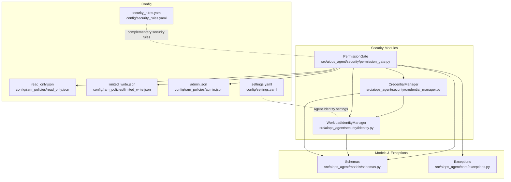
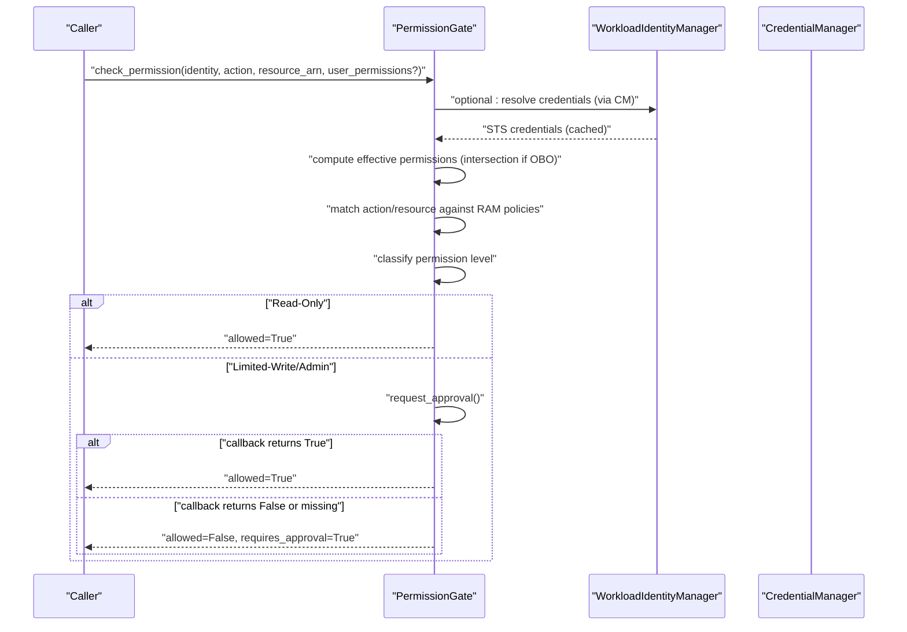
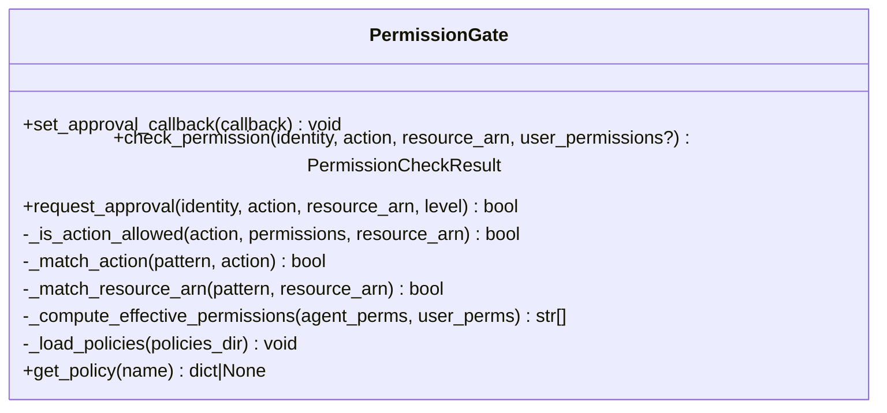
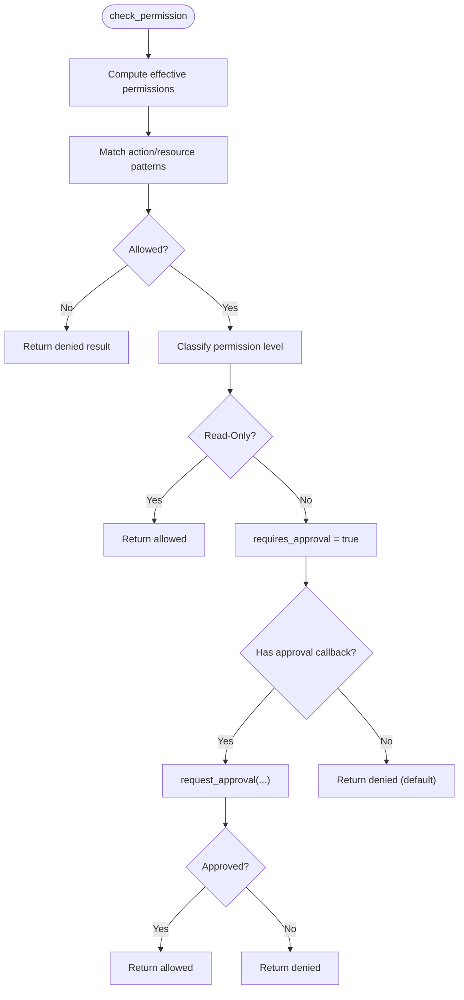
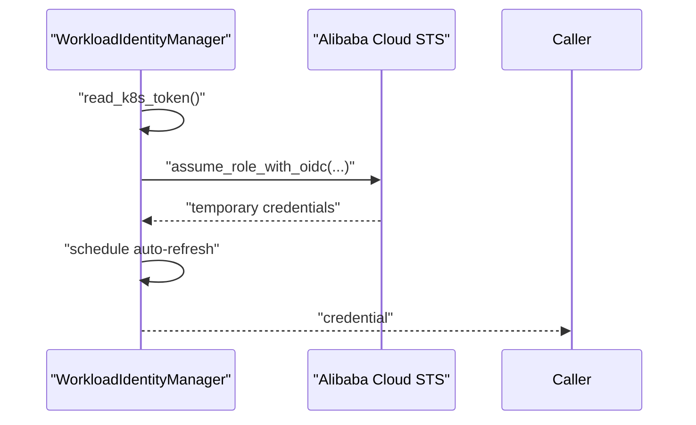
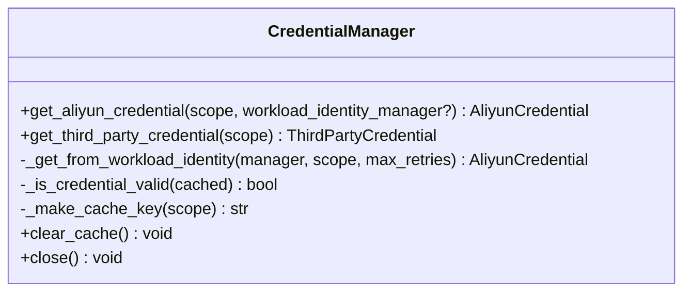
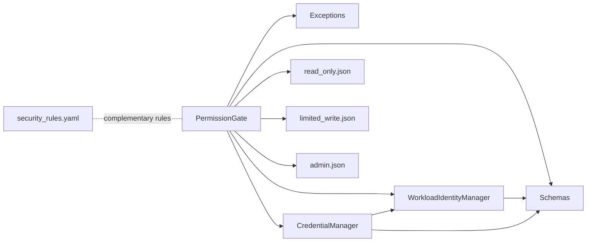

# RBAC Permissions

<cite>
**Referenced Files in This Document**
- [permission_gate.py](file://src/aiops_agent/security/permission_gate.py)
- [identity.py](file://src/aiops_agent/security/identity.py)
- [credential_manager.py](file://src/aiops_agent/security/credential_manager.py)
- [schemas.py](file://src/aiops_agent/models/schemas.py)
- [exceptions.py](file://src/aiops_agent/core/exceptions.py)
- [admin.json](file://config/ram_policies/admin.json)
- [limited_write.json](file://config/ram_policies/limited_write.json)
- [read_only.json](file://config/ram_policies/read_only.json)
- [security_rules.yaml](file://config/security_rules.yaml)
- [settings.yaml](file://config/settings.yaml)
- [test_permission_gate.py](file://tests/test_permission_gate.py)
- [test_workload_identity.py](file://tests/test_workload_identity.py)
</cite>

## Table of Contents
1. [Introduction](#introduction)
2. [Project Structure](#project-structure)
3. [Core Components](#core-components)
4. [Architecture Overview](#architecture-overview)
5. [Detailed Component Analysis](#detailed-component-analysis)
6. [Dependency Analysis](#dependency-analysis)
7. [Performance Considerations](#performance-considerations)
8. [Troubleshooting Guide](#troubleshooting-guide)
9. [Conclusion](#conclusion)
10. [Appendices](#appendices)

## Introduction
This document explains the AIOps Agent’s Role-Based Access Control (RBAC) system with three permission tiers:
- Read-Only: Permits read-only inspection and discovery operations.
- Limited-Write: Allows constrained write operations that require approval.
- Admin: Grants broad administrative capabilities with mandatory manual approval.

It documents the PermissionGate implementation, how it validates user permissions against requested operations, and how RAM policy templates define administrative privileges, write restrictions, and read-only access patterns. It also covers permission evaluation logic, policy inheritance via Workload Identity, role assignment mechanisms, and integration with Workload Identity roles. Guidance is included for customizing permission policies to fit different operational contexts and security requirements.

## Project Structure
The RBAC system spans security-related modules, configuration files, and supporting models:
- PermissionGate enforces permission checks and approval gating.
- WorkloadIdentityManager integrates with Alibaba Cloud RAM OIDC to obtain temporary credentials.
- CredentialManager caches and supplies credentials scoped to skills/services.
- RAM policy templates under config/ram_policies define Allow/Deny statements for each tier.
- Security rules and settings provide complementary protections and configuration.

**Diagram sources**
- [permission_gate.py:57-319](file://src/aiops_agent/security/permission_gate.py#L57-L319)
- [identity.py:38-247](file://src/aiops_agent/security/identity.py#L38-L247)
- [credential_manager.py:38-261](file://src/aiops_agent/security/credential_manager.py#L38-L261)
- [schemas.py:89-231](file://src/aiops_agent/models/schemas.py#L89-L231)
- [exceptions.py:57-98](file://src/aiops_agent/core/exceptions.py#L57-L98)
- [read_only.json:1-30](file://config/ram_policies/read_only.json#L1-L30)
- [limited_write.json:1-38](file://config/ram_policies/limited_write.json#L1-L38)
- [admin.json:1-35](file://config/ram_policies/admin.json#L1-L35)
- [security_rules.yaml:1-70](file://config/security_rules.yaml#L1-L70)
- [settings.yaml:27-42](file://config/settings.yaml#L27-L42)

**Section sources**
- [permission_gate.py:1-319](file://src/aiops_agent/security/permission_gate.py#L1-L319)
- [identity.py:1-247](file://src/aiops_agent/security/identity.py#L1-L247)
- [credential_manager.py:1-261](file://src/aiops_agent/security/credential_manager.py#L1-L261)
- [schemas.py:1-313](file://src/aiops_agent/models/schemas.py#L1-L313)
- [exceptions.py:1-143](file://src/aiops_agent/core/exceptions.py#L1-L143)
- [read_only.json:1-30](file://config/ram_policies/read_only.json#L1-L30)
- [limited_write.json:1-38](file://config/ram_policies/limited_write.json#L1-L38)
- [admin.json:1-35](file://config/ram_policies/admin.json#L1-L35)
- [security_rules.yaml:1-70](file://config/security_rules.yaml#L1-L70)
- [settings.yaml:1-85](file://config/settings.yaml#L1-L85)

## Core Components
- PermissionGate: Central enforcement engine that evaluates actions against Workload Identity permissions, classifies permission levels, matches actions/resources, and requests approvals when required.
- WorkloadIdentityManager: Manages Alibaba Cloud OIDC-based Workload Identity, obtaining temporary STS credentials and auto-refreshing them.
- CredentialManager: Supplies credentials to skills/services with caching and scope isolation; delegates Alibaba Cloud credential acquisition to WorkloadIdentityManager.
- RAM Policy Templates: Three JSON policy files defining administrative privileges, write restrictions, and read-only access patterns.
- Schemas and Exceptions: Define WorkloadIdentity, PermissionLevel, PermissionCheckResult, and PermissionDeniedError used across the system.

Key responsibilities:
- PermissionGate
  - Loads and references RAM policies from disk.
  - Matches requested actions against loaded permissions with wildcard support.
  - Computes effective permissions in On-Behalf-Of scenarios (intersection of Agent and user permissions).
  - Classifies actions into Read-Only, Limited-Write, or Admin tiers.
  - Requests manual approval for Limited-Write and Admin operations; defaults to denial when no callback is configured.
- WorkloadIdentityManager
  - Reads Kubernetes ServiceAccount JWT and calls STS AssumeRoleWithOIDC to obtain temporary credentials.
  - Schedules automatic refresh before credential expiry.
- CredentialManager
  - Provides cached Alibaba Cloud credentials to skills/services with retry logic and scope-aware caching.

**Section sources**
- [permission_gate.py:57-319](file://src/aiops_agent/security/permission_gate.py#L57-L319)
- [identity.py:38-247](file://src/aiops_agent/security/identity.py#L38-L247)
- [credential_manager.py:38-261](file://src/aiops_agent/security/credential_manager.py#L38-L261)
- [schemas.py:89-231](file://src/aiops_agent/models/schemas.py#L89-L231)
- [exceptions.py:57-98](file://src/aiops_agent/core/exceptions.py#L57-L98)

## Architecture Overview
The RBAC architecture integrates Workload Identity with PermissionGate and optional approval callbacks. RAM policy templates define the baseline permissions associated with the Agent’s RAM role.

**Diagram sources**
- [permission_gate.py:95-181](file://src/aiops_agent/security/permission_gate.py#L95-L181)
- [identity.py:119-173](file://src/aiops_agent/security/identity.py#L119-L173)
- [credential_manager.py:63-121](file://src/aiops_agent/security/credential_manager.py#L63-L121)

## Detailed Component Analysis

### PermissionGate Implementation
PermissionGate centralizes permission evaluation and approval logic:
- Initialization loads RAM policy templates from a directory and stores them in memory.
- check_permission orchestrates:
  - Effective permission computation (intersection in On-Behalf-Of mode).
  - Action/resource matching using fnmatch-style wildcards.
  - Permission level classification based on action prefixes.
  - Approval gating for Limited-Write and Admin levels.
- request_approval supports pluggable async callbacks; defaults to Read-Only allowed and others denied when no callback is set.
- Internal helpers:
  - _is_action_allowed: iterates permissions and matches action patterns.
  - _match_action/_match_resource_arn: wildcard matching for actions and resource ARNs.
  - _compute_effective_permissions: intersection plus wildcard handling for OBO scenarios.
  - _load_policies/get_policy: load and retrieve RAM policies from disk.

**Diagram sources**
- [permission_gate.py:57-319](file://src/aiops_agent/security/permission_gate.py#L57-L319)

**Section sources**
- [permission_gate.py:57-319](file://src/aiops_agent/security/permission_gate.py#L57-L319)

### Permission Evaluation Logic and Tiers
- Action classification:
  - Admin: actions whose verb starts with specific prefixes (e.g., Delete).
  - Limited-Write: actions whose verb starts with prefixes like Create, Delete, Modify, Update, Start, Stop, Reboot, Restart, Execute, Set, Enable, Disable.
  - Read-Only: all other actions.
- Permission level drives approval requirement:
  - Read-Only: no approval required.
  - Limited-Write/Admin: approval required; default denial when no callback configured.

**Diagram sources**
- [permission_gate.py:95-181](file://src/aiops_agent/security/permission_gate.py#L95-L181)

**Section sources**
- [permission_gate.py:24-54](file://src/aiops_agent/security/permission_gate.py#L24-L54)
- [permission_gate.py:95-181](file://src/aiops_agent/security/permission_gate.py#L95-L181)

### RAM Policy Templates
The system ships three RAM policy templates under config/ram_policies:

- Read-Only template
  - Effect: Allow Describe/List operations across ECS, RDS, VPC, SLB, CMS, SLS, ARMS.
  - Scope: Wide read-only access across multiple services.
  - Typical use: Observability-only agents or analysts performing diagnostics.

- Limited-Write template
  - Effect: Allow constrained write operations such as starting/stopping instances, rebooting, modifying attributes, restarting databases, enabling/disabling alarms, executing scaling rules, and similar.
  - Scope: Write operations that are commonly routine but still require oversight.
  - Typical use: Automation agents performing controlled maintenance.

- Admin template
  - Effect: Broad Allow for service APIs (ECS/RDS/VPC/SLB/CMS/SLS/ARMS/ESS) and RAM/STS operations; explicit Deny for high-risk actions (e.g., deleting users, updating login profiles, disabling critical trails).
  - Scope: Full administrative capability with deliberate Deny exceptions.
  - Typical use: Operator or administrator agents requiring elevated privileges.

Policy inheritance and composition:
- The Agent’s RAM role is attached to the Workload Identity. The policies loaded by PermissionGate reflect the union of permissions granted by the role’s attached policies.
- PermissionGate does not merge policies programmatically; it relies on the effective permissions delivered by Workload Identity and the policy files present in the configured directory.

**Section sources**
- [read_only.json:1-30](file://config/ram_policies/read_only.json#L1-L30)
- [limited_write.json:1-38](file://config/ram_policies/limited_write.json#L1-L38)
- [admin.json:1-35](file://config/ram_policies/admin.json#L1-L35)

### Workload Identity Integration
Workload Identity enables the Agent to assume a RAM role and receive temporary STS credentials:
- Reads Kubernetes ServiceAccount JWT from the pod mount path.
- Calls STS AssumeRoleWithOIDC to obtain temporary credentials.
- Automatically refreshes credentials before expiry.
- Exposes current credential validity and lifecycle controls.

Integration with PermissionGate:
- PermissionGate receives WorkloadIdentity with permissions array; these permissions are derived from the attached RAM role policies.
- In On-Behalf-Of scenarios, PermissionGate intersects Agent permissions with user-provided permissions to compute effective permissions.

**Diagram sources**
- [identity.py:119-173](file://src/aiops_agent/security/identity.py#L119-L173)

**Section sources**
- [identity.py:38-247](file://src/aiops_agent/security/identity.py#L38-L247)
- [settings.yaml:27-42](file://config/settings.yaml#L27-L42)

### Credential Management and Scope Isolation
CredentialManager supplies credentials to skills/services:
- Retrieves Alibaba Cloud credentials from WorkloadIdentityManager and caches them with refresh-before-expiry logic.
- Supports third-party credentials via environment variables.
- Implements scope-aware caching keys to isolate credentials per target service and scopes.

**Diagram sources**
- [credential_manager.py:38-261](file://src/aiops_agent/security/credential_manager.py#L38-L261)

**Section sources**
- [credential_manager.py:38-261](file://src/aiops_agent/security/credential_manager.py#L38-L261)

### Permission Checking Workflows and Examples
Example scenarios validated by unit tests:
- Read-Only allowed: Agent with permissions for Describe* can execute DescribeInstances on a matching resource ARN.
- Limited-Write requires approval: Agent with Create* permissions triggers approval gating; without a callback, the operation is denied.
- Permission denied: Agent with Describe* cannot execute DeleteInstance.
- On-Behalf-Of intersection: Effective permissions are the intersection of Agent and user permissions; if user lacks Delete, the operation is denied even if Agent has it.

These examples demonstrate:
- Action/resource pattern matching with wildcards.
- Permission level classification and approval gating.
- Effective permission computation in OBO mode.

**Section sources**
- [test_permission_gate.py:99-236](file://tests/test_permission_gate.py#L99-L236)

### Complementary Security Controls
While PermissionGate focuses on RBAC, the system includes additional safeguards:
- SecurityGuard: Blacklists high-risk actions, enforces rate limits, detects anomaly operation sequences, and enforces HTTPS/TLS compliance.
- AuditLogger: Logs structured audit events with sensitive parameter sanitization and dual-path persistence (ActionTrail and local logs).
- Sanitizer: Recursively redacts sensitive fields in parameters.

These controls complement RBAC by preventing dangerous operations, throttling excessive calls, and maintaining auditability.

**Section sources**
- [security_rules.yaml:20-69](file://config/security_rules.yaml#L20-L69)
- [audit_logger.py:24-253](file://src/aiops_agent/security/audit_logger.py#L24-L253)
- [sanitizer.py:39-80](file://src/aiops_agent/security/sanitizer.py#L39-L80)

## Dependency Analysis
The following diagram shows key dependencies among RBAC components:

**Diagram sources**
- [permission_gate.py:15-21](file://src/aiops_agent/security/permission_gate.py#L15-L21)
- [identity.py:22-28](file://src/aiops_agent/security/identity.py#L22-L28)
- [credential_manager.py:18-28](file://src/aiops_agent/security/credential_manager.py#L18-L28)
- [schemas.py:89-231](file://src/aiops_agent/models/schemas.py#L89-L231)
- [exceptions.py:57-98](file://src/aiops_agent/core/exceptions.py#L57-L98)
- [read_only.json:1-30](file://config/ram_policies/read_only.json#L1-L30)
- [limited_write.json:1-38](file://config/ram_policies/limited_write.json#L1-L38)
- [admin.json:1-35](file://config/ram_policies/admin.json#L1-L35)
- [security_rules.yaml:1-70](file://config/security_rules.yaml#L1-L70)

**Section sources**
- [permission_gate.py:15-21](file://src/aiops_agent/security/permission_gate.py#L15-L21)
- [identity.py:22-28](file://src/aiops_agent/security/identity.py#L22-L28)
- [credential_manager.py:18-28](file://src/aiops_agent/security/credential_manager.py#L18-L28)
- [schemas.py:89-231](file://src/aiops_agent/models/schemas.py#L89-L231)
- [exceptions.py:57-98](file://src/aiops_agent/core/exceptions.py#L57-L98)
- [read_only.json:1-30](file://config/ram_policies/read_only.json#L1-L30)
- [limited_write.json:1-38](file://config/ram_policies/limited_write.json#L1-L38)
- [admin.json:1-35](file://config/ram_policies/admin.json#L1-L35)
- [security_rules.yaml:1-70](file://config/security_rules.yaml#L1-L70)

## Performance Considerations
- Permission matching uses fnmatch on the permissions list; keep the number of permissions reasonable to avoid long match loops.
- Wildcard handling in On-Behalf-Of mode adds complexity; minimize overlapping wildcards to reduce computation.
- Credential caching reduces repeated AssumeRole calls; ensure refresh-before-expiry aligns with workload needs.
- Approval callbacks are asynchronous; design them to be fast and resilient to avoid blocking operations.

## Troubleshooting Guide
Common issues and resolutions:
- PermissionDeniedError raised when PermissionGate denies an operation. Inspect the required permission and current permissions captured in the exception payload.
- CredentialError during STS AssumeRoleWithOIDC indicates misconfiguration of Role ARN, OIDC Provider ARN, or JWT token path. Verify settings and environment.
- No approval callback configured leads to default denials for Limited-Write/Admin. Provide an async approval callback to permit these operations.
- Unit tests demonstrate expected behaviors for wildcard matching, OBO intersections, and approval outcomes.

Operational checks:
- Confirm RAM role is attached to the Agent’s Workload Identity and policies are present in the configured directory.
- Validate that action/resource ARNs match the patterns defined in the policy templates.
- Review audit logs and security guard alerts for blocked or anomalous operations.

**Section sources**
- [exceptions.py:57-98](file://src/aiops_agent/core/exceptions.py#L57-L98)
- [identity.py:132-173](file://src/aiops_agent/security/identity.py#L132-L173)
- [permission_gate.py:187-219](file://src/aiops_agent/security/permission_gate.py#L187-L219)
- [test_permission_gate.py:99-236](file://tests/test_permission_gate.py#L99-L236)
- [test_workload_identity.py:134-147](file://tests/test_workload_identity.py#L134-L147)

## Conclusion
The AIOps Agent’s RBAC system combines Workload Identity with PermissionGate to enforce three-tier permissions: Read-Only, Limited-Write, and Admin. RAM policy templates define baseline allowances and denials, while PermissionGate classifies actions, matches patterns, and enforces approval gating. Complementary security controls (SecurityGuard, AuditLogger, Sanitizer) provide additional safeguards and observability. By configuring Workload Identity roles and RAM policies appropriately, teams can tailor security posture to operational contexts and compliance requirements.

## Appendices

### Policy Configuration Examples
- Read-Only: Use the read_only template for monitoring and diagnostic tasks.
- Limited-Write: Use the limited_write template for controlled maintenance operations.
- Admin: Use the admin template for operator-level tasks, understanding the explicit Deny exceptions.

Policy inheritance:
- Attach the desired RAM policy template(s) to the Agent’s RAM role. PermissionGate reads the effective permissions from Workload Identity and applies matching and approval logic.

**Section sources**
- [read_only.json:1-30](file://config/ram_policies/read_only.json#L1-L30)
- [limited_write.json:1-38](file://config/ram_policies/limited_write.json#L1-L38)
- [admin.json:1-35](file://config/ram_policies/admin.json#L1-L35)

### Permission Classification Reference
- Admin actions: verbs starting with Delete.
- Limited-Write actions: verbs starting with Create, Delete, Modify, Update, Start, Stop, Reboot, Restart, Execute, Set, Enable, Disable.
- Read-Only actions: all other verbs.

**Section sources**
- [permission_gate.py:24-54](file://src/aiops_agent/security/permission_gate.py#L24-L54)