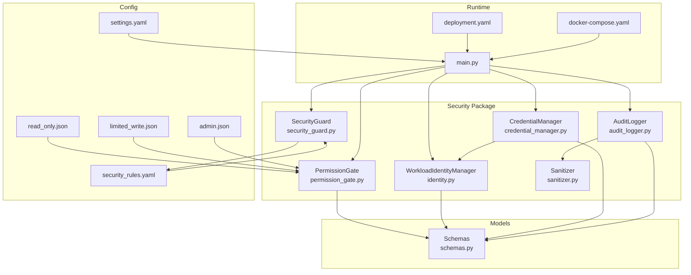
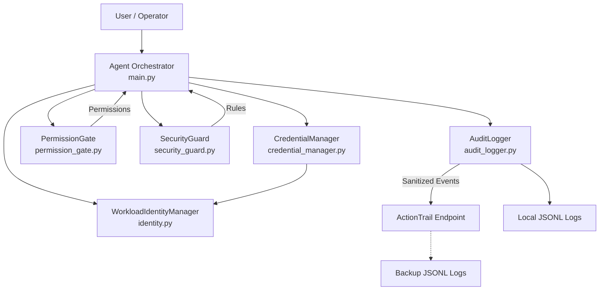
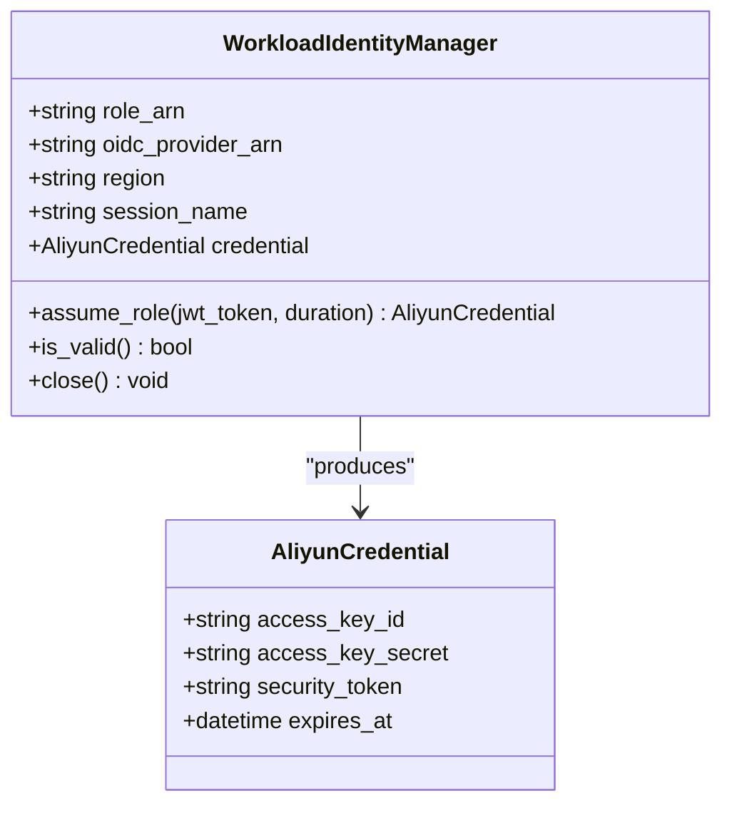
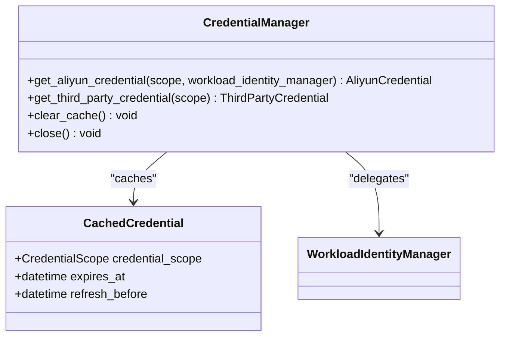
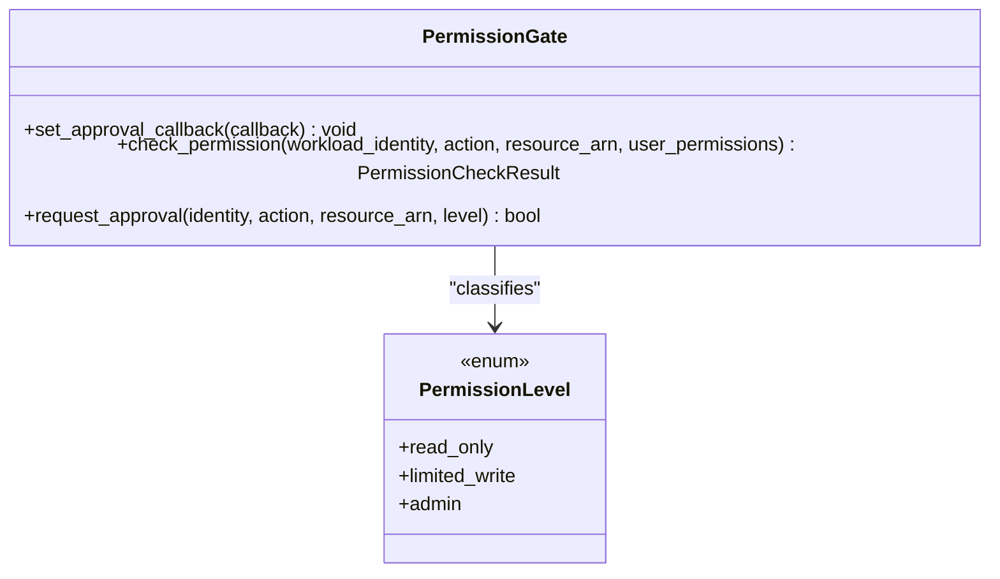
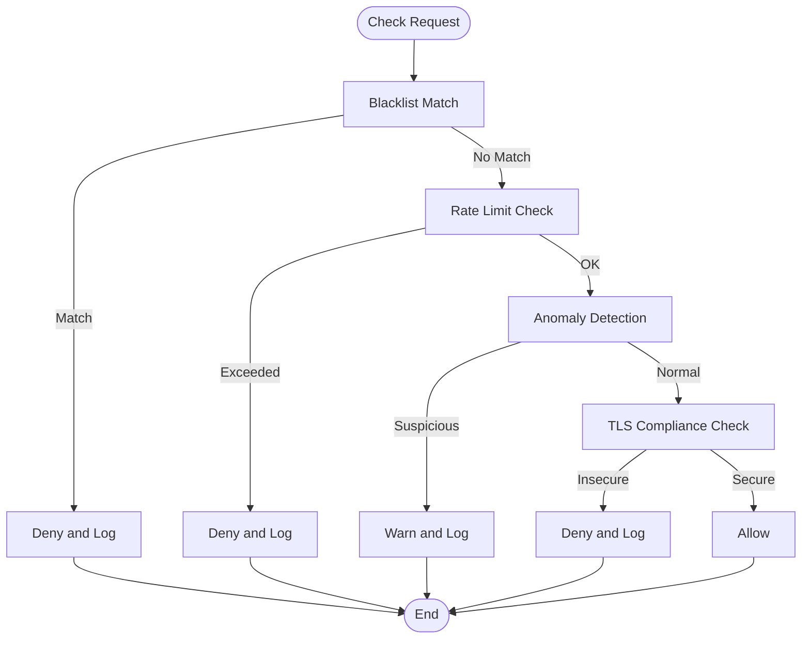
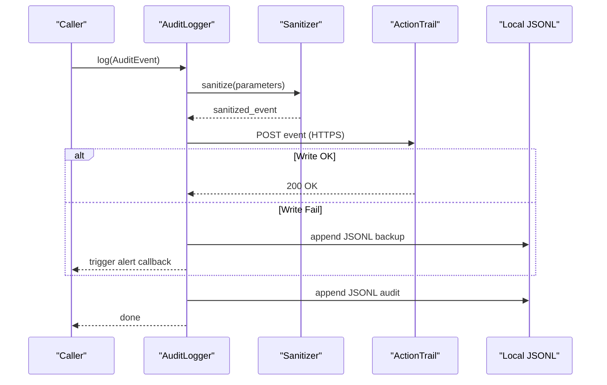
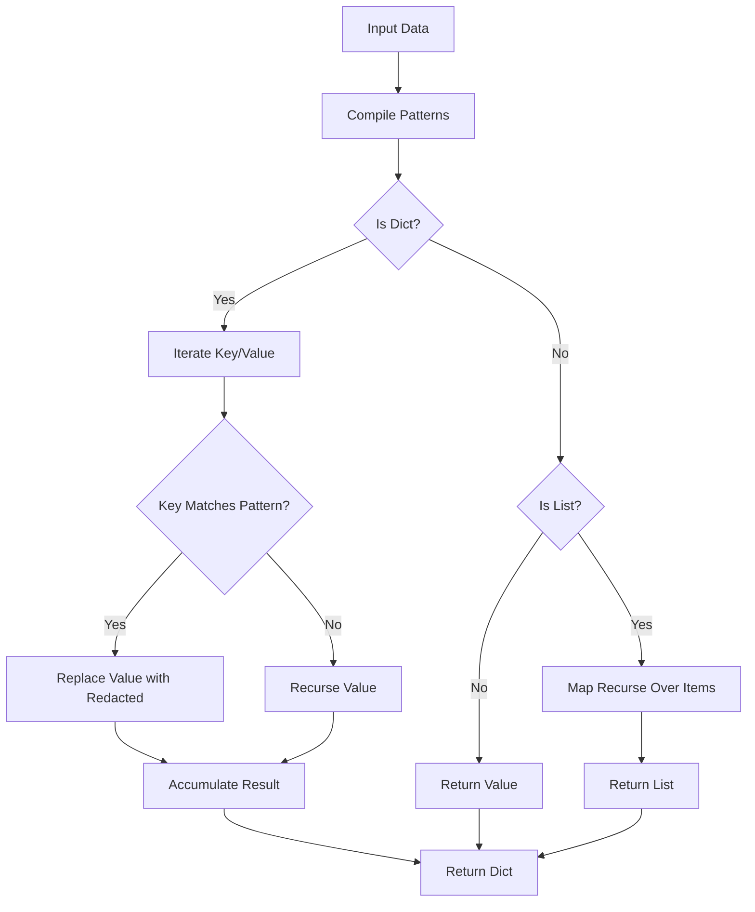
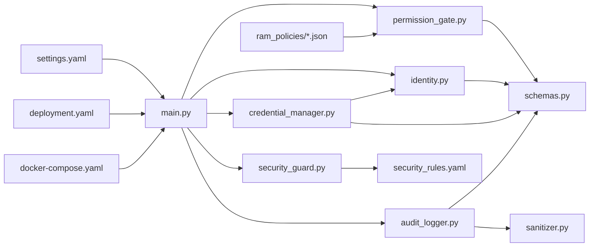

# Security Framework

<cite>
**Referenced Files in This Document**
- [identity.py](file://src/aiops_agent/security/identity.py)
- [credential_manager.py](file://src/aiops_agent/security/credential_manager.py)
- [permission_gate.py](file://src/aiops_agent/security/permission_gate.py)
- [security_guard.py](file://src/aiops_agent/security/security_guard.py)
- [sanitizer.py](file://src/aiops_agent/security/sanitizer.py)
- [audit_logger.py](file://src/aiops_agent/security/audit_logger.py)
- [schemas.py](file://src/aiops_agent/models/schemas.py)
- [settings.yaml](file://config/settings.yaml)
- [security_rules.yaml](file://config/security_rules.yaml)
- [read_only.json](file://config/ram_policies/read_only.json)
- [limited_write.json](file://config/ram_policies/limited_write.json)
- [admin.json](file://config/ram_policies/admin.json)
- [main.py](file://src/aiops_agent/main.py)
- [deployment.yaml](file://deploy/k8s/deployment.yaml)
- [docker-compose.yaml](file://deploy/docker-compose.yaml)
</cite>

## Table of Contents
1. [Introduction](#introduction)
2. [Project Structure](#project-structure)
3. [Core Components](#core-components)
4. [Architecture Overview](#architecture-overview)
5. [Detailed Component Analysis](#detailed-component-analysis)
6. [Dependency Analysis](#dependency-analysis)
7. [Performance Considerations](#performance-considerations)
8. [Troubleshooting Guide](#troubleshooting-guide)
9. [Conclusion](#conclusion)
10. [Appendices](#appendices)

## Introduction
This document describes the comprehensive security framework of the AIOps Agent, focusing on Workload Identity based on Alibaba Cloud Agent Identity, three-tier RBAC permissions, Security Guard threat detection and protection, Credential Manager’s token vault and sanitization, and audit logging integration with ActionTrail and local JSONL backups. It also provides configuration examples, policy templates, and best practices for secure deployment and operation.

## Project Structure
The security framework spans several modules under the security package, configuration directories for policies and rules, and orchestration in the main entrypoint. Kubernetes and Docker Compose deployment manifests show how identity and secrets are injected into the runtime environment.

**Diagram sources**
- [main.py:70-222](file://src/aiops_agent/main.py#L70-L222)
- [identity.py:38-247](file://src/aiops_agent/security/identity.py#L38-L247)
- [credential_manager.py:38-261](file://src/aiops_agent/security/credential_manager.py#L38-L261)
- [permission_gate.py:57-319](file://src/aiops_agent/security/permission_gate.py#L57-L319)
- [security_guard.py:25-292](file://src/aiops_agent/security/security_guard.py#L25-L292)
- [audit_logger.py:24-253](file://src/aiops_agent/security/audit_logger.py#L24-L253)
- [sanitizer.py:1-80](file://src/aiops_agent/security/sanitizer.py#L1-L80)
- [schemas.py:89-231](file://src/aiops_agent/models/schemas.py#L89-L231)
- [settings.yaml:27-42](file://config/settings.yaml#L27-L42)
- [security_rules.yaml:1-70](file://config/security_rules.yaml#L1-L70)
- [read_only.json:1-30](file://config/ram_policies/read_only.json#L1-L30)
- [limited_write.json:1-38](file://config/ram_policies/limited_write.json#L1-L38)
- [admin.json:1-35](file://config/ram_policies/admin.json#L1-L35)
- [deployment.yaml:17-38](file://deploy/k8s/deployment.yaml#L17-L38)
- [docker-compose.yaml:11-19](file://deploy/docker-compose.yaml#L11-L19)

**Section sources**
- [main.py:70-222](file://src/aiops_agent/main.py#L70-L222)
- [settings.yaml:27-42](file://config/settings.yaml#L27-L42)
- [security_rules.yaml:1-70](file://config/security_rules.yaml#L1-L70)
- [read_only.json:1-30](file://config/ram_policies/read_only.json#L1-L30)
- [limited_write.json:1-38](file://config/ram_policies/limited_write.json#L1-L38)
- [admin.json:1-35](file://config/ram_policies/admin.json#L1-L35)
- [deployment.yaml:17-38](file://deploy/k8s/deployment.yaml#L17-L38)
- [docker-compose.yaml:11-19](file://deploy/docker-compose.yaml#L11-L19)

## Core Components
- Workload Identity (Alibaba Cloud Agent Identity): Manages OIDC-based temporary STS credentials via AssumeRoleWithOIDC, with automatic refresh and safe token handling.
- Credential Manager: Centralized vault for Alibaba Cloud STS and third-party credentials with caching, scope isolation, and retry/backoff.
- Permission Gate: Three-tier RBAC (Read-Only, Limited-Write, Admin) with action classification, resource ARN matching, and optional human approval.
- Security Guard: Blacklist enforcement, rate limiting, anomaly detection, and TLS compliance checks.
- Audit Logger: Full-chain audit with sensitive data sanitization, ActionTrail integration, local JSONL logs, and backup/alerting.
- Sanitizer: Recursive redaction of sensitive fields in parameters and events.

**Section sources**
- [identity.py:38-247](file://src/aiops_agent/security/identity.py#L38-L247)
- [credential_manager.py:38-261](file://src/aiops_agent/security/credential_manager.py#L38-L261)
- [permission_gate.py:57-319](file://src/aiops_agent/security/permission_gate.py#L57-L319)
- [security_guard.py:25-292](file://src/aiops_agent/security/security_guard.py#L25-L292)
- [audit_logger.py:24-253](file://src/aiops_agent/security/audit_logger.py#L24-L253)
- [sanitizer.py:1-80](file://src/aiops_agent/security/sanitizer.py#L1-L80)

## Architecture Overview
The security architecture integrates Workload Identity for cloud service access, a layered permission gate, protective security guard, and comprehensive audit logging. Configuration is centralized in YAML files and environment variables, with Kubernetes and Docker Compose providing runtime injection of identity and secrets.

**Diagram sources**
- [main.py:70-222](file://src/aiops_agent/main.py#L70-L222)
- [identity.py:38-247](file://src/aiops_agent/security/identity.py#L38-L247)
- [credential_manager.py:38-261](file://src/aiops_agent/security/credential_manager.py#L38-L261)
- [permission_gate.py:57-319](file://src/aiops_agent/security/permission_gate.py#L57-L319)
- [security_guard.py:25-292](file://src/aiops_agent/security/security_guard.py#L25-L292)
- [audit_logger.py:24-253](file://src/aiops_agent/security/audit_logger.py#L24-L253)

## Detailed Component Analysis

### Workload Identity (Alibaba Cloud Agent Identity)
The WorkloadIdentityManager enables secure cloud service access without long-lived keys by obtaining temporary STS credentials using Kubernetes ServiceAccount JWT and STS AssumeRoleWithOIDC. It supports manual JWT override for non-Kubernetes environments, automatic refresh before expiration, and lifecycle cleanup.

**Diagram sources**
- [identity.py:38-247](file://src/aiops_agent/security/identity.py#L38-L247)
- [schemas.py:121-128](file://src/aiops_agent/models/schemas.py#L121-L128)

**Section sources**
- [identity.py:38-247](file://src/aiops_agent/security/identity.py#L38-L247)
- [main.py:112-139](file://src/aiops_agent/main.py#L112-L139)

### Credential Manager (Token Vault and Scope Isolation)
CredentialManager centralizes credential retrieval and caching, delegating Alibaba Cloud STS acquisition to WorkloadIdentityManager and supporting third-party credentials from environment variables. It enforces pre-expiration refresh windows and provides scope-based cache keys for skill-level isolation.

**Diagram sources**
- [credential_manager.py:38-261](file://src/aiops_agent/security/credential_manager.py#L38-L261)
- [schemas.py:108-119](file://src/aiops_agent/models/schemas.py#L108-L119)

**Section sources**
- [credential_manager.py:38-261](file://src/aiops_agent/security/credential_manager.py#L38-L261)
- [main.py:144-171](file://src/aiops_agent/main.py#L144-L171)

### Permission Gate (Three-Tier RBAC)
The PermissionGate implements three-tier RBAC:
- Read-Only: Default, auto-approved actions.
- Limited-Write: Requires approval; common write operations.
- Admin: Requires explicit human approval; destructive or privileged actions.

It classifies actions by verb prefixes, matches permissions and resource ARNs, computes effective permissions in On-Behalf-Of scenarios, and integrates with human approval callbacks.

**Diagram sources**
- [permission_gate.py:57-319](file://src/aiops_agent/security/permission_gate.py#L57-L319)
- [schemas.py:191-197](file://src/aiops_agent/models/schemas.py#L191-L197)

**Section sources**
- [permission_gate.py:57-319](file://src/aiops_agent/security/permission_gate.py#L57-L319)
- [read_only.json:1-30](file://config/ram_policies/read_only.json#L1-L30)
- [limited_write.json:1-38](file://config/ram_policies/limited_write.json#L1-L38)
- [admin.json:1-35](file://config/ram_policies/admin.json#L1-L35)

### Security Guard (Threat Detection and Protection)
SecurityGuard enforces:
- Blacklist: Prohibits high-risk actions (e.g., deleting production resources).
- Rate Limits: Per-minute and per-hour thresholds configurable per skill.
- Anomaly Detection: Flags unusual operation sequences.
- TLS Compliance: Enforces HTTPS/TLS 1.2+ for external communications.

**Diagram sources**
- [security_guard.py:64-253](file://src/aiops_agent/security/security_guard.py#L64-L253)
- [security_rules.yaml:20-69](file://config/security_rules.yaml#L20-L69)

**Section sources**
- [security_guard.py:25-292](file://src/aiops_agent/security/security_guard.py#L25-L292)
- [security_rules.yaml:1-70](file://config/security_rules.yaml#L1-L70)

### Audit Logger (ActionTrail + Local Backups)
AuditLogger records full-chain audit events with sensitive parameter sanitization, writes to ActionTrail when configured, falls back to local JSONL logs, and triggers alerts on failures. It supports querying historical events locally.

**Diagram sources**
- [audit_logger.py:65-253](file://src/aiops_agent/security/audit_logger.py#L65-L253)
- [sanitizer.py:39-80](file://src/aiops_agent/security/sanitizer.py#L39-L80)

**Section sources**
- [audit_logger.py:24-253](file://src/aiops_agent/security/audit_logger.py#L24-L253)
- [sanitizer.py:1-80](file://src/aiops_agent/security/sanitizer.py#L1-L80)

### Sensitive Data Sanitization
The sanitizer recursively redacts sensitive fields (e.g., passwords, tokens, access keys) from dictionaries and lists using compiled regex patterns. It is used by the audit logger to protect privacy in logged events.

**Diagram sources**
- [sanitizer.py:39-80](file://src/aiops_agent/security/sanitizer.py#L39-L80)

**Section sources**
- [sanitizer.py:1-80](file://src/aiops_agent/security/sanitizer.py#L1-L80)
- [audit_logger.py:216-221](file://src/aiops_agent/security/audit_logger.py#L216-L221)

## Dependency Analysis
The security components depend on shared schemas and are orchestrated in the main entrypoint. Policies and rules are loaded from configuration files. Runtime injection is handled via Kubernetes and Docker Compose.

**Diagram sources**
- [main.py:70-222](file://src/aiops_agent/main.py#L70-L222)
- [permission_gate.py:77-79](file://src/aiops_agent/security/permission_gate.py#L77-L79)
- [security_guard.py:57-58](file://src/aiops_agent/security/security_guard.py#L57-L58)
- [audit_logger.py:51-55](file://src/aiops_agent/security/audit_logger.py#L51-L55)
- [settings.yaml:27-42](file://config/settings.yaml#L27-L42)
- [read_only.json:1-30](file://config/ram_policies/read_only.json#L1-L30)
- [limited_write.json:1-38](file://config/ram_policies/limited_write.json#L1-L38)
- [admin.json:1-35](file://config/ram_policies/admin.json#L1-L35)
- [deployment.yaml:17-38](file://deploy/k8s/deployment.yaml#L17-L38)
- [docker-compose.yaml:11-19](file://deploy/docker-compose.yaml#L11-L19)

**Section sources**
- [main.py:70-222](file://src/aiops_agent/main.py#L70-L222)
- [permission_gate.py:77-79](file://src/aiops_agent/security/permission_gate.py#L77-L79)
- [security_guard.py:57-58](file://src/aiops_agent/security/security_guard.py#L57-L58)
- [audit_logger.py:51-55](file://src/aiops_agent/security/audit_logger.py#L51-L55)

## Performance Considerations
- Asynchronous refresh: WorkloadIdentityManager and SecurityGuard use async loops and timers to avoid blocking the event loop.
- Efficient caching: CredentialManager caches credentials with pre-expiration refresh windows to minimize latency and STS calls.
- Rate-limit buffers: SecurityGuard maintains bounded deques for call history and operation sequences to cap memory usage.
- TLS enforcement: SecurityGuard validates protocol compliance early to fail fast on insecure connections.

[No sources needed since this section provides general guidance]

## Troubleshooting Guide
Common issues and resolutions:
- Workload Identity initialization failures: Verify Role ARN, OIDC Provider ARN, and ServiceAccount JWT availability. Non-Kubernetes environments can supply a JWT via environment variable.
- Permission denials: Confirm RAM policy JSON files are present and readable by PermissionGate. Validate action verbs and resource ARNs.
- SecurityGuard rate limit exceeded: Adjust thresholds in security_rules.yaml or reduce operational frequency.
- Audit logging failures: Check ActionTrail endpoint reachability and SSL/TLS settings; confirm local disk write permissions for JSONL logs.
- Credential retrieval errors: Ensure environment variables for third-party credentials are set and that WorkloadIdentityManager is initialized before first use.

**Section sources**
- [main.py:124-139](file://src/aiops_agent/main.py#L124-L139)
- [permission_gate.py:302-315](file://src/aiops_agent/security/permission_gate.py#L302-L315)
- [security_guard.py:165-211](file://src/aiops_agent/security/security_guard.py#L165-L211)
- [audit_logger.py:161-185](file://src/aiops_agent/security/audit_logger.py#L161-L185)
- [credential_manager.py:96-157](file://src/aiops_agent/security/credential_manager.py#L96-L157)

## Conclusion
The AIOps Agent’s security framework combines OIDC-based Workload Identity, scoped credential management, three-tier RBAC, proactive security guard enforcement, and comprehensive audit logging with sensitive data sanitization. Together, these components provide a robust foundation for secure cloud operations with clear separation of duties, strong access controls, and full observability.

[No sources needed since this section summarizes without analyzing specific files]

## Appendices

### Security Configuration Examples
- Agent Identity configuration (settings.yaml): Defines RAM Role ARN, OIDC Provider ARN, region, session name, and token refresh window.
- Security rules (security_rules.yaml): Includes sensitive field patterns, blacklist entries, rate limits, anomaly detection, and communication enforcement.
- RAM policies (read_only.json, limited_write.json, admin.json): Define allowable actions per tier and deny-listed operations.

**Section sources**
- [settings.yaml:27-42](file://config/settings.yaml#L27-L42)
- [security_rules.yaml:1-70](file://config/security_rules.yaml#L1-L70)
- [read_only.json:1-30](file://config/ram_policies/read_only.json#L1-L30)
- [limited_write.json:1-38](file://config/ram_policies/limited_write.json#L1-L38)
- [admin.json:1-35](file://config/ram_policies/admin.json#L1-L35)

### Policy Templates
- Read-Only: Allows read-only queries across ECS, RDS, VPC, SLB, CMS, SLS, ARMS.
- Limited-Write: Adds selected write operations (e.g., instance start/stop/reboot, DB restart/spec modify, SLB backend updates, alarm enable/disable).
- Admin: Grants broad administrative permissions with explicit denials for sensitive operations (e.g., deleting users, disabling logging).

**Section sources**
- [read_only.json:1-30](file://config/ram_policies/read_only.json#L1-L30)
- [limited_write.json:1-38](file://config/ram_policies/limited_write.json#L1-L38)
- [admin.json:1-35](file://config/ram_policies/admin.json#L1-L35)

### Best Practices for Secure Deployment and Operation
- Deploy in Kubernetes with a dedicated ServiceAccount and inject Role ARN and OIDC Provider ARN via ConfigMaps/Secrets.
- Keep token_refresh_before_minutes aligned with operational cadence to prevent credential churn.
- Configure security_rules.yaml thresholds conservatively and tune per skill categories.
- Store third-party credentials in environment variables or external secret managers; avoid embedding in images.
- Enable ActionTrail integration and monitor backup logs for audit continuity.
- Restrict data residency to allowed regions and validate during startup.
- Regularly review and rotate RAM roles and OIDC providers; enforce least privilege.

**Section sources**
- [deployment.yaml:17-38](file://deploy/k8s/deployment.yaml#L17-L38)
- [docker-compose.yaml:11-19](file://deploy/docker-compose.yaml#L11-L19)
- [settings.yaml:78-85](file://config/settings.yaml#L78-L85)
- [security_rules.yaml:44-69](file://config/security_rules.yaml#L44-L69)
- [main.py:58-67](file://src/aiops_agent/main.py#L58-L67)