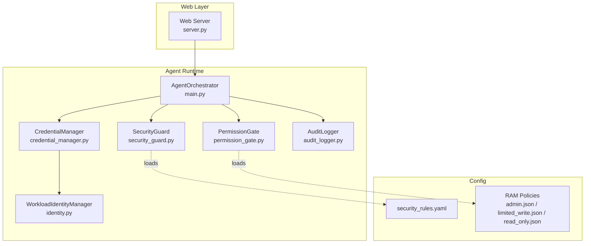
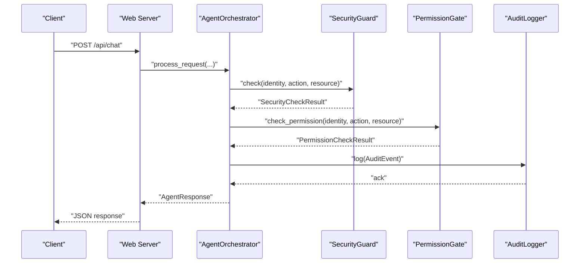
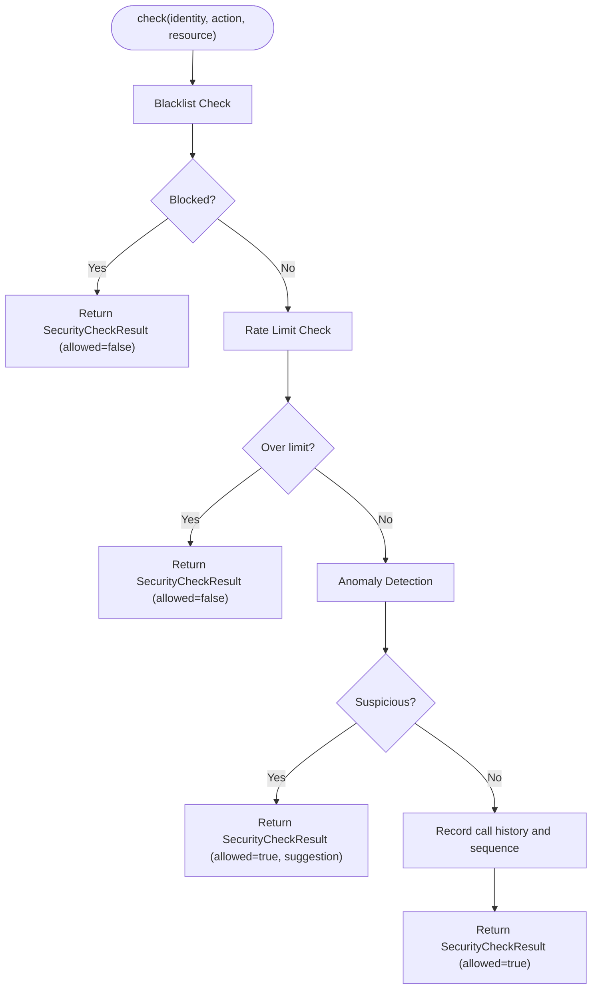
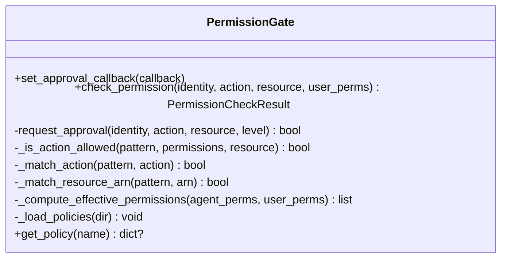
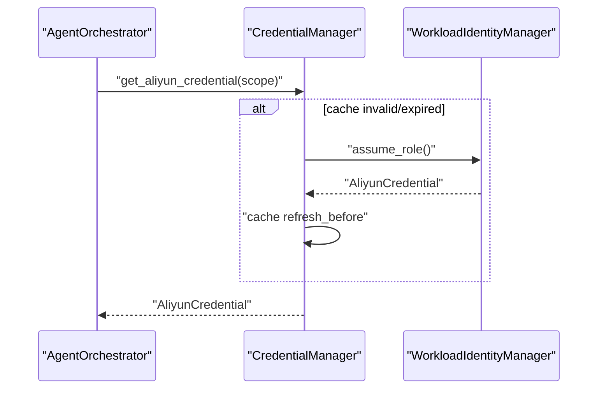
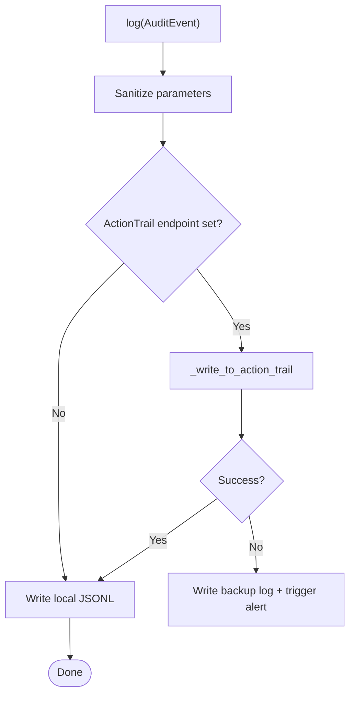
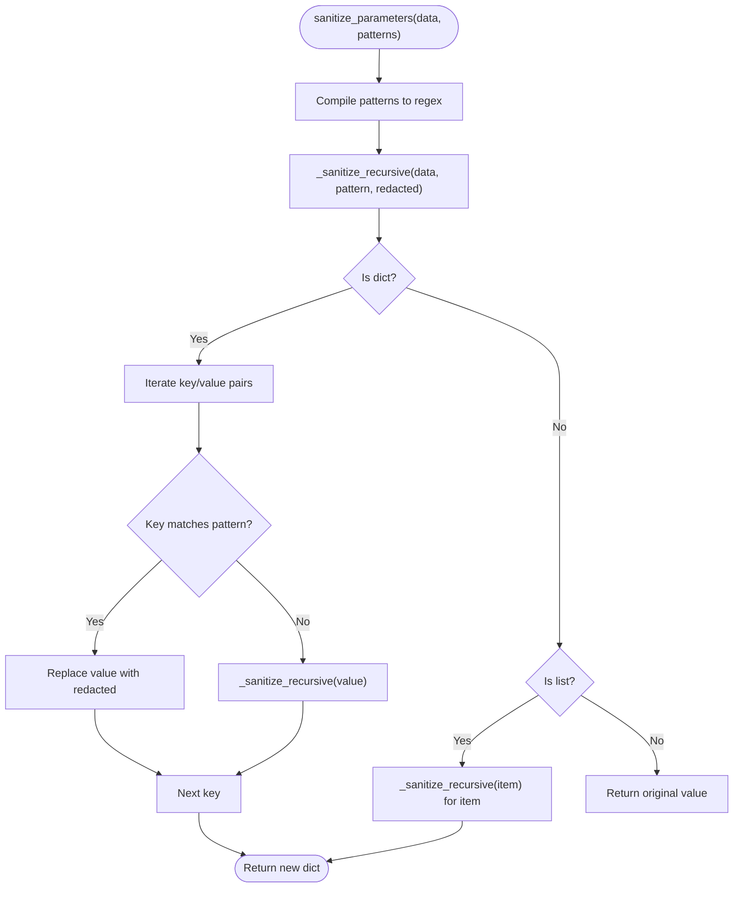
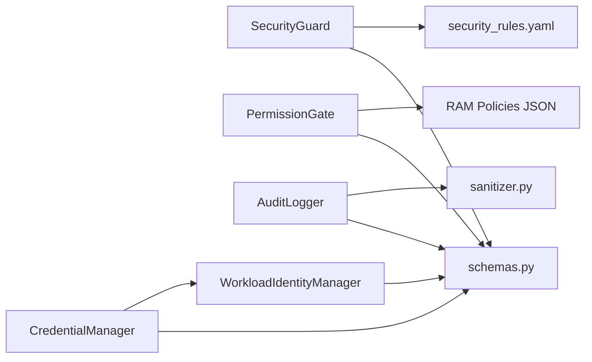

# Security Guard

<cite>
**Referenced Files in This Document**
- [security_guard.py](file://src/aiops_agent/security/security_guard.py)
- [security_rules.yaml](file://config/security_rules.yaml)
- [sanitizer.py](file://src/aiops_agent/security/sanitizer.py)
- [permission_gate.py](file://src/aiops_agent/security/permission_gate.py)
- [audit_logger.py](file://src/aiops_agent/security/audit_logger.py)
- [credential_manager.py](file://src/aiops_agent/security/credential_manager.py)
- [identity.py](file://src/aiops_agent/security/identity.py)
- [schemas.py](file://src/aiops_agent/models/schemas.py)
- [main.py](file://src/aiops_agent/main.py)
- [server.py](file://src/aiops_agent/web/server.py)
- [test_security_guard.py](file://tests/test_security_guard.py)
- [admin.json](file://config/ram_policies/admin.json)
- [limited_write.json](file://config/ram_policies/limited_write.json)
- [read_only.json](file://config/ram_policies/read_only.json)
</cite>

## Table of Contents
1. [Introduction](#introduction)
2. [Project Structure](#project-structure)
3. [Core Components](#core-components)
4. [Architecture Overview](#architecture-overview)
5. [Detailed Component Analysis](#detailed-component-analysis)
6. [Dependency Analysis](#dependency-analysis)
7. [Performance Considerations](#performance-considerations)
8. [Troubleshooting Guide](#troubleshooting-guide)
9. [Conclusion](#conclusion)
10. [Appendices](#appendices)

## Introduction
This document explains the Security Guard threat detection and protection system within the AIOps Agent. It focuses on the security rule engine that validates incoming requests against configurable security policies, the rule-based filtering mechanisms, pattern matching, and anomaly detection capabilities. It also documents the integration with security_rules.yaml for defining custom protection policies, provides examples of common attack patterns detected, describes rule configuration syntax, and outlines policy enforcement mechanisms. Guidance is included for tuning security rules across deployment scenarios, mitigating false positives, and optimizing performance for high-throughput environments.

## Project Structure
Security Guard is part of the broader AIOps Agent security stack. It integrates with identity management, credential management, permission gating, auditing, and the web server to enforce protections at runtime.

**Diagram sources**
- [server.py:196-222](file://src/aiops_agent/web/server.py#L196-L222)
- [main.py:70-222](file://src/aiops_agent/main.py#L70-L222)
- [security_guard.py:25-59](file://src/aiops_agent/security/security_guard.py#L25-L59)
- [permission_gate.py:57-82](file://src/aiops_agent/security/permission_gate.py#L57-L82)
- [credential_manager.py:38-60](file://src/aiops_agent/security/credential_manager.py#L38-L60)
- [identity.py:38-73](file://src/aiops_agent/security/identity.py#L38-L73)
- [audit_logger.py:24-60](file://src/aiops_agent/security/audit_logger.py#L24-L60)
- [security_rules.yaml:1-70](file://config/security_rules.yaml#L1-L70)
- [admin.json:1-35](file://config/ram_policies/admin.json#L1-L35)
- [limited_write.json:1-38](file://config/ram_policies/limited_write.json#L1-L38)
- [read_only.json:1-30](file://config/ram_policies/read_only.json#L1-L30)

**Section sources**
- [server.py:196-222](file://src/aiops_agent/web/server.py#L196-L222)
- [main.py:70-222](file://src/aiops_agent/main.py#L70-L222)

## Core Components
- SecurityGuard: Central security rule engine that enforces blacklist rules, rate limits, anomaly detection, and TLS enforcement. It loads configuration from security_rules.yaml and exposes a check method for incoming actions.
- PermissionGate: RBAC-based permission gate that validates requested actions against Workload Identity permissions and resource ARNs, classifies permission levels, and supports manual approval flows.
- CredentialManager and WorkloadIdentityManager: Manage secure credentials and OIDC-based workloads identities, enabling least-privilege access to cloud APIs.
- AuditLogger: Records structured audit events, sanitizes sensitive parameters, writes to ActionTrail when available, falls back to local logs, and triggers alerts on failures.
- Sanitizer: Recursively redacts sensitive fields from parameters using configurable field-name patterns.
- RAM Policies: Predefined policy sets for admin, limited-write, and read-only roles.

**Section sources**
- [security_guard.py:25-59](file://src/aiops_agent/security/security_guard.py#L25-L59)
- [permission_gate.py:57-93](file://src/aiops_agent/security/permission_gate.py#L57-L93)
- [credential_manager.py:38-60](file://src/aiops_agent/security/credential_manager.py#L38-L60)
- [identity.py:38-73](file://src/aiops_agent/security/identity.py#L38-L73)
- [audit_logger.py:24-60](file://src/aiops_agent/security/audit_logger.py#L24-L60)
- [sanitizer.py:1-80](file://src/aiops_agent/security/sanitizer.py#L1-L80)
- [admin.json:1-35](file://config/ram_policies/admin.json#L1-L35)
- [limited_write.json:1-38](file://config/ram_policies/limited_write.json#L1-L38)
- [read_only.json:1-30](file://config/ram_policies/read_only.json#L1-L30)

## Architecture Overview
Security Guard participates in the request lifecycle alongside PermissionGate and AuditLogger. The web server initializes the AgentOrchestrator, which coordinates security checks, permission validation, credential acquisition, and auditing.

**Diagram sources**
- [server.py:44-82](file://src/aiops_agent/web/server.py#L44-L82)
- [main.py:148-171](file://src/aiops_agent/main.py#L148-L171)
- [security_guard.py:64-122](file://src/aiops_agent/security/security_guard.py#L64-L122)
- [permission_gate.py:95-181](file://src/aiops_agent/security/permission_gate.py#L95-L181)
- [audit_logger.py:65-103](file://src/aiops_agent/security/audit_logger.py#L65-L103)

## Detailed Component Analysis

### SecurityGuard: Rule Engine
SecurityGuard performs three primary checks in order:
- Blacklist match: Blocks high-risk actions configured in the blacklist.
- Rate limit: Enforces per-minute and per-hour thresholds for each action per identity.
- Anomaly detection: Flags unusual operation sequences without blocking.
- TLS enforcement: Ensures HTTPS/TLS 1.2+ for URLs when configured.

**Diagram sources**
- [security_guard.py:64-122](file://src/aiops_agent/security/security_guard.py#L64-L122)
- [security_guard.py:149-253](file://src/aiops_agent/security/security_guard.py#L149-L253)

Key behaviors:
- Blacklist entries define action identifiers and suggestions.
- Rate limits support a default profile and per-skill overrides.
- Anomaly detection counts unique actions in the recent window and emits warnings when diversity exceeds thresholds.
- TLS enforcement blocks non-HTTPS URLs when enabled.

Configuration syntax and examples are documented in the Appendices.

**Section sources**
- [security_guard.py:64-122](file://src/aiops_agent/security/security_guard.py#L64-L122)
- [security_guard.py:149-253](file://src/aiops_agent/security/security_guard.py#L149-L253)
- [security_rules.yaml:20-69](file://config/security_rules.yaml#L20-L69)

### PermissionGate: RBAC and Resource Matching
PermissionGate classifies actions into permission levels and enforces allow/deny decisions based on Workload Identity permissions and resource ARNs. It supports:
- Operation pattern matching with wildcards.
- Resource ARN pattern matching with wildcards.
- Effective permission computation under On-Behalf-Of scenarios.
- Manual approval for Limited-Write and Admin actions via a callback hook.

**Diagram sources**
- [permission_gate.py:57-319](file://src/aiops_agent/security/permission_gate.py#L57-L319)

**Section sources**
- [permission_gate.py:95-181](file://src/aiops_agent/security/permission_gate.py#L95-L181)
- [permission_gate.py:225-296](file://src/aiops_agent/security/permission_gate.py#L225-L296)
- [admin.json:1-35](file://config/ram_policies/admin.json#L1-L35)
- [limited_write.json:1-38](file://config/ram_policies/limited_write.json#L1-L38)
- [read_only.json:1-30](file://config/ram_policies/read_only.json#L1-L30)

### CredentialManager and WorkloadIdentityManager
These components manage secure access to cloud APIs:
- WorkloadIdentityManager obtains temporary STS credentials via OIDC AssumeRoleWithOIDC and schedules automatic refresh.
- CredentialManager caches and serves credentials scoped per target service and role, with exponential backoff retries.

**Diagram sources**
- [credential_manager.py:63-121](file://src/aiops_agent/security/credential_manager.py#L63-L121)
- [identity.py:119-173](file://src/aiops_agent/security/identity.py#L119-L173)

**Section sources**
- [credential_manager.py:38-121](file://src/aiops_agent/security/credential_manager.py#L38-L121)
- [identity.py:38-173](file://src/aiops_agent/security/identity.py#L38-L173)

### AuditLogger: Structured Auditing and Sanitization
AuditLogger records events with sensitive parameters sanitized, attempts to write to ActionTrail, falls back to local JSONL logs, and triggers alerts on failures. It supports querying local audit logs by time and filters.

**Diagram sources**
- [audit_logger.py:65-103](file://src/aiops_agent/security/audit_logger.py#L65-L103)
- [audit_logger.py:161-210](file://src/aiops_agent/security/audit_logger.py#L161-L210)

**Section sources**
- [audit_logger.py:24-103](file://src/aiops_agent/security/audit_logger.py#L24-L103)
- [audit_logger.py:105-155](file://src/aiops_agent/security/audit_logger.py#L105-L155)

### Sanitizer: Recursive Parameter Redaction
The sanitizer recursively redacts sensitive fields whose names match configured patterns (case-insensitive). It operates on dictionaries and lists without mutating the original data.

**Diagram sources**
- [sanitizer.py:39-79](file://src/aiops_agent/security/sanitizer.py#L39-L79)

**Section sources**
- [sanitizer.py:1-80](file://src/aiops_agent/security/sanitizer.py#L1-L80)

## Dependency Analysis
SecurityGuard depends on configuration loaded from security_rules.yaml and interacts with the runtime through the AgentOrchestrator. PermissionGate depends on RAM policy JSON files. AuditLogger depends on the sanitizer and optional ActionTrail endpoint. CredentialManager depends on WorkloadIdentityManager for STS tokens.

**Diagram sources**
- [security_guard.py:25-59](file://src/aiops_agent/security/security_guard.py#L25-L59)
- [permission_gate.py:57-82](file://src/aiops_agent/security/permission_gate.py#L57-L82)
- [audit_logger.py:24-60](file://src/aiops_agent/security/audit_logger.py#L24-L60)
- [sanitizer.py:1-80](file://src/aiops_agent/security/sanitizer.py#L1-L80)
- [credential_manager.py:38-60](file://src/aiops_agent/security/credential_manager.py#L38-L60)
- [identity.py:38-73](file://src/aiops_agent/security/identity.py#L38-L73)
- [schemas.py:89-231](file://src/aiops_agent/models/schemas.py#L89-L231)

**Section sources**
- [main.py:144-171](file://src/aiops_agent/main.py#L144-L171)
- [security_rules.yaml:1-70](file://config/security_rules.yaml#L1-L70)

## Performance Considerations
- Rate-limiting uses deques with capped lengths to bound memory usage per identity and action. Tune defaults and per-skill limits to balance safety and throughput.
- Anomaly detection scans recent sequences; adjust the window size and threshold to reduce false positives in noisy environments.
- TLS enforcement is O(1) string checks per URL.
- Sanitization is recursive but bounded by input size; keep patterns concise.
- Credential caching avoids frequent AssumeRole calls; refresh before expiration to prevent latency spikes.
- AuditLogger writes are asynchronous; ActionTrail failures trigger backups and alerts to avoid blocking the main path.

[No sources needed since this section provides general guidance]

## Troubleshooting Guide
Common issues and resolutions:
- Blacklist blocks legitimate actions: Review and refine blacklist entries in security_rules.yaml to avoid over-blocking.
- Frequent rate-limit denials: Increase max_calls_per_minute or max_calls_per_hour for high-volume skills; consider per-skill overrides.
- Anomaly warnings flooding: Adjust deviation_threshold or disable anomaly_detection temporarily during onboarding.
- TLS failures: Ensure URLs use HTTPS; configure enforce_https appropriately.
- Permission denials: Verify Workload Identity permissions and resource ARN patterns; confirm RAM policy alignment.
- Audit failures: Confirm ActionTrail endpoint availability and credentials; monitor backup logs and alerts.

Validation references:
- Unit tests demonstrate blacklist blocking, rate-limiting behavior, anomaly warnings, TLS enforcement, and rule loading.

**Section sources**
- [test_security_guard.py:19-177](file://tests/test_security_guard.py#L19-L177)

## Conclusion
Security Guard provides a layered defense-in-depth for the AIOps Agent, combining blacklist enforcement, rate limiting, anomaly detection, and strict TLS requirements. It integrates tightly with RBAC, credential management, and auditing to ensure secure, auditable, and high-performance operations across diverse deployment scenarios.

[No sources needed since this section summarizes without analyzing specific files]

## Appendices

### Appendix A: security_rules.yaml Configuration Syntax and Examples
- sensitive_field_patterns: List of field-name substrings to redact (used by sanitizer).
- blacklist: Array of high-risk actions with description and suggestion.
- rate_limits: default thresholds and optional per-skill overrides.
- anomaly_detection: enable flag, baseline window, and deviation threshold.
- communication: enforce_https and minimum TLS version.

Example coverage:
- High-risk actions include deleting production resources, modifying root account login profiles, and disabling security controls.
- Per-skill rate limits differentiate monitoring, troubleshooting, and change management workloads.

**Section sources**
- [security_rules.yaml:1-70](file://config/security_rules.yaml#L1-L70)

### Appendix B: RAM Policy Sets
- admin.json: Broad administrative allowances with explicit denials for destructive actions.
- limited_write.json: Operational write actions with restrictions.
- read_only.json: Read-only monitoring and logging actions.

**Section sources**
- [admin.json:1-35](file://config/ram_policies/admin.json#L1-L35)
- [limited_write.json:1-38](file://config/ram_policies/limited_write.json#L1-L38)
- [read_only.json:1-30](file://config/ram_policies/read_only.json#L1-L30)

### Appendix C: Data Models Used by Security Components
- WorkloadIdentity, CredentialScope, CachedCredential, AliyunCredential, ThirdPartyCredential, AuditEvent, PermissionLevel, PermissionCheckResult, SecurityRule, SecurityCheckResult.

**Section sources**
- [schemas.py:89-231](file://src/aiops_agent/models/schemas.py#L89-L231)