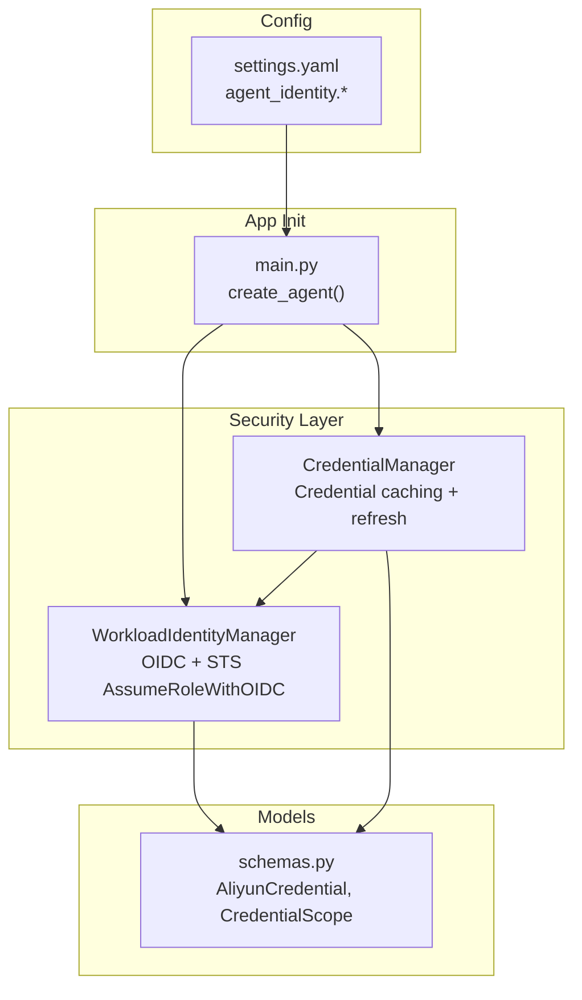
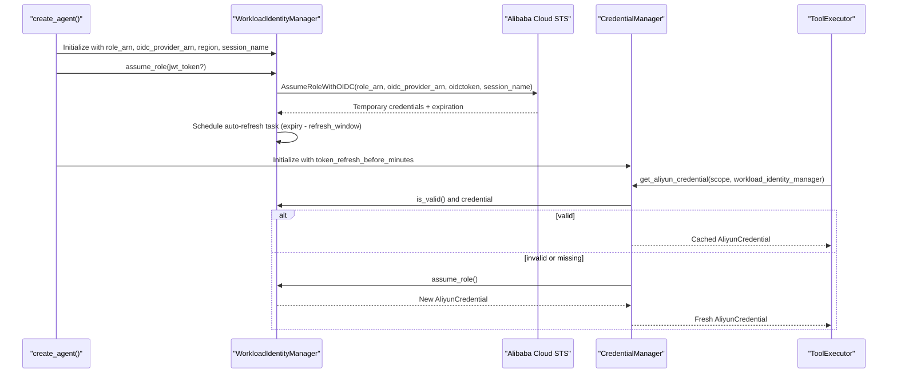
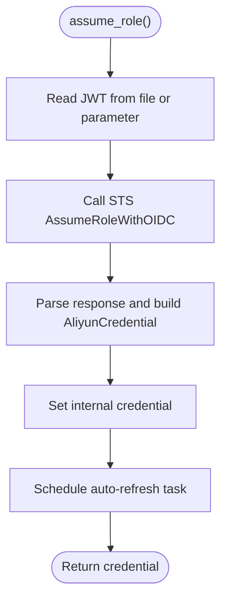
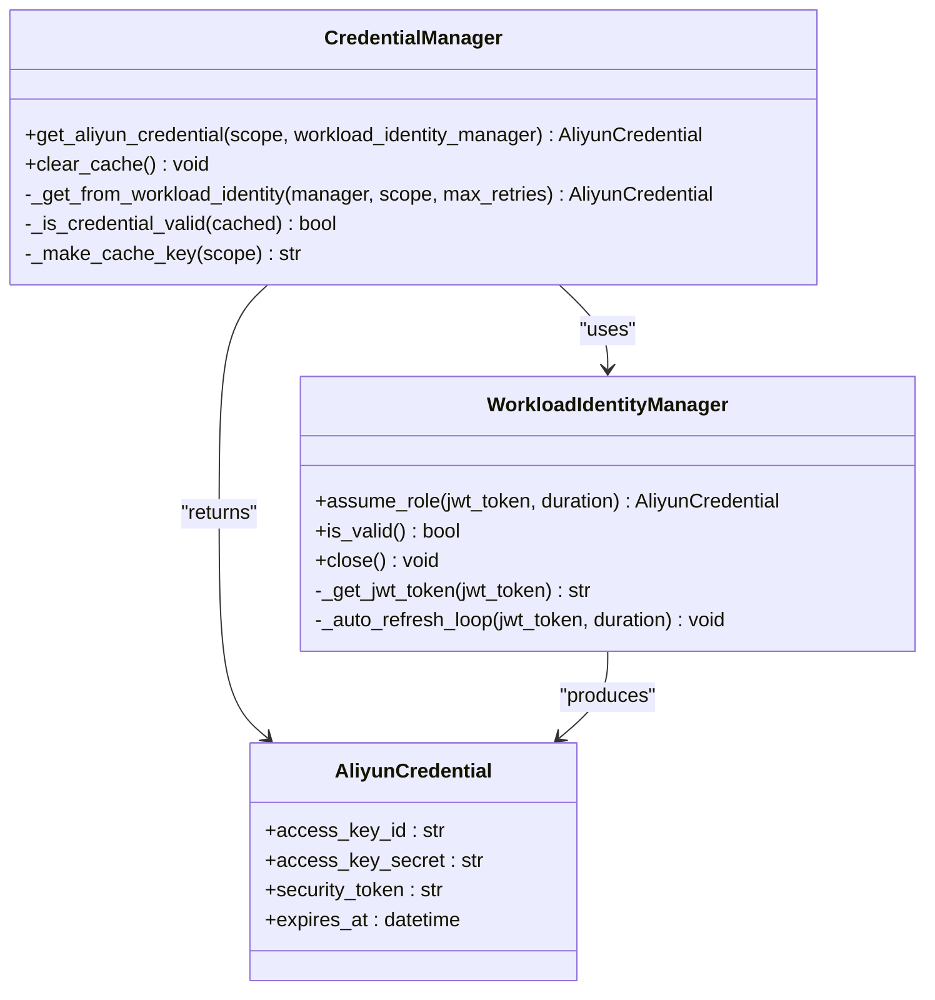
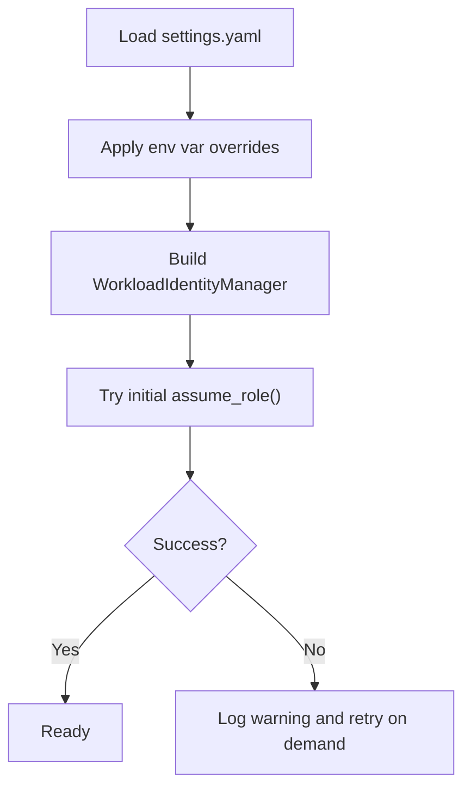
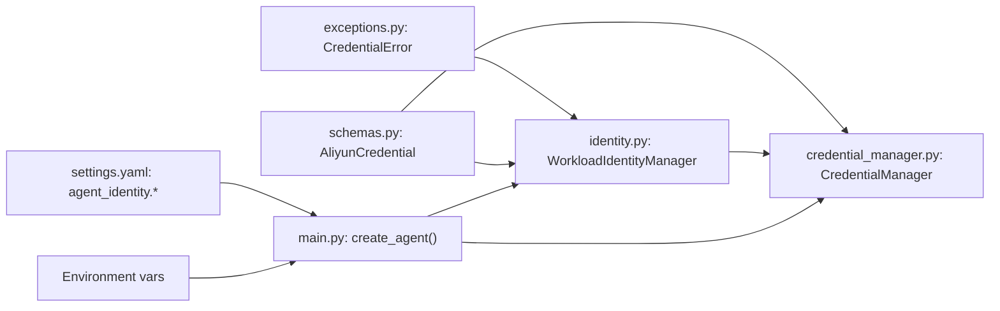

# Workload Identity

<cite>
**Referenced Files in This Document**
- [identity.py](file://src/aiops_agent/security/identity.py)
- [credential_manager.py](file://src/aiops_agent/security/credential_manager.py)
- [schemas.py](file://src/aiops_agent/models/schemas.py)
- [exceptions.py](file://src/aiops_agent/core/exceptions.py)
- [settings.yaml](file://config/settings.yaml)
- [main.py](file://src/aiops_agent/main.py)
- [test_workload_identity.py](file://tests/test_workload_identity.py)
</cite>

## Table of Contents
1. [Introduction](#introduction)
2. [Project Structure](#project-structure)
3. [Core Components](#core-components)
4. [Architecture Overview](#architecture-overview)
5. [Detailed Component Analysis](#detailed-component-analysis)
6. [Dependency Analysis](#dependency-analysis)
7. [Performance Considerations](#performance-considerations)
8. [Troubleshooting Guide](#troubleshooting-guide)
9. [Conclusion](#conclusion)

## Introduction
This document explains the Workload Identity system used by the AIOps Agent to obtain short-lived credentials from Alibaba Cloud STS using OIDC (OpenID Connect) with Kubernetes ServiceAccounts. It covers the OIDC workflow, the AssumeRoleWithOIDC process, prerequisites for IAM configuration, automatic credential refresh behavior, configuration options, and troubleshooting guidance.

## Project Structure
The Workload Identity implementation is centered around two modules:
- WorkloadIdentityManager: reads the Kubernetes ServiceAccount JWT and exchanges it for STS credentials via AssumeRoleWithOIDC, with automatic refresh.
- CredentialManager: caches and serves temporary credentials to skills and tools, integrating with WorkloadIdentityManager.

**Diagram sources**
- [identity.py:38-247](file://src/aiops_agent/security/identity.py#L38-L247)
- [credential_manager.py:38-261](file://src/aiops_agent/security/credential_manager.py#L38-L261)
- [schemas.py:99-128](file://src/aiops_agent/models/schemas.py#L99-L128)
- [settings.yaml:27-42](file://config/settings.yaml#L27-L42)
- [main.py:70-146](file://src/aiops_agent/main.py#L70-L146)

**Section sources**
- [identity.py:1-247](file://src/aiops_agent/security/identity.py#L1-L247)
- [credential_manager.py:1-261](file://src/aiops_agent/security/credential_manager.py#L1-L261)
- [schemas.py:1-313](file://src/aiops_agent/models/schemas.py#L1-L313)
- [settings.yaml:1-85](file://config/settings.yaml#L1-L85)
- [main.py:1-311](file://src/aiops_agent/main.py#L1-L311)

## Core Components
- WorkloadIdentityManager
  - Reads the Kubernetes ServiceAccount JWT from the default mounted path or accepts an explicit JWT for non-Kubernetes environments.
  - Calls STS AssumeRoleWithOIDC to obtain temporary credentials.
  - Starts an asynchronous refresh loop to proactively renew credentials before expiration.
  - Exposes validity checks and lifecycle cleanup.
- CredentialManager
  - Provides cached access to AliyunCredential instances.
  - Integrates with WorkloadIdentityManager to fetch fresh credentials when needed.
  - Implements exponential backoff retries and cache invalidation.

Key configuration inputs:
- role_arn: RAM role ARN to assume.
- oidc_provider_arn: OIDC identity provider ARN.
- region: Alibaba Cloud region for STS endpoint.
- session_name: STS role session name.
- token_refresh_before_minutes: Refresh threshold window before expiry.

**Section sources**
- [identity.py:38-247](file://src/aiops_agent/security/identity.py#L38-L247)
- [credential_manager.py:38-261](file://src/aiops_agent/security/credential_manager.py#L38-L261)
- [settings.yaml:27-42](file://config/settings.yaml#L27-L42)
- [main.py:100-118](file://src/aiops_agent/main.py#L100-L118)

## Architecture Overview
The Workload Identity flow integrates with the application bootstrap and tool execution pipeline.

**Diagram sources**
- [main.py:100-146](file://src/aiops_agent/main.py#L100-L146)
- [identity.py:119-173](file://src/aiops_agent/security/identity.py#L119-L173)
- [credential_manager.py:63-121](file://src/aiops_agent/security/credential_manager.py#L63-L121)

## Detailed Component Analysis

### OIDC Workflow and AssumeRoleWithOIDC
- Kubernetes ServiceAccount JWT:
  - Mounted at a well-known path inside the pod.
  - Read synchronously in an executor to avoid blocking the event loop.
- STS AssumeRoleWithOIDC:
  - Uses the provided role_arn, oidc_provider_arn, and the JWT to obtain temporary credentials.
  - Stores the resulting AliyunCredential with expiration time.
- Automatic refresh:
  - A background task calculates refresh time as (credential.expiration - refresh_window).
  - Sleeps until refresh time and re-invokes assume_role with the same JWT and duration.

**Diagram sources**
- [identity.py:107-173](file://src/aiops_agent/security/identity.py#L107-L173)

**Section sources**
- [identity.py:92-173](file://src/aiops_agent/security/identity.py#L92-L173)
- [test_workload_identity.py:92-148](file://tests/test_workload_identity.py#L92-L148)

### Automatic Credential Refresh Mechanism
- Refresh window:
  - Defaults to 5 minutes before expiration.
  - Controlled by token_refresh_before_minutes.
- Background loop:
  - Computes wait time as (expires_at - refresh_before - now).
  - Sleeps and then calls assume_role again with the same JWT and duration.
  - On failure, logs and retries after a fixed interval.

```mermaid
flowchart TD
LoopStart(["_auto_refresh_loop"]) --> CheckCred{"Has credential?"}
CheckCred --> |No| Exit["Exit loop"]
CheckCred --> |Yes| Calc["Compute refresh_at = expires_at - refresh_before"]
Calc --> Now["Get current UTC time"]
Now --> WaitSec["wait_seconds = max(refresh_at - now, 0)"]
WaitSec --> Sleep["Sleep for wait_seconds"]
Sleep --> Reassume["assume_role(jwt_token, duration)"]
Reassume --> LoopStart
```

**Diagram sources**
- [identity.py:188-213](file://src/aiops_agent/security/identity.py#L188-L213)

**Section sources**
- [identity.py:179-213](file://src/aiops_agent/security/identity.py#L179-L213)
- [test_workload_identity.py:155-202](file://tests/test_workload_identity.py#L155-L202)

### Credential Caching and Retrieval
- CredentialManager caches AliyunCredential keyed by scope and refresh_before time.
- get_aliyun_credential:
  - Returns cached credential if still valid (not within refresh window).
  - Otherwise delegates to WorkloadIdentityManager to refresh.
  - Applies exponential backoff on failures.

**Diagram sources**
- [credential_manager.py:38-261](file://src/aiops_agent/security/credential_manager.py#L38-L261)
- [identity.py:38-247](file://src/aiops_agent/security/identity.py#L38-L247)
- [schemas.py:121-128](file://src/aiops_agent/models/schemas.py#L121-L128)

**Section sources**
- [credential_manager.py:63-157](file://src/aiops_agent/security/credential_manager.py#L63-L157)
- [schemas.py:99-128](file://src/aiops_agent/models/schemas.py#L99-L128)

### Configuration and Environment Integration
- Configuration sources:
  - settings.yaml: agent_identity.role_arn, agent_identity.oidc_provider_arn, agent_identity.region, agent_identity.session_name, agent_identity.token_refresh_before_minutes.
  - Environment variables: ALIBABA_CLOUD_ROLE_ARN, ALIBABA_CLOUD_OIDC_PROVIDER_ARN, ALIBABA_CLOUD_OIDC_TOKEN.
- Application bootstrap:
  - create_agent() reads configuration and environment variables, initializes WorkloadIdentityManager, and attempts initial assume_role.
  - Non-Kubernetes environments can supply a JWT via ALIBABA_CLOUD_OIDC_TOKEN.

**Diagram sources**
- [main.py:100-139](file://src/aiops_agent/main.py#L100-L139)
- [settings.yaml:27-42](file://config/settings.yaml#L27-L42)

**Section sources**
- [main.py:100-139](file://src/aiops_agent/main.py#L100-L139)
- [settings.yaml:27-42](file://config/settings.yaml#L27-L42)

## Dependency Analysis
- WorkloadIdentityManager depends on:
  - Alibaba Cloud STS SDK for AssumeRoleWithOIDC.
  - AliyunCredential model for structured credentials.
  - CredentialError for error propagation.
- CredentialManager depends on:
  - WorkloadIdentityManager for fetching new credentials.
  - AliyunCredential and CachedCredential models.
  - Exponential backoff constants for retries.
- main.py composes these components during application startup.

**Diagram sources**
- [exceptions.py:79-98](file://src/aiops_agent/core/exceptions.py#L79-L98)
- [schemas.py:121-128](file://src/aiops_agent/models/schemas.py#L121-L128)
- [identity.py:26-27](file://src/aiops_agent/security/identity.py#L26-L27)
- [credential_manager.py:18-24](file://src/aiops_agent/security/credential_manager.py#L18-L24)
- [main.py:100-146](file://src/aiops_agent/main.py#L100-L146)

**Section sources**
- [identity.py:22-27](file://src/aiops_agent/security/identity.py#L22-L27)
- [credential_manager.py:18-24](file://src/aiops_agent/security/credential_manager.py#L18-L24)
- [exceptions.py:79-98](file://src/aiops_agent/core/exceptions.py#L79-L98)
- [main.py:100-146](file://src/aiops_agent/main.py#L100-L146)

## Performance Considerations
- Asynchronous I/O:
  - JWT file read is executed in a thread pool to avoid blocking the event loop.
  - STS calls are executed in a separate thread to keep the async loop responsive.
- Refresh scheduling:
  - Proactive refresh avoids latency spikes near expiration.
  - Backoff reduces load on STS during transient failures.
- Caching:
  - Reduces repeated AssumeRoleWithOIDC calls and improves responsiveness.

[No sources needed since this section provides general guidance]

## Troubleshooting Guide

Common issues and resolutions:
- Missing or invalid Kubernetes ServiceAccount JWT:
  - Symptom: CredentialError indicating the token file does not exist.
  - Resolution: Ensure the pod mounts the ServiceAccount token volume or provide a JWT via ALIBABA_CLOUD_OIDC_TOKEN in non-Kubernetes environments.
  - Section sources
    - [identity.py:92-105](file://src/aiops_agent/security/identity.py#L92-L105)
    - [test_workload_identity.py:54-61](file://tests/test_workload_identity.py#L54-L61)

- STS AssumeRoleWithOIDC failure:
  - Symptom: CredentialError mentioning STS AssumeRoleWithOIDC failure.
  - Causes: Incorrect role_arn, oidc_provider_arn, or invalid/expired JWT.
  - Resolution: Verify OIDC provider ARN and role ARN, ensure the ServiceAccount is bound to the role, and confirm the JWT is readable.
  - Section sources
    - [identity.py:144-152](file://src/aiops_agent/security/identity.py#L144-L152)
    - [test_workload_identity.py:134-148](file://tests/test_workload_identity.py#L134-L148)

- Credentials not refreshed:
  - Symptom: Near-expiry credential considered invalid by is_valid().
  - Cause: Refresh window too aggressive or refresh task was cancelled.
  - Resolution: Check token_refresh_before_minutes setting and ensure the refresh task is running.
  - Section sources
    - [identity.py:179-213](file://src/aiops_agent/security/identity.py#L179-L213)
    - [test_workload_identity.py:209-258](file://tests/test_workload_identity.py#L209-L258)

- Network connectivity issues:
  - Symptom: STS calls fail intermittently.
  - Resolution: Retry logic is built-in; ensure outbound HTTPS access to sts.aliyuncs.com is permitted.
  - Section sources
    - [identity.py:78-86](file://src/aiops_agent/security/identity.py#L78-L86)
    - [credential_manager.py:129-157](file://src/aiops_agent/security/credential_manager.py#L129-L157)

- IAM configuration prerequisites:
  - Create OIDC identity provider and RAM role with a trust policy referencing the OIDC provider.
  - Attach managed or custom policies granting least privilege.
  - Bind the ServiceAccount to the RAM role using annotation or webhook.
  - Section sources
    - [identity.py:47-51](file://src/aiops_agent/security/identity.py#L47-L51)

- Configuration examples:
  - settings.yaml:
    - agent_identity.role_arn: "acs:ram::<AccountID>:role/<RoleName>"
    - agent_identity.oidc_provider_arn: "acs:ram::<AccountID>:oidc-provider/<ProviderName>"
    - agent_identity.region: "cn-hangzhou"
    - agent_identity.session_name: "aiops-agent"
    - agent_identity.token_refresh_before_minutes: 5
  - Environment variables:
    - ALIBABA_CLOUD_ROLE_ARN
    - ALIBABA_CLOUD_OIDC_PROVIDER_ARN
    - ALIBABA_CLOUD_OIDC_TOKEN (manual JWT override for non-Kubernetes)
  - Section sources
    - [settings.yaml:27-42](file://config/settings.yaml#L27-L42)
    - [main.py:100-122](file://src/aiops_agent/main.py#L100-L122)

## Conclusion
The Workload Identity system enables secure, ephemeral credentials for the AIOps Agent by leveraging Kubernetes ServiceAccount JWTs and Alibaba Cloud STS AssumeRoleWithOIDC. The implementation provides robust credential caching, proactive refresh, and clear error signaling. Proper IAM setup and configuration ensure reliable operation across Kubernetes and non-Kubernetes environments.