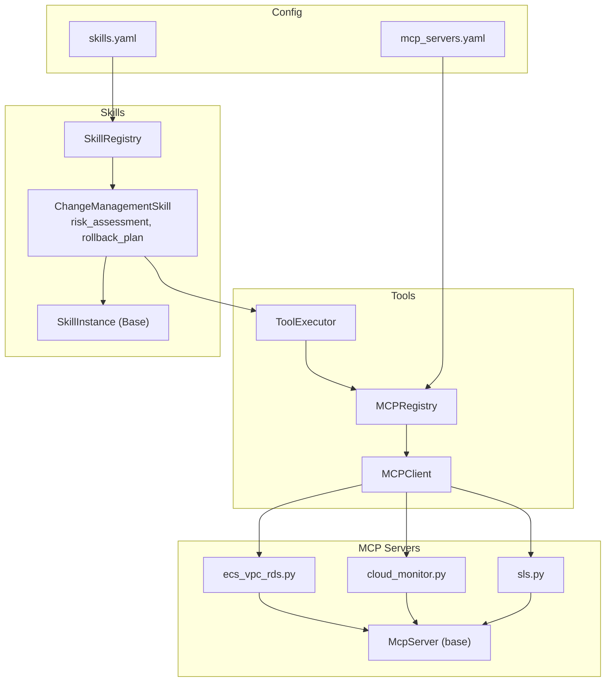
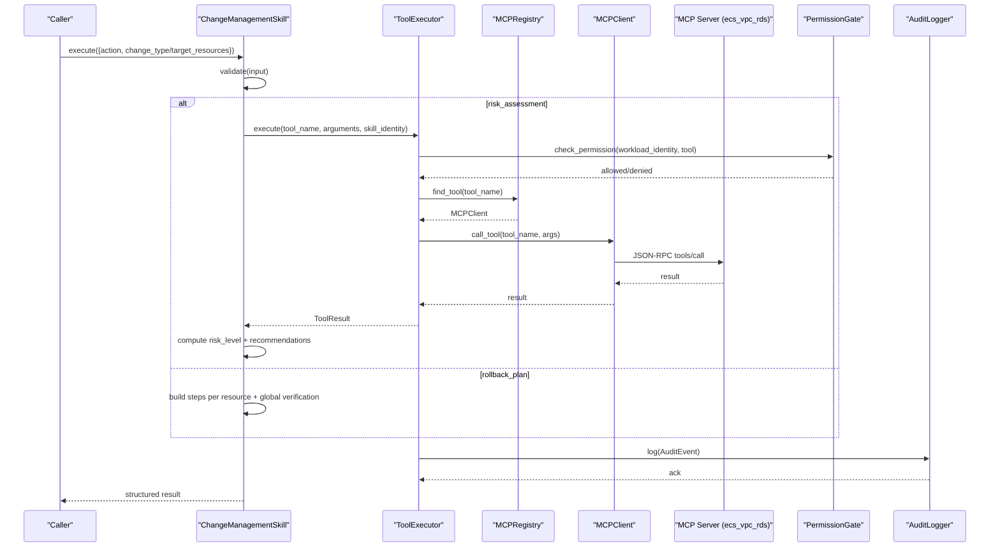
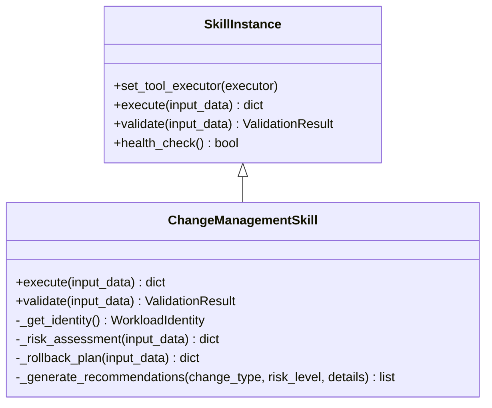
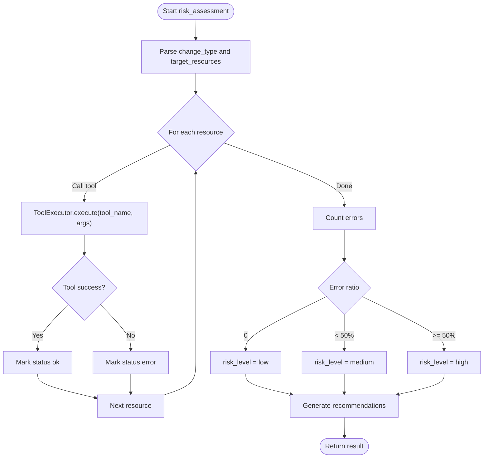
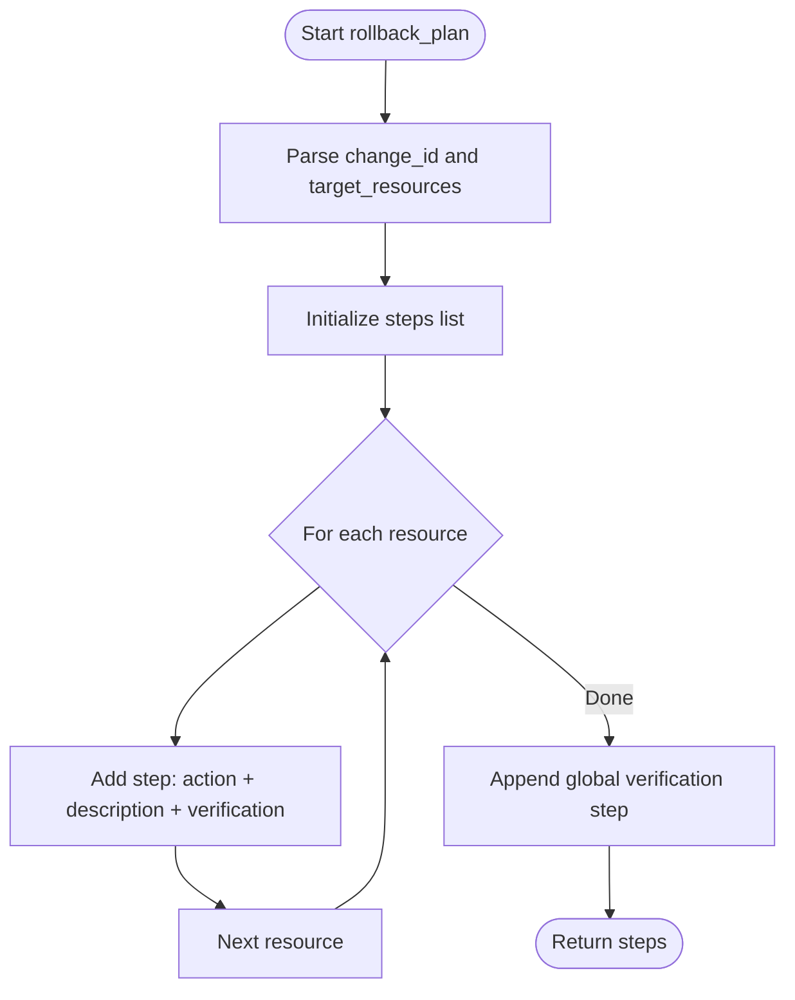
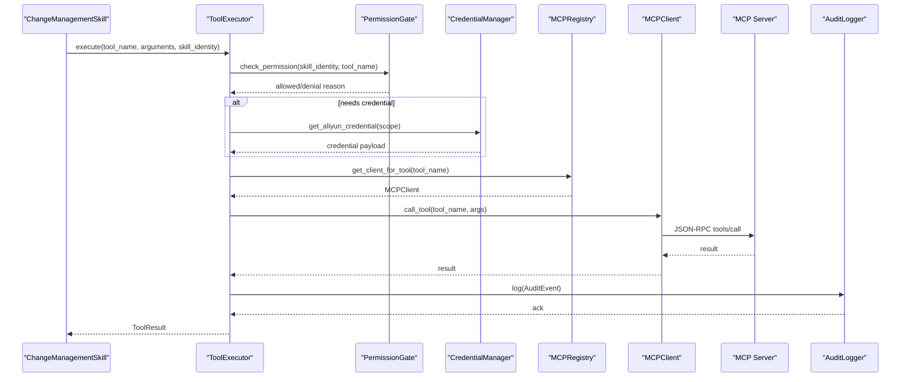
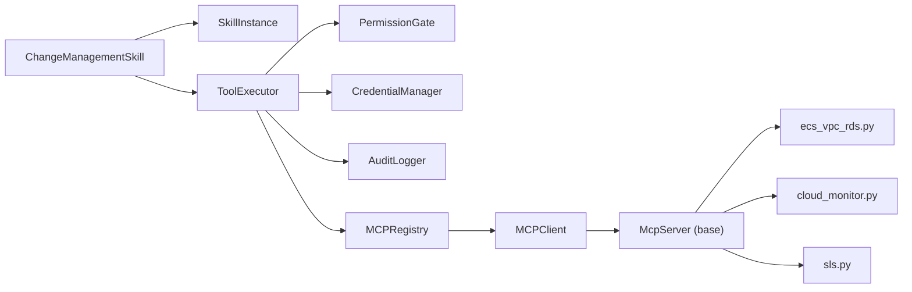

# Change Management Skills

<cite>
**Referenced Files in This Document**
- [change_management.py](file://src/aiops_agent/skills/change_management.py)
- [base.py](file://src/aiops_agent/skills/base.py)
- [registry.py](file://src/aiops_agent/skills/registry.py)
- [schemas.py](file://src/aiops_agent/models/schemas.py)
- [executor.py](file://src/aiops_agent/tools/executor.py)
- [mcp_client.py](file://src/aiops_agent/tools/mcp_client.py)
- [mcp_registry.py](file://src/aiops_agent/tools/mcp_registry.py)
- [base.py](file://mcp_servers/base.py)
- [ecs_vpc_rds.py](file://mcp_servers/ecs_vpc_rds.py)
- [cloud_monitor.py](file://mcp_servers/cloud_monitor.py)
- [sls.py](file://mcp_servers/sls.py)
- [skills.yaml](file://config/skills.yaml)
- [mcp_servers.yaml](file://config/mcp_servers.yaml)
- [test_change_management_skill.py](file://tests/test_change_management_skill.py)
</cite>

## Table of Contents
1. [Introduction](#introduction)
2. [Project Structure](#project-structure)
3. [Core Components](#core-components)
4. [Architecture Overview](#architecture-overview)
5. [Detailed Component Analysis](#detailed-component-analysis)
6. [Dependency Analysis](#dependency-analysis)
7. [Performance Considerations](#performance-considerations)
8. [Troubleshooting Guide](#troubleshooting-guide)
9. [Conclusion](#conclusion)
10. [Appendices](#appendices)

## Introduction
This document describes the AIOps Agent’s Change Management Skills system, focusing on automated operational change orchestration. It covers the skill architecture for risk assessment, rollback planning, and integration with cloud service APIs via MCP (Model Context Protocol). It also documents approval workflow integration, validation, and post-change verification patterns, along with guidelines for implementing custom change types and governance policies.

## Project Structure
The Change Management system spans several modules:
- Skill definition and lifecycle: Skill base class, registry, and the ChangeManagementSkill implementation
- Tool execution pipeline: Unified ToolExecutor with permission gating, credential acquisition, auditing, and MCP/local tool dispatch
- MCP server ecosystem: Alibaba Cloud ECS/VPC/RDS, CloudMonitor, and SLS servers exposing cloud-native tools
- Configuration: Skill capability definitions and MCP server configurations

**Diagram sources**
- [change_management.py:18-178](file://src/aiops_agent/skills/change_management.py#L18-L178)
- [base.py:21-93](file://src/aiops_agent/skills/base.py#L21-L93)
- [registry.py:19-284](file://src/aiops_agent/skills/registry.py#L19-L284)
- [executor.py:45-314](file://src/aiops_agent/tools/executor.py#L45-L314)
- [mcp_registry.py:20-162](file://src/aiops_agent/tools/mcp_registry.py#L20-L162)
- [mcp_client.py:22-324](file://src/aiops_agent/tools/mcp_client.py#L22-L324)
- [base.py:14-108](file://mcp_servers/base.py#L14-L108)
- [ecs_vpc_rds.py:101-125](file://mcp_servers/ecs_vpc_rds.py#L101-L125)
- [cloud_monitor.py:74-131](file://mcp_servers/cloud_monitor.py#L74-L131)
- [sls.py:49-97](file://mcp_servers/sls.py#L49-L97)
- [skills.yaml:31-42](file://config/skills.yaml#L31-L42)
- [mcp_servers.yaml:3-33](file://config/mcp_servers.yaml#L3-L33)

**Section sources**
- [change_management.py:18-178](file://src/aiops_agent/skills/change_management.py#L18-L178)
- [base.py:21-93](file://src/aiops_agent/skills/base.py#L21-L93)
- [registry.py:19-284](file://src/aiops_agent/skills/registry.py#L19-L284)
- [executor.py:45-314](file://src/aiops_agent/tools/executor.py#L45-L314)
- [mcp_registry.py:20-162](file://src/aiops_agent/tools/mcp_registry.py#L20-L162)
- [mcp_client.py:22-324](file://src/aiops_agent/tools/mcp_client.py#L22-L324)
- [base.py:14-108](file://mcp_servers/base.py#L14-L108)
- [ecs_vpc_rds.py:101-125](file://mcp_servers/ecs_vpc_rds.py#L101-L125)
- [cloud_monitor.py:74-131](file://mcp_servers/cloud_monitor.py#L74-L131)
- [sls.py:49-97](file://mcp_servers/sls.py#L49-L97)
- [skills.yaml:31-42](file://config/skills.yaml#L31-L42)
- [mcp_servers.yaml:3-33](file://config/mcp_servers.yaml#L3-L33)

## Core Components
- ChangeManagementSkill: Implements risk assessment and rollback recommendation actions. It validates inputs, constructs WorkloadIdentity for permission enforcement, and orchestrates tool execution against cloud resources.
- SkillInstance: Defines the skill interface and lifecycle hooks, including dependency injection of ToolExecutor.
- SkillRegistry: Manages skill registration, discovery, health checks, and default version routing.
- ToolExecutor: Centralized execution pipeline enforcing permission checks, credential retrieval, MCP/local tool dispatch, sanitization, auditing, and tracing.
- MCP ecosystem: Alibaba Cloud servers expose tools for ECS, VPC, RDS, CloudMonitor metrics, and SLS logs.

Key capabilities:
- Risk assessment: Evaluates change risk based on cloud resource availability and status.
- Rollback planning: Generates stepwise rollback actions per target resource plus global verification.

**Section sources**
- [change_management.py:18-178](file://src/aiops_agent/skills/change_management.py#L18-L178)
- [base.py:21-93](file://src/aiops_agent/skills/base.py#L21-L93)
- [registry.py:19-284](file://src/aiops_agent/skills/registry.py#L19-L284)
- [executor.py:45-314](file://src/aiops_agent/tools/executor.py#L45-L314)
- [mcp_client.py:22-324](file://src/aiops_agent/tools/mcp_client.py#L22-L324)
- [ecs_vpc_rds.py:101-125](file://mcp_servers/ecs_vpc_rds.py#L101-L125)
- [cloud_monitor.py:74-131](file://mcp_servers/cloud_monitor.py#L74-L131)
- [sls.py:49-97](file://mcp_servers/sls.py#L49-L97)

## Architecture Overview
The Change Management skill integrates with cloud services through MCP. The flow:
- Skill receives an action (risk_assessment or rollback_plan) and target resources
- For risk assessment, it queries cloud resources via MCP tools and computes risk level and recommendations
- For rollback planning, it generates stepwise rollback actions and a global verification step
- ToolExecutor enforces permissions, injects credentials when needed, and records audit events

**Diagram sources**
- [change_management.py:29-177](file://src/aiops_agent/skills/change_management.py#L29-L177)
- [executor.py:80-226](file://src/aiops_agent/tools/executor.py#L80-L226)
- [mcp_registry.py:95-112](file://src/aiops_agent/tools/mcp_registry.py#L95-L112)
- [mcp_client.py:135-155](file://src/aiops_agent/tools/mcp_client.py#L135-L155)
- [base.py:76-107](file://mcp_servers/base.py#L76-L107)
- [ecs_vpc_rds.py:101-125](file://mcp_servers/ecs_vpc_rds.py#L101-L125)

## Detailed Component Analysis

### ChangeManagementSkill
Responsibilities:
- Action routing: risk_assessment and rollback_plan
- Validation: ensures required fields (e.g., action) are present
- Identity: provides WorkloadIdentity with required permissions for cloud operations
- Risk assessment: queries cloud resources via MCP tools, aggregates statuses, and computes risk level with tailored recommendations
- Rollback planning: generates ordered steps for each target resource plus a global verification step

**Diagram sources**
- [base.py:21-93](file://src/aiops_agent/skills/base.py#L21-L93)
- [change_management.py:18-178](file://src/aiops_agent/skills/change_management.py#L18-L178)

**Section sources**
- [change_management.py:29-177](file://src/aiops_agent/skills/change_management.py#L29-L177)
- [base.py:42-93](file://src/aiops_agent/skills/base.py#L42-L93)

### Risk Assessment Workflow
Risk computation logic:
- For each target resource, call the appropriate MCP tool (describe_instances, describe_dbinstances, describe_vpcs)
- Aggregate results: count failures vs. successes
- Compute risk level thresholds and produce recommendations

**Diagram sources**
- [change_management.py:54-138](file://src/aiops_agent/skills/change_management.py#L54-L138)
- [executor.py:231-295](file://src/aiops_agent/tools/executor.py#L231-L295)

**Section sources**
- [change_management.py:54-138](file://src/aiops_agent/skills/change_management.py#L54-L138)
- [test_change_management_skill.py:88-170](file://tests/test_change_management_skill.py#L88-L170)

### Rollback Planning Workflow
Generates a stepwise plan:
- One step per target resource with action, description, and verification
- Adds a final global verification step covering monitoring and logs

**Diagram sources**
- [change_management.py:140-177](file://src/aiops_agent/skills/change_management.py#L140-L177)

**Section sources**
- [change_management.py:140-177](file://src/aiops_agent/skills/change_management.py#L140-L177)
- [test_change_management_skill.py:171-190](file://tests/test_change_management_skill.py#L171-L190)

### Tool Execution Pipeline
The ToolExecutor coordinates:
- PermissionGate: checks whether the skill’s WorkloadIdentity has required permissions
- CredentialManager: obtains temporary credentials scoped to target services
- MCPRegistry/MCPClient: resolves tool providers and executes JSON-RPC calls
- Sanitization and AuditLogger: sanitize sensitive parameters and record audit events
- OpenTelemetry tracing: attaches trace/span IDs for observability

**Diagram sources**
- [executor.py:80-226](file://src/aiops_agent/tools/executor.py#L80-L226)
- [mcp_registry.py:95-112](file://src/aiops_agent/tools/mcp_registry.py#L95-L112)
- [mcp_client.py:135-155](file://src/aiops_agent/tools/mcp_client.py#L135-L155)
- [base.py:76-107](file://mcp_servers/base.py#L76-L107)

**Section sources**
- [executor.py:45-314](file://src/aiops_agent/tools/executor.py#L45-L314)
- [mcp_client.py:22-324](file://src/aiops_agent/tools/mcp_client.py#L22-L324)
- [mcp_registry.py:20-162](file://src/aiops_agent/tools/mcp_registry.py#L20-L162)

### MCP Server Integrations
Cloud service toolsets exposed via MCP:
- ECS/VPC/RDS: describe_instances, describe_vpcs, describe_dbinstances, and related status tools
- CloudMonitor: query_metric_last, query_metric_list, query_alarm_history
- SLS: query_logs, list_logstores, get_logstore_index

These tools are registered by their respective MCP servers and discovered by the MCPRegistry.

**Section sources**
- [ecs_vpc_rds.py:101-125](file://mcp_servers/ecs_vpc_rds.py#L101-L125)
- [cloud_monitor.py:74-131](file://mcp_servers/cloud_monitor.py#L74-L131)
- [sls.py:49-97](file://mcp_servers/sls.py#L49-L97)
- [base.py:23-41](file://mcp_servers/base.py#L23-L41)
- [mcp_registry.py:38-69](file://src/aiops_agent/tools/mcp_registry.py#L38-L69)

### Skill Registration and Discovery
Skills are defined in configuration and registered with the SkillRegistry. The registry:
- Validates completeness and uniqueness
- Routes to default versions
- Supports health checks and dynamic loading/unloading
- Discovers skills by capability overlap

**Section sources**
- [registry.py:41-81](file://src/aiops_agent/skills/registry.py#L41-L81)
- [registry.py:122-153](file://src/aiops_agent/skills/registry.py#L122-L153)
- [registry.py:213-237](file://src/aiops_agent/skills/registry.py#L213-L237)
- [skills.yaml:31-42](file://config/skills.yaml#L31-L42)

## Dependency Analysis
High-level dependencies:
- ChangeManagementSkill depends on SkillInstance and ToolExecutor
- ToolExecutor depends on PermissionGate, CredentialManager, AuditLogger, MCPRegistry, and LocalToolRegistry
- MCPRegistry depends on MCPClient and maintains tool-to-server mapping
- MCP servers depend on McpServer base class and expose tools via JSON-RPC

**Diagram sources**
- [change_management.py:18-178](file://src/aiops_agent/skills/change_management.py#L18-L178)
- [base.py:21-93](file://src/aiops_agent/skills/base.py#L21-L93)
- [executor.py:45-314](file://src/aiops_agent/tools/executor.py#L45-L314)
- [mcp_registry.py:20-162](file://src/aiops_agent/tools/mcp_registry.py#L20-L162)
- [mcp_client.py:22-324](file://src/aiops_agent/tools/mcp_client.py#L22-L324)
- [base.py:14-108](file://mcp_servers/base.py#L14-L108)
- [ecs_vpc_rds.py:101-125](file://mcp_servers/ecs_vpc_rds.py#L101-L125)
- [cloud_monitor.py:74-131](file://mcp_servers/cloud_monitor.py#L74-L131)
- [sls.py:49-97](file://mcp_servers/sls.py#L49-L97)

**Section sources**
- [change_management.py:18-178](file://src/aiops_agent/skills/change_management.py#L18-L178)
- [executor.py:45-314](file://src/aiops_agent/tools/executor.py#L45-L314)
- [mcp_registry.py:20-162](file://src/aiops_agent/tools/mcp_registry.py#L20-L162)
- [mcp_client.py:22-324](file://src/aiops_agent/tools/mcp_client.py#L22-L324)
- [base.py:14-108](file://mcp_servers/base.py#L14-L108)

## Performance Considerations
- Asynchronous execution: Tools are executed asynchronously with timeouts and exponential backoff to improve resilience under network variability.
- Retry strategy: Up to three retries with capped delays reduce transient failure impact.
- Parallelism: ToolExecutor does not enforce concurrency limits; avoid issuing thousands of concurrent MCP calls to prevent overload.
- Observability: OpenTelemetry tracing and audit logging add overhead but enable precise diagnostics.

[No sources needed since this section provides general guidance]

## Troubleshooting Guide
Common issues and resolutions:
- Permission denied: Verify required permissions in WorkloadIdentity and skill configuration; ensure PermissionGate allows the requested tool.
- Tool not found: Confirm MCP server is registered and tool is exposed; check MCPRegistry mapping.
- Timeout errors: Increase ToolExecutor timeout or reduce concurrent operations; inspect underlying cloud API latency.
- Audit gaps: Ensure AuditLogger is initialized and reachable; review sanitization of sensitive parameters.

Operational checks:
- Health status: Use SkillRegistry health_check to mark skills healthy/unhealthy.
- MCP connectivity: Validate MCP server configuration and environment variables; confirm stdio or SSE/HTTP connectivity.

**Section sources**
- [executor.py:124-201](file://src/aiops_agent/tools/executor.py#L124-L201)
- [mcp_registry.py:38-69](file://src/aiops_agent/tools/mcp_registry.py#L38-L69)
- [registry.py:213-237](file://src/aiops_agent/skills/registry.py#L213-L237)
- [mcp_servers.yaml:3-33](file://config/mcp_servers.yaml#L3-L33)

## Conclusion
The Change Management Skills system provides a robust framework for automated operational change with built-in risk assessment, rollback planning, and secure cloud integration via MCP. By leveraging the ToolExecutor pipeline and MCP servers, it supports scalable, auditable, and observable change operations across ECS, VPC, RDS, CloudMonitor, and SLS.

[No sources needed since this section summarizes without analyzing specific files]

## Appendices

### Implementation Examples

- Auto-scaling deployments
  - Use CloudMonitor metrics to assess CPU/memory trends and capacity planning
  - Generate rollback steps to revert scaling groups and restore previous instance counts
  - Reference: [cloud_monitor.py:41-72](file://mcp_servers/cloud_monitor.py#L41-L72), [change_management.py:140-177](file://src/aiops_agent/skills/change_management.py#L140-L177)

- Configuration modifications
  - Query current resource attributes (e.g., instance attributes, DB instance status)
  - Compute risk based on current state and propose conservative change windows
  - Reference: [ecs_vpc_rds.py:43-98](file://mcp_servers/ecs_vpc_rds.py#L43-L98), [change_management.py:54-138](file://src/aiops_agent/skills/change_management.py#L54-L138)

- Service upgrades
  - Validate pre-upgrade conditions (e.g., disk space, instance status)
  - Plan rollback to previous image/version and verify post-upgrade metrics/logs
  - Reference: [ecs_vpc_rds.py:43-98](file://mcp_servers/ecs_vpc_rds.py#L43-L98), [cloud_monitor.py:41-72](file://mcp_servers/cloud_monitor.py#L41-L72), [sls.py:35-47](file://mcp_servers/sls.py#L35-L47), [change_management.py:140-177](file://src/aiops_agent/skills/change_management.py#L140-L177)

### Governance and Approval Integration
- Permissions: Define required permissions in skill configuration and WorkloadIdentity; enforce via PermissionGate
- Approval workflow: Integrate with external approval systems by raising approval-required signals during validation or pre-execution checks
- Post-change verification: Use CloudMonitor and SLS tools to validate service health and alert status after changes
- Reference: [skills.yaml:31-42](file://config/skills.yaml#L31-L42), [change_management.py:46-52](file://src/aiops_agent/skills/change_management.py#L46-L52), [executor.py:124-147](file://src/aiops_agent/tools/executor.py#L124-L147)

### Custom Change Types
Steps to implement:
- Extend ChangeManagementSkill with new actions and validation rules
- Add required permissions to WorkloadIdentity and skill configuration
- Implement or integrate MCP tools for resource introspection and rollback primitives
- Register MCP servers and ensure tool discovery
- Add capability-based routing and health checks via SkillRegistry
- Reference: [change_management.py:18-178](file://src/aiops_agent/skills/change_management.py#L18-L178), [skills.yaml:31-42](file://config/skills.yaml#L31-L42), [mcp_servers.yaml:3-33](file://config/mcp_servers.yaml#L3-L33), [mcp_registry.py:122-153](file://src/aiops_agent/tools/mcp_registry.py#L122-L153)