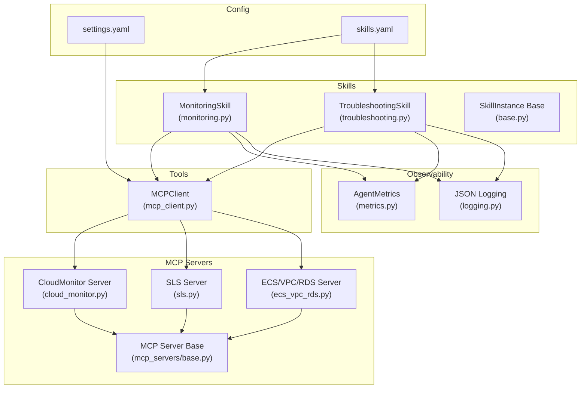
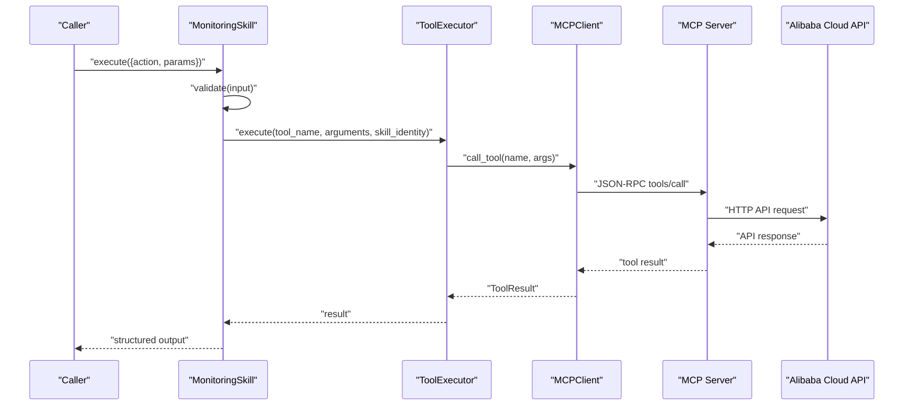
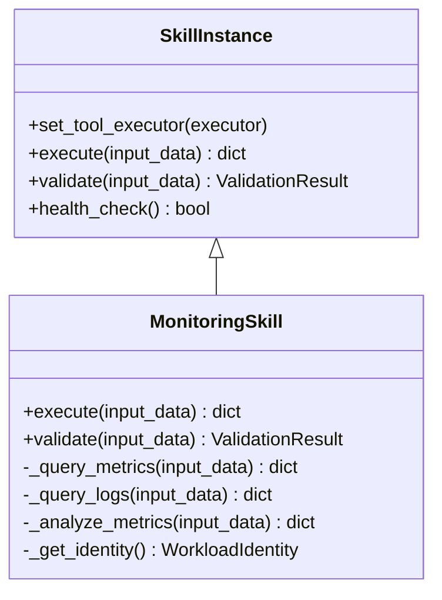
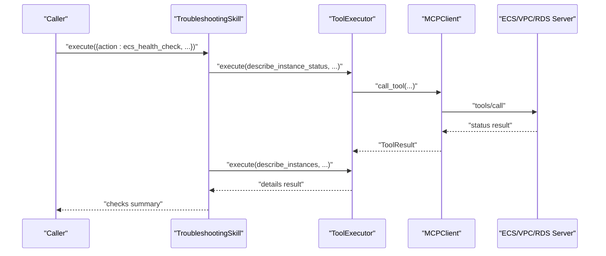
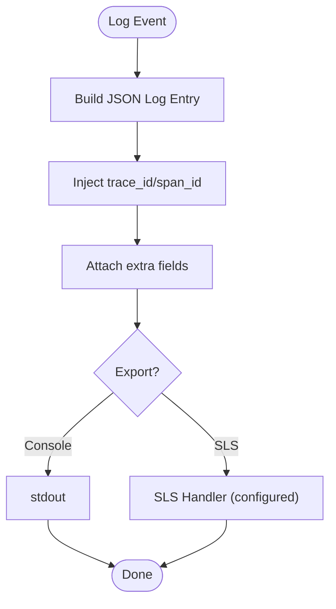
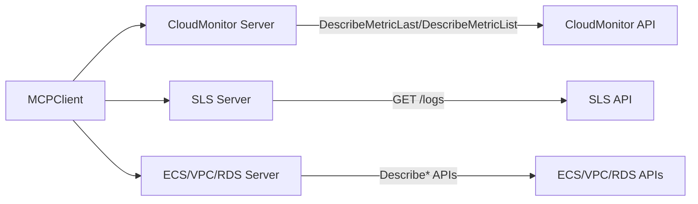
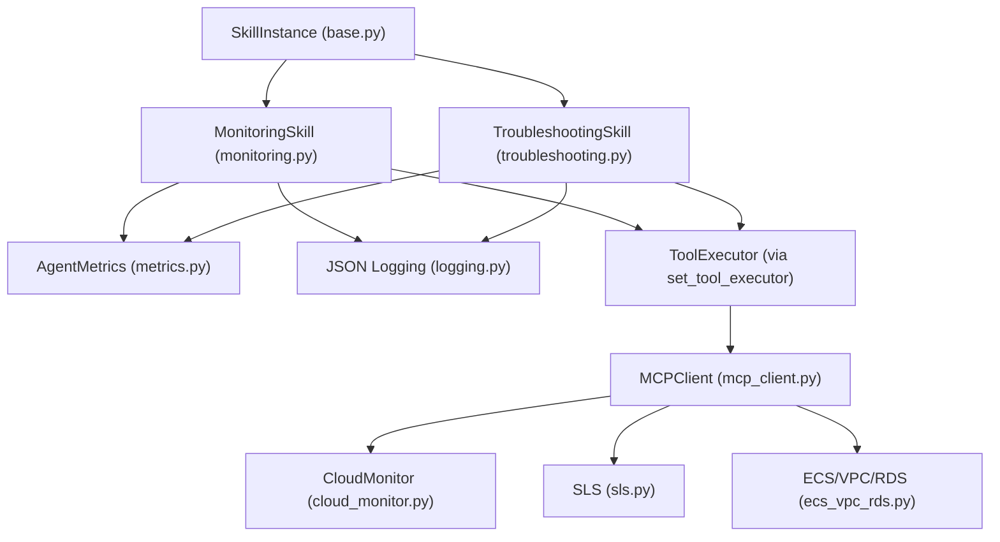

# Monitoring & Diagnostics Skills

<cite>
**Referenced Files in This Document**
- [monitoring.py](file://src/aiops_agent/skills/monitoring.py)
- [troubleshooting.py](file://src/aiops_agent/skills/troubleshooting.py)
- [base.py](file://src/aiops_agent/skills/base.py)
- [metrics.py](file://src/aiops_agent/observability/metrics.py)
- [logging.py](file://src/aiops_agent/observability/logging.py)
- [mcp_client.py](file://src/aiops_agent/tools/mcp_client.py)
- [cloud_monitor.py](file://mcp_servers/cloud_monitor.py)
- [sls.py](file://mcp_servers/sls.py)
- [ecs_vpc_rds.py](file://mcp_servers/ecs_vpc_rds.py)
- [base.py](file://mcp_servers/base.py)
- [settings.yaml](file://config/settings.yaml)
- [skills.yaml](file://config/skills.yaml)
- [schemas.py](file://src/aiops_agent/models/schemas.py)
- [test_monitoring_skill.py](file://tests/test_monitoring_skill.py)
- [test_troubleshooting_skill.py](file://tests/test_troubleshooting_skill.py)
</cite>

## Table of Contents
1. [Introduction](#introduction)
2. [Project Structure](#project-structure)
3. [Core Components](#core-components)
4. [Architecture Overview](#architecture-overview)
5. [Detailed Component Analysis](#detailed-component-analysis)
6. [Dependency Analysis](#dependency-analysis)
7. [Performance Considerations](#performance-considerations)
8. [Troubleshooting Guide](#troubleshooting-guide)
9. [Conclusion](#conclusion)
10. [Appendices](#appendices)

## Introduction
This document explains the Monitoring & Diagnostics capabilities of the AIOps Agent, focusing on:
- Monitoring skill architecture for cloud service observation, metric collection, and alert analysis
- Diagnostic capabilities including log analysis, performance profiling, and system health assessment
- Knowledge base skill for storing and retrieving operational knowledge, best practices, and troubleshooting procedures
- Implementation patterns for metric aggregation, anomaly detection, and automated remediation suggestions
- Examples of monitoring queries, diagnostic workflows, and knowledge retrieval mechanisms
- Integration with Alibaba Cloud monitoring services and data visualization patterns

The Monitoring and Troubleshooting skills are implemented as pluggable SkillInstance modules that orchestrate tool execution via a unified ToolExecutor, communicating with Alibaba Cloud services through MCP servers.

## Project Structure
The Monitoring & Diagnostics domain spans several modules:
- Skills: Monitoring and Troubleshooting skill implementations
- Observability: Metrics and structured logging integrations
- Tools: MCP client and tool execution bridge
- MCP Servers: Alibaba Cloud service adapters (Cloud Monitor, SLS, ECS/VPC/RDS)
- Config: Global settings and skill capability definitions
- Tests: Behavioral verification of skills and tool flows

**Diagram sources**
- [monitoring.py:18-140](file://src/aiops_agent/skills/monitoring.py#L18-L140)
- [troubleshooting.py:18-152](file://src/aiops_agent/skills/troubleshooting.py#L18-L152)
- [base.py:21-93](file://src/aiops_agent/skills/base.py#L21-L93)
- [metrics.py:26-150](file://src/aiops_agent/observability/metrics.py#L26-L150)
- [logging.py:18-111](file://src/aiops_agent/observability/logging.py#L18-L111)
- [mcp_client.py:22-324](file://src/aiops_agent/tools/mcp_client.py#L22-L324)
- [cloud_monitor.py:17-131](file://mcp_servers/cloud_monitor.py#L17-L131)
- [sls.py:16-97](file://mcp_servers/sls.py#L16-L97)
- [ecs_vpc_rds.py:19-125](file://mcp_servers/ecs_vpc_rds.py#L19-L125)
- [base.py:14-108](file://mcp_servers/base.py#L14-L108)
- [settings.yaml:1-85](file://config/settings.yaml#L1-L85)
- [skills.yaml:1-77](file://config/skills.yaml#L1-L77)

**Section sources**
- [monitoring.py:18-140](file://src/aiops_agent/skills/monitoring.py#L18-L140)
- [troubleshooting.py:18-152](file://src/aiops_agent/skills/troubleshooting.py#L18-L152)
- [base.py:21-93](file://src/aiops_agent/skills/base.py#L21-L93)
- [metrics.py:26-150](file://src/aiops_agent/observability/metrics.py#L26-L150)
- [logging.py:18-111](file://src/aiops_agent/observability/logging.py#L18-L111)
- [mcp_client.py:22-324](file://src/aiops_agent/tools/mcp_client.py#L22-L324)
- [cloud_monitor.py:17-131](file://mcp_servers/cloud_monitor.py#L17-L131)
- [sls.py:16-97](file://mcp_servers/sls.py#L16-L97)
- [ecs_vpc_rds.py:19-125](file://mcp_servers/ecs_vpc_rds.py#L19-L125)
- [base.py:14-108](file://mcp_servers/base.py#L14-L108)
- [settings.yaml:1-85](file://config/settings.yaml#L1-L85)
- [skills.yaml:1-77](file://config/skills.yaml#L1-L77)

## Core Components
- MonitoringSkill: Orchestrates metric queries against Alibaba Cloud CloudMonitor and log queries against SLS. It validates inputs, injects WorkloadIdentity for secure access, and delegates to ToolExecutor to call MCP tools.
- TroubleshootingSkill: Performs ECS health checks, network diagnosis, and RDS slow query analysis by invoking ECS/VPC/RDS MCP tools.
- SkillInstance base: Defines the common interface and lifecycle hooks for skills, including ToolExecutor injection and optional health checks.
- MCPClient: Implements JSON-RPC over stdio and HTTP/SSE transports to communicate with MCP servers.
- MCP Servers: Alibaba Cloud service adapters that expose tools for metric queries, logs, and resource inspection.
- Observability: AgentMetrics for core runtime metrics and JSON logging with OpenTelemetry trace/span correlation.

Key implementation patterns:
- Unified input validation and action routing per skill
- WorkloadIdentity propagation to enforce least-privilege permissions
- ToolExecutor abstraction enabling local and remote MCP tool invocation
- Structured logging enriched with trace identifiers for end-to-end observability

**Section sources**
- [monitoring.py:30-140](file://src/aiops_agent/skills/monitoring.py#L30-L140)
- [troubleshooting.py:30-152](file://src/aiops_agent/skills/troubleshooting.py#L30-L152)
- [base.py:42-93](file://src/aiops_agent/skills/base.py#L42-L93)
- [mcp_client.py:56-156](file://src/aiops_agent/tools/mcp_client.py#L56-L156)
- [cloud_monitor.py:74-125](file://mcp_servers/cloud_monitor.py#L74-L125)
- [sls.py:49-91](file://mcp_servers/sls.py#L49-L91)
- [ecs_vpc_rds.py:101-119](file://mcp_servers/ecs_vpc_rds.py#L101-L119)
- [metrics.py:26-106](file://src/aiops_agent/observability/metrics.py#L26-L106)
- [logging.py:18-58](file://src/aiops_agent/observability/logging.py#L18-L58)

## Architecture Overview
The Monitoring & Diagnostics architecture integrates skills, tools, and Alibaba Cloud services through MCP:

**Diagram sources**
- [monitoring.py:30-97](file://src/aiops_agent/skills/monitoring.py#L30-L97)
- [mcp_client.py:135-156](file://src/aiops_agent/tools/mcp_client.py#L135-L156)
- [cloud_monitor.py:41-72](file://mcp_servers/cloud_monitor.py#L41-L72)
- [sls.py:35-47](file://mcp_servers/sls.py#L35-L47)

## Detailed Component Analysis

### MonitoringSkill
- Responsibilities:
  - Validate inputs and route actions to metric/log analysis handlers
  - Query CloudMonitor metrics and SLS logs via ToolExecutor
  - Aggregate and return results with consistent structure
- Permissions:
  - Uses WorkloadIdentity with CloudMonitor and SLS permissions for secure access
- Observability:
  - Emits structured logs and records metrics for tool and task execution

**Diagram sources**
- [base.py:21-93](file://src/aiops_agent/skills/base.py#L21-L93)
- [monitoring.py:18-140](file://src/aiops_agent/skills/monitoring.py#L18-L140)

**Section sources**
- [monitoring.py:30-140](file://src/aiops_agent/skills/monitoring.py#L30-L140)
- [base.py:42-93](file://src/aiops_agent/skills/base.py#L42-L93)
- [test_monitoring_skill.py:46-91](file://tests/test_monitoring_skill.py#L46-L91)
- [test_monitoring_skill.py:97-178](file://tests/test_monitoring_skill.py#L97-L178)

### TroubleshootingSkill
- Capabilities:
  - ECS health checks (status + details)
  - Network diagnosis (VPC configuration)
  - RDS slow query analysis
- Execution pattern:
  - Calls multiple tools per action and aggregates results
  - Gracefully handles partial failures

**Diagram sources**
- [troubleshooting.py:57-92](file://src/aiops_agent/skills/troubleshooting.py#L57-L92)
- [mcp_client.py:135-156](file://src/aiops_agent/tools/mcp_client.py#L135-L156)
- [ecs_vpc_rds.py:43-48](file://mcp_servers/ecs_vpc_rds.py#L43-L48)

**Section sources**
- [troubleshooting.py:30-152](file://src/aiops_agent/skills/troubleshooting.py#L30-L152)
- [test_troubleshooting_skill.py:95-178](file://tests/test_troubleshooting_skill.py#L95-L178)
- [test_troubleshooting_skill.py:170-247](file://tests/test_troubleshooting_skill.py#L170-L247)

### Observability: Metrics and Logging
- AgentMetrics:
  - Exposes counters and histograms for tasks, durations, permission denials, security events, tool calls, and LLM calls
  - Provides convenience methods to record observations
- JSON Logging:
  - Structured JSON output with OpenTelemetry trace/span IDs
  - Supports SLS integration placeholders

**Diagram sources**
- [logging.py:18-58](file://src/aiops_agent/observability/logging.py#L18-L58)
- [metrics.py:26-106](file://src/aiops_agent/observability/metrics.py#L26-L106)

**Section sources**
- [metrics.py:26-150](file://src/aiops_agent/observability/metrics.py#L26-L150)
- [logging.py:18-111](file://src/aiops_agent/observability/logging.py#L18-L111)

### MCP Communication and Alibaba Cloud Integrations
- MCPClient:
  - Supports stdio and HTTP/SSE transports
  - Implements JSON-RPC 2.0 messaging and error handling
- CloudMonitor MCP Server:
  - Tools: query_metric_last, query_metric_list, query_alarm_history
  - Uses signed requests to CloudMonitor API
- SLS MCP Server:
  - Tools: query_logs, list_logstores, get_logstore_index
  - Uses signed requests to SLS API
- ECS/VPC/RDS MCP Server:
  - Tools: describe_instances, describe_instance_status, describe_vpcs, describe_slowlog_records, etc.
  - Uses signed requests to ECS, VPC, and RDS APIs

**Diagram sources**
- [mcp_client.py:22-324](file://src/aiops_agent/tools/mcp_client.py#L22-L324)
- [cloud_monitor.py:17-131](file://mcp_servers/cloud_monitor.py#L17-L131)
- [sls.py:16-97](file://mcp_servers/sls.py#L16-L97)
- [ecs_vpc_rds.py:19-125](file://mcp_servers/ecs_vpc_rds.py#L19-L125)

**Section sources**
- [mcp_client.py:56-220](file://src/aiops_agent/tools/mcp_client.py#L56-L220)
- [cloud_monitor.py:41-72](file://mcp_servers/cloud_monitor.py#L41-L72)
- [sls.py:35-47](file://mcp_servers/sls.py#L35-L47)
- [ecs_vpc_rds.py:43-98](file://mcp_servers/ecs_vpc_rds.py#L43-L98)

## Dependency Analysis
- SkillInstance base defines the contract and ToolExecutor injection mechanism used by MonitoringSkill and TroubleshootingSkill
- Skills depend on ToolExecutor to call MCP tools; ToolExecutor depends on MCPClient
- MCPClient communicates with MCP servers that wrap Alibaba Cloud APIs
- Observability modules (metrics and logging) are used by skills for runtime insights

**Diagram sources**
- [base.py:21-93](file://src/aiops_agent/skills/base.py#L21-L93)
- [monitoring.py:18-140](file://src/aiops_agent/skills/monitoring.py#L18-L140)
- [troubleshooting.py:18-152](file://src/aiops_agent/skills/troubleshooting.py#L18-L152)
- [metrics.py:26-150](file://src/aiops_agent/observability/metrics.py#L26-L150)
- [logging.py:18-111](file://src/aiops_agent/observability/logging.py#L18-L111)
- [mcp_client.py:22-324](file://src/aiops_agent/tools/mcp_client.py#L22-L324)
- [cloud_monitor.py:17-131](file://mcp_servers/cloud_monitor.py#L17-L131)
- [sls.py:16-97](file://mcp_servers/sls.py#L16-L97)
- [ecs_vpc_rds.py:19-125](file://mcp_servers/ecs_vpc_rds.py#L19-L125)

**Section sources**
- [base.py:21-93](file://src/aiops_agent/skills/base.py#L21-L93)
- [monitoring.py:18-140](file://src/aiops_agent/skills/monitoring.py#L18-L140)
- [troubleshooting.py:18-152](file://src/aiops_agent/skills/troubleshooting.py#L18-L152)
- [mcp_client.py:22-324](file://src/aiops_agent/tools/mcp_client.py#L22-L324)

## Performance Considerations
- Asynchronous tool execution: Skills and MCPClient leverage async I/O to minimize latency and maximize throughput
- Metric export cadence: Configure export intervals to balance overhead and visibility
- Logging volume: Prefer JSON logging and controlled log levels to reduce I/O overhead
- Tool batching: Where applicable, combine multiple tool calls per action to reduce round-trips (as seen in TroubleshootingSkill’s ECS health checks)

[No sources needed since this section provides general guidance]

## Troubleshooting Guide
Common issues and resolutions:
- Missing ToolExecutor:
  - Symptoms: Empty results for metrics/logs; skills still return success
  - Resolution: Ensure ToolExecutor is injected during registration
- Unknown action:
  - Symptoms: Error returned for unsupported action
  - Resolution: Verify action name matches supported operations
- Tool call failures:
  - Symptoms: Partial successes or empty outputs
  - Resolution: Inspect ToolResult and reattempt with retries; confirm permissions and identity
- Permission denied:
  - Symptoms: Security events recorded and permission denied counters incremented
  - Resolution: Review WorkloadIdentity permissions and agent role configuration

**Section sources**
- [test_monitoring_skill.py:46-91](file://tests/test_monitoring_skill.py#L46-L91)
- [test_monitoring_skill.py:184-204](file://tests/test_monitoring_skill.py#L184-L204)
- [test_troubleshooting_skill.py:46-90](file://tests/test_troubleshooting_skill.py#L46-L90)
- [test_troubleshooting_skill.py:253-273](file://tests/test_troubleshooting_skill.py#L253-L273)
- [metrics.py:87-105](file://src/aiops_agent/observability/metrics.py#L87-L105)

## Conclusion
The Monitoring & Diagnostics subsystem provides a modular, observable, and secure framework for cloud service observation and remediation:
- Skills encapsulate domain logic and enforce validation and identity
- MCP-based tooling enables flexible integration with Alibaba Cloud services
- Observability primitives support continuous monitoring of agent performance and behavior
- Extensible patterns enable future enhancements such as anomaly detection and automated remediation

[No sources needed since this section summarizes without analyzing specific files]

## Appendices

### Monitoring Queries and Diagnostic Workflows
- Metric query example:
  - Action: query_metrics
  - Parameters: namespace, metric_name, instance_id
  - Outcome: returns latest datapoints or empty list if no executor
- Log query example:
  - Action: query_logs
  - Parameters: project, logstore, query
  - Outcome: returns matched log entries or empty list if no executor
- ECS health check:
  - Action: ecs_health_check
  - Outcome: aggregated checks for status and details
- Network diagnosis:
  - Action: network_diagnosis
  - Outcome: VPC configuration checks
- RDS slow query analysis:
  - Action: rds_slow_query
  - Outcome: slow query items or empty list

**Section sources**
- [monitoring.py:59-130](file://src/aiops_agent/skills/monitoring.py#L59-L130)
- [troubleshooting.py:57-151](file://src/aiops_agent/skills/troubleshooting.py#L57-L151)
- [test_monitoring_skill.py:100-178](file://tests/test_monitoring_skill.py#L100-L178)
- [test_troubleshooting_skill.py:98-247](file://tests/test_troubleshooting_skill.py#L98-L247)

### Knowledge Base Skill
- Purpose: Operational knowledge retrieval and fault case matching
- Current status: Placeholder module indicating planned integration
- Next steps: Define knowledge schema, embedding retrieval, and retrieval-augmented generation (RAG) pipeline

**Section sources**
- [knowledge_base.py:1-2](file://src/aiops_agent/skills/knowledge_base.py#L1-L2)

### Integration with Alibaba Cloud Monitoring Services
- CloudMonitor:
  - Tools: query_metric_last, query_metric_list, query_alarm_history
  - Permissions: cms:QueryMetricData, cms:QueryMetricLast
- SLS:
  - Tools: query_logs, list_logstores, get_logstore_index
  - Permissions: sls:GetLogs
- ECS/VPC/RDS:
  - Tools: describe_instances, describe_instance_status, describe_vpcs, describe_slowlog_records
  - Permissions: ecs:DescribeInstances, ecs:DescribeInstanceStatus, vpc:DescribeVpcs, rds:DescribeSlowLogs

**Section sources**
- [cloud_monitor.py:74-125](file://mcp_servers/cloud_monitor.py#L74-L125)
- [sls.py:49-91](file://mcp_servers/sls.py#L49-L91)
- [ecs_vpc_rds.py:101-119](file://mcp_servers/ecs_vpc_rds.py#L101-L119)
- [monitoring.py:50-57](file://src/aiops_agent/skills/monitoring.py#L50-L57)
- [troubleshooting.py:49-55](file://src/aiops_agent/skills/troubleshooting.py#L49-L55)

### Data Visualization Patterns
- Metrics:
  - Use exported metrics for dashboards (task completion rates, durations, tool/LLM call counts)
- Logs:
  - Emit structured JSON logs with trace identifiers for correlation across services
- Recommendations:
  - Integrate with Alibaba Cloud ARMS or Grafana for visualization
  - Use SLS dashboards for log analytics and alerting

**Section sources**
- [metrics.py:108-150](file://src/aiops_agent/observability/metrics.py#L108-L150)
- [logging.py:60-111](file://src/aiops_agent/observability/logging.py#L60-L111)
- [settings.yaml:62-77](file://config/settings.yaml#L62-L77)