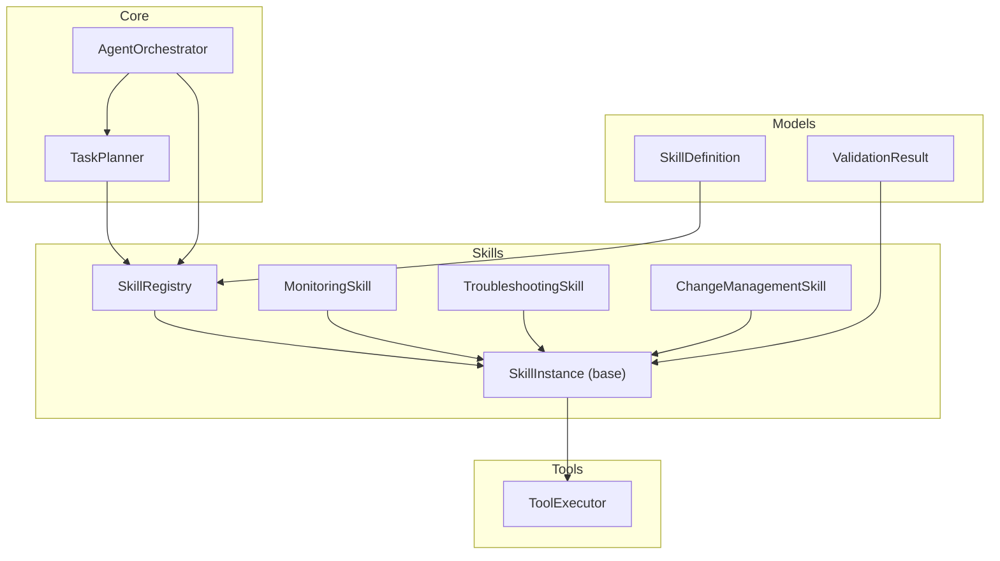
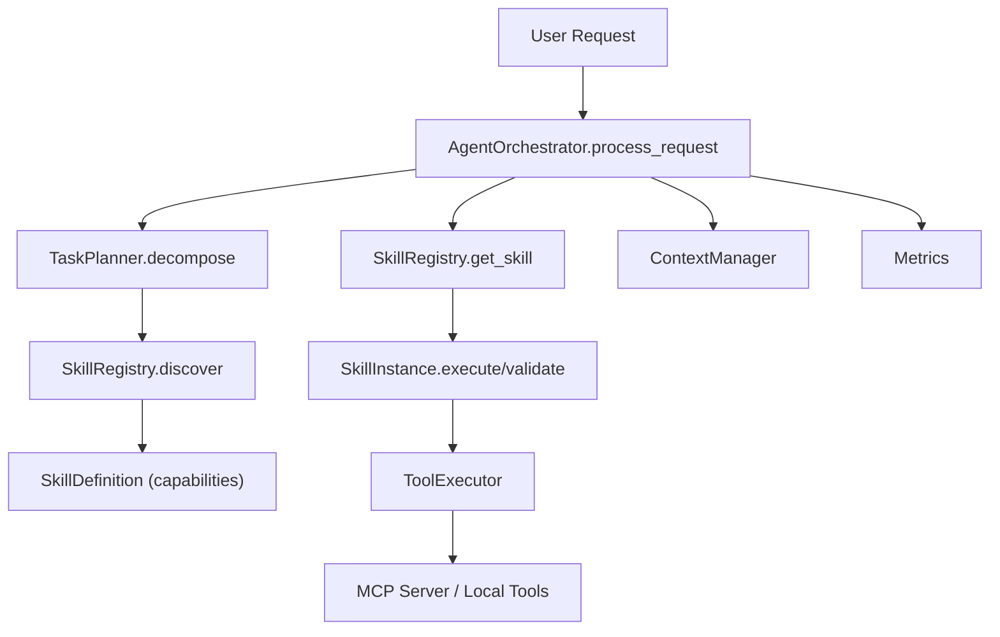
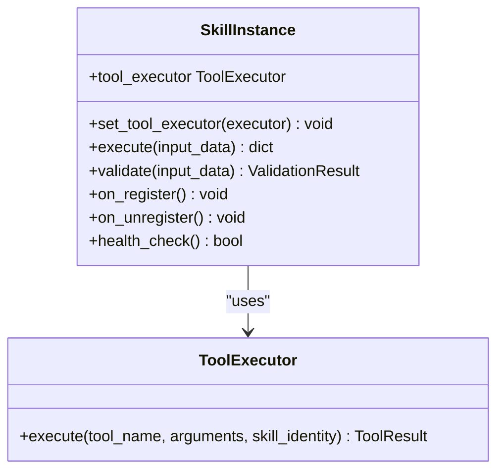
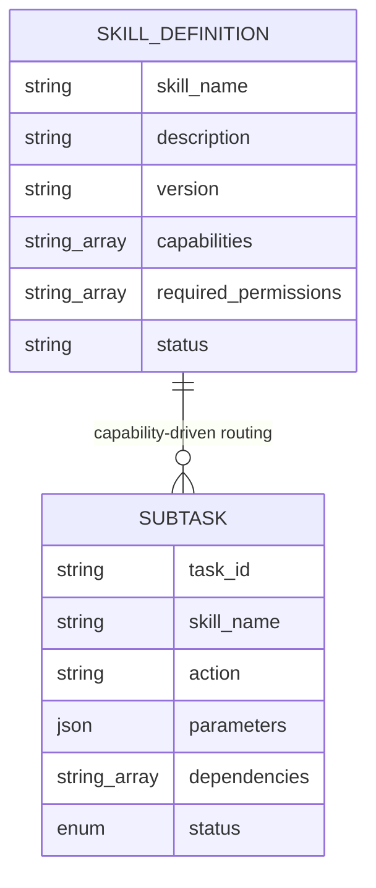
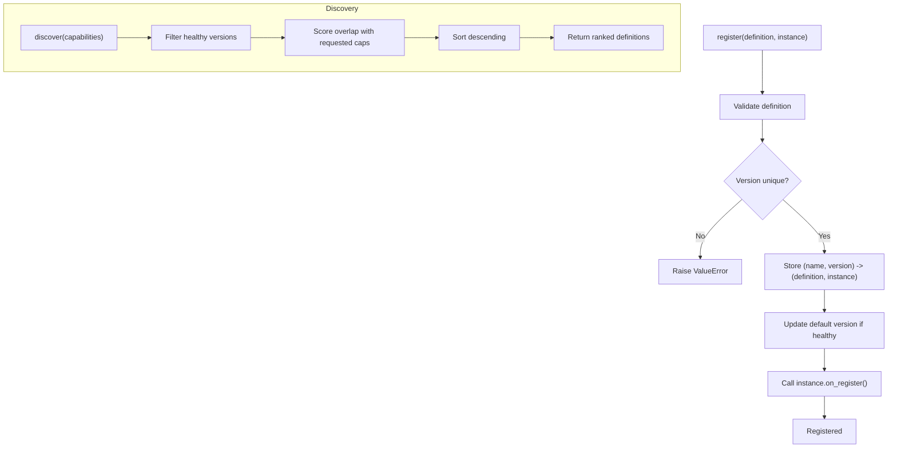
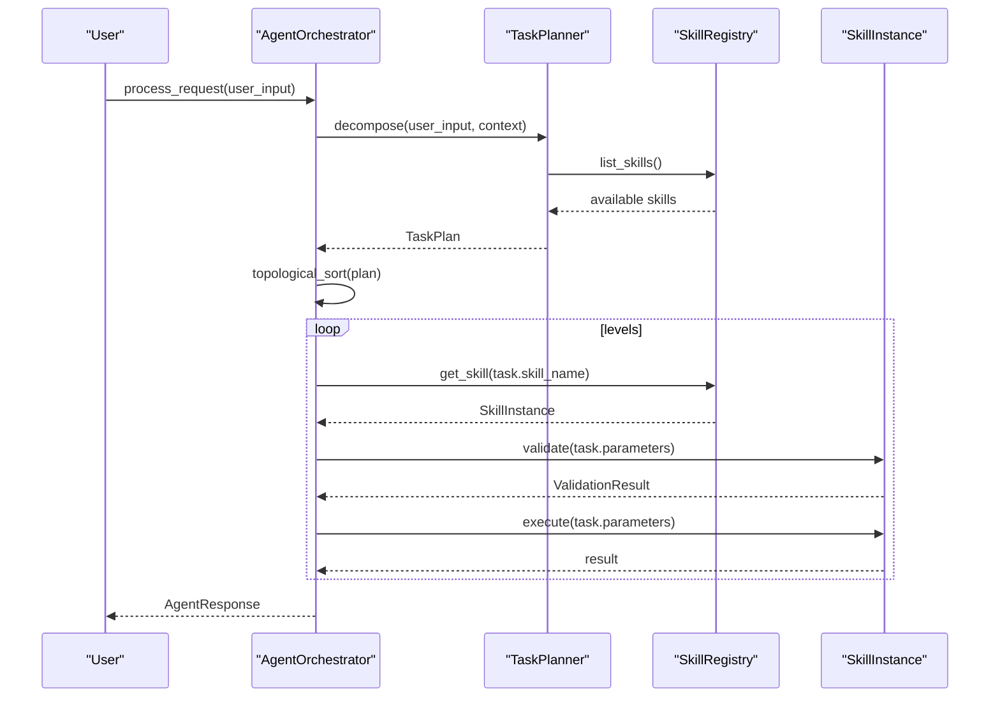
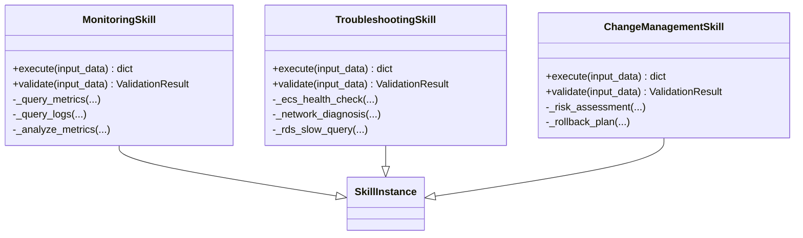
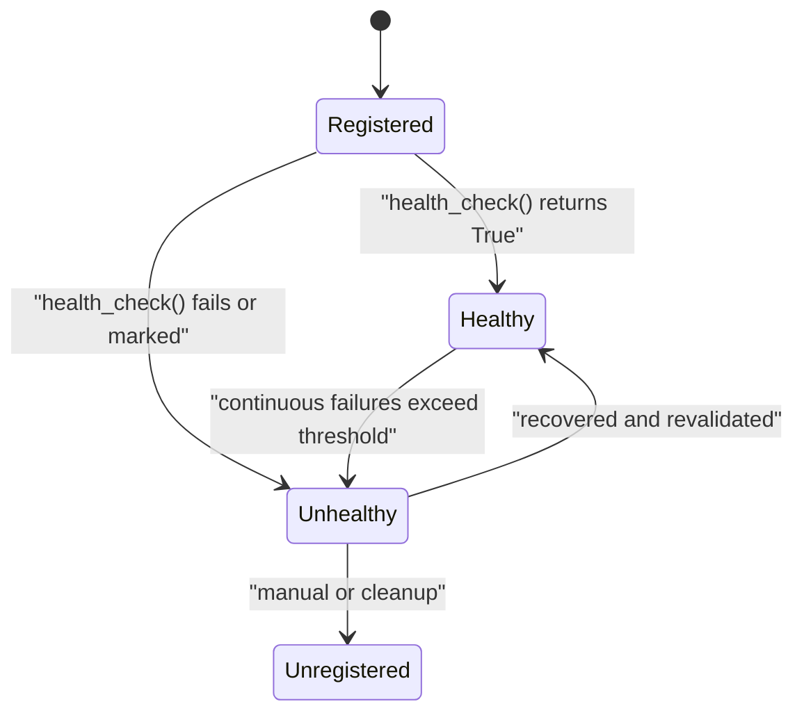
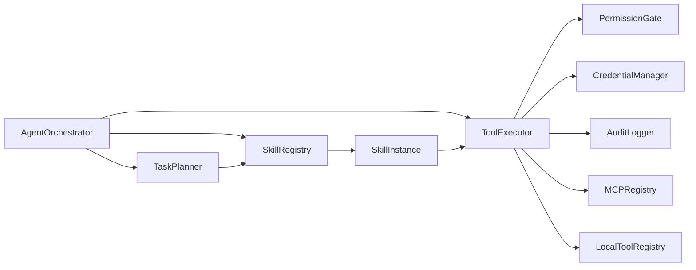

# Skill Architecture Overview

<cite>
**Referenced Files in This Document**
- [README.md](file://README.md)
- [src/aiops_agent/main.py](file://src/aiops_agent/main.py)
- [src/aiops_agent/core/orchestrator.py](file://src/aiops_agent/core/orchestrator.py)
- [src/aiops_agent/core/task_planner.py](file://src/aiops_agent/core/task_planner.py)
- [src/aiops_agent/skills/base.py](file://src/aiops_agent/skills/base.py)
- [src/aiops_agent/skills/registry.py](file://src/aiops_agent/skills/registry.py)
- [src/aiops_agent/skills/monitoring.py](file://src/aiops_agent/skills/monitoring.py)
- [src/aiops_agent/skills/troubleshooting.py](file://src/aiops_agent/skills/troubleshooting.py)
- [src/aiops_agent/skills/change_management.py](file://src/aiops_agent/skills/change_management.py)
- [src/aiops_agent/models/schemas.py](file://src/aiops_agent/models/schemas.py)
- [src/aiops_agent/tools/executor.py](file://src/aiops_agent/tools/executor.py)
- [config/skills.yaml](file://config/skills.yaml)
- [docs/taskplanner.md](file://docs/taskplanner.md)
</cite>

## Table of Contents
1. [Introduction](#introduction)
2. [Project Structure](#project-structure)
3. [Core Components](#core-components)
4. [Architecture Overview](#architecture-overview)
5. [Detailed Component Analysis](#detailed-component-analysis)
6. [Dependency Analysis](#dependency-analysis)
7. [Performance Considerations](#performance-considerations)
8. [Troubleshooting Guide](#troubleshooting-guide)
9. [Conclusion](#conclusion)
10. [Appendices](#appendices)

## Introduction
This document explains the AIOps Agent skill architecture fundamentals and how the skill-based automation paradigm enables modular, composable operations. It covers the SkillInstance base class, lifecycle hooks, and development patterns; the SkillRegistry’s roles in discovery, registration, capability matching, and version management; the skill definition schema and capability-based routing; and health status management. Architectural diagrams illustrate the skill lifecycle, registry operations, and integration with the orchestrator. Finally, it provides guidelines and best practices for designing scalable skills.

## Project Structure
The skill architecture spans several modules:
- Skills: base abstraction, registry, and built-in skills
- Orchestrator: request processing, DAG execution, and health monitoring
- TaskPlanner: natural language decomposition into SubTasks and DAG construction
- Tools: unified ToolExecutor integrating permission gating, credential management, and MCP/local tool dispatch
- Models: shared schemas including SkillDefinition and ValidationResult
- Config: skill capability templates and runtime settings

**Diagram sources**
- [src/aiops_agent/skills/base.py:21-93](file://src/aiops_agent/skills/base.py#L21-L93)
- [src/aiops_agent/skills/registry.py:19-284](file://src/aiops_agent/skills/registry.py#L19-L284)
- [src/aiops_agent/skills/monitoring.py:18-140](file://src/aiops_agent/skills/monitoring.py#L18-L140)
- [src/aiops_agent/skills/troubleshooting.py:18-152](file://src/aiops_agent/skills/troubleshooting.py#L18-L152)
- [src/aiops_agent/skills/change_management.py:18-178](file://src/aiops_agent/skills/change_management.py#L18-L178)
- [src/aiops_agent/core/orchestrator.py:47-658](file://src/aiops_agent/core/orchestrator.py#L47-L658)
- [src/aiops_agent/core/task_planner.py:32-207](file://src/aiops_agent/core/task_planner.py#L32-L207)
- [src/aiops_agent/tools/executor.py:45-314](file://src/aiops_agent/tools/executor.py#L45-L314)
- [src/aiops_agent/models/schemas.py:283-313](file://src/aiops_agent/models/schemas.py#L283-L313)

**Section sources**
- [README.md:64-126](file://README.md#L64-L126)
- [src/aiops_agent/main.py:70-222](file://src/aiops_agent/main.py#L70-L222)

## Core Components
- SkillInstance (base): Defines the abstract contract for skills, including execute, validate, optional lifecycle hooks (on_register, on_unregister), and a health_check method. It supports dependency injection of ToolExecutor for invoking MCP or local tools.
- SkillRegistry: Central registry managing registration, discovery, versioning, and health status. It routes by capability overlap and maintains default versions for each skill family.
- SkillDefinition: Typed schema describing a skill’s metadata, capabilities, permissions, and status.
- Orchestrator: Integrates TaskPlanner, SkillRegistry, ContextManager, and ToolExecutor to orchestrate request processing, DAG execution, failure handling, and health monitoring.
- TaskPlanner: Decomposes natural language requests into TaskPlan with SubTasks and builds a DAG for topological execution.
- ToolExecutor: Unified tool execution engine enforcing permissions, injecting credentials, dispatching to MCP or local tools, and recording audit events.

**Section sources**
- [src/aiops_agent/skills/base.py:21-93](file://src/aiops_agent/skills/base.py#L21-L93)
- [src/aiops_agent/skills/registry.py:19-284](file://src/aiops_agent/skills/registry.py#L19-L284)
- [src/aiops_agent/models/schemas.py:283-313](file://src/aiops_agent/models/schemas.py#L283-L313)
- [src/aiops_agent/core/orchestrator.py:47-658](file://src/aiops_agent/core/orchestrator.py#L47-L658)
- [src/aiops_agent/core/task_planner.py:32-207](file://src/aiops_agent/core/task_planner.py#L32-L207)
- [src/aiops_agent/tools/executor.py:45-314](file://src/aiops_agent/tools/executor.py#L45-L314)

## Architecture Overview
The skill-based automation paradigm enables modular operations by:
- Encapsulating domain-specific logic in SkillInstance subclasses
- Discovering and routing tasks to skills via SkillRegistry using capability-based matching
- Executing tasks through ToolExecutor with strict permission gating and auditing
- Managing skill lifecycles and health to ensure reliable operation

**Diagram sources**
- [src/aiops_agent/core/orchestrator.py:84-198](file://src/aiops_agent/core/orchestrator.py#L84-L198)
- [src/aiops_agent/core/task_planner.py:50-113](file://src/aiops_agent/core/task_planner.py#L50-L113)
- [src/aiops_agent/skills/registry.py:122-153](file://src/aiops_agent/skills/registry.py#L122-L153)
- [src/aiops_agent/skills/base.py:47-92](file://src/aiops_agent/skills/base.py#L47-L92)
- [src/aiops_agent/tools/executor.py:80-226](file://src/aiops_agent/tools/executor.py#L80-L226)

## Detailed Component Analysis

### SkillInstance Base Class
SkillInstance defines the minimal interface and lifecycle for all skills:
- Abstract methods:
  - execute(input_data): asynchronous execution returning a structured result
  - validate(input_data): validates input parameters and returns ValidationResult
- Lifecycle hooks:
  - on_register(): invoked after registration
  - on_unregister(): invoked before unregistration
- Health:
  - health_check(): returns True if the skill is healthy
- Dependency injection:
  - set_tool_executor(executor): inject ToolExecutor for tool invocation

**Diagram sources**
- [src/aiops_agent/skills/base.py:21-93](file://src/aiops_agent/skills/base.py#L21-L93)
- [src/aiops_agent/tools/executor.py:80-226](file://src/aiops_agent/tools/executor.py#L80-L226)

**Section sources**
- [src/aiops_agent/skills/base.py:21-93](file://src/aiops_agent/skills/base.py#L21-L93)

### Skill Definition Schema and Capability-Based Routing
SkillDefinition captures the skill’s identity, capabilities, and metadata. The orchestrator and TaskPlanner route tasks based on capability overlap:
- SkillDefinition includes skill_name, description, version, capabilities, required_permissions, and status
- Capability-based discovery ranks skills by overlap with requested capabilities
- Default version selection prefers the latest healthy version

**Diagram sources**
- [src/aiops_agent/models/schemas.py:283-313](file://src/aiops_agent/models/schemas.py#L283-L313)
- [src/aiops_agent/core/task_planner.py:19-51](file://src/aiops_agent/core/task_planner.py#L19-L51)

**Section sources**
- [src/aiops_agent/models/schemas.py:283-313](file://src/aiops_agent/models/schemas.py#L283-L313)
- [src/aiops_agent/skills/registry.py:122-153](file://src/aiops_agent/skills/registry.py#L122-L153)

### SkillRegistry Operations
SkillRegistry manages:
- Registration: validation of SkillDefinition, uniqueness by skill_name+version, default version updates, and lifecycle hook invocation
- Discovery: capability overlap scoring and sorting, filtering by health status
- Version management: default version selection among healthy versions
- Health management: periodic checks, marking unhealthy, and automatic removal from routing candidates
- Retrieval: get_skill and get_definition by name and version

**Diagram sources**
- [src/aiops_agent/skills/registry.py:41-153](file://src/aiops_agent/skills/registry.py#L41-L153)

**Section sources**
- [src/aiops_agent/skills/registry.py:19-284](file://src/aiops_agent/skills/registry.py#L19-L284)

### Orchestrator Integration and Execution Flow
The orchestrator coordinates:
- Request sanitization and context updates
- Task decomposition via TaskPlanner
- DAG execution with topological levels and concurrency limits
- Per-task validation and execution via SkillInstance
- Failure recording and health monitoring thresholds
- Streaming and non-streaming responses

**Diagram sources**
- [src/aiops_agent/core/orchestrator.py:84-198](file://src/aiops_agent/core/orchestrator.py#L84-L198)
- [src/aiops_agent/core/task_planner.py:50-113](file://src/aiops_agent/core/task_planner.py#L50-L113)
- [src/aiops_agent/skills/registry.py:159-181](file://src/aiops_agent/skills/registry.py#L159-L181)

**Section sources**
- [src/aiops_agent/core/orchestrator.py:47-658](file://src/aiops_agent/core/orchestrator.py#L47-L658)
- [src/aiops_agent/core/task_planner.py:32-207](file://src/aiops_agent/core/task_planner.py#L32-L207)

### Built-in Skills and ToolExecutor Integration
Built-in skills demonstrate:
- Capability-driven actions (e.g., monitoring metrics, troubleshooting ECS/RDS/VPC)
- Validation of required parameters
- Optional ToolExecutor usage for MCP/local tool invocation
- WorkloadIdentity per skill for permission scoping

**Diagram sources**
- [src/aiops_agent/skills/monitoring.py:18-140](file://src/aiops_agent/skills/monitoring.py#L18-L140)
- [src/aiops_agent/skills/troubleshooting.py:18-152](file://src/aiops_agent/skills/troubleshooting.py#L18-L152)
- [src/aiops_agent/skills/change_management.py:18-178](file://src/aiops_agent/skills/change_management.py#L18-L178)
- [src/aiops_agent/skills/base.py:21-93](file://src/aiops_agent/skills/base.py#L21-L93)

**Section sources**
- [src/aiops_agent/skills/monitoring.py:18-140](file://src/aiops_agent/skills/monitoring.py#L18-L140)
- [src/aiops_agent/skills/troubleshooting.py:18-152](file://src/aiops_agent/skills/troubleshooting.py#L18-L152)
- [src/aiops_agent/skills/change_management.py:18-178](file://src/aiops_agent/skills/change_management.py#L18-L178)
- [src/aiops_agent/tools/executor.py:45-314](file://src/aiops_agent/tools/executor.py#L45-L314)

### Skill Lifecycle and Health Management
Lifecycle and health:
- Lifecycle: registration initializes resources; unregistration cleans up
- Health: periodic checks, marking unhealthy after threshold breaches, and automatic reversion to default healthy version
- Status propagation: SkillRegistry updates status on health checks

**Diagram sources**
- [src/aiops_agent/skills/registry.py:213-251](file://src/aiops_agent/skills/registry.py#L213-L251)
- [src/aiops_agent/core/orchestrator.py:571-596](file://src/aiops_agent/core/orchestrator.py#L571-L596)

**Section sources**
- [src/aiops_agent/skills/registry.py:213-251](file://src/aiops_agent/skills/registry.py#L213-L251)
- [src/aiops_agent/core/orchestrator.py:571-596](file://src/aiops_agent/core/orchestrator.py#L571-L596)

## Dependency Analysis
Key dependencies:
- Orchestrator depends on TaskPlanner, SkillRegistry, ContextManager, ToolExecutor
- TaskPlanner depends on LLMProviderFactory and SkillRegistry
- Skills depend on SkillInstance and optionally ToolExecutor
- ToolExecutor depends on PermissionGate, CredentialManager, AuditLogger, MCPRegistry, LocalToolRegistry

**Diagram sources**
- [src/aiops_agent/core/orchestrator.py:68-75](file://src/aiops_agent/core/orchestrator.py#L68-L75)
- [src/aiops_agent/core/task_planner.py:42-48](file://src/aiops_agent/core/task_planner.py#L42-L48)
- [src/aiops_agent/skills/registry.py:31-36](file://src/aiops_agent/skills/registry.py#L31-L36)
- [src/aiops_agent/skills/base.py:31-45](file://src/aiops_agent/skills/base.py#L31-L45)
- [src/aiops_agent/tools/executor.py:58-74](file://src/aiops_agent/tools/executor.py#L58-L74)

**Section sources**
- [src/aiops_agent/core/orchestrator.py:68-75](file://src/aiops_agent/core/orchestrator.py#L68-L75)
- [src/aiops_agent/core/task_planner.py:42-48](file://src/aiops_agent/core/task_planner.py#L42-L48)
- [src/aiops_agent/tools/executor.py:58-74](file://src/aiops_agent/tools/executor.py#L58-L74)

## Performance Considerations
- Concurrency control: Orchestrator uses a semaphore to limit concurrent subtask execution per level
- Health monitoring window: Threshold-based unhealthy marking prevents cascading failures
- Tool retries and timeouts: ToolExecutor applies exponential backoff and configurable timeouts
- Capability-based routing minimizes misrouting and reduces unnecessary invocations

[No sources needed since this section provides general guidance]

## Troubleshooting Guide
Common issues and mitigations:
- Skill not found: Orchestrator raises explicit errors when a SubTask skill_name is not registered; verify SkillRegistry contents and TaskPlanner skill mapping
- Parameter validation failures: Ensure required fields are present; ValidationResult reports specific errors
- Permission denials: Confirm WorkloadIdentity permissions match required_permissions declared in SkillDefinition
- Tool execution timeouts or network errors: Adjust ToolExecutor timeout and retry settings; verify MCP connectivity
- Health flapping: Investigate transient failures; SkillRegistry marks unhealthy after repeated failures within a time window

**Section sources**
- [src/aiops_agent/core/orchestrator.py:519-532](file://src/aiops_agent/core/orchestrator.py#L519-L532)
- [src/aiops_agent/core/task_planner.py:189-206](file://src/aiops_agent/core/task_planner.py#L189-L206)
- [src/aiops_agent/tools/executor.py:231-295](file://src/aiops_agent/tools/executor.py#L231-L295)
- [src/aiops_agent/skills/registry.py:213-251](file://src/aiops_agent/skills/registry.py#L213-L251)

## Conclusion
The AIOps Agent skill architecture provides a robust, modular framework for automating operations through capability-based routing, strict validation, and lifecycle-managed skills. The SkillInstance abstraction, SkillRegistry, and ToolExecutor collectively enable scalable, secure, and observable skill development and execution, integrated seamlessly with the orchestrator and task planning pipeline.

[No sources needed since this section summarizes without analyzing specific files]

## Appendices

### Best Practices for Skill Development
- Define precise capabilities in SkillDefinition to improve discoverability and routing accuracy
- Implement comprehensive validate to guard against malformed inputs
- Use ToolExecutor for all external calls to enforce permissions and auditability
- Keep health_check lightweight and deterministic; avoid long-running operations
- Prefer idempotent actions and include meaningful result structures for downstream consumers
- Document required_permissions clearly to streamline RBAC configuration

**Section sources**
- [src/aiops_agent/models/schemas.py:283-313](file://src/aiops_agent/models/schemas.py#L283-L313)
- [src/aiops_agent/skills/base.py:47-92](file://src/aiops_agent/skills/base.py#L47-L92)
- [src/aiops_agent/tools/executor.py:80-226](file://src/aiops_agent/tools/executor.py#L80-L226)

### Skill Configuration Template
Use the skills template to define capabilities and permissions for new skills.

**Section sources**
- [config/skills.yaml:1-77](file://config/skills.yaml#L1-L77)