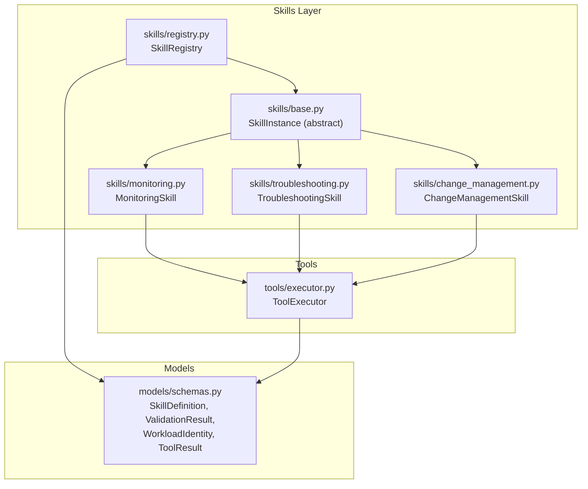
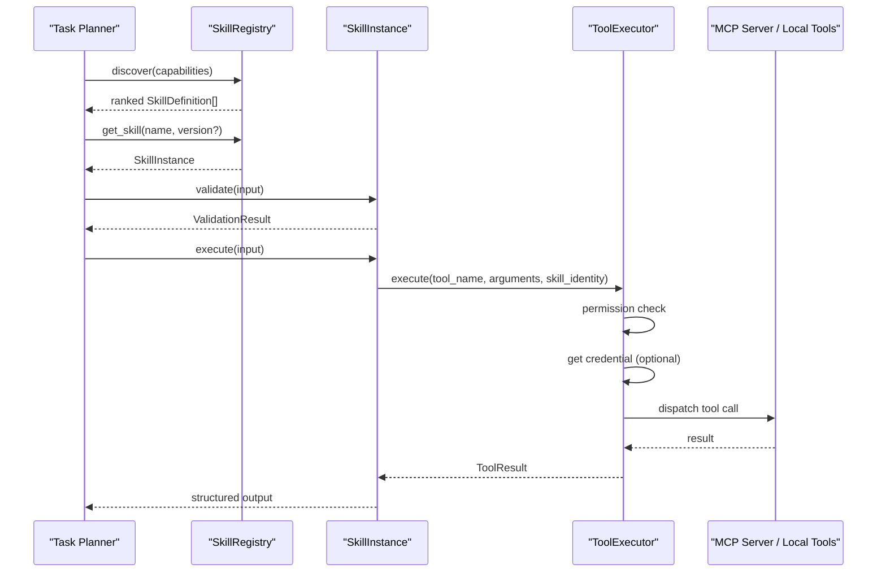
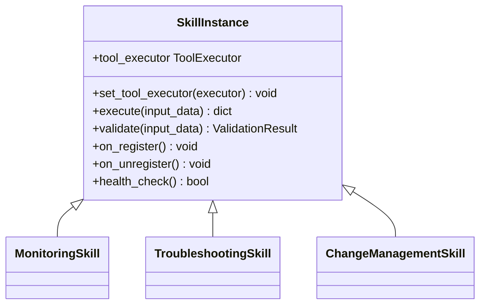
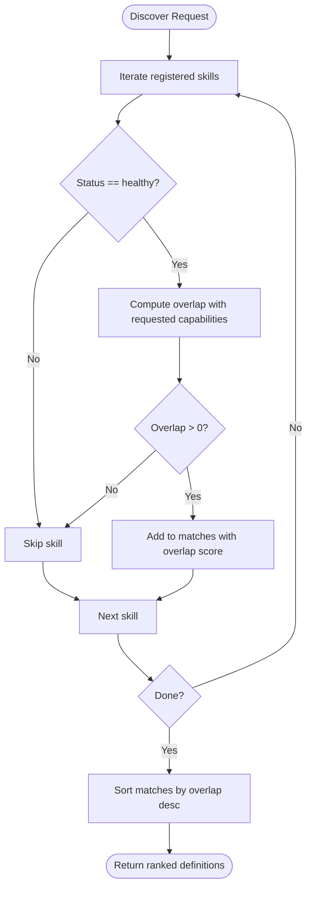
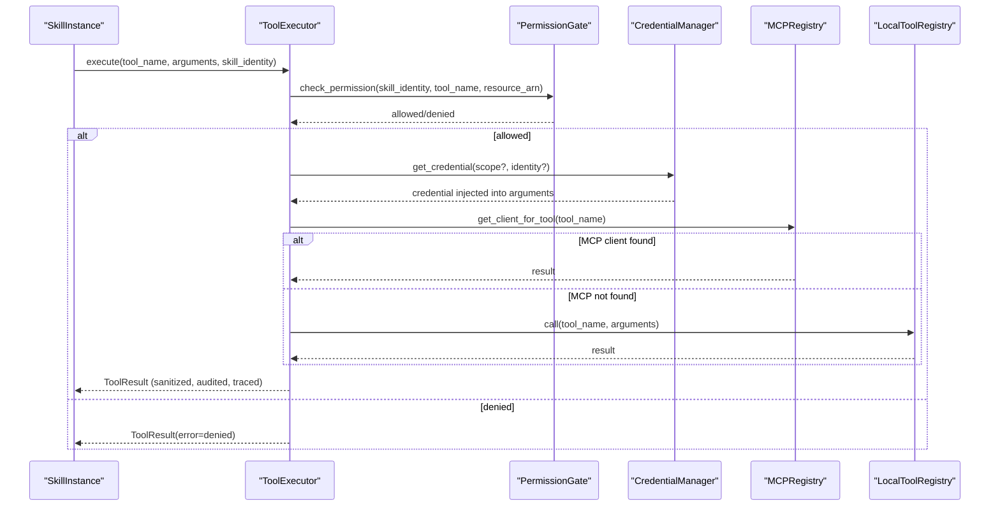
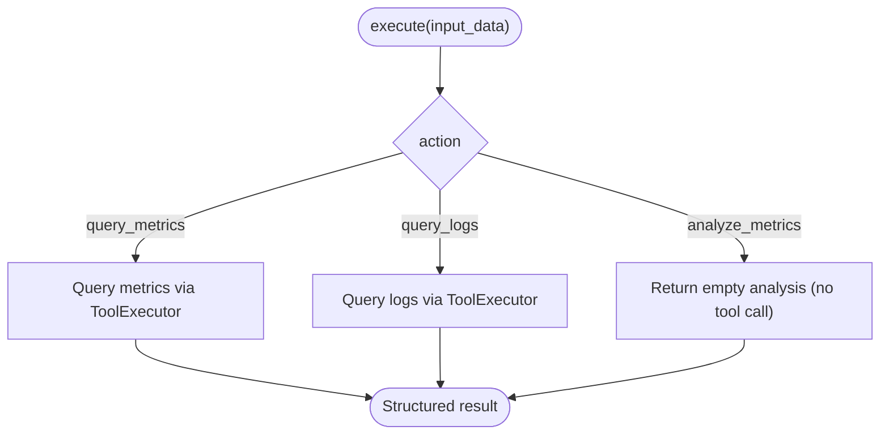
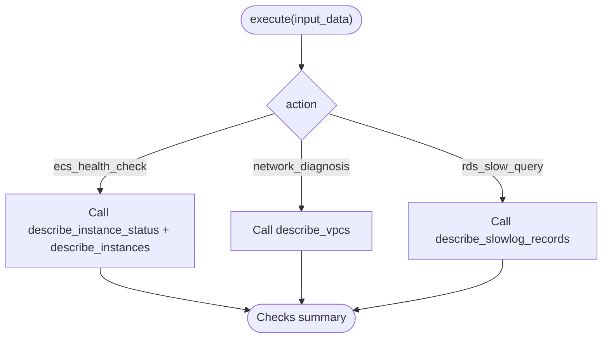
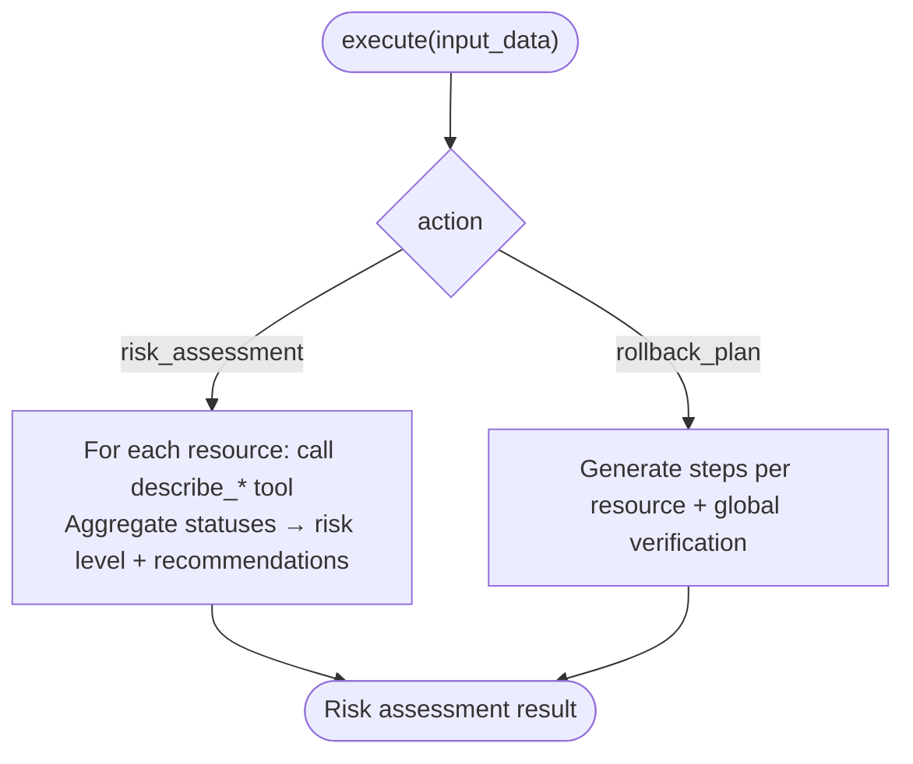
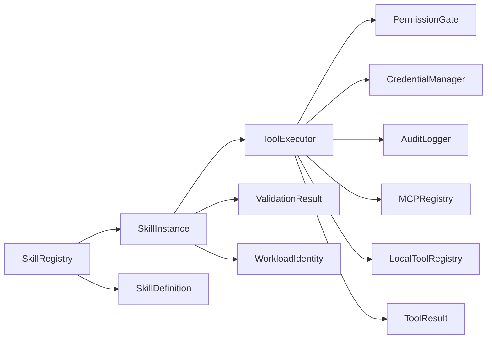

# Skill System

<cite>
**Referenced Files in This Document**
- [base.py](file://src/aiops_agent/skills/base.py)
- [registry.py](file://src/aiops_agent/skills/registry.py)
- [monitoring.py](file://src/aiops_agent/skills/monitoring.py)
- [troubleshooting.py](file://src/aiops_agent/skills/troubleshooting.py)
- [change_management.py](file://src/aiops_agent/skills/change_management.py)
- [schemas.py](file://src/aiops_agent/models/schemas.py)
- [executor.py](file://src/aiops_agent/tools/executor.py)
- [test_skill_base.py](file://tests/test_skill_base.py)
- [test_skill_registry.py](file://tests/test_skill_registry.py)
- [test_monitoring_skill.py](file://tests/test_monitoring_skill.py)
- [test_troubleshooting_skill.py](file://tests/test_troubleshooting_skill.py)
- [test_change_management_skill.py](file://tests/test_change_management_skill.py)
</cite>

## Table of Contents
1. [Introduction](#introduction)
2. [Project Structure](#project-structure)
3. [Core Components](#core-components)
4. [Architecture Overview](#architecture-overview)
5. [Detailed Component Analysis](#detailed-component-analysis)
6. [Dependency Analysis](#dependency-analysis)
7. [Performance Considerations](#performance-considerations)
8. [Troubleshooting Guide](#troubleshooting-guide)
9. [Conclusion](#conclusion)
10. [Appendices](#appendices)

## Introduction
This document explains the AIOps Agent’s skill system architecture and how it enables modular, composable automation. The system is skill-centric: each skill encapsulates a focused operational capability (e.g., monitoring, troubleshooting, change management), exposes a standardized interface, and integrates with a unified tool execution pipeline. The SkillRegistry manages discovery, registration, capability matching, versioning, and health. Skills inherit a common base class, implement a strict contract for execution and validation, and optionally leverage a ToolExecutor to call external tools via MCP servers or local tool registries. This document covers the design, implementation patterns, integration points, and extension guidelines for building new skills.

## Project Structure
The skill system resides under the skills package and integrates with shared models and the tool execution subsystem.

**Diagram sources**
- [base.py:21-93](file://src/aiops_agent/skills/base.py#L21-L93)
- [registry.py:19-284](file://src/aiops_agent/skills/registry.py#L19-L284)
- [monitoring.py:18-140](file://src/aiops_agent/skills/monitoring.py#L18-L140)
- [troubleshooting.py:18-152](file://src/aiops_agent/skills/troubleshooting.py#L18-L152)
- [change_management.py:18-178](file://src/aiops_agent/skills/change_management.py#L18-L178)
- [schemas.py:283-313](file://src/aiops_agent/models/schemas.py#L283-L313)
- [executor.py:45-314](file://src/aiops_agent/tools/executor.py#L45-L314)

**Section sources**
- [base.py:1-93](file://src/aiops_agent/skills/base.py#L1-L93)
- [registry.py:1-284](file://src/aiops_agent/skills/registry.py#L1-L284)
- [monitoring.py:1-140](file://src/aiops_agent/skills/monitoring.py#L1-L140)
- [troubleshooting.py:1-152](file://src/aiops_agent/skills/troubleshooting.py#L1-L152)
- [change_management.py:1-178](file://src/aiops_agent/skills/change_management.py#L1-L178)
- [schemas.py:1-313](file://src/aiops_agent/models/schemas.py#L1-L313)
- [executor.py:1-314](file://src/aiops_agent/tools/executor.py#L1-L314)

## Core Components
- SkillInstance (abstract): Defines the standard interface for all skills, including execute, validate, and optional lifecycle hooks. It supports injecting a ToolExecutor to call external tools.
- SkillRegistry: Central registry for discovering, registering, versioning, and health-checking skills. It routes to the latest stable version and filters unhealthy skills during discovery.
- ToolExecutor: Unified tool execution engine that enforces permissions, obtains credentials when needed, dispatches to MCP or local tools, retries with exponential backoff, sanitizes output, records audit events, and traces execution.
- Shared Models: SkillDefinition, ValidationResult, WorkloadIdentity, ToolResult define the contracts for capability metadata, input validation, identity and permissions, and tool execution results.

Key responsibilities:
- SkillInstance: Enforce abstraction, inject ToolExecutor, implement execute/validate, and optional lifecycle hooks.
- SkillRegistry: Register/unregister, capability-based discovery with ranking, default version selection, health management, and listing.
- ToolExecutor: Permission gate, credential acquisition, tool dispatch, retry/backoff, sanitization, auditing, and tracing.

**Section sources**
- [base.py:21-93](file://src/aiops_agent/skills/base.py#L21-L93)
- [registry.py:19-284](file://src/aiops_agent/skills/registry.py#L19-L284)
- [schemas.py:283-313](file://src/aiops_agent/models/schemas.py#L283-L313)
- [executor.py:45-314](file://src/aiops_agent/tools/executor.py#L45-L314)

## Architecture Overview
The skill system follows a layered, modular design:
- Skills implement a common interface and declare capabilities via SkillDefinition.
- SkillRegistry maintains a versioned catalog and performs capability-based discovery.
- Skills use ToolExecutor to call tools, which enforces permissions, resolves credentials, and executes against MCP or local tool registries.
- Results are sanitized, audited, and traced.

**Diagram sources**
- [registry.py:122-153](file://src/aiops_agent/skills/registry.py#L122-L153)
- [base.py:47-72](file://src/aiops_agent/skills/base.py#L47-L72)
- [executor.py:80-226](file://src/aiops_agent/tools/executor.py#L80-L226)
- [schemas.py:73-82](file://src/aiops_agent/models/schemas.py#L73-L82)

## Detailed Component Analysis

### SkillInstance Base Class
SkillInstance defines the contract that all skills must implement:
- execute(input_data): Asynchronous execution returning a structured dictionary.
- validate(input_data): Validates inputs and returns a ValidationResult.
- Lifecycle hooks: on_register, on_unregister, health_check (default returns True).
- ToolExecutor integration: set_tool_executor injects a ToolExecutor instance for tool invocation.

Implementation patterns:
- Always validate inputs via validate before executing.
- Use tool_executor.execute to call tools; handle success/failure gracefully.
- Override lifecycle hooks for initialization/cleanup and health diagnostics.

**Diagram sources**
- [base.py:21-93](file://src/aiops_agent/skills/base.py#L21-L93)
- [monitoring.py:18-140](file://src/aiops_agent/skills/monitoring.py#L18-L140)
- [troubleshooting.py:18-152](file://src/aiops_agent/skills/troubleshooting.py#L18-L152)
- [change_management.py:18-178](file://src/aiops_agent/skills/change_management.py#L18-L178)

**Section sources**
- [base.py:21-93](file://src/aiops_agent/skills/base.py#L21-L93)
- [test_skill_base.py:1-181](file://tests/test_skill_base.py#L1-L181)

### SkillRegistry
Responsibilities:
- Registration: Validates SkillDefinition completeness and uniqueness, sets default version, triggers on_register.
- Unregistration: Removes specific or all versions, triggers on_unregister, updates defaults.
- Discovery: Matches skills by capability intersection, ranks by overlap count, excludes unhealthy.
- Versioning: Tracks per-skill versions, selects default as latest healthy.
- Health: health_check updates status based on skill-reported health; manual mark_healthy/mark_unhealthy.

**Diagram sources**
- [registry.py:122-153](file://src/aiops_agent/skills/registry.py#L122-L153)

**Section sources**
- [registry.py:19-284](file://src/aiops_agent/skills/registry.py#L19-L284)
- [test_skill_registry.py:1-253](file://tests/test_skill_registry.py#L1-L253)

### ToolExecutor
Core responsibilities:
- Permission gating: Uses PermissionGate to enforce required permissions against WorkloadIdentity.
- Credential management: Obtains temporary credentials for target services and injects into tool arguments.
- Tool dispatch: Prefers MCP tools via MCPRegistry, falls back to LocalToolRegistry.
- Execution: Supports sync/async/stream modes, timeouts, and exponential backoff retries.
- Sanitization and auditing: Sanitizes sensitive parameters and logs audit events with trace/span IDs.
- Tracing: Records spans for end-to-end observability.

**Diagram sources**
- [executor.py:80-226](file://src/aiops_agent/tools/executor.py#L80-L226)
- [schemas.py:73-82](file://src/aiops_agent/models/schemas.py#L73-L82)

**Section sources**
- [executor.py:45-314](file://src/aiops_agent/tools/executor.py#L45-L314)
- [schemas.py:89-137](file://src/aiops_agent/models/schemas.py#L89-L137)

### Monitoring & Diagnostics Skills
Capabilities:
- cloud_monitor_query: Query metric data.
- sls_log_query: Query structured logs.
- metric_analysis: Trend analysis.

Implementation highlights:
- Action routing in execute based on action field.
- Identity with permissions for cloud monitor and SLS.
- Graceful fallback when ToolExecutor is unavailable.

**Diagram sources**
- [monitoring.py:30-140](file://src/aiops_agent/skills/monitoring.py#L30-L140)

**Section sources**
- [monitoring.py:18-140](file://src/aiops_agent/skills/monitoring.py#L18-L140)
- [test_monitoring_skill.py:1-233](file://tests/test_monitoring_skill.py#L1-L233)

### Troubleshooting Skills
Capabilities:
- ecs_health_check: Instance status and details.
- network_diagnosis: VPC configuration checks.
- rds_slow_query_analysis: Slow query log retrieval.

Implementation highlights:
- Multi-tool orchestration per action.
- Robust failure handling: partial successes still produce usable results.
- Identity with permissions for ECS, VPC, and RDS.

**Diagram sources**
- [troubleshooting.py:30-152](file://src/aiops_agent/skills/troubleshooting.py#L30-L152)

**Section sources**
- [troubleshooting.py:18-152](file://src/aiops_agent/skills/troubleshooting.py#L18-L152)
- [test_troubleshooting_skill.py:1-302](file://tests/test_troubleshooting_skill.py#L1-L302)

### Change Management Skills
Capabilities:
- change_risk_assessment: Risk evaluation across resources.
- rollback_recommendation: Stepwise rollback plan.

Implementation highlights:
- Dynamic tool selection by resource type.
- Risk scoring based on tool call outcomes.
- Structured rollback steps with verification.

**Diagram sources**
- [change_management.py:29-178](file://src/aiops_agent/skills/change_management.py#L29-L178)

**Section sources**
- [change_management.py:18-178](file://src/aiops_agent/skills/change_management.py#L18-L178)
- [test_change_management_skill.py:1-267](file://tests/test_change_management_skill.py#L1-L267)

## Dependency Analysis
- SkillInstance depends on:
  - ToolExecutor (optional) for external tool calls.
  - Models (ValidationResult, WorkloadIdentity) for input validation and identity.
- SkillRegistry depends on:
  - SkillInstance subclasses and SkillDefinition for metadata/versioning.
  - Health checks to filter candidates.
- ToolExecutor depends on:
  - PermissionGate, CredentialManager, AuditLogger, MCPRegistry, LocalToolRegistry.
  - Models (ToolResult, WorkloadIdentity) for contracts.

**Diagram sources**
- [base.py:13-16](file://src/aiops_agent/skills/base.py#L13-L16)
- [registry.py:13-14](file://src/aiops_agent/skills/registry.py#L13-L14)
- [executor.py:18-35](file://src/aiops_agent/tools/executor.py#L18-L35)
- [schemas.py:283-296](file://src/aiops_agent/models/schemas.py#L73-L96, #L283-L296)

**Section sources**
- [base.py:1-93](file://src/aiops_agent/skills/base.py#L1-L93)
- [registry.py:1-284](file://src/aiops_agent/skills/registry.py#L1-L284)
- [executor.py:1-314](file://src/aiops_agent/tools/executor.py#L1-L314)
- [schemas.py:1-313](file://src/aiops_agent/models/schemas.py#L1-L313)

## Performance Considerations
- Capability-based discovery uses set intersection and sorting by overlap count; keep capability lists concise and meaningful.
- ToolExecutor applies exponential backoff and timeouts; tune default_timeout_seconds for long-running tools.
- ToolExecutor retries transient network failures; ensure tools are idempotent where possible.
- Sanitization and auditing add overhead; consider batching audit events in high-throughput scenarios.
- Health checks should be lightweight; avoid heavy I/O in health_check implementations.

## Troubleshooting Guide
Common issues and resolutions:
- PermissionDeniedError: Verify WorkloadIdentity permissions and required permissions declared in SkillDefinition.
- Tool not found: Confirm tool_name exists in MCPRegistry or LocalToolRegistry; ToolExecutor raises when neither is available.
- TimeoutError: Increase timeout or optimize tool execution; inspect ToolResult.error for details.
- Unhealthy skill: Use SkillRegistry.health_check to diagnose; mark_unhealthy to remove temporarily.
- Missing action in execute: Ensure action is included in input_data; skills validate presence and return errors.

Operational checks:
- Validate inputs using ValidationResult before executing.
- Inspect ToolResult.success and ToolResult.error for tool execution outcomes.
- Review audit logs for trace_id and span_id correlation.

**Section sources**
- [executor.py:169-201](file://src/aiops_agent/tools/executor.py#L169-L201)
- [schemas.py:73-82](file://src/aiops_agent/models/schemas.py#L73-L82)
- [registry.py:213-251](file://src/aiops_agent/skills/registry.py#L213-L251)

## Conclusion
The AIOps Agent skill system provides a robust, extensible foundation for operational automation. By adhering to the SkillInstance contract, skills remain modular and composable. SkillRegistry enables intelligent capability-based routing and version management. ToolExecutor centralizes safety, reliability, and observability for tool invocations. Following the documented patterns and guidelines allows teams to develop new skills quickly while maintaining consistency and security.

## Appendices

### Implementation Patterns and Guidelines
- Define capabilities in SkillDefinition and align skill actions with those capabilities.
- Implement validate to return early with clear errors; keep execute idempotent where feasible.
- Inject ToolExecutor in on_register if the skill needs external tools; release resources in on_unregister.
- Use WorkloadIdentity to declare required permissions; keep permissions minimal and scoped.
- For multi-step actions, orchestrate tool calls and aggregate results; handle partial failures gracefully.
- Keep health_check fast and deterministic; avoid external calls unless necessary.

### Integration with ToolExecutor
- Call tool_name with arguments and skill_identity; ToolExecutor handles permission checks, credential acquisition, dispatch, retries, sanitization, auditing, and tracing.
- Use execution_mode and timeout_seconds appropriately; stream mode for long-running operations.

### Extending the System with New Capabilities
Steps to add a new skill:
1. Create a new class inheriting SkillInstance and implement execute/validate.
2. Declare capabilities in SkillDefinition and include required permissions.
3. Optionally override lifecycle hooks for setup/cleanup.
4. Register the skill with SkillRegistry and ensure health_check passes.
5. Add tests mirroring existing patterns (validation, execution with/without executor, identity checks).

Example references:
- SkillInstance contract and lifecycle: [base.py:21-93](file://src/aiops_agent/skills/base.py#L21-L93)
- Registration and discovery: [registry.py:41-153](file://src/aiops_agent/skills/registry.py#L41-L153)
- ToolExecutor execution flow: [executor.py:80-226](file://src/aiops_agent/tools/executor.py#L80-L226)
- Existing skills for reference:
  - Monitoring: [monitoring.py:18-140](file://src/aiops_agent/skills/monitoring.py#L18-L140)
  - Troubleshooting: [troubleshooting.py:18-152](file://src/aiops_agent/skills/troubleshooting.py#L18-L152)
  - Change Management: [change_management.py:18-178](file://src/aiops_agent/skills/change_management.py#L18-L178)

**Section sources**
- [base.py:21-93](file://src/aiops_agent/skills/base.py#L21-L93)
- [registry.py:41-153](file://src/aiops_agent/skills/registry.py#L41-L153)
- [executor.py:80-226](file://src/aiops_agent/tools/executor.py#L80-L226)
- [monitoring.py:18-140](file://src/aiops_agent/skills/monitoring.py#L18-L140)
- [troubleshooting.py:18-152](file://src/aiops_agent/skills/troubleshooting.py#L18-L152)
- [change_management.py:18-178](file://src/aiops_agent/skills/change_management.py#L18-L178)