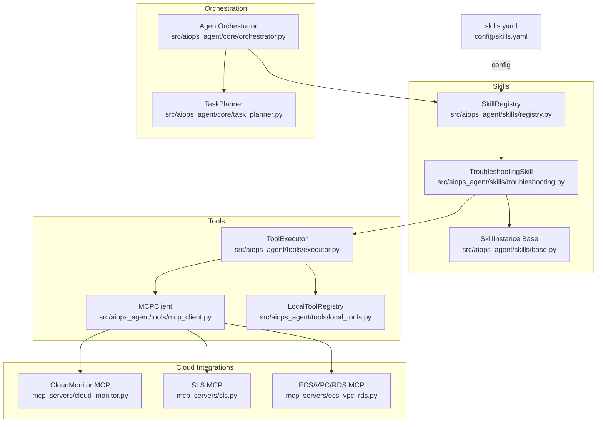
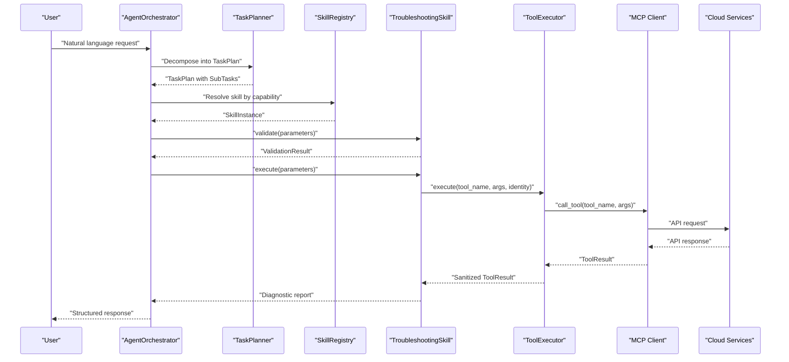
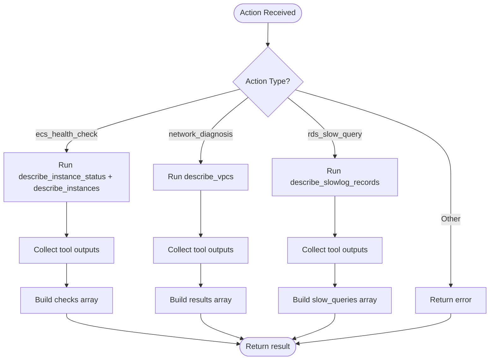
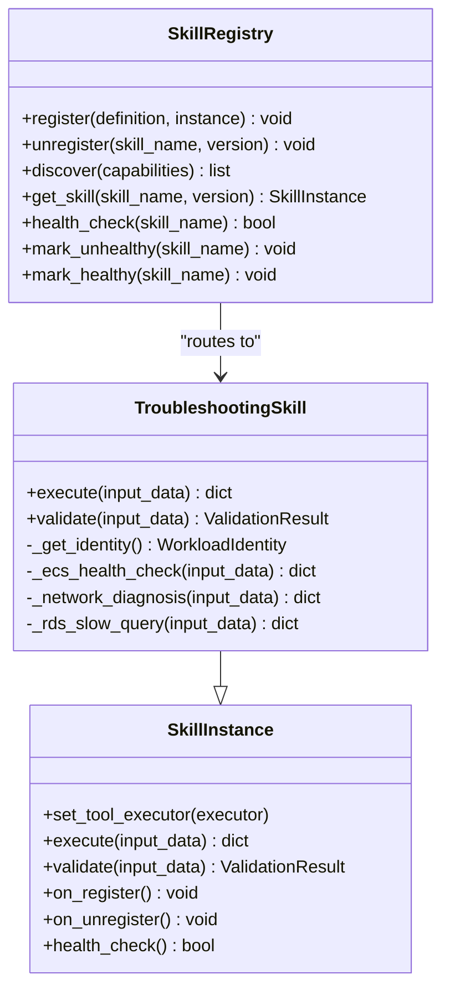
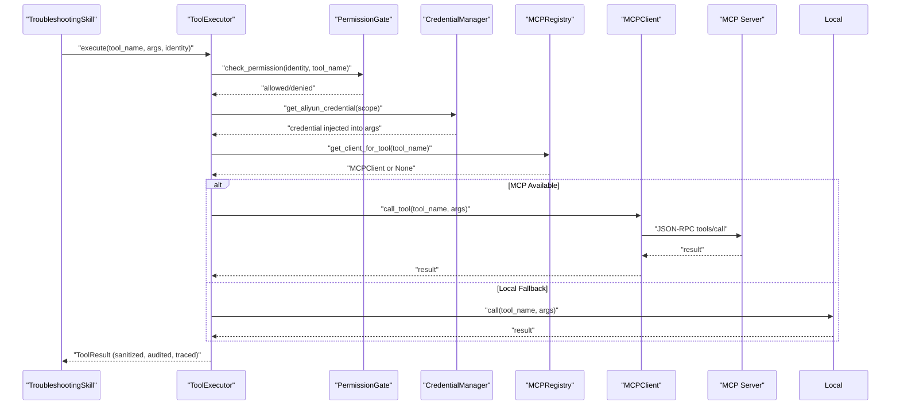
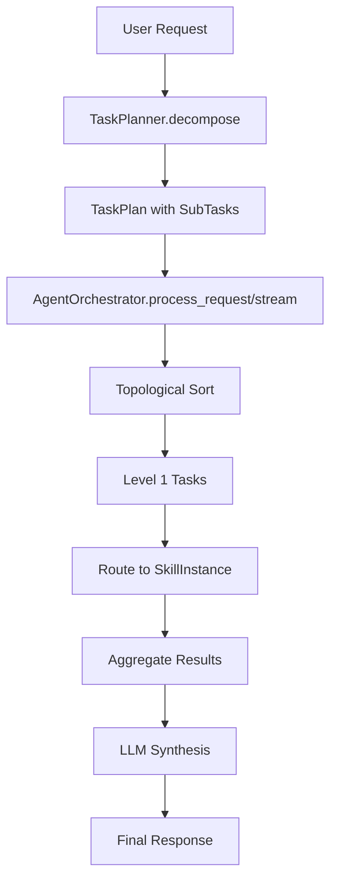
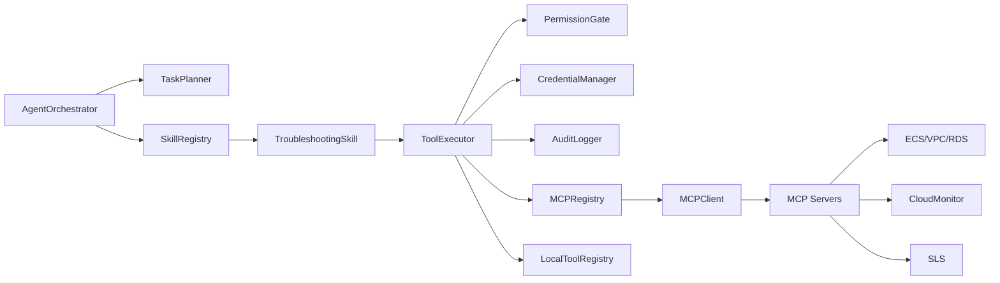

# Troubleshooting Skills

<cite>
**Referenced Files in This Document**
- [troubleshooting.py](file://src/aiops_agent/skills/troubleshooting.py)
- [base.py](file://src/aiops_agent/skills/base.py)
- [registry.py](file://src/aiops_agent/skills/registry.py)
- [schemas.py](file://src/aiops_agent/models/schemas.py)
- [skills.yaml](file://config/skills.yaml)
- [cloud_monitor.py](file://mcp_servers/cloud_monitor.py)
- [sls.py](file://mcp_servers/sls.py)
- [ecs_vpc_rds.py](file://mcp_servers/ecs_vpc_rds.py)
- [mcp_client.py](file://src/aiops_agent/tools/mcp_client.py)
- [executor.py](file://src/aiops_agent/tools/executor.py)
- [local_tools.py](file://src/aiops_agent/tools/local_tools.py)
- [test_troubleshooting_skill.py](file://tests/test_troubleshooting_skill.py)
- [orchestrator.py](file://src/aiops_agent/core/orchestrator.py)
- [task_planner.py](file://src/aiops_agent/core/task_planner.py)
</cite>

## Table of Contents
1. [Introduction](#introduction)
2. [Project Structure](#project-structure)
3. [Core Components](#core-components)
4. [Architecture Overview](#architecture-overview)
5. [Detailed Component Analysis](#detailed-component-analysis)
6. [Dependency Analysis](#dependency-analysis)
7. [Performance Considerations](#performance-considerations)
8. [Troubleshooting Guide](#troubleshooting-guide)
9. [Conclusion](#conclusion)
10. [Appendices](#appendices)

## Introduction
This document describes the AIOps Agent’s Troubleshooting Skills subsystem. It explains the architecture for automated problem diagnosis and resolution, including diagnostic workflows (root cause analysis, symptom correlation, remediation recommendation generation), integration patterns with cloud service monitoring and log analysis, and implementation examples for common scenarios such as performance degradation, service outages, and configuration issues. It also documents the skill’s decision-making logic, evidence-gathering processes, confidence scoring mechanisms, and guidelines for extending capabilities with domain-specific diagnostic procedures.

## Project Structure
The troubleshooting capability is implemented as a Skill module that integrates with the Agent’s orchestration pipeline and MCP-based tool execution framework. Key areas:
- Skill definition and execution: TroubleshootingSkill and SkillInstance base
- Skill registry and discovery: SkillRegistry
- Tool execution and security: ToolExecutor, MCP client, local tools
- Cloud integrations: MCP servers for ECS/VPC/RDS, CloudMonitor, and SLS
- Orchestration and planning: Orchestrator and TaskPlanner
- Configuration: skills.yaml defines capabilities and permissions

**Diagram sources**
- [troubleshooting.py:18-152](file://src/aiops_agent/skills/troubleshooting.py#L18-L152)
- [base.py:21-93](file://src/aiops_agent/skills/base.py#L21-L93)
- [registry.py:19-284](file://src/aiops_agent/skills/registry.py#L19-L284)
- [executor.py:45-314](file://src/aiops_agent/tools/executor.py#L45-L314)
- [mcp_client.py:22-324](file://src/aiops_agent/tools/mcp_client.py#L22-L324)
- [local_tools.py:35-161](file://src/aiops_agent/tools/local_tools.py#L35-L161)
- [cloud_monitor.py:17-131](file://mcp_servers/cloud_monitor.py#L17-L131)
- [sls.py:16-97](file://mcp_servers/sls.py#L16-L97)
- [ecs_vpc_rds.py:19-125](file://mcp_servers/ecs_vpc_rds.py#L19-L125)
- [orchestrator.py:47-658](file://src/aiops_agent/core/orchestrator.py#L47-L658)
- [task_planner.py:32-207](file://src/aiops_agent/core/task_planner.py#L32-L207)
- [skills.yaml:1-77](file://config/skills.yaml#L1-L77)

**Section sources**
- [troubleshooting.py:1-152](file://src/aiops_agent/skills/troubleshooting.py#L1-L152)
- [registry.py:19-284](file://src/aiops_agent/skills/registry.py#L19-L284)
- [executor.py:45-314](file://src/aiops_agent/tools/executor.py#L45-L314)
- [mcp_client.py:22-324](file://src/aiops_agent/tools/mcp_client.py#L22-L324)
- [cloud_monitor.py:17-131](file://mcp_servers/cloud_monitor.py#L17-L131)
- [sls.py:16-97](file://mcp_servers/sls.py#L16-L97)
- [ecs_vpc_rds.py:19-125](file://mcp_servers/ecs_vpc_rds.py#L19-L125)
- [orchestrator.py:47-658](file://src/aiops_agent/core/orchestrator.py#L47-L658)
- [task_planner.py:32-207](file://src/aiops_agent/core/task_planner.py#L32-L207)
- [skills.yaml:1-77](file://config/skills.yaml#L1-L77)

## Core Components
- TroubleshootingSkill: Implements three actions—ECS health check, network diagnosis, and RDS slow query analysis—by invoking tools via ToolExecutor. It validates inputs and gathers evidence from cloud APIs through MCP servers.
- SkillInstance: Defines the standard interface for skills, including execute, validate, lifecycle hooks, and optional ToolExecutor injection.
- SkillRegistry: Manages registration, discovery, versioning, and health status of skills. Supports capability-based matching and default version routing.
- ToolExecutor: Provides unified execution with permission gating, credential acquisition, MCP/local tool dispatch, retry/backoff, sanitization, auditing, and tracing.
- MCP Servers: CloudMonitor (metrics), SLS (logs), and ECS/VPC/RDS (resource queries) expose tools consumable by ToolExecutor.
- Orchestrator and TaskPlanner: Decompose natural language requests into TaskPlans with SubTasks, route to skills, and orchestrate DAG execution with streaming support.

**Section sources**
- [troubleshooting.py:18-152](file://src/aiops_agent/skills/troubleshooting.py#L18-L152)
- [base.py:21-93](file://src/aiops_agent/skills/base.py#L21-L93)
- [registry.py:19-284](file://src/aiops_agent/skills/registry.py#L19-L284)
- [executor.py:45-314](file://src/aiops_agent/tools/executor.py#L45-L314)
- [mcp_client.py:22-324](file://src/aiops_agent/tools/mcp_client.py#L22-L324)
- [cloud_monitor.py:17-131](file://mcp_servers/cloud_monitor.py#L17-L131)
- [sls.py:16-97](file://mcp_servers/sls.py#L16-L97)
- [ecs_vpc_rds.py:19-125](file://mcp_servers/ecs_vpc_rds.py#L19-L125)
- [orchestrator.py:47-658](file://src/aiops_agent/core/orchestrator.py#L47-L658)
- [task_planner.py:32-207](file://src/aiops_agent/core/task_planner.py#L32-L207)

## Architecture Overview
The troubleshooting workflow integrates LLM-driven task decomposition, skill routing, and cloud tool execution. Evidence is gathered from multiple sources (metrics, logs, resource states), aggregated, and synthesized into actionable insights.

**Diagram sources**
- [orchestrator.py:84-198](file://src/aiops_agent/core/orchestrator.py#L84-L198)
- [task_planner.py:50-113](file://src/aiops_agent/core/task_planner.py#L50-L113)
- [registry.py:159-182](file://src/aiops_agent/skills/registry.py#L159-L182)
- [troubleshooting.py:30-47](file://src/aiops_agent/skills/troubleshooting.py#L30-L47)
- [executor.py:80-202](file://src/aiops_agent/tools/executor.py#L80-L202)
- [mcp_client.py:135-156](file://src/aiops_agent/tools/mcp_client.py#L135-L156)

## Detailed Component Analysis

### TroubleshootingSkill
- Responsibilities:
  - Action routing: ecs_health_check, network_diagnosis, rds_slow_query
  - Input validation: ensures required fields per action
  - Identity provisioning: WorkloadIdentity with required permissions
  - Evidence gathering: invokes MCP tools for cloud resource queries
  - Output structuring: standardized success responses with collected checks/logs
- Decision-making logic:
  - Executes tools conditionally based on action
  - Aggregates tool outcomes into structured checks/results
  - Gracefully handles missing ToolExecutor by returning empty results
- Confidence scoring:
  - No explicit numeric confidence score is computed in the current implementation
  - Confidence can be derived from presence/absence of checks and tool success/failure

**Diagram sources**
- [troubleshooting.py:30-152](file://src/aiops_agent/skills/troubleshooting.py#L30-L152)

**Section sources**
- [troubleshooting.py:18-152](file://src/aiops_agent/skills/troubleshooting.py#L18-L152)
- [test_troubleshooting_skill.py:46-302](file://tests/test_troubleshooting_skill.py#L46-L302)

### SkillInstance and SkillRegistry
- SkillInstance:
  - Enforces execute/validate contract
  - Supports ToolExecutor injection and lifecycle hooks
- SkillRegistry:
  - Registers/unregisters skills with validation and uniqueness checks
  - Discovers skills by capability overlap and sorts by match quality
  - Maintains health status and default versions
  - Routes to latest stable version by default

**Diagram sources**
- [base.py:21-93](file://src/aiops_agent/skills/base.py#L21-L93)
- [troubleshooting.py:18-56](file://src/aiops_agent/skills/troubleshooting.py#L18-L56)
- [registry.py:19-284](file://src/aiops_agent/skills/registry.py#L19-L284)

**Section sources**
- [base.py:21-93](file://src/aiops_agent/skills/base.py#L21-L93)
- [registry.py:19-284](file://src/aiops_agent/skills/registry.py#L19-L284)

### Tool Execution Pipeline and Cloud Integrations
- ToolExecutor:
  - PermissionGate: enforces required permissions against WorkloadIdentity
  - CredentialManager: obtains temporary credentials for cloud APIs
  - Dispatch: prefers MCP tools, falls back to LocalToolRegistry
  - Retry/backoff: exponential backoff with capped delay
  - Sanitization and audit logging: sensitive data removal and structured audit events
  - Tracing: OpenTelemetry spans for end-to-end visibility
- MCP Client:
  - Supports stdio and SSE/HTTP transports
  - JSON-RPC 2.0 messaging
  - Tool discovery and invocation
- MCP Servers:
  - ECS/VPC/RDS: describe_instances, describe_instance_status, describe_vpcs, describe_slowlog_records
  - CloudMonitor: DescribeMetricLast/DescribeMetricList/DescribeSystemEventHistory
  - SLS: GetLogs, ListLogstores, GetLogstoreIndex

**Diagram sources**
- [executor.py:80-202](file://src/aiops_agent/tools/executor.py#L80-L202)
- [mcp_client.py:135-156](file://src/aiops_agent/tools/mcp_client.py#L135-L156)
- [ecs_vpc_rds.py:101-120](file://mcp_servers/ecs_vpc_rds.py#L101-L120)
- [cloud_monitor.py:74-126](file://mcp_servers/cloud_monitor.py#L74-L126)
- [sls.py:49-91](file://mcp_servers/sls.py#L49-L91)

**Section sources**
- [executor.py:45-314](file://src/aiops_agent/tools/executor.py#L45-L314)
- [mcp_client.py:22-324](file://src/aiops_agent/tools/mcp_client.py#L22-L324)
- [ecs_vpc_rds.py:19-125](file://mcp_servers/ecs_vpc_rds.py#L19-L125)
- [cloud_monitor.py:17-131](file://mcp_servers/cloud_monitor.py#L17-L131)
- [sls.py:16-97](file://mcp_servers/sls.py#L16-L97)

### Orchestration and Planning
- TaskPlanner:
  - Uses LLM to decompose user intent into SubTasks with skill_name, action, parameters, and dependencies
  - Validates skill availability and marks unmappable tasks as failed
- AgentOrchestrator:
  - Streams progress via SSE-like events
  - Executes tasks in DAG levels with concurrency control
  - Records failures, triggers health checks, and synthesizes final LLM summary

**Diagram sources**
- [task_planner.py:50-113](file://src/aiops_agent/core/task_planner.py#L50-L113)
- [orchestrator.py:84-198](file://src/aiops_agent/core/orchestrator.py#L84-L198)
- [orchestrator.py:424-483](file://src/aiops_agent/core/orchestrator.py#L424-L483)

**Section sources**
- [task_planner.py:32-207](file://src/aiops_agent/core/task_planner.py#L32-L207)
- [orchestrator.py:47-658](file://src/aiops_agent/core/orchestrator.py#L47-L658)

## Dependency Analysis
- Skill-to-tool coupling:
  - TroubleshootingSkill depends on ToolExecutor and WorkloadIdentity
  - ToolExecutor depends on PermissionGate, CredentialManager, AuditLogger, MCPRegistry, and LocalToolRegistry
- Capability-based routing:
  - SkillRegistry matches skills by capability overlap; higher overlap yields priority
- External dependencies:
  - MCP servers for ECS/VPC/RDS, CloudMonitor, and SLS
  - LLM provider for task decomposition and synthesis

**Diagram sources**
- [troubleshooting.py:49-56](file://src/aiops_agent/skills/troubleshooting.py#L49-L56)
- [executor.py:58-75](file://src/aiops_agent/tools/executor.py#L58-L75)
- [mcp_client.py:22-43](file://src/aiops_agent/tools/mcp_client.py#L22-L43)
- [ecs_vpc_rds.py:101-120](file://mcp_servers/ecs_vpc_rds.py#L101-L120)
- [cloud_monitor.py:74-126](file://mcp_servers/cloud_monitor.py#L74-L126)
- [sls.py:49-91](file://mcp_servers/sls.py#L49-L91)
- [orchestrator.py:68-75](file://src/aiops_agent/core/orchestrator.py#L68-L75)
- [task_planner.py:42-48](file://src/aiops_agent/core/task_planner.py#L42-L48)
- [registry.py:19-36](file://src/aiops_agent/skills/registry.py#L19-L36)

**Section sources**
- [registry.py:122-154](file://src/aiops_agent/skills/registry.py#L122-L154)
- [schemas.py:283-313](file://src/aiops_agent/models/schemas.py#L283-L313)

## Performance Considerations
- Concurrency and throughput:
  - Orchestrator limits concurrent tasks per level to avoid overload
  - ToolExecutor retries with exponential backoff to mitigate transient failures
- Latency-sensitive operations:
  - Prefer MCP tools for cloud APIs; ensure servers are close to Agent runtime
  - Use streaming responses for long-running diagnostics to improve perceived responsiveness
- Observability:
  - OpenTelemetry tracing and metrics capture execution durations and failure rates
  - Audit logs record every tool invocation with sanitized parameters

[No sources needed since this section provides general guidance]

## Troubleshooting Guide
Common issues and resolutions:
- Unknown action:
  - Symptom: error returned for unsupported action
  - Resolution: verify action name in supported list
- Missing ToolExecutor:
  - Symptom: empty checks/results returned
  - Resolution: configure MCP servers or local tools; ensure ToolExecutor is injected
- Permission denied:
  - Symptom: ToolResult with error indicating insufficient permissions
  - Resolution: update WorkloadIdentity permissions; reconfigure required permissions
- Tool timeouts:
  - Symptom: AgentTimeoutError propagated
  - Resolution: increase timeout; verify network connectivity; check MCP server health
- Partial failures:
  - Symptom: some checks succeed, others fail
  - Resolution: review individual tool outputs; correlate with logs and metrics

**Section sources**
- [troubleshooting.py:40-47](file://src/aiops_agent/skills/troubleshooting.py#L40-L47)
- [executor.py:180-202](file://src/aiops_agent/tools/executor.py#L180-L202)
- [test_troubleshooting_skill.py:46-90](file://tests/test_troubleshooting_skill.py#L46-L90)

## Conclusion
The Troubleshooting Skills subsystem provides a modular, secure, and extensible framework for automated diagnosis. By combining capability-based skill routing, robust tool execution with permission and audit controls, and integration with cloud monitoring/log services, it supports practical workflows for diagnosing performance degradation, outages, and configuration issues. Extensibility is achieved through adding new MCP tools, skills, and domain-specific diagnostic procedures.

[No sources needed since this section summarizes without analyzing specific files]

## Appendices

### Diagnostic Workflow Examples
- Performance degradation:
  - Actions: ecs_health_check, network_diagnosis, rds_slow_query
  - Evidence: instance status, VPC configuration, slow query logs
  - Remediation: scale compute/storage, adjust network ACLs, optimize queries
- Service outage:
  - Actions: ecs_health_check, network_diagnosis
  - Evidence: instance status, VPC reachability
  - Remediation: restart unhealthy instances, fix VPC routes
- Configuration issue:
  - Actions: network_diagnosis
  - Evidence: VPC configuration
  - Remediation: align subnet masks, security groups, route tables

[No sources needed since this section provides general guidance]

### Extending Troubleshooting Capabilities
- Add MCP tools:
  - Define tool handlers in ECS/VPC/RDS or dedicated MCP servers
  - Register tools with ToolExecutor; ensure permissions are declared
- Create new skills:
  - Extend SkillInstance, implement execute/validate
  - Register with SkillRegistry and define capabilities/permissions in skills.yaml
- Enhance decision logic:
  - Incorporate confidence scoring by weighting tool outcomes and cross-checking evidence
  - Integrate anomaly detection and trend analysis from CloudMonitor/SLS

**Section sources**
- [ecs_vpc_rds.py:101-120](file://mcp_servers/ecs_vpc_rds.py#L101-L120)
- [cloud_monitor.py:74-126](file://mcp_servers/cloud_monitor.py#L74-L126)
- [sls.py:49-91](file://mcp_servers/sls.py#L49-L91)
- [base.py:21-93](file://src/aiops_agent/skills/base.py#L21-L93)
- [registry.py:41-81](file://src/aiops_agent/skills/registry.py#L41-L81)
- [skills.yaml:17-30](file://config/skills.yaml#L17-L30)