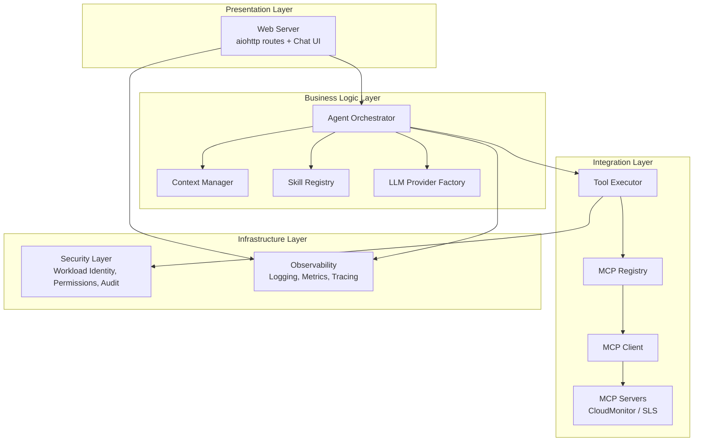
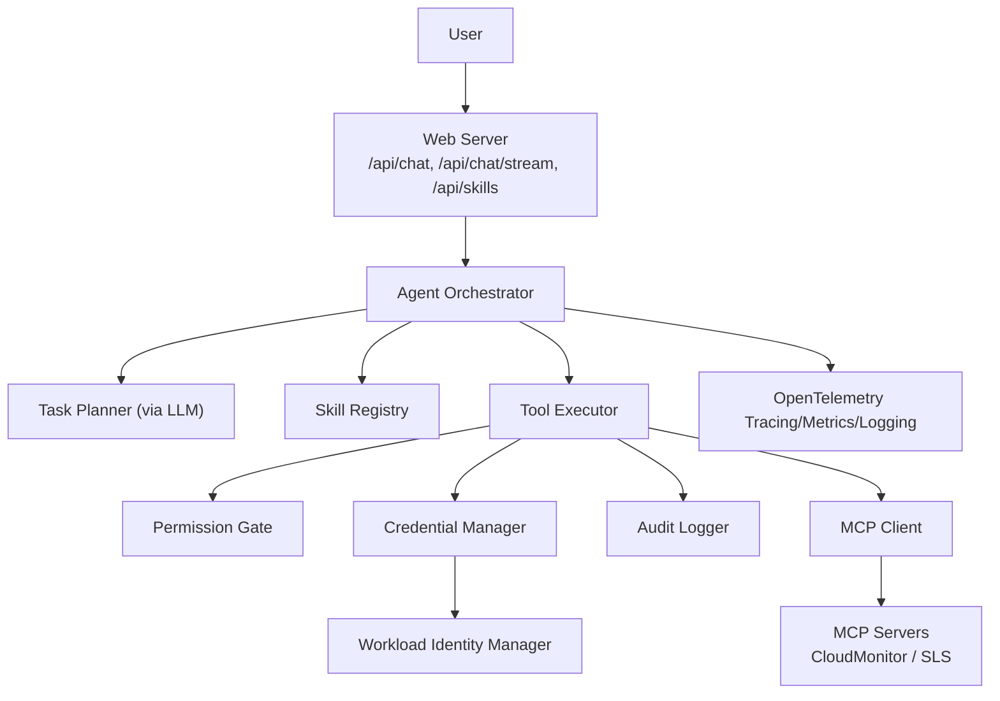
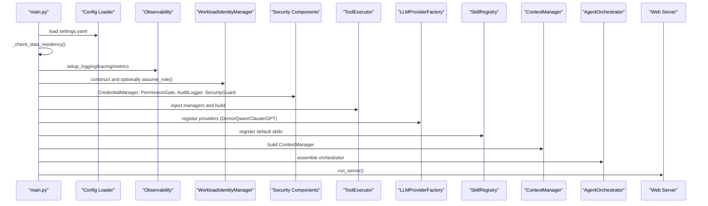
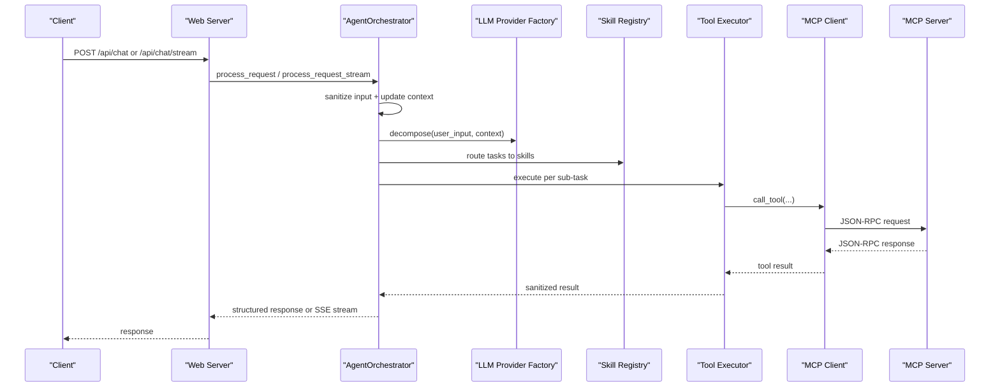
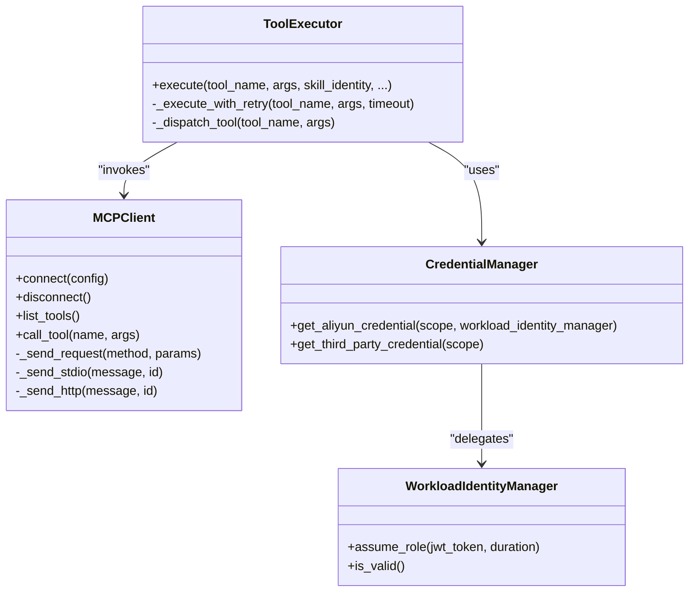
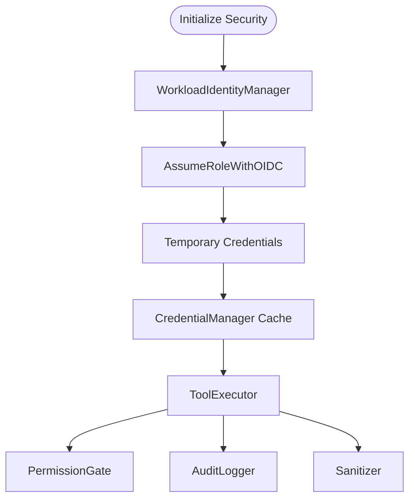
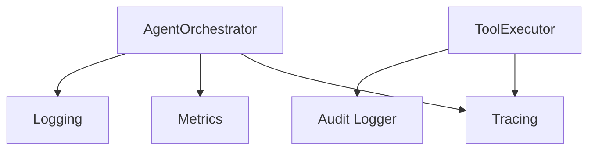
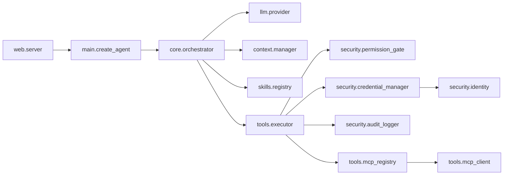
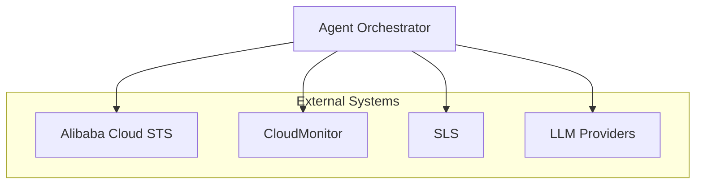
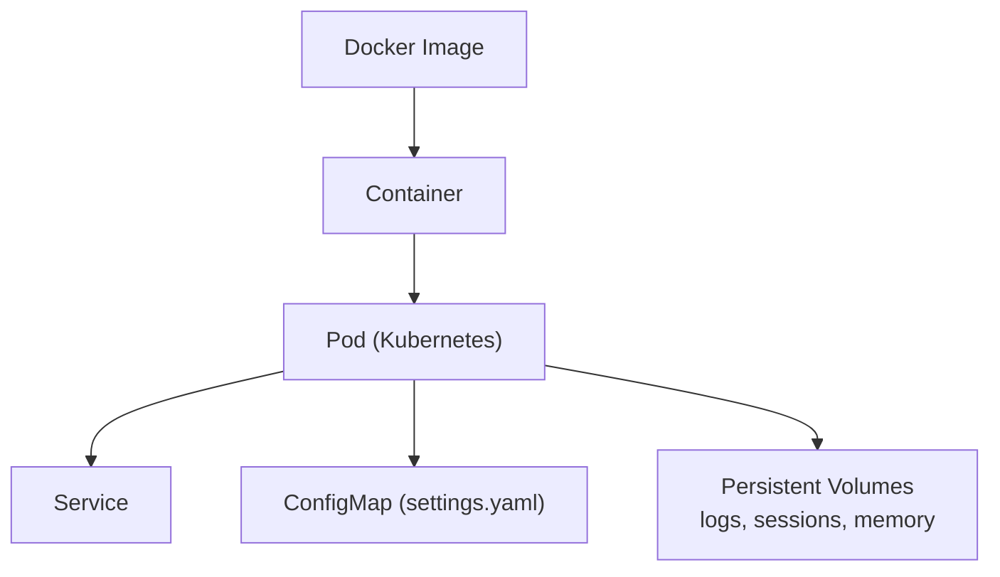

# Architecture Overview

<cite>
**Referenced Files in This Document**
- [README.md](file://README.md)
- [main.py](file://src/aiops_agent/main.py)
- [server.py](file://src/aiops_agent/web/server.py)
- [orchestrator.py](file://src/aiops_agent/core/orchestrator.py)
- [executor.py](file://src/aiops_agent/tools/executor.py)
- [credential_manager.py](file://src/aiops_agent/security/credential_manager.py)
- [identity.py](file://src/aiops_agent/security/identity.py)
- [provider.py](file://src/aiops_agent/llm/provider.py)
- [manager.py](file://src/aiops_agent/context/manager.py)
- [registry.py](file://src/aiops_agent/skills/registry.py)
- [mcp_client.py](file://src/aiops_agent/tools/mcp_client.py)
- [settings.yaml](file://config/settings.yaml)
- [Dockerfile](file://deploy/Dockerfile)
- [cloud_monitor.py](file://mcp_servers/cloud_monitor.py)
- [sls.py](file://mcp_servers/sls.py)
</cite>

## Table of Contents
1. [Introduction](#introduction)
2. [Project Structure](#project-structure)
3. [Core Components](#core-components)
4. [Architecture Overview](#architecture-overview)
5. [Detailed Component Analysis](#detailed-component-analysis)
6. [Dependency Analysis](#dependency-analysis)
7. [Performance Considerations](#performance-considerations)
8. [Troubleshooting Guide](#troubleshooting-guide)
9. [Conclusion](#conclusion)
10. [Appendices](#appendices)

## Introduction
This document presents the system architecture overview of the AIOps Agent, focusing on the five-layer architecture pattern and the overall design philosophy. It explains how the system initializes, how components are wired together, and how the main entry point orchestrates startup. It also covers async processing, containerization, enterprise-grade security, scalability, fault tolerance, and deployment topology. External dependencies such as Alibaba Cloud services, LLM providers, and MCP servers are contextualized within system diagrams.

## Project Structure
The repository follows a layered, feature-oriented structure:
- Presentation Layer (Web Server): aiohttp-based HTTP API and embedded Chat UI
- Business Logic Layer (Agent Orchestrator): request processing, task decomposition, DAG orchestration, streaming
- Integration Layer (MCP Servers): protocol clients and server implementations for Alibaba Cloud services
- Infrastructure Layer (Security, Observability): Workload Identity, credential management, auditing, logging, metrics, tracing
- Application Entry Point: main entry that wires components, loads configuration, and starts the web server

**Diagram sources**
- [server.py:196-227](file://src/aiops_agent/web/server.py#L196-L227)
- [orchestrator.py:47-82](file://src/aiops_agent/core/orchestrator.py#L47-L82)
- [executor.py:45-75](file://src/aiops_agent/tools/executor.py#L45-L75)
- [mcp_client.py:22-51](file://src/aiops_agent/tools/mcp_client.py#L22-L51)
- [cloud_monitor.py:74-125](file://mcp_servers/cloud_monitor.py#L74-L125)
- [sls.py:49-91](file://mcp_servers/sls.py#L49-L91)
- [identity.py:38-73](file://src/aiops_agent/security/identity.py#L38-L73)
- [credential_manager.py:38-50](file://src/aiops_agent/security/credential_manager.py#L38-L50)

**Section sources**
- [README.md:64-127](file://README.md#L64-L127)

## Core Components
- Agent Orchestrator: central coordinator that decomposes tasks via LLM, builds a DAG, executes skills in parallel per level, streams progress, and synthesizes final results.
- Tool Executor: unified entry for permissions, credential acquisition, MCP/local tool dispatch, retries, sanitization, and audit logging.
- MCP Client/Registry: JSON-RPC over stdio/SSE transport, tool discovery, and invocation against remote MCP servers.
- Security Layer: Workload Identity (STS AssumeRoleWithOIDC), credential caching and refresh, permission gates, audit logging, and sanitization.
- Context Manager: multi-turn conversation, resource reference resolution, mode switching (Chat/Task/Watch), and task progress tracking.
- Skill Registry: registration, capability-based discovery, versioning, health checks, and runtime hot-swapping.
- LLM Provider Factory: pluggable providers with primary/fallback selection and automatic degradation.
- Web Server: aiohttp application exposing REST endpoints and serving the Chat UI.

**Section sources**
- [orchestrator.py:47-484](file://src/aiops_agent/core/orchestrator.py#L47-L484)
- [executor.py:45-314](file://src/aiops_agent/tools/executor.py#L45-L314)
- [mcp_client.py:22-324](file://src/aiops_agent/tools/mcp_client.py#L22-L324)
- [identity.py:38-247](file://src/aiops_agent/security/identity.py#L38-L247)
- [credential_manager.py:38-261](file://src/aiops_agent/security/credential_manager.py#L38-L261)
- [manager.py:25-193](file://src/aiops_agent/context/manager.py#L25-L193)
- [registry.py:19-284](file://src/aiops_agent/skills/registry.py#L19-L284)
- [provider.py:97-242](file://src/aiops_agent/llm/provider.py#L97-L242)
- [server.py:196-227](file://src/aiops_agent/web/server.py#L196-L227)

## Architecture Overview
The AIOps Agent implements a five-layer architecture aligned with enterprise needs:
- Presentation Layer: Web Server exposes REST APIs and serves a Chat UI built with aiohttp.
- Business Logic Layer: Agent Orchestrator integrates LLM planning, skill routing, and DAG execution with streaming support.
- Integration Layer: MCP protocol enables standardized tool invocation against Alibaba Cloud services and other providers.
- Infrastructure Layer: Security and Observability provide enterprise-grade controls and telemetry.
- Design Philosophy: asynchronous-first, modular, secure-by-design, observable, and resilient.

**Diagram sources**
- [server.py:44-136](file://src/aiops_agent/web/server.py#L44-L136)
- [orchestrator.py:84-418](file://src/aiops_agent/core/orchestrator.py#L84-L418)
- [executor.py:80-226](file://src/aiops_agent/tools/executor.py#L80-L226)
- [credential_manager.py:63-121](file://src/aiops_agent/security/credential_manager.py#L63-L121)
- [identity.py:119-173](file://src/aiops_agent/security/identity.py#L119-L173)
- [mcp_client.py:56-94](file://src/aiops_agent/tools/mcp_client.py#L56-L94)
- [cloud_monitor.py:74-125](file://mcp_servers/cloud_monitor.py#L74-L125)
- [sls.py:49-91](file://mcp_servers/sls.py#L49-L91)

## Detailed Component Analysis

### Component Initialization Sequence and Dependency Injection
The application initializes in a deterministic order controlled by the main entry point:
1. Load configuration and validate data residency
2. Setup observability (logging, tracing, metrics)
3. Initialize Workload Identity Manager (STS AssumeRoleWithOIDC)
4. Build security components (Credential Manager, Permission Gate, Audit Logger, Security Guard)
5. Construct Tool Executor with injected managers
6. Build LLM Provider Factory (register Demo, optionally Qwen/Claude/GPT)
7. Register default skills into Skill Registry
8. Initialize Context Manager
9. Assemble Agent Orchestrator with all collaborators
10. Start Web Server

**Diagram sources**
- [main.py:48-222](file://src/aiops_agent/main.py#L48-L222)
- [server.py:32-36](file://src/aiops_agent/web/server.py#L32-L36)

**Section sources**
- [main.py:48-222](file://src/aiops_agent/main.py#L48-L222)
- [server.py:32-36](file://src/aiops_agent/web/server.py#L32-L36)

### Request Processing Flow (Sync and Streaming)
The Orchestrator coordinates multi-step processing:
- Input sanitization and context update
- Switch to Task mode and task decomposition via LLM
- DAG execution with parallelism per level and dependency cancellation
- Streamed progress events and optional final synthesis via LLM

**Diagram sources**
- [server.py:44-136](file://src/aiops_agent/web/server.py#L44-L136)
- [orchestrator.py:84-418](file://src/aiops_agent/core/orchestrator.py#L84-L418)
- [executor.py:80-226](file://src/aiops_agent/tools/executor.py#L80-L226)
- [mcp_client.py:100-155](file://src/aiops_agent/tools/mcp_client.py#L100-L155)
- [cloud_monitor.py:74-125](file://mcp_servers/cloud_monitor.py#L74-L125)
- [sls.py:49-91](file://mcp_servers/sls.py#L49-L91)

**Section sources**
- [server.py:44-136](file://src/aiops_agent/web/server.py#L44-L136)
- [orchestrator.py:84-418](file://src/aiops_agent/core/orchestrator.py#L84-L418)
- [executor.py:80-226](file://src/aiops_agent/tools/executor.py#L80-L226)

### MCP Protocol and Tool Execution
The Tool Executor integrates with MCP servers using a JSON-RPC client supporting stdio and HTTP/SSE transports. It performs permission checks, injects credentials (when needed), and records audit events.

**Diagram sources**
- [mcp_client.py:22-324](file://src/aiops_agent/tools/mcp_client.py#L22-L324)
- [executor.py:45-314](file://src/aiops_agent/tools/executor.py#L45-L314)
- [credential_manager.py:38-261](file://src/aiops_agent/security/credential_manager.py#L38-L261)
- [identity.py:38-247](file://src/aiops_agent/security/identity.py#L38-L247)

**Section sources**
- [mcp_client.py:22-324](file://src/aiops_agent/tools/mcp_client.py#L22-L324)
- [executor.py:45-314](file://src/aiops_agent/tools/executor.py#L45-L314)
- [credential_manager.py:38-261](file://src/aiops_agent/security/credential_manager.py#L38-L261)
- [identity.py:38-247](file://src/aiops_agent/security/identity.py#L38-L247)

### Security and Workload Identity
Enterprise-grade security is achieved through:
- Workload Identity (STS AssumeRoleWithOIDC) for temporary credentials
- Credential Manager with caching and refresh-before expiration
- Permission Gate enforcing RBAC policies
- Audit Logger recording actions with sanitization
- Security Guard applying policy rules and rate limiting

**Diagram sources**
- [identity.py:119-173](file://src/aiops_agent/security/identity.py#L119-L173)
- [credential_manager.py:63-121](file://src/aiops_agent/security/credential_manager.py#L63-L121)
- [executor.py:124-226](file://src/aiops_agent/tools/executor.py#L124-L226)

**Section sources**
- [identity.py:38-247](file://src/aiops_agent/security/identity.py#L38-L247)
- [credential_manager.py:38-261](file://src/aiops_agent/security/credential_manager.py#L38-L261)
- [executor.py:45-314](file://src/aiops_agent/tools/executor.py#L45-L314)

### Observability and Telemetry
OpenTelemetry tracing, metrics, and structured logging are integrated across components. The Orchestrator annotates spans and records metrics for task completion and failures.

**Diagram sources**
- [orchestrator.py:84-198](file://src/aiops_agent/core/orchestrator.py#L84-L198)
- [executor.py:104-226](file://src/aiops_agent/tools/executor.py#L104-L226)

**Section sources**
- [orchestrator.py:84-198](file://src/aiops_agent/core/orchestrator.py#L84-L198)
- [executor.py:104-226](file://src/aiops_agent/tools/executor.py#L104-L226)

## Dependency Analysis
The system exhibits strong cohesion within layers and explicit dependency injection. Key relationships:
- Web Server depends on Orchestrator and creates it lazily on first request
- Orchestrator composes LLM Factory, Skill Registry, Context Manager, Tool Executor, Security Guard, and Metrics
- Tool Executor depends on Permission Gate, Credential Manager, Audit Logger, MCP Registry, and Workload Identity Manager
- MCP Client supports stdio and HTTP/SSE transports and relies on JSON-RPC serialization helpers
- Security components depend on Workload Identity Manager and external Alibaba Cloud STS

**Diagram sources**
- [server.py:32-36](file://src/aiops_agent/web/server.py#L32-L36)
- [main.py:70-222](file://src/aiops_agent/main.py#L70-L222)
- [orchestrator.py:59-73](file://src/aiops_agent/core/orchestrator.py#L59-L73)
- [executor.py:58-74](file://src/aiops_agent/tools/executor.py#L58-L74)
- [mcp_client.py:31-43](file://src/aiops_agent/tools/mcp_client.py#L31-L43)
- [credential_manager.py:63-121](file://src/aiops_agent/security/credential_manager.py#L63-L121)
- [identity.py:119-173](file://src/aiops_agent/security/identity.py#L119-L173)

**Section sources**
- [server.py:32-36](file://src/aiops_agent/web/server.py#L32-L36)
- [main.py:70-222](file://src/aiops_agent/main.py#L70-L222)
- [orchestrator.py:59-73](file://src/aiops_agent/core/orchestrator.py#L59-L73)
- [executor.py:58-74](file://src/aiops_agent/tools/executor.py#L58-L74)
- [mcp_client.py:31-43](file://src/aiops_agent/tools/mcp_client.py#L31-L43)
- [credential_manager.py:63-121](file://src/aiops_agent/security/credential_manager.py#L63-L121)
- [identity.py:119-173](file://src/aiops_agent/security/identity.py#L119-L173)

## Performance Considerations
- Asynchronous execution: Orchestrator uses asyncio.Semaphore to cap parallelism per DAG level, preventing resource contention.
- Retry and backoff: ToolExecutor applies exponential backoff for transient network errors and timeouts.
- Caching: CredentialManager caches STS credentials and refreshes before expiration to reduce latency.
- Streaming: SSE streaming reduces perceived latency and improves UX during long-running tasks.
- Concurrency limits: Orchestrator limits concurrent subtasks to avoid overload; adjust via configuration.

[No sources needed since this section provides general guidance]

## Troubleshooting Guide
Common areas to inspect:
- Health and readiness endpoints for quick diagnostics
- Orchestrator error handling and structured AgentResponse for actionable messages
- ToolExecutor exception mapping for permission denials, timeouts, and tool-not-found scenarios
- Security components for denied permissions and audit trail entries
- MCP Client connection and JSON-RPC errors

Operational checks:
- Verify configuration loading and data residency validation
- Confirm Workload Identity credentials are valid and refreshed
- Inspect observability exports (traces, metrics, logs) for failure patterns

**Section sources**
- [server.py:138-145](file://src/aiops_agent/web/server.py#L138-L145)
- [orchestrator.py:174-194](file://src/aiops_agent/core/orchestrator.py#L174-L194)
- [executor.py:169-201](file://src/aiops_agent/tools/executor.py#L169-L201)
- [credential_manager.py:153-157](file://src/aiops_agent/security/credential_manager.py#L153-L157)
- [mcp_client.py:261-273](file://src/aiops_agent/tools/mcp_client.py#L261-L273)

## Conclusion
The AIOps Agent’s five-layer architecture balances modularity, security, and performance. The Orchestrator centralizes planning and execution, while the Tool Executor and MCP integration enable extensibility. Enterprise-grade security via Workload Identity and comprehensive observability underpin reliability. The system is designed for async processing, containerized deployment, and horizontal scaling with graceful degradation and fault tolerance.

[No sources needed since this section summarizes without analyzing specific files]

## Appendices

### System Context Diagrams
External dependencies and integrations:
- Alibaba Cloud services: CloudMonitor, SLS, STS (via Workload Identity)
- LLM providers: Qwen, Claude, GPT (switchable via configuration)
- MCP servers: CloudMonitor and SLS implementations

**Diagram sources**
- [cloud_monitor.py:12-13](file://mcp_servers/cloud_monitor.py#L12-L13)
- [sls.py:28-33](file://mcp_servers/sls.py#L28-L33)
- [identity.py:135-152](file://src/aiops_agent/security/identity.py#L135-L152)
- [provider.py:97-242](file://src/aiops_agent/llm/provider.py#L97-L242)

### Containerization and Deployment Topology
- Multi-stage Docker build with slim base image, non-root user, and exposed port
- Configuration mounted at runtime; persistent directories for audit logs and sessions
- Deployment artifacts include Dockerfile, docker-compose, and Kubernetes manifests

**Diagram sources**
- [Dockerfile:1-42](file://deploy/Dockerfile#L1-L42)
- [settings.yaml:1-85](file://config/settings.yaml#L1-L85)

**Section sources**
- [Dockerfile:1-42](file://deploy/Dockerfile#L1-L42)
- [settings.yaml:1-85](file://config/settings.yaml#L1-L85)