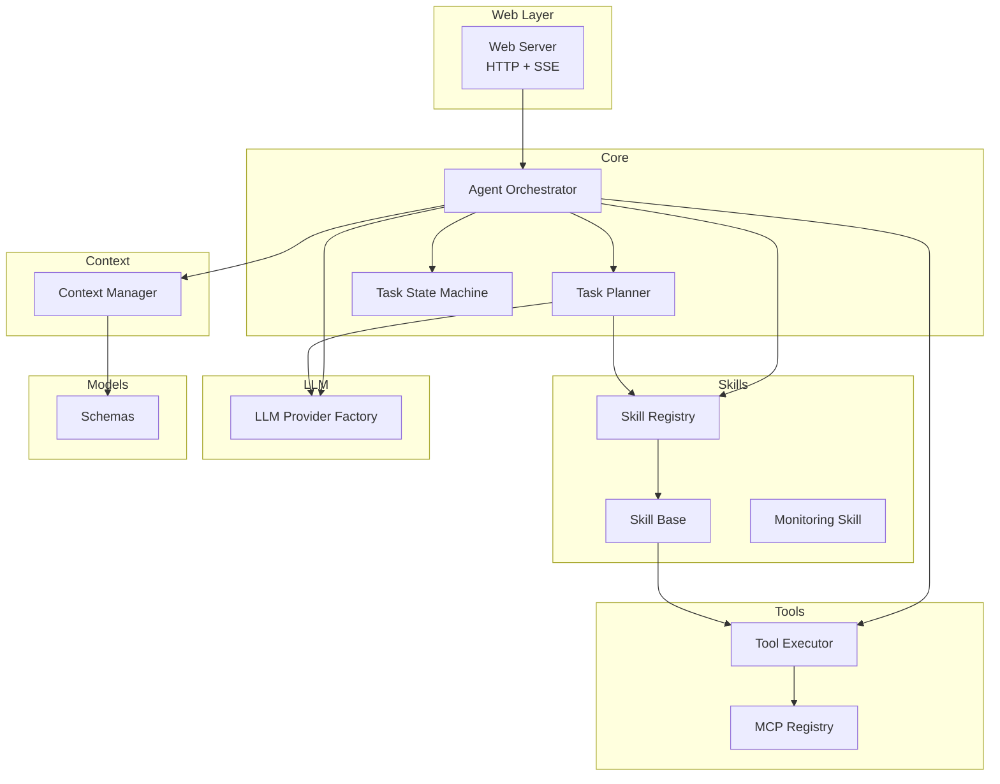
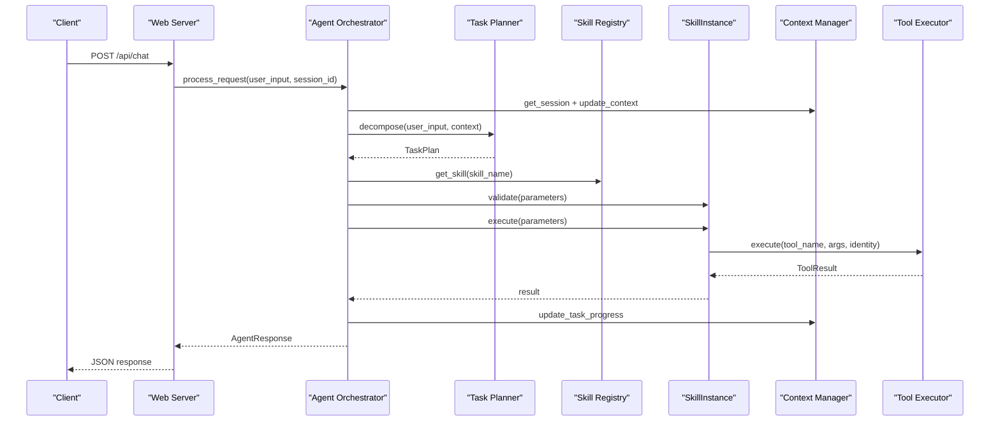
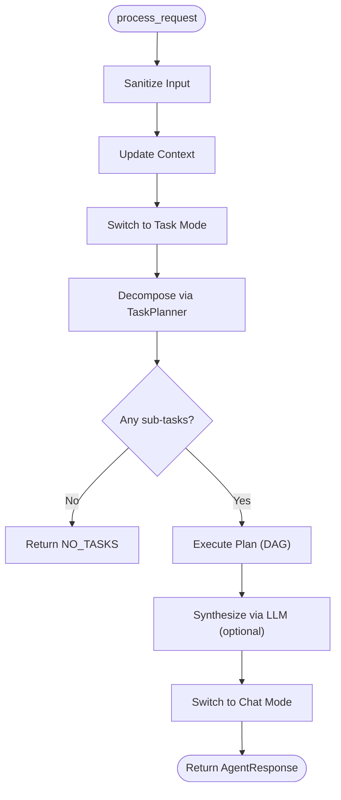
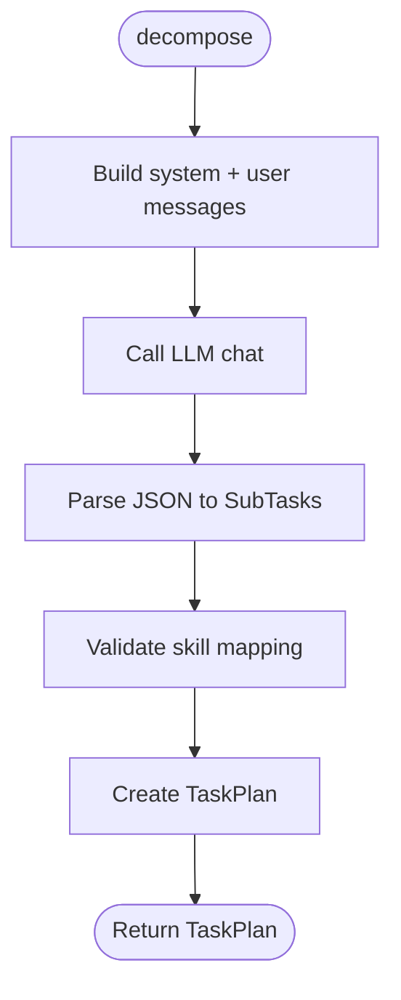
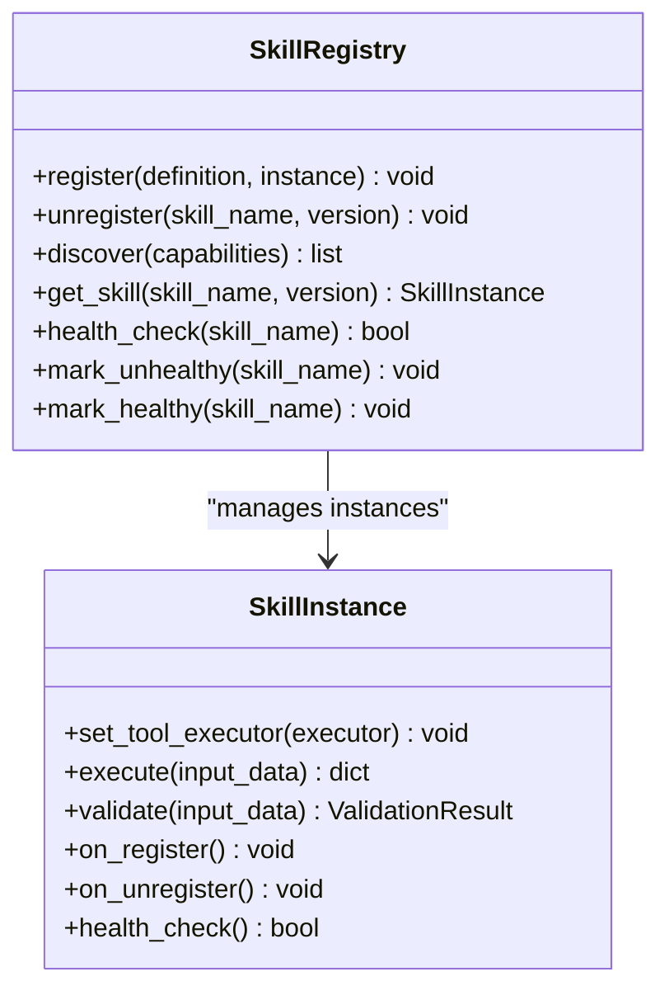
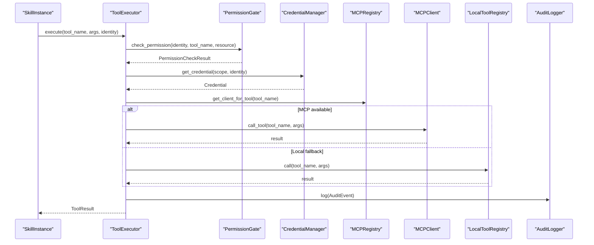
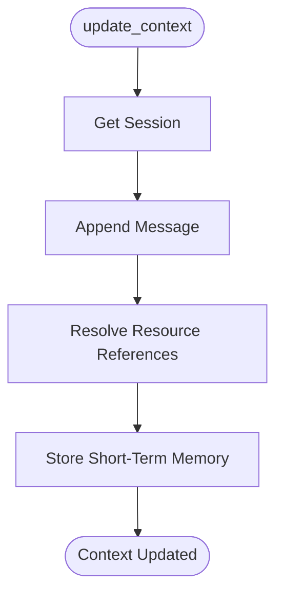
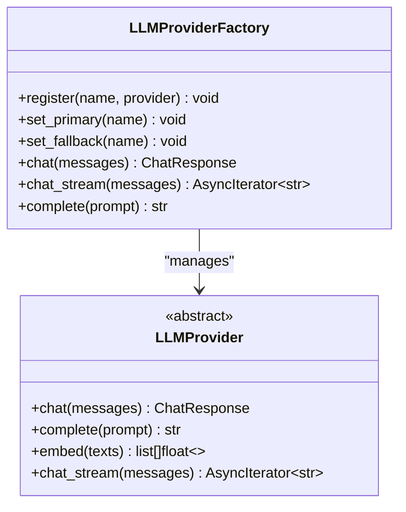
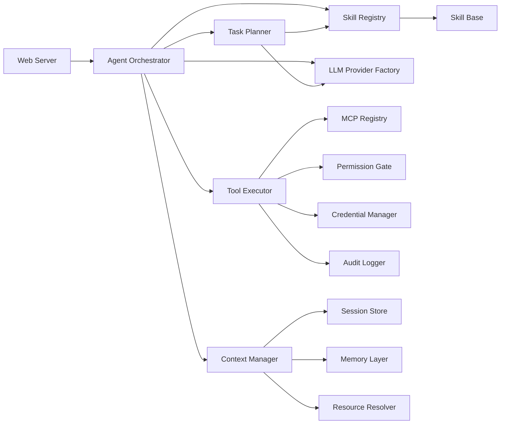

# Component Interactions

<cite>
**Referenced Files in This Document**
- [main.py](file://src/aiops_agent/main.py)
- [orchestrator.py](file://src/aiops_agent/core/orchestrator.py)
- [task_planner.py](file://src/aiops_agent/core/task_planner.py)
- [state_machine.py](file://src/aiops_agent/core/state_machine.py)
- [registry.py](file://src/aiops_agent/skills/registry.py)
- [base.py](file://src/aiops_agent/skills/base.py)
- [monitoring.py](file://src/aiops_agent/skills/monitoring.py)
- [executor.py](file://src/aiops_agent/tools/executor.py)
- [mcp_registry.py](file://src/aiops_agent/tools/mcp_registry.py)
- [manager.py](file://src/aiops_agent/context/manager.py)
- [schemas.py](file://src/aiops_agent/models/schemas.py)
- [provider.py](file://src/aiops_agent/llm/provider.py)
- [server.py](file://src/aiops_agent/web/server.py)
- [settings.yaml](file://config/settings.yaml)
</cite>

## Table of Contents
1. [Introduction](#introduction)
2. [Project Structure](#project-structure)
3. [Core Components](#core-components)
4. [Architecture Overview](#architecture-overview)
5. [Detailed Component Analysis](#detailed-component-analysis)
6. [Dependency Analysis](#dependency-analysis)
7. [Performance Considerations](#performance-considerations)
8. [Troubleshooting Guide](#troubleshooting-guide)
9. [Conclusion](#conclusion)

## Introduction
This document explains the component interactions within the AIOps Agent’s architecture. It focuses on how the Agent Orchestrator coordinates skill execution, manages context state, and handles tool invocations. It documents communication patterns, dependency relationships, data flow, event-driven interactions, plugin architecture, factory methods, registry-based service discovery, interfaces and contracts, error propagation, and state synchronization.

## Project Structure
The system is organized around a modular core with clear separation of concerns:
- Core orchestration and planning
- Skill registry and lifecycle management
- Tool execution with permission gating and auditing
- Context management for sessions and progress
- LLM provider abstraction and factory
- Web server exposing HTTP APIs and SSE streaming
- Configuration and observability

**Diagram sources**
- [server.py:196-227](file://src/aiops_agent/web/server.py#L196-L227)
- [orchestrator.py:47-90](file://src/aiops_agent/core/orchestrator.py#L47-L90)
- [task_planner.py:32-49](file://src/aiops_agent/core/task_planner.py#L32-L49)
- [state_machine.py:26-42](file://src/aiops_agent/core/state_machine.py#L26-L42)
- [registry.py:19-35](file://src/aiops_agent/skills/registry.py#L19-L35)
- [base.py:21-46](file://src/aiops_agent/skills/base.py#L21-L46)
- [monitoring.py:18-42](file://src/aiops_agent/skills/monitoring.py#L18-L42)
- [executor.py:45-75](file://src/aiops_agent/tools/executor.py#L45-L75)
- [mcp_registry.py:20-33](file://src/aiops_agent/tools/mcp_registry.py#L20-L33)
- [manager.py:25-45](file://src/aiops_agent/context/manager.py#L25-L45)
- [provider.py:97-146](file://src/aiops_agent/llm/provider.py#L97-L146)
- [schemas.py:19-51](file://src/aiops_agent/models/schemas.py#L19-L51)

**Section sources**
- [main.py:20-42](file://src/aiops_agent/main.py#L20-L42)
- [server.py:196-227](file://src/aiops_agent/web/server.py#L196-L227)

## Core Components
- Agent Orchestrator: Central coordinator that receives requests, updates context, decomposes tasks, routes to skills, executes in DAG order, and synthesizes final responses.
- Task Planner: Uses LLM to decompose user input into a TaskPlan with SubTasks and dependencies.
- Skill Registry: Manages skill registration, discovery, versioning, and health status.
- Tool Executor: Unified execution layer integrating permission checks, credential acquisition, MCP/local tool dispatch, sanitization, auditing, and retries.
- Context Manager: Maintains session state, resource references, and task progress across modes (Chat/Task/Watch).
- LLM Provider Factory: Abstraction over multiple LLM backends with primary/fallback selection and automatic failover.
- Web Server: Exposes REST endpoints and SSE streaming for chat and skill listings.

**Section sources**
- [orchestrator.py:47-90](file://src/aiops_agent/core/orchestrator.py#L47-L90)
- [task_planner.py:32-49](file://src/aiops_agent/core/task_planner.py#L32-L49)
- [registry.py:19-35](file://src/aiops_agent/skills/registry.py#L19-L35)
- [executor.py:45-75](file://src/aiops_agent/tools/executor.py#L45-L75)
- [manager.py:25-45](file://src/aiops_agent/context/manager.py#L25-L45)
- [provider.py:97-146](file://src/aiops_agent/llm/provider.py#L97-L146)
- [server.py:196-227](file://src/aiops_agent/web/server.py#L196-L227)

## Architecture Overview
The orchestrator composes the system: it initializes and wires components, then orchestrates end-to-end flows. The web server delegates to the orchestrator, which uses the planner to build a DAG of subtasks, resolves skills via the registry, executes via the tool executor, and updates context state.

**Diagram sources**
- [server.py:44-83](file://src/aiops_agent/web/server.py#L44-L83)
- [orchestrator.py:84-198](file://src/aiops_agent/core/orchestrator.py#L84-L198)
- [task_planner.py:50-113](file://src/aiops_agent/core/task_planner.py#L50-L113)
- [registry.py:159-181](file://src/aiops_agent/skills/registry.py#L159-L181)
- [monitoring.py:30-48](file://src/aiops_agent/skills/monitoring.py#L30-L48)
- [executor.py:80-226](file://src/aiops_agent/tools/executor.py#L80-L226)
- [manager.py:58-121](file://src/aiops_agent/context/manager.py#L58-L121)

## Detailed Component Analysis

### Agent Orchestrator
Responsibilities:
- Request processing pipeline: input sanitization, context update, task decomposition, DAG execution, synthesis, and response assembly.
- Streamed execution with SSE events for planning, task start/done, and final completion.
- Health monitoring for skills and metrics recording.
- OpenTelemetry tracing integration.

Key flows:
- Synchronous request: [process_request:84-198](file://src/aiops_agent/core/orchestrator.py#L84-L198)
- Streaming request: [process_request_stream:203-419](file://src/aiops_agent/core/orchestrator.py#L203-L419)
- DAG execution: [execute_plan:424-484](file://src/aiops_agent/core/orchestrator.py#L424-L484)
- Routing to skill: [_route_to_skill:485-532](file://src/aiops_agent/core/orchestrator.py#L485-L532)
- Failure recording and health checks: [_record_skill_failure:571-596](file://src/aiops_agent/core/orchestrator.py#L571-L596)
- Input sanitization: [_sanitize_input:601-646](file://src/aiops_agent/core/orchestrator.py#L601-L646)

**Diagram sources**
- [orchestrator.py:84-198](file://src/aiops_agent/core/orchestrator.py#L84-L198)

**Section sources**
- [orchestrator.py:47-90](file://src/aiops_agent/core/orchestrator.py#L47-L90)
- [orchestrator.py:424-484](file://src/aiops_agent/core/orchestrator.py#L424-L484)
- [orchestrator.py:571-596](file://src/aiops_agent/core/orchestrator.py#L571-L596)

### Task Planner
Responsibilities:
- Build system prompts with available skills and context.
- Call LLM to produce structured subtasks.
- Validate skill mapping and construct TaskPlan.
- Provide topological sorting for DAG execution.

Key methods:
- [decompose:50-113](file://src/aiops_agent/core/task_planner.py#L50-L113)
- [topological_sort:115-150](file://src/aiops_agent/core/task_planner.py#L115-L150)
- [parse_subtasks:156-188](file://src/aiops_agent/core/task_planner.py#L156-L188)
- [validate_skill_mapping:189-207](file://src/aiops_agent/core/task_planner.py#L189-L207)

**Diagram sources**
- [task_planner.py:50-113](file://src/aiops_agent/core/task_planner.py#L50-L113)

**Section sources**
- [task_planner.py:32-49](file://src/aiops_agent/core/task_planner.py#L32-L49)
- [task_planner.py:115-150](file://src/aiops_agent/core/task_planner.py#L115-L150)

### Skill Registry and Plugin Architecture
- Registry-based discovery and routing by capability.
- Version management and default version selection.
- Health status maintenance and automatic marking unhealthy.
- Lifecycle hooks for registration/unregistration.

Key methods:
- [register:41-81](file://src/aiops_agent/skills/registry.py#L41-L81)
- [unregister:82-117](file://src/aiops_agent/skills/registry.py#L82-L117)
- [discover:122-153](file://src/aiops_agent/skills/registry.py#L122-L153)
- [get_skill:159-181](file://src/aiops_agent/skills/registry.py#L159-L181)
- [health_check/mark_unhealthy/mark_healthy:213-251](file://src/aiops_agent/skills/registry.py#L213-L251)

**Diagram sources**
- [registry.py:19-284](file://src/aiops_agent/skills/registry.py#L19-L284)
- [base.py:21-93](file://src/aiops_agent/skills/base.py#L21-L93)

**Section sources**
- [registry.py:19-35](file://src/aiops_agent/skills/registry.py#L19-L35)
- [base.py:21-46](file://src/aiops_agent/skills/base.py#L21-L46)

### Tool Executor and MCP Registry
- Unified execution pipeline: permission gate, credential acquisition, tool dispatch (MCP first, then local), retry/backoff, sanitization, audit logging, tracing.
- MCP registry maintains server-client mappings and auto-discovers tools from configuration.

Key methods:
- [ToolExecutor.execute:80-226](file://src/aiops_agent/tools/executor.py#L80-L226)
- [ToolExecutor._execute_with_retry:231-275](file://src/aiops_agent/tools/executor.py#L231-L275)
- [ToolExecutor._dispatch_tool:276-295](file://src/aiops_agent/tools/executor.py#L276-L295)
- [MCPRegistry.register/unregister/load_from_config:38-153](file://src/aiops_agent/tools/mcp_registry.py#L38-L153)

**Diagram sources**
- [executor.py:80-226](file://src/aiops_agent/tools/executor.py#L80-L226)
- [mcp_registry.py:38-113](file://src/aiops_agent/tools/mcp_registry.py#L38-L113)

**Section sources**
- [executor.py:45-75](file://src/aiops_agent/tools/executor.py#L45-L75)
- [mcp_registry.py:20-33](file://src/aiops_agent/tools/mcp_registry.py#L20-L33)

### Context Manager
- Session storage, memory layer, and resource resolver integration.
- Mode switching (CHAT/TASK/WATCH) with progress tracking.
- Automatic resource reference resolution from messages.

Key methods:
- [get_session/update_context/switch_mode:50-121](file://src/aiops_agent/context/manager.py#L50-L121)
- [update_task_progress/pause_task/cancel_task:127-168](file://src/aiops_agent/context/manager.py#L127-L168)

**Diagram sources**
- [manager.py:58-88](file://src/aiops_agent/context/manager.py#L58-L88)

**Section sources**
- [manager.py:25-45](file://src/aiops_agent/context/manager.py#L25-L45)

### LLM Provider Factory
- Abstraction over multiple LLM backends with primary/fallback selection.
- Automatic failover on failures; supports stream and non-stream chat.

Key methods:
- [LLMProviderFactory.chat/chat_stream/complete:147-233](file://src/aiops_agent/llm/provider.py#L147-L233)

**Diagram sources**
- [provider.py:31-95](file://src/aiops_agent/llm/provider.py#L31-L95)
- [provider.py:97-146](file://src/aiops_agent/llm/provider.py#L97-L146)

**Section sources**
- [provider.py:97-146](file://src/aiops_agent/llm/provider.py#L97-L146)

### Web Server and Streaming
- REST endpoints for chat and skills.
- SSE streaming for long-running orchestration with typed events.

Key handlers:
- [handle_chat:44-83](file://src/aiops_agent/web/server.py#L44-L83)
- [handle_chat_stream:85-135](file://src/aiops_agent/web/server.py#L85-L135)
- [handle_skills:148-171](file://src/aiops_agent/web/server.py#L148-L171)

**Section sources**
- [server.py:196-227](file://src/aiops_agent/web/server.py#L196-L227)

## Dependency Analysis
High-level dependencies:
- Orchestrator depends on Planner, Registry, Context, ToolExecutor, LLMFactory, Metrics, SecurityGuard.
- Planner depends on LLMFactory and Registry.
- ToolExecutor depends on PermissionGate, CredentialManager, AuditLogger, MCPRegistry, LocalToolRegistry.
- Registry depends on SkillInstance base class.
- Context Manager depends on SessionStore, MemoryLayer, ResourceResolver.
- Web Server depends on Orchestrator.

**Diagram sources**
- [main.py:20-42](file://src/aiops_agent/main.py#L20-L42)
- [orchestrator.py:17-38](file://src/aiops_agent/core/orchestrator.py#L17-L38)
- [task_planner.py:14-16](file://src/aiops_agent/core/task_planner.py#L14-L16)
- [executor.py:28-35](file://src/aiops_agent/tools/executor.py#L28-L35)
- [registry.py:13-14](file://src/aiops_agent/skills/registry.py#L13-L14)
- [manager.py:12-14](file://src/aiops_agent/context/manager.py#L12-L14)

**Section sources**
- [main.py:20-42](file://src/aiops_agent/main.py#L20-L42)
- [orchestrator.py:17-38](file://src/aiops_agent/core/orchestrator.py#L17-L38)

## Performance Considerations
- Concurrency: Orchestrator uses a semaphore to cap concurrent subtasks during DAG execution.
- Retries and timeouts: ToolExecutor applies exponential backoff and configurable timeouts.
- Parallelism: Planner’s topological levels enable parallel execution of independent tasks.
- Observability: Tracing and metrics are integrated across components.

Recommendations:
- Tune orchestrator.max_parallel_subtasks and tool timeouts based on backend SLAs.
- Monitor skill failure thresholds and health checks to prevent cascading failures.
- Use streaming responses for long-running tasks to improve UX.

**Section sources**
- [orchestrator.py:451-460](file://src/aiops_agent/core/orchestrator.py#L451-L460)
- [executor.py:39-43](file://src/aiops_agent/tools/executor.py#L39-L43)
- [settings.yaml:56-61](file://config/settings.yaml#L56-L61)

## Troubleshooting Guide
Common issues and handling:
- Input validation failures: Orchestrator sanitizes input and raises structured errors.
- Skill not found: Orchestrator reports available skills and suggests alternatives.
- Tool execution errors: ToolExecutor records audit events and propagates exceptions.
- Permission denied: PermissionGate denies with detailed reasons.
- MCP tool missing: ToolExecutor falls back to local tools or raises a clear error.

Key locations:
- Input sanitization: [sanitize_input:601-646](file://src/aiops_agent/core/orchestrator.py#L601-L646)
- Skill not found response: [process_request unmapped tasks:136-146](file://src/aiops_agent/core/orchestrator.py#L136-L146)
- Tool execution error handling: [execute try/except blocks:169-201](file://src/aiops_agent/tools/executor.py#L169-L201)
- Permission denial: [PermissionDeniedError:129-133](file://src/aiops_agent/tools/executor.py#L129-L133)
- MCP/local fallback: [_dispatch_tool:276-295](file://src/aiops_agent/tools/executor.py#L276-L295)

**Section sources**
- [orchestrator.py:601-646](file://src/aiops_agent/core/orchestrator.py#L601-L646)
- [executor.py:169-201](file://src/aiops_agent/tools/executor.py#L169-L201)

## Conclusion
The AIOps Agent employs a robust, modular architecture centered on the Agent Orchestrator. It integrates LLM-driven task decomposition, registry-managed skills, unified tool execution with strong security and observability, and context-aware session management. The design emphasizes plugin-style extensibility, factory-based provider selection, and registry-based discovery, enabling scalable and maintainable operations across diverse AIOps scenarios.