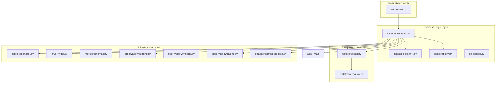
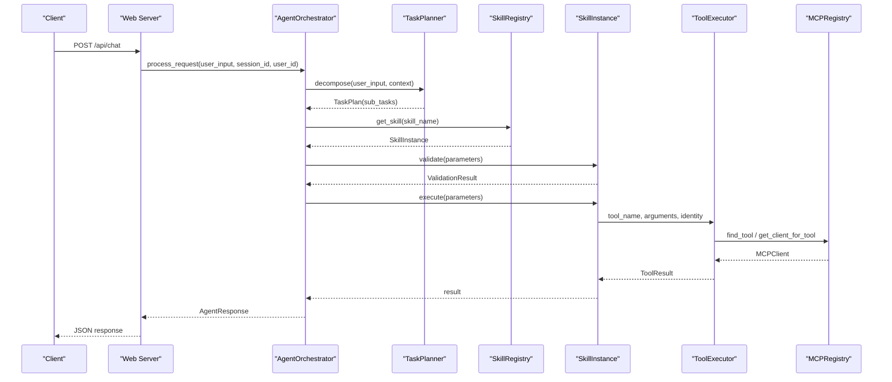
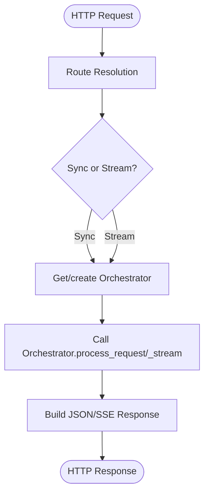
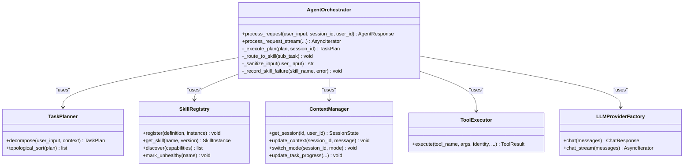
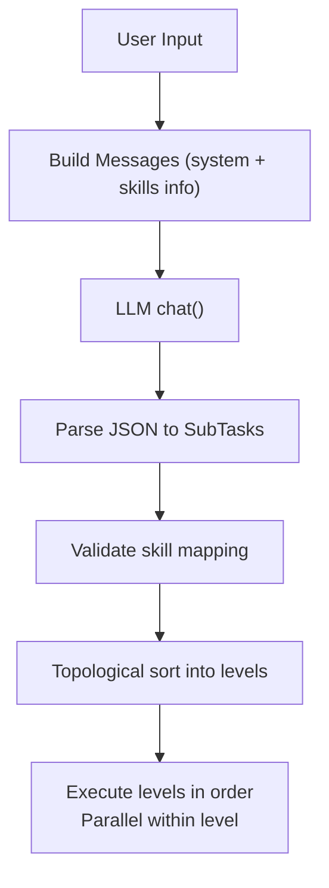
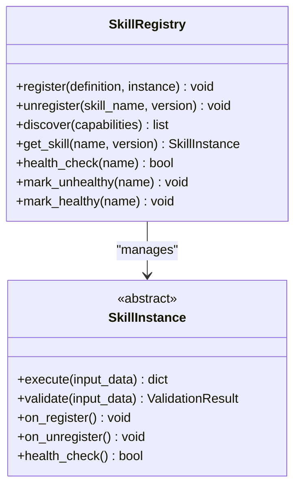
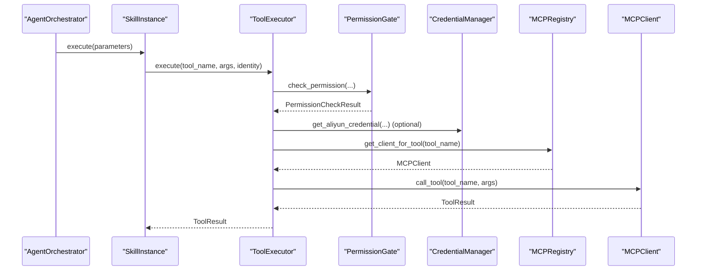
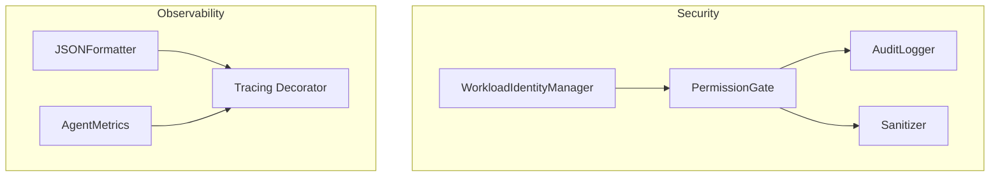
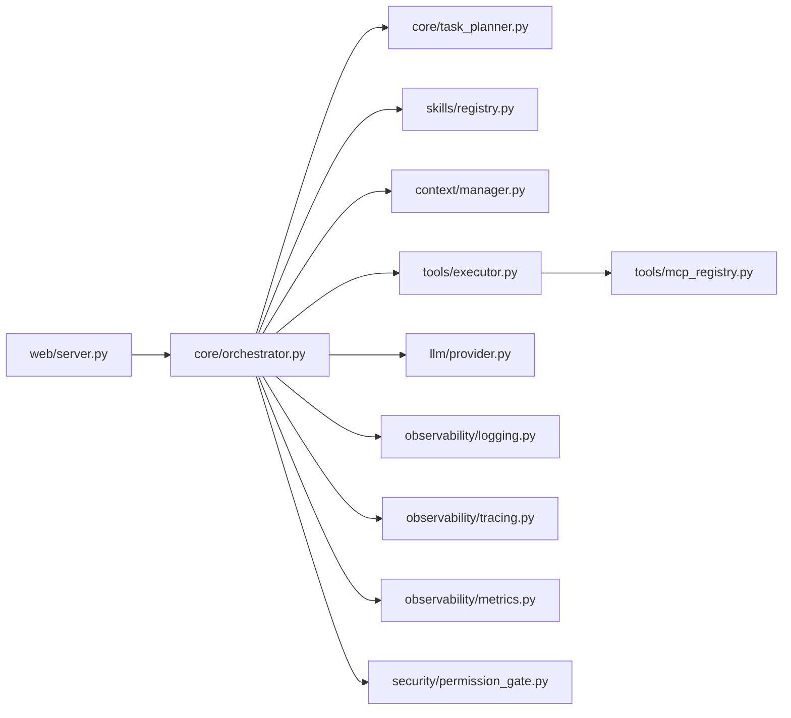

# Layered Architecture Patterns

<cite>
**Referenced Files in This Document**
- [src/aiops_agent/main.py](file://src/aiops_agent/main.py)
- [src/aiops_agent/web/server.py](file://src/aiops_agent/web/server.py)
- [src/aiops_agent/core/orchestrator.py](file://src/aiops_agent/core/orchestrator.py)
- [src/aiops_agent/core/task_planner.py](file://src/aiops_agent/core/task_planner.py)
- [src/aiops_agent/skills/registry.py](file://src/aiops_agent/skills/registry.py)
- [src/aiops_agent/skills/base.py](file://src/aiops_agent/skills/base.py)
- [src/aiops_agent/tools/executor.py](file://src/aiops_agent/tools/executor.py)
- [src/aiops_agent/tools/mcp_registry.py](file://src/aiops_agent/tools/mcp_registry.py)
- [src/aiops_agent/context/manager.py](file://src/aiops_agent/context/manager.py)
- [src/aiops_agent/llm/provider.py](file://src/aiops_agent/llm/provider.py)
- [src/aiops_agent/models/schemas.py](file://src/aiops_agent/models/schemas.py)
- [src/aiops_agent/observability/logging.py](file://src/aiops_agent/observability/logging.py)
- [src/aiops_agent/observability/metrics.py](file://src/aiops_agent/observability/metrics.py)
- [src/aiops_agent/observability/tracing.py](file://src/aiops_agent/observability/tracing.py)
- [src/aiops_agent/security/permission_gate.py](file://src/aiops_agent/security/permission_gate.py)
</cite>

## Table of Contents
1. [Introduction](#introduction)
2. [Project Structure](#project-structure)
3. [Core Components](#core-components)
4. [Architecture Overview](#architecture-overview)
5. [Detailed Component Analysis](#detailed-component-analysis)
6. [Dependency Analysis](#dependency-analysis)
7. [Performance Considerations](#performance-considerations)
8. [Troubleshooting Guide](#troubleshooting-guide)
9. [Conclusion](#conclusion)

## Introduction
This document explains the layered architecture used by the AIOps Agent, focusing on four main layers:
- Presentation Layer: aiohttp web server exposing REST APIs and serving a frontend.
- Business Logic Layer: Agent Orchestrator, Task Planner, and Skills.
- Integration Layer: MCP servers and cloud services via ToolExecutor and MCPRegistry.
- Infrastructure Layer: Security (RBAC, Workload Identity, auditing) and Observability (logging, metrics, tracing).

We describe how each layer encapsulates responsibilities, maintains separation of concerns, and communicates with adjacent layers. We also detail the architectural patterns implemented: Orchestrator pattern, Registry pattern, Factory pattern, and Observer-like health monitoring. Cross-cutting concerns are addressed through dependency inversion and modular design to support testability and extensibility.

## Project Structure
The codebase follows a feature-oriented package layout under src/aiops_agent with clear boundaries:
- web/: HTTP server and routes
- core/: orchestration, planning, state machine
- skills/: skill registry, base skill interface, and skill implementations
- tools/: unified tool execution, MCP registry/client, and local tools
- context/: session, memory, and resource resolution
- llm/: provider abstraction and factories
- models/: shared Pydantic schemas
- observability/: logging, metrics, tracing
- security/: permission gate, identity, audit, sanitization

**Diagram sources**
- [src/aiops_agent/web/server.py:196-227](file://src/aiops_agent/web/server.py#L196-L227)
- [src/aiops_agent/core/orchestrator.py:47-220](file://src/aiops_agent/core/orchestrator.py#L47-L220)
- [src/aiops_agent/core/task_planner.py:32-114](file://src/aiops_agent/core/task_planner.py#L32-L114)
- [src/aiops_agent/skills/registry.py:19-81](file://src/aiops_agent/skills/registry.py#L19-L81)
- [src/aiops_agent/tools/executor.py:45-106](file://src/aiops_agent/tools/executor.py#L45-L106)
- [src/aiops_agent/tools/mcp_registry.py:20-70](file://src/aiops_agent/tools/mcp_registry.py#L20-L70)
- [src/aiops_agent/context/manager.py:25-45](file://src/aiops_agent/context/manager.py#L25-L45)
- [src/aiops_agent/llm/provider.py:97-146](file://src/aiops_agent/llm/provider.py#L97-L146)
- [src/aiops_agent/models/schemas.py:14-82](file://src/aiops_agent/models/schemas.py#L14-L82)
- [src/aiops_agent/observability/logging.py:60-111](file://src/aiops_agent/observability/logging.py#L60-L111)
- [src/aiops_agent/observability/metrics.py:26-106](file://src/aiops_agent/observability/metrics.py#L26-L106)
- [src/aiops_agent/observability/tracing.py:32-88](file://src/aiops_agent/observability/tracing.py#L32-L88)
- [src/aiops_agent/security/permission_gate.py:57-101](file://src/aiops_agent/security/permission_gate.py#L57-L101)

**Section sources**
- [src/aiops_agent/main.py:70-222](file://src/aiops_agent/main.py#L70-L222)
- [src/aiops_agent/web/server.py:196-227](file://src/aiops_agent/web/server.py#L196-L227)

## Core Components
This section summarizes the responsibilities and interactions of the core components across layers.

- Presentation Layer (aiohttp)
  - Exposes REST endpoints and serves a static frontend.
  - Delegates request handling to the Agent Orchestrator.
  - Provides health/ready checks and skills listing.

- Business Logic Layer
  - Agent Orchestrator: central coordinator receiving requests, invoking LLM for decomposition, routing tasks to skills, managing progress, and generating summaries.
  - Task Planner: converts natural language into a DAG of SubTasks using LLM and validates skill availability.
  - Skill Registry: manages skill registration, discovery, health, and default version selection.
  - Skill Base: defines the SkillInstance contract and lifecycle hooks.

- Integration Layer
  - ToolExecutor: unified execution pipeline enforcing permissions, acquiring credentials, dispatching to MCP or local tools, retry/backoff, sanitization, and audit logging.
  - MCPRegistry: dynamic registration/discovery of MCP servers and mapping tools to servers.

- Infrastructure Layer
  - Context Manager: session/state management, memory, resource resolution, and task progress tracking.
  - LLM Provider Factory: abstraction over multiple LLM providers with primary/fallback selection and automatic failover.
  - Observability: structured logging, metrics, and tracing; integrates OpenTelemetry spans and attributes.
  - Security: PermissionGate for RBAC and resource ARN matching, Workload Identity integration, audit logging, and input sanitization.

**Section sources**
- [src/aiops_agent/web/server.py:44-146](file://src/aiops_agent/web/server.py#L44-L146)
- [src/aiops_agent/core/orchestrator.py:47-198](file://src/aiops_agent/core/orchestrator.py#L47-L198)
- [src/aiops_agent/core/task_planner.py:32-114](file://src/aiops_agent/core/task_planner.py#L32-L114)
- [src/aiops_agent/skills/registry.py:19-81](file://src/aiops_agent/skills/registry.py#L19-L81)
- [src/aiops_agent/skills/base.py:21-93](file://src/aiops_agent/skills/base.py#L21-L93)
- [src/aiops_agent/tools/executor.py:45-106](file://src/aiops_agent/tools/executor.py#L45-L106)
- [src/aiops_agent/tools/mcp_registry.py:20-70](file://src/aiops_agent/tools/mcp_registry.py#L20-L70)
- [src/aiops_agent/context/manager.py:25-45](file://src/aiops_agent/context/manager.py#L25-L45)
- [src/aiops_agent/llm/provider.py:97-146](file://src/aiops_agent/llm/provider.py#L97-L146)
- [src/aiops_agent/observability/logging.py:60-111](file://src/aiops_agent/observability/logging.py#L60-L111)
- [src/aiops_agent/observability/metrics.py:26-106](file://src/aiops_agent/observability/metrics.py#L26-L106)
- [src/aiops_agent/observability/tracing.py:32-88](file://src/aiops_agent/observability/tracing.py#L32-L88)
- [src/aiops_agent/security/permission_gate.py:57-101](file://src/aiops_agent/security/permission_gate.py#L57-L101)

## Architecture Overview
The system is a layered pipeline:
- Presentation Layer receives HTTP requests and delegates to the Orchestrator.
- Orchestrator coordinates Task Planning, Skill Routing, and Execution.
- Tools are executed through ToolExecutor, which enforces security and resolves MCP/local targets.
- Observability and Security are cross-cutting concerns applied at each layer boundary.

**Diagram sources**
- [src/aiops_agent/web/server.py:44-82](file://src/aiops_agent/web/server.py#L44-L82)
- [src/aiops_agent/core/orchestrator.py:84-198](file://src/aiops_agent/core/orchestrator.py#L84-L198)
- [src/aiops_agent/core/task_planner.py:50-114](file://src/aiops_agent/core/task_planner.py#L50-L114)
- [src/aiops_agent/skills/registry.py:159-182](file://src/aiops_agent/skills/registry.py#L159-L182)
- [src/aiops_agent/tools/executor.py:80-106](file://src/aiops_agent/tools/executor.py#L80-L106)
- [src/aiops_agent/tools/mcp_registry.py:95-112](file://src/aiops_agent/tools/mcp_registry.py#L95-L112)

## Detailed Component Analysis

### Presentation Layer: aiohttp Web Server
Responsibilities:
- Define routes for chat, skills listing, health/ready checks, and serve static assets.
- Initialize the Agent Orchestrator lazily on first request.
- Stream responses via Server-Sent Events for long-running tasks.

Key interactions:
- Routes delegate to Orchestrator’s synchronous and streaming handlers.
- Uses JSON serialization helpers and handles malformed JSON gracefully.

**Diagram sources**
- [src/aiops_agent/web/server.py:44-146](file://src/aiops_agent/web/server.py#L44-L146)

**Section sources**
- [src/aiops_agent/web/server.py:196-227](file://src/aiops_agent/web/server.py#L196-L227)

### Business Logic Layer: Orchestrator Pattern
Responsibilities:
- Accept user requests, sanitize input, update context, switch to task mode, decompose via LLM, execute tasks in DAG order with parallelism, and summarize outcomes.
- Enforce security via input sanitization and health monitoring for skills.
- Track progress and emit structured telemetry.

Architectural pattern: Orchestrator
- Central coordination point that composes other subsystems (planner, registry, executor, context, metrics, tracing).
- Applies dependency inversion by accepting abstractions (LLMFactory, SkillRegistry, ToolExecutor).

**Diagram sources**
- [src/aiops_agent/core/orchestrator.py:47-198](file://src/aiops_agent/core/orchestrator.py#L47-L198)
- [src/aiops_agent/core/task_planner.py:32-114](file://src/aiops_agent/core/task_planner.py#L32-L114)
- [src/aiops_agent/skills/registry.py:19-81](file://src/aiops_agent/skills/registry.py#L19-L81)
- [src/aiops_agent/context/manager.py:25-45](file://src/aiops_agent/context/manager.py#L25-L45)
- [src/aiops_agent/tools/executor.py:45-106](file://src/aiops_agent/tools/executor.py#L45-L106)
- [src/aiops_agent/llm/provider.py:97-146](file://src/aiops_agent/llm/provider.py#L97-L146)

**Section sources**
- [src/aiops_agent/core/orchestrator.py:47-198](file://src/aiops_agent/core/orchestrator.py#L47-L198)

### Business Logic Layer: Task Planner and DAG Execution
Responsibilities:
- Convert natural language into a TaskPlan with SubTasks and dependencies.
- Build a DAG and perform topological sorting to determine execution order.
- Validate skill mapping and mark unmappable tasks as failed.

**Diagram sources**
- [src/aiops_agent/core/task_planner.py:50-151](file://src/aiops_agent/core/task_planner.py#L50-L151)

**Section sources**
- [src/aiops_agent/core/task_planner.py:32-151](file://src/aiops_agent/core/task_planner.py#L32-L151)

### Business Logic Layer: Skill Registry Pattern
Responsibilities:
- Register/unregister skills with validation and uniqueness checks.
- Discover skills by capability overlap and default to latest healthy version.
- Health management: mark unhealthy, recover, and expose health status.

**Diagram sources**
- [src/aiops_agent/skills/registry.py:19-81](file://src/aiops_agent/skills/registry.py#L19-L81)
- [src/aiops_agent/skills/base.py:21-93](file://src/aiops_agent/skills/base.py#L21-L93)

**Section sources**
- [src/aiops_agent/skills/registry.py:19-284](file://src/aiops_agent/skills/registry.py#L19-L284)
- [src/aiops_agent/skills/base.py:21-93](file://src/aiops_agent/skills/base.py#L21-L93)

### Integration Layer: ToolExecutor and MCP Registry
Responsibilities:
- Unified tool execution pipeline: permission check, credential acquisition, dispatch to MCP or local tool, retry/backoff, sanitization, audit logging, and tracing.
- MCPRegistry: dynamic registration of MCP servers, tool discovery, and mapping tool names to clients.

**Diagram sources**
- [src/aiops_agent/tools/executor.py:80-106](file://src/aiops_agent/tools/executor.py#L80-L106)
- [src/aiops_agent/security/permission_gate.py:95-182](file://src/aiops_agent/security/permission_gate.py#L95-L182)
- [src/aiops_agent/tools/mcp_registry.py:95-112](file://src/aiops_agent/tools/mcp_registry.py#L95-L112)

**Section sources**
- [src/aiops_agent/tools/executor.py:45-202](file://src/aiops_agent/tools/executor.py#L45-L202)
- [src/aiops_agent/tools/mcp_registry.py:20-117](file://src/aiops_agent/tools/mcp_registry.py#L20-L117)

### Infrastructure Layer: Security and Observability
Responsibilities:
- Security: RBAC via PermissionGate, Workload Identity integration, audit logging, input sanitization, and security rule enforcement.
- Observability: structured logging with trace/span IDs, metrics counters/histograms, and tracing spans with decorators.

**Diagram sources**
- [src/aiops_agent/security/permission_gate.py:57-101](file://src/aiops_agent/security/permission_gate.py#L57-L101)
- [src/aiops_agent/observability/logging.py:18-58](file://src/aiops_agent/observability/logging.py#L18-L58)
- [src/aiops_agent/observability/metrics.py:26-106](file://src/aiops_agent/observability/metrics.py#L26-L106)
- [src/aiops_agent/observability/tracing.py:98-137](file://src/aiops_agent/observability/tracing.py#L98-L137)

**Section sources**
- [src/aiops_agent/observability/logging.py:60-111](file://src/aiops_agent/observability/logging.py#L60-L111)
- [src/aiops_agent/observability/metrics.py:26-106](file://src/aiops_agent/observability/metrics.py#L26-L106)
- [src/aiops_agent/observability/tracing.py:32-88](file://src/aiops_agent/observability/tracing.py#L32-L88)
- [src/aiops_agent/security/permission_gate.py:57-101](file://src/aiops_agent/security/permission_gate.py#L57-L101)

## Dependency Analysis
The system exhibits strong separation of concerns and low coupling between layers:
- Presentation depends on Orchestrator only.
- Orchestrator depends on abstractions (LLMFactory, SkillRegistry, ToolExecutor, ContextManager).
- Integration depends on Registry abstractions and schemas.
- Infrastructure components are injected and used via composition.

**Diagram sources**
- [src/aiops_agent/web/server.py:196-227](file://src/aiops_agent/web/server.py#L196-L227)
- [src/aiops_agent/core/orchestrator.py:47-198](file://src/aiops_agent/core/orchestrator.py#L47-L198)
- [src/aiops_agent/core/task_planner.py:32-114](file://src/aiops_agent/core/task_planner.py#L32-L114)
- [src/aiops_agent/skills/registry.py:19-81](file://src/aiops_agent/skills/registry.py#L19-L81)
- [src/aiops_agent/context/manager.py:25-45](file://src/aiops_agent/context/manager.py#L25-L45)
- [src/aiops_agent/tools/executor.py:45-106](file://src/aiops_agent/tools/executor.py#L45-L106)
- [src/aiops_agent/tools/mcp_registry.py:20-70](file://src/aiops_agent/tools/mcp_registry.py#L20-L70)
- [src/aiops_agent/llm/provider.py:97-146](file://src/aiops_agent/llm/provider.py#L97-L146)
- [src/aiops_agent/observability/logging.py:60-111](file://src/aiops_agent/observability/logging.py#L60-L111)
- [src/aiops_agent/observability/tracing.py:32-88](file://src/aiops_agent/observability/tracing.py#L32-L88)
- [src/aiops_agent/observability/metrics.py:26-106](file://src/aiops_agent/observability/metrics.py#L26-L106)
- [src/aiops_agent/security/permission_gate.py:57-101](file://src/aiops_agent/security/permission_gate.py#L57-L101)

**Section sources**
- [src/aiops_agent/main.py:70-222](file://src/aiops_agent/main.py#L70-L222)

## Performance Considerations
- Concurrency and Parallelism
  - Orchestrator executes tasks per DAG level with bounded concurrency to avoid overload.
  - ToolExecutor applies exponential backoff and timeouts to improve resilience.
- Observability-Driven Tuning
  - Metrics track task durations and statuses; tracing annotates spans with attributes for latency analysis.
- LLM Resilience
  - Provider Factory supports primary/fallback switching to mitigate provider outages.
- Input Sanitization and Security Checks
  - Early detection of injection attempts reduces downstream failures.

[No sources needed since this section provides general guidance]

## Troubleshooting Guide
Common issues and diagnostics:
- Permission Denied
  - Symptom: Tool execution fails with denied result.
  - Action: Inspect PermissionGate logs and required permissions; verify Workload Identity and RAM policies.
- Tool Not Found
  - Symptom: “Tool not registered” error.
  - Action: Confirm MCPRegistry loaded tools and Skill’s tool dependencies; check ToolExecutor dispatch logic.
- Skill Unhealthy
  - Symptom: Repeated failures lead to skill marked unhealthy.
  - Action: Use SkillRegistry health APIs; inspect Orchestrator’s failure recording window and threshold.
- Observability
  - Use structured logs with trace/span IDs; review metrics and traces for bottlenecks.

**Section sources**
- [src/aiops_agent/tools/executor.py:169-202](file://src/aiops_agent/tools/executor.py#L169-L202)
- [src/aiops_agent/tools/mcp_registry.py:122-153](file://src/aiops_agent/tools/mcp_registry.py#L122-L153)
- [src/aiops_agent/core/orchestrator.py:571-596](file://src/aiops_agent/core/orchestrator.py#L571-L596)
- [src/aiops_agent/observability/logging.py:30-58](file://src/aiops_agent/observability/logging.py#L30-L58)
- [src/aiops_agent/observability/metrics.py:81-106](file://src/aiops_agent/observability/metrics.py#L81-L106)
- [src/aiops_agent/observability/tracing.py:98-137](file://src/aiops_agent/observability/tracing.py#L98-L137)

## Conclusion
The AIOps Agent employs a clean layered architecture:
- Presentation Layer focuses on HTTP and SSE.
- Business Logic Layer coordinates planning, routing, and execution via the Orchestrator pattern.
- Integration Layer abstracts tool execution and MCP connectivity.
- Infrastructure Layer ensures security and observability through cross-cutting modules.

Patterns such as Registry, Factory, Orchestrator, and health monitoring enable modularity, testability, and resilience. Dependency inversion and schema-driven contracts further strengthen maintainability and extensibility.