# Request Processing Flow

<cite>
**Referenced Files in This Document**
- [server.py](file://src/aiops_agent/web/server.py)
- [main.py](file://src/aiops_agent/main.py)
- [orchestrator.py](file://src/aiops_agent/core/orchestrator.py)
- [task_planner.py](file://src/aiops_agent/core/task_planner.py)
- [manager.py](file://src/aiops_agent/context/manager.py)
- [executor.py](file://src/aiops_agent/tools/executor.py)
- [provider.py](file://src/aiops_agent/llm/provider.py)
- [schemas.py](file://src/aiops_agent/models/schemas.py)
- [registry.py](file://src/aiops_agent/skills/registry.py)
- [base.py](file://src/aiops_agent/skills/base.py)
- [state_machine.py](file://src/aiops_agent/core/state_machine.py)
- [security_guard.py](file://src/aiops_agent/security/security_guard.py)
- [sanitizer.py](file://src/aiops_agent/security/sanitizer.py)
- [exceptions.py](file://src/aiops_agent/core/exceptions.py)
</cite>

## Table of Contents
1. [Introduction](#introduction)
2. [Project Structure](#project-structure)
3. [Core Components](#core-components)
4. [Architecture Overview](#architecture-overview)
5. [Detailed Component Analysis](#detailed-component-analysis)
6. [Dependency Analysis](#dependency-analysis)
7. [Performance Considerations](#performance-considerations)
8. [Troubleshooting Guide](#troubleshooting-guide)
9. [Conclusion](#conclusion)

## Introduction
This document explains the end-to-end request processing flow in the AIOps Agent, from HTTP request reception through the web server to final response delivery. It covers input sanitization, context management, skill selection, task planning, tool execution, and response streaming. It also documents error handling, timeout management, and graceful degradation, and clarifies the roles and coordination among components via the orchestrator.

## Project Structure
The request processing pipeline spans several modules:
- Web server exposes HTTP endpoints and SSE streaming.
- Orchestrator coordinates request lifecycle, context, planning, routing, and telemetry.
- Task planner builds a DAG of subtasks from natural language requests.
- Context manager maintains session state, resources, and progress.
- Tool executor enforces permissions, credentials, retries, and audits.
- LLM provider factory selects and falls back among providers.
- Skill registry manages skills and health.
- Security guard and sanitizer protect against threats and sanitize data.
- Models define shared data structures and enums.

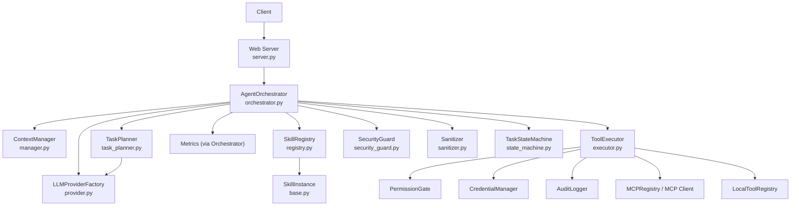

**Diagram sources**
- [server.py:44-135](file://src/aiops_agent/web/server.py#L44-L135)
- [orchestrator.py:84-418](file://src/aiops_agent/core/orchestrator.py#L84-L418)
- [task_planner.py:50-113](file://src/aiops_agent/core/task_planner.py#L50-L113)
- [manager.py:50-121](file://src/aiops_agent/context/manager.py#L50-L121)
- [executor.py:80-226](file://src/aiops_agent/tools/executor.py#L80-L226)
- [provider.py:147-209](file://src/aiops_agent/llm/provider.py#L147-L209)
- [registry.py:159-181](file://src/aiops_agent/skills/registry.py#L159-L181)
- [base.py:47-72](file://src/aiops_agent/skills/base.py#L47-L72)
- [security_guard.py:64-122](file://src/aiops_agent/security/security_guard.py#L64-L122)
- [sanitizer.py:39-79](file://src/aiops_agent/security/sanitizer.py#L39-L79)
- [state_machine.py:51-79](file://src/aiops_agent/core/state_machine.py#L51-L79)

**Section sources**
- [server.py:196-227](file://src/aiops_agent/web/server.py#L196-L227)
- [main.py:70-222](file://src/aiops_agent/main.py#L70-L222)

## Core Components
- Web Server: Parses JSON, validates minimal inputs, delegates to orchestrator, and streams SSE events for real-time feedback.
- Agent Orchestrator: Central coordinator that sanitizes input, updates context, switches modes, plans tasks, executes DAG, synthesizes final summary via LLM, and handles errors and metrics.
- Task Planner: Uses LLM to decompose user intent into a DAG of SubTasks with dependencies.
- Context Manager: Manages sessions, messages, resource references, and task progress.
- Tool Executor: Enforces permissions, acquires credentials, dispatches to MCP or local tools, applies retries and timeouts, sanitizes outputs, and logs audits.
- LLM Provider Factory: Provides unified chat and stream APIs with primary/fallback fallback.
- Skill Registry: Registers skills, routes by capability, tracks health, and marks unhealthy ones.
- Security Guard and Sanitizer: Enforce safety rules and sanitize sensitive fields.
- Models: Define shared types for tasks, responses, identities, and audit events.

**Section sources**
- [server.py:44-135](file://src/aiops_agent/web/server.py#L44-L135)
- [orchestrator.py:84-418](file://src/aiops_agent/core/orchestrator.py#L84-L418)
- [task_planner.py:50-113](file://src/aiops_agent/core/task_planner.py#L50-L113)
- [manager.py:50-121](file://src/aiops_agent/context/manager.py#L50-L121)
- [executor.py:80-226](file://src/aiops_agent/tools/executor.py#L80-L226)
- [provider.py:147-209](file://src/aiops_agent/llm/provider.py#L147-L209)
- [registry.py:159-181](file://src/aiops_agent/skills/registry.py#L159-L181)
- [security_guard.py:64-122](file://src/aiops_agent/security/security_guard.py#L64-L122)
- [sanitizer.py:39-79](file://src/aiops_agent/security/sanitizer.py#L39-L79)
- [schemas.py:19-82](file://src/aiops_agent/models/schemas.py#L19-L82)

## Architecture Overview
The orchestrator is the central hub. It receives sanitized input, updates context, switches to task mode, asks the planner to build a DAG, executes tasks in topological order with concurrency limits, and finally synthesizes a human-readable summary via LLM streaming.

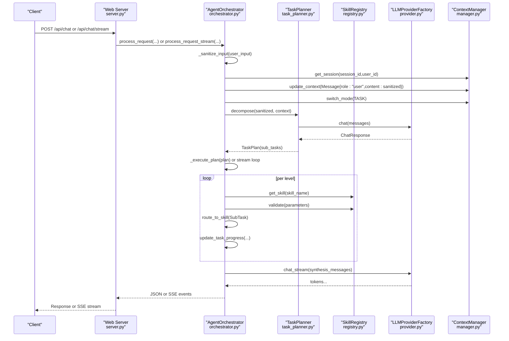

**Diagram sources**
- [server.py:44-135](file://src/aiops_agent/web/server.py#L44-L135)
- [orchestrator.py:84-418](file://src/aiops_agent/core/orchestrator.py#L84-L418)
- [task_planner.py:50-113](file://src/aiops_agent/core/task_planner.py#L50-L113)
- [registry.py:159-181](file://src/aiops_agent/skills/registry.py#L159-L181)
- [provider.py:147-209](file://src/aiops_agent/llm/provider.py#L147-L209)
- [manager.py:50-121](file://src/aiops_agent/context/manager.py#L50-L121)

## Detailed Component Analysis

### Web Server: HTTP Endpoints and Streaming
- Synchronous chat endpoint validates JSON and body fields, retrieves orchestrator, and returns structured JSON response.
- Streaming endpoint validates JSON, prepares a StreamResponse with SSE headers, and yields structured events for planning, task lifecycle, and final completion.
- Health and readiness endpoints expose operational status.
- Skills listing endpoint returns registered skills metadata.

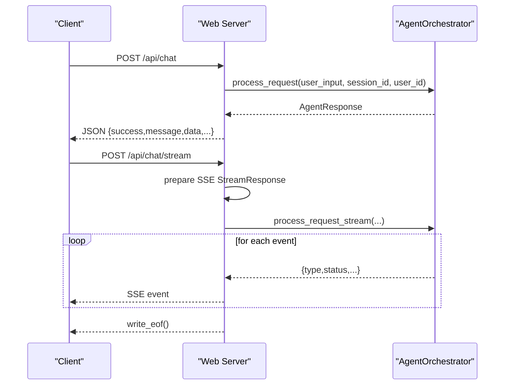

**Diagram sources**
- [server.py:44-135](file://src/aiops_agent/web/server.py#L44-L135)

**Section sources**
- [server.py:44-135](file://src/aiops_agent/web/server.py#L44-L135)

### Orchestrator: Central Coordinator
Responsibilities:
- Input sanitization and injection detection.
- Context updates and mode switching (CHAT/TASK).
- Task planning via TaskPlanner.
- DAG execution with topological sorting and concurrency control.
- Skill routing, validation, and execution.
- Progress tracking and metrics.
- Final synthesis via LLM streaming.
- Health monitoring for skills and error handling.

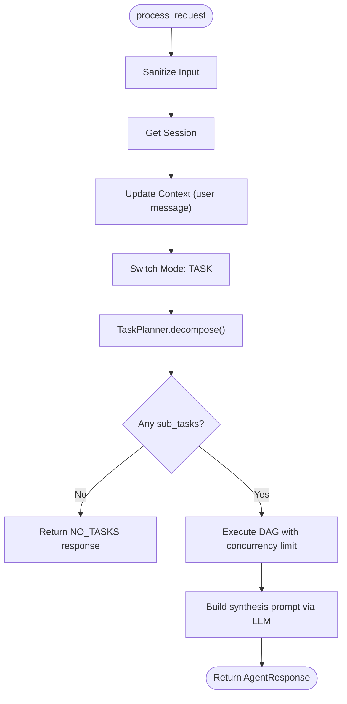

**Diagram sources**
- [orchestrator.py:84-198](file://src/aiops_agent/core/orchestrator.py#L84-L198)

**Section sources**
- [orchestrator.py:84-198](file://src/aiops_agent/core/orchestrator.py#L84-L198)

### Task Planner: Decomposition and DAG Construction
- Builds system prompts including available skills and context.
- Calls LLM to produce JSON-formatted subtasks.
- Validates skill existence and sets status accordingly.
- Provides topological sort to compute parallelizable levels.

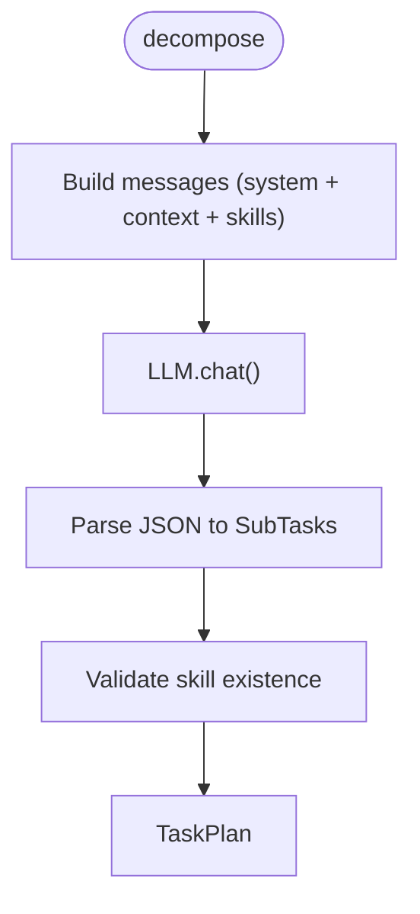

**Diagram sources**
- [task_planner.py:50-113](file://src/aiops_agent/core/task_planner.py#L50-L113)

**Section sources**
- [task_planner.py:50-113](file://src/aiops_agent/core/task_planner.py#L50-L113)

### Context Manager: Session, Resources, and Progress
- Retrieves or creates session state.
- Appends user messages and resolves resource references automatically.
- Switches interaction mode and tracks task progress.
- Supports persistence and idle checks.

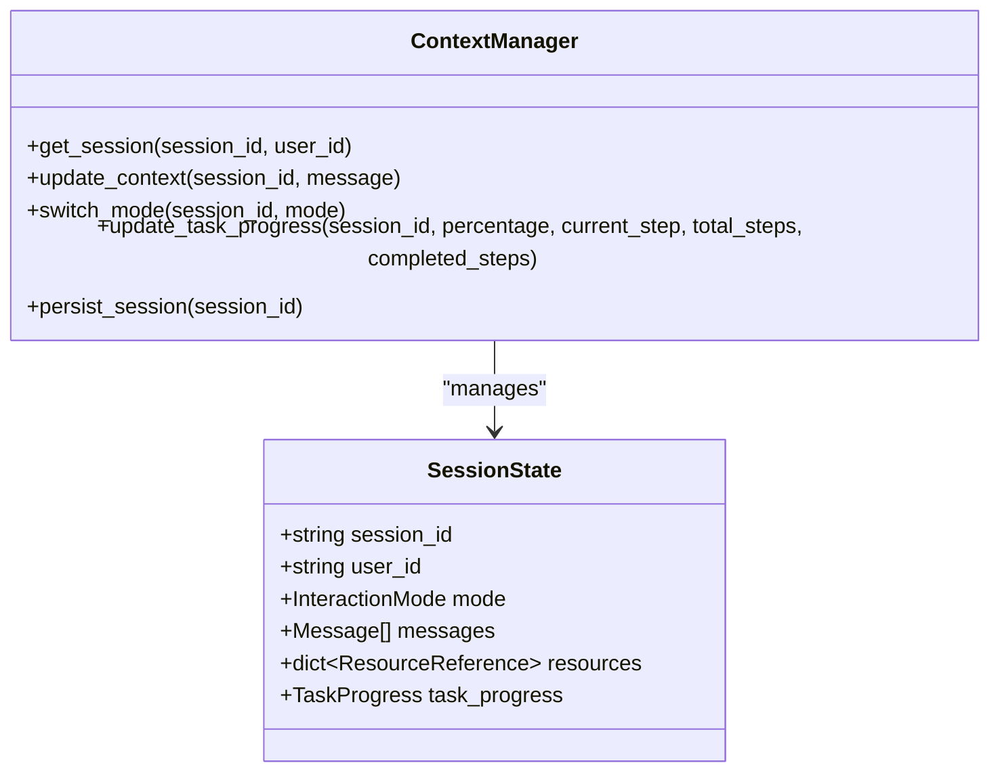

**Diagram sources**
- [manager.py:50-121](file://src/aiops_agent/context/manager.py#L50-L121)
- [schemas.py:264-276](file://src/aiops_agent/models/schemas.py#L264-L276)

**Section sources**
- [manager.py:50-121](file://src/aiops_agent/context/manager.py#L50-L121)

### Tool Executor: Permissions, Credentials, Retries, and Audits
- PermissionGate checks required permissions against workload identity.
- CredentialManager obtains temporary credentials when needed.
- Dispatches to MCP client or local tool registry with retry/backoff.
- Applies output sanitization and records audit events.
- Enforces timeouts via asyncio.wait_for.

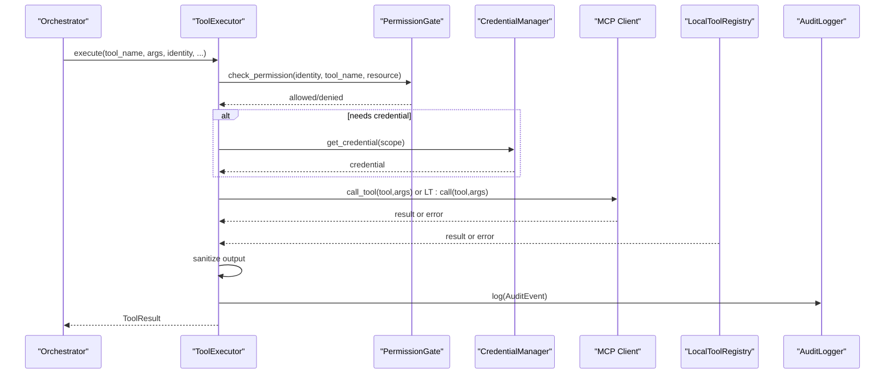

**Diagram sources**
- [executor.py:80-226](file://src/aiops_agent/tools/executor.py#L80-L226)

**Section sources**
- [executor.py:80-226](file://src/aiops_agent/tools/executor.py#L80-L226)

### LLM Provider Factory: Unified Interface and Fallback
- Registers multiple providers and supports primary/fallback selection.
- Provides chat, stream, and completion with automatic fallback on failure.

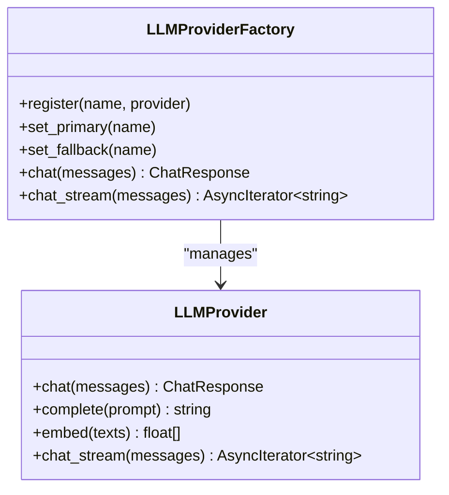

**Diagram sources**
- [provider.py:97-209](file://src/aiops_agent/llm/provider.py#L97-L209)

**Section sources**
- [provider.py:97-209](file://src/aiops_agent/llm/provider.py#L97-L209)

### Skill Registry and Instances
- Registers skills with definitions and instances.
- Routes by capability and version, and marks health status.
- Instances implement validate and execute and can inject ToolExecutor.

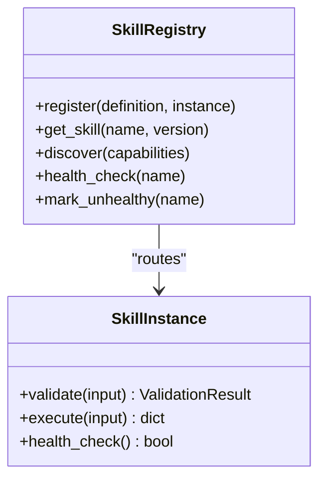

**Diagram sources**
- [registry.py:159-181](file://src/aiops_agent/skills/registry.py#L159-L181)
- [base.py:47-72](file://src/aiops_agent/skills/base.py#L47-L72)

**Section sources**
- [registry.py:159-181](file://src/aiops_agent/skills/registry.py#L159-L181)
- [base.py:47-72](file://src/aiops_agent/skills/base.py#L47-L72)

### Security Guard and Sanitizer
- SecurityGuard enforces blacklist rules, rate limits, anomaly detection, and TLS enforcement.
- Sanitizer recursively redacts sensitive fields in parameters and tool outputs.

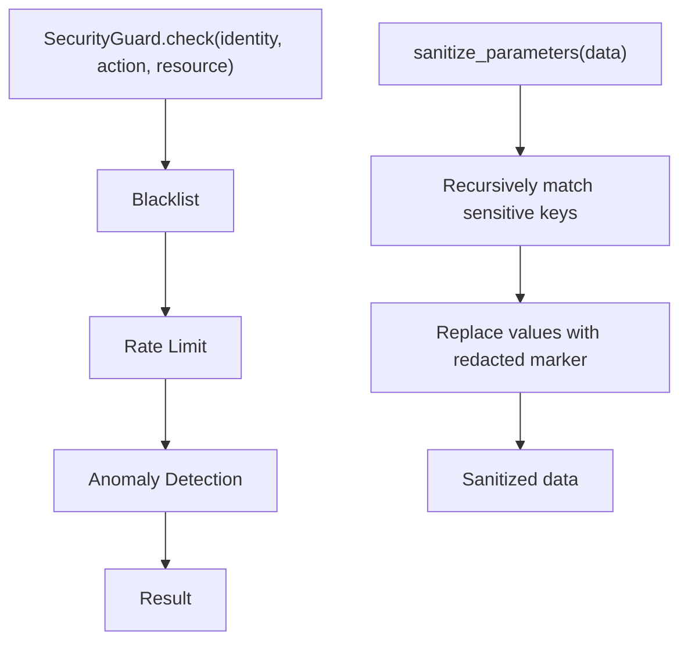

**Diagram sources**
- [security_guard.py:64-122](file://src/aiops_agent/security/security_guard.py#L64-L122)
- [sanitizer.py:39-79](file://src/aiops_agent/security/sanitizer.py#L39-L79)

**Section sources**
- [security_guard.py:64-122](file://src/aiops_agent/security/security_guard.py#L64-L122)
- [sanitizer.py:39-79](file://src/aiops_agent/security/sanitizer.py#L39-L79)

### Data Models and Types
Shared models define task lifecycle, messages, tool results, audit events, identities, and permissions.

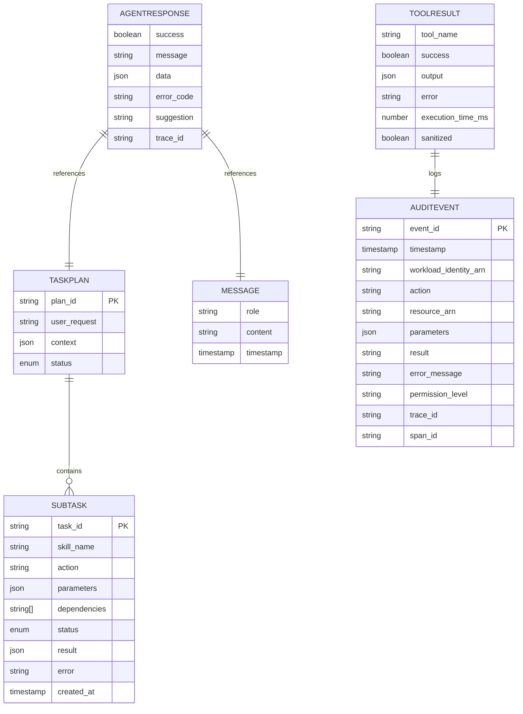

**Diagram sources**
- [schemas.py:19-82](file://src/aiops_agent/models/schemas.py#L19-L82)
- [schemas.py:53-62](file://src/aiops_agent/models/schemas.py#L53-L62)
- [schemas.py:64-71](file://src/aiops_agent/models/schemas.py#L64-L71)
- [schemas.py:73-82](file://src/aiops_agent/models/schemas.py#L73-L82)
- [schemas.py:169-184](file://src/aiops_agent/models/schemas.py#L169-L184)

**Section sources**
- [schemas.py:19-82](file://src/aiops_agent/models/schemas.py#L19-L82)
- [schemas.py:53-62](file://src/aiops_agent/models/schemas.py#L53-L62)
- [schemas.py:64-71](file://src/aiops_agent/models/schemas.py#L64-L71)
- [schemas.py:73-82](file://src/aiops_agent/models/schemas.py#L73-L82)
- [schemas.py:169-184](file://src/aiops_agent/models/schemas.py#L169-L184)

## Dependency Analysis
The orchestrator composes multiple subsystems. It depends on:
- LLM provider factory for planning and synthesis.
- Skill registry for capability routing.
- Context manager for session and progress.
- Tool executor for safe tool invocation.
- Security guard and sanitizer for protection.
- Metrics via orchestrator’s internal metrics.

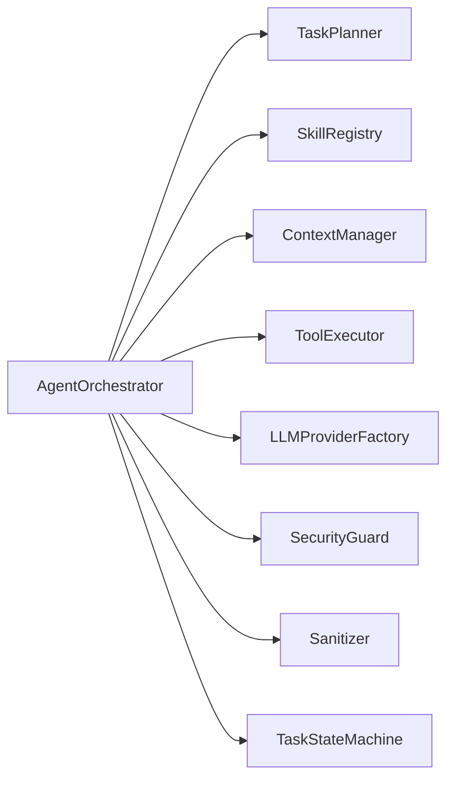

**Diagram sources**
- [orchestrator.py:59-78](file://src/aiops_agent/core/orchestrator.py#L59-L78)

**Section sources**
- [orchestrator.py:59-78](file://src/aiops_agent/core/orchestrator.py#L59-L78)

## Performance Considerations
- Concurrency control: Orchestrator executes tasks per level with a semaphore to cap concurrent operations.
- Retry and backoff: Tool executor retries transient network failures with exponential backoff.
- Timeouts: Tool calls are bounded by asyncio.wait_for with configurable defaults.
- Streaming: SSE and LLM streaming enable progressive feedback without blocking.
- Metrics: Orchestrator records task outcomes and durations for observability.

[No sources needed since this section provides general guidance]

## Troubleshooting Guide
Common issues and mitigations:
- Empty or invalid input: Sanitization raises structured errors; ensure non-empty, properly formatted JSON.
- Permission denied: Review required permissions and workload identity; adjust policies or scopes.
- Tool timeout: Increase timeout or reduce workload; inspect retries and backoff behavior.
- Skill not found: Verify skill registration and capabilities; check health status.
- Internal errors: Inspect trace IDs and logs; confirm provider availability and fallback behavior.
- Security violations: Review blacklist/rate-limit/anomaly alerts; adjust configurations.

**Section sources**
- [exceptions.py:10-143](file://src/aiops_agent/core/exceptions.py#L10-L143)
- [executor.py:180-201](file://src/aiops_agent/tools/executor.py#L180-L201)
- [security_guard.py:64-122](file://src/aiops_agent/security/security_guard.py#L64-L122)
- [orchestrator.py:174-194](file://src/aiops_agent/core/orchestrator.py#L174-L194)

## Conclusion
The AIOps Agent implements a robust, modular request processing pipeline. The web server accepts requests and delegates to the orchestrator, which coordinates planning, execution, and synthesis while enforcing security, context, and observability. The design supports streaming, graceful degradation, and extensibility through skills and providers.