# System Architecture

<cite>
**Referenced Files in This Document**
- [README.md](file://README.md)
- [main.py](file://src/aiops_agent/main.py)
- [server.py](file://src/aiops_agent/web/server.py)
- [orchestrator.py](file://src/aiops_agent/core/orchestrator.py)
- [task_planner.py](file://src/aiops_agent/core/task_planner.py)
- [manager.py](file://src/aiops_agent/context/manager.py)
- [schemas.py](file://src/aiops_agent/models/schemas.py)
- [executor.py](file://src/aiops_agent/tools/executor.py)
- [provider.py](file://src/aiops_agent/llm/provider.py)
- [identity.py](file://src/aiops_agent/security/identity.py)
- [tracing.py](file://src/aiops_agent/observability/tracing.py)
- [settings.yaml](file://config/settings.yaml)
- [Dockerfile](file://deploy/Dockerfile)
- [pyproject.toml](file://pyproject.toml)
</cite>

## Table of Contents
1. [Introduction](#introduction)
2. [Project Structure](#project-structure)
3. [Core Components](#core-components)
4. [Architecture Overview](#architecture-overview)
5. [Detailed Component Analysis](#detailed-component-analysis)
6. [Dependency Analysis](#dependency-analysis)
7. [Performance Considerations](#performance-considerations)
8. [Troubleshooting Guide](#troubleshooting-guide)
9. [Conclusion](#conclusion)
10. [Appendices](#appendices)

## Introduction
This document describes the system architecture of the AIOps Agent, focusing on the five core modules and their interactions. It explains the end-to-end request processing flow from user input through the Agent Orchestrator to skill execution, and details the layered architecture pattern (presentation, business logic, integration, and infrastructure). Cross-cutting concerns such as security, observability, and error handling are addressed, along with technology stack choices, architectural patterns, and scalability considerations.

## Project Structure
The AIOps Agent follows a modular, layered structure:
- Presentation layer: Web server exposing REST APIs and serving a Chat UI
- Business logic layer: Orchestrator, Task Planner, Context Manager, Skill Registry
- Integration layer: Tool Executor integrating MCP protocol and local tools
- Infrastructure layer: Security (Workload Identity, credentials, permissions), Observability (Tracing, Metrics, Logging)

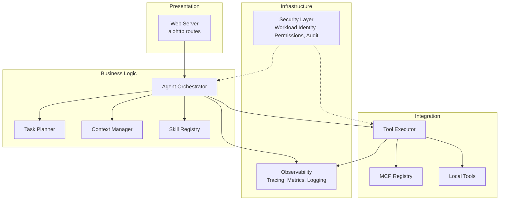

**Diagram sources**
- [server.py:196-227](file://src/aiops_agent/web/server.py#L196-L227)
- [orchestrator.py:47-98](file://src/aiops_agent/core/orchestrator.py#L47-L98)
- [task_planner.py:32-50](file://src/aiops_agent/core/task_planner.py#L32-L50)
- [manager.py:25-45](file://src/aiops_agent/context/manager.py#L25-L45)
- [executor.py:45-75](file://src/aiops_agent/tools/executor.py#L45-L75)
- [identity.py:38-73](file://src/aiops_agent/security/identity.py#L38-L73)
- [tracing.py:32-87](file://src/aiops_agent/observability/tracing.py#L32-L87)

**Section sources**
- [README.md:64-126](file://README.md#L64-L126)
- [pyproject.toml:16-25](file://pyproject.toml#L16-L25)

## Core Components
- Agent Orchestrator: Central coordinator that receives requests, validates input, updates context, delegates decomposition to Task Planner, executes tasks via Skill Registry and Tool Executor, and synthesizes final LLM response.
- Task Planner: Decomposes natural language into a TaskPlan with SubTasks and dependency DAG, enabling topological execution.
- Context Manager: Manages sessions, messages, resource references, and task progress across Chat/Task/Watch modes.
- Skill Registry: Registers skills, resolves capabilities, manages versions, health status, and runtime lifecycle hooks.
- Tool Executor: Unified tool execution pipeline integrating Permission Gate, Credential Manager, MCP/local tool dispatch, retries, sanitization, and audit logging.

**Section sources**
- [orchestrator.py:47-98](file://src/aiops_agent/core/orchestrator.py#L47-L98)
- [task_planner.py:32-50](file://src/aiops_agent/core/task_planner.py#L32-L50)
- [manager.py:25-45](file://src/aiops_agent/context/manager.py#L25-L45)
- [schemas.py:29-51](file://src/aiops_agent/models/schemas.py#L29-L51)
- [schemas.py:283-306](file://src/aiops_agent/models/schemas.py#L283-L306)
- [executor.py:45-75](file://src/aiops_agent/tools/executor.py#L45-L75)

## Architecture Overview
The system implements a layered architecture:
- Presentation: aiohttp web server exposes REST endpoints and serves a Chat UI.
- Business Logic: Orchestrator composes orchestration, planning, context, and skill routing.
- Integration: Tool Executor encapsulates permission checks, credential acquisition, MCP/local tool invocation, and auditing.
- Infrastructure: Security and Observability layers provide identity, permissions, audit, tracing, metrics, and logging.

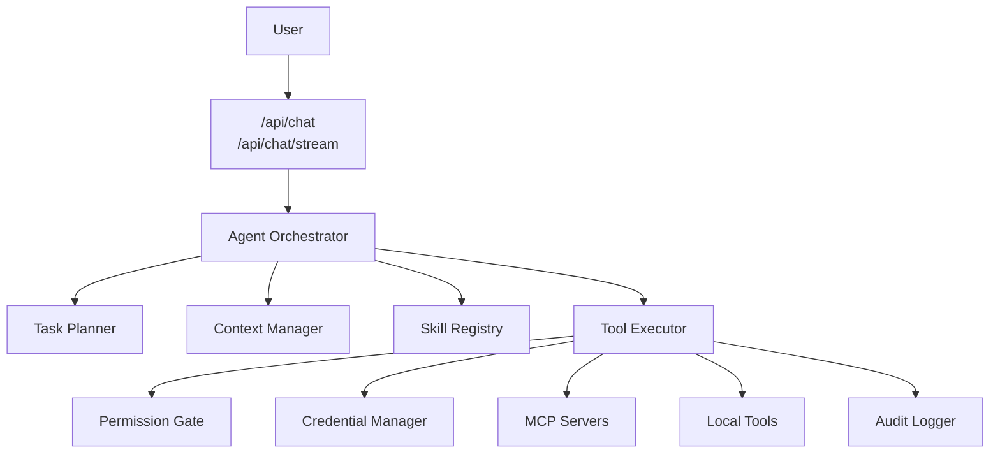

**Diagram sources**
- [server.py:44-135](file://src/aiops_agent/web/server.py#L44-L135)
- [orchestrator.py:84-198](file://src/aiops_agent/core/orchestrator.py#L84-L198)
- [task_planner.py:50-113](file://src/aiops_agent/core/task_planner.py#L50-L113)
- [manager.py:50-121](file://src/aiops_agent/context/manager.py#L50-L121)
- [executor.py:80-226](file://src/aiops_agent/tools/executor.py#L80-L226)

## Detailed Component Analysis

### Request Processing Flow
End-to-end flow from user input to final synthesis:
1. Web server receives request and extracts session/user identifiers.
2. Orchestrator sanitizes input, updates context, switches to Task mode, and asks Task Planner to decompose into SubTasks.
3. Orchestrator executes tasks in DAG order, routing each SubTask to the appropriate Skill via Skill Registry.
4. Skills delegate tool execution through Tool Executor, which enforces permissions, injects credentials, and calls MCP/local tools.
5. Results are aggregated and synthesized by the Orchestrator using an LLM summary prompt.

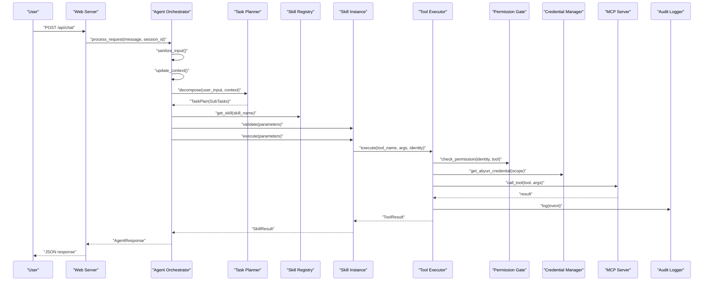

**Diagram sources**
- [server.py:44-82](file://src/aiops_agent/web/server.py#L44-L82)
- [orchestrator.py:84-198](file://src/aiops_agent/core/orchestrator.py#L84-L198)
- [task_planner.py:50-113](file://src/aiops_agent/core/task_planner.py#L50-L113)
- [executor.py:80-226](file://src/aiops_agent/tools/executor.py#L80-L226)

**Section sources**
- [server.py:44-135](file://src/aiops_agent/web/server.py#L44-L135)
- [orchestrator.py:84-198](file://src/aiops_agent/core/orchestrator.py#L84-L198)
- [task_planner.py:50-113](file://src/aiops_agent/core/task_planner.py#L50-L113)
- [executor.py:80-226](file://src/aiops_agent/tools/executor.py#L80-L226)

### Agent Orchestrator
Responsibilities:
- Input sanitization and injection detection
- Context switching and task progress tracking
- TaskPlan creation and DAG execution with concurrency limits
- Failure handling and partial failure reporting
- Health monitoring for skills and metrics recording
- OpenTelemetry tracing integration

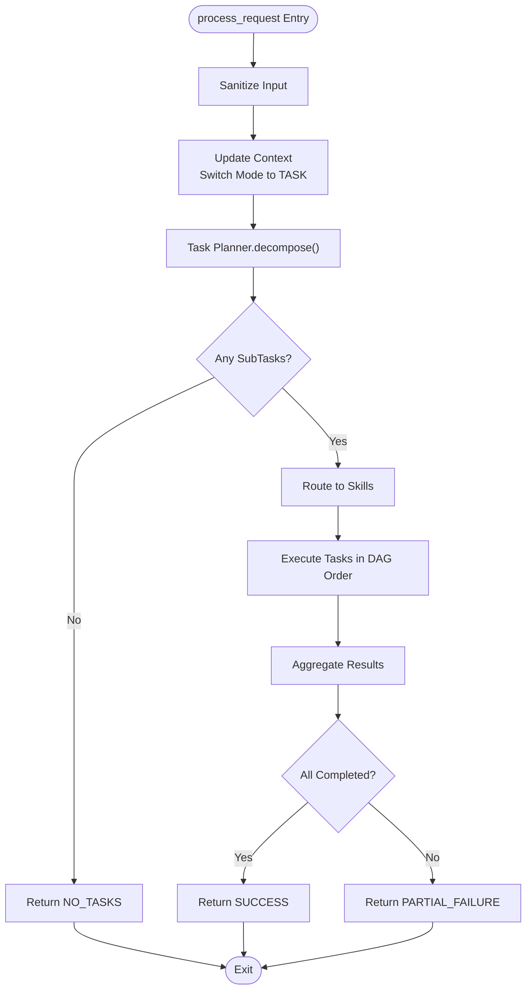

**Diagram sources**
- [orchestrator.py:84-198](file://src/aiops_agent/core/orchestrator.py#L84-L198)
- [task_planner.py:50-113](file://src/aiops_agent/core/task_planner.py#L50-L113)

**Section sources**
- [orchestrator.py:47-98](file://src/aiops_agent/core/orchestrator.py#L47-L98)
- [orchestrator.py:571-646](file://src/aiops_agent/core/orchestrator.py#L571-L646)

### Task Planner
Responsibilities:
- Build system/user messages with available skills and context
- Call LLM to produce JSON subtasks
- Validate skill existence and set status accordingly
- Produce TaskPlan ready for topological execution

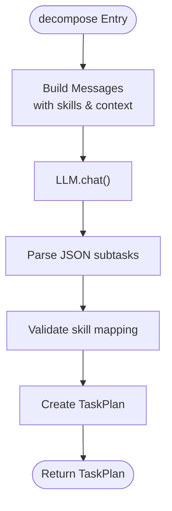

**Diagram sources**
- [task_planner.py:50-113](file://src/aiops_agent/core/task_planner.py#L50-L113)
- [task_planner.py:156-206](file://src/aiops_agent/core/task_planner.py#L156-L206)

**Section sources**
- [task_planner.py:32-50](file://src/aiops_agent/core/task_planner.py#L32-L50)
- [task_planner.py:115-150](file://src/aiops_agent/core/task_planner.py#L115-L150)

### Context Manager
Responsibilities:
- Session retrieval/creation and persistence
- Message history append and resource reference resolution
- Mode switching (CHAT/TASK/WATCH) with progress tracking
- Pause/cancel task support

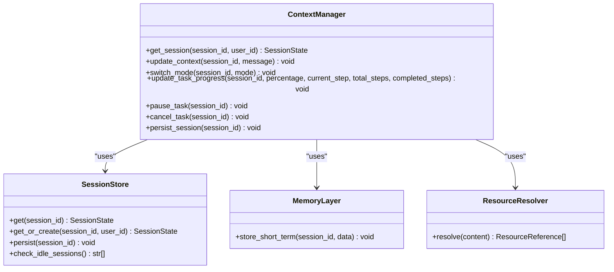

**Diagram sources**
- [manager.py:25-45](file://src/aiops_agent/context/manager.py#L25-L45)
- [schemas.py:264-276](file://src/aiops_agent/models/schemas.py#L264-L276)
- [schemas.py:246-253](file://src/aiops_agent/models/schemas.py#L246-L253)

**Section sources**
- [manager.py:25-121](file://src/aiops_agent/context/manager.py#L25-L121)
- [schemas.py:238-276](file://src/aiops_agent/models/schemas.py#L238-L276)

### Tool Executor
Responsibilities:
- Permission gate checks against Workload Identity
- Credential acquisition via Credential Manager and Workload Identity Manager
- Dispatch to MCP servers or local tools with retry/backoff
- Output sanitization and audit logging
- OpenTelemetry tracing spans

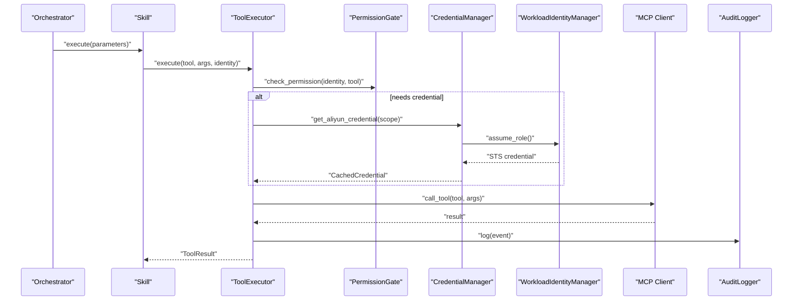

**Diagram sources**
- [executor.py:80-226](file://src/aiops_agent/tools/executor.py#L80-L226)
- [identity.py:119-173](file://src/aiops_agent/security/identity.py#L119-L173)

**Section sources**
- [executor.py:45-75](file://src/aiops_agent/tools/executor.py#L45-L75)
- [executor.py:231-295](file://src/aiops_agent/tools/executor.py#L231-L295)

### Security Layer
- Workload Identity: STS AssumeRoleWithOIDC via Kubernetes ServiceAccount JWT
- Credential Manager: Temporary credential caching and refresh
- Permission Gate: RBAC-based permission checks
- Audit Logger: Structured audit events with trace/span correlation
- Security Guard: Rule-based protection (blacklists, rate limits, anomaly detection)

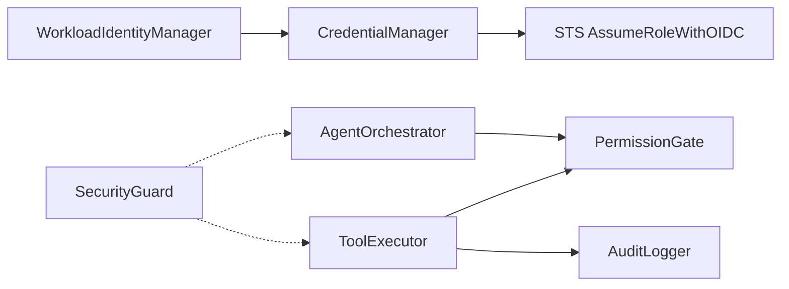

**Diagram sources**
- [identity.py:38-73](file://src/aiops_agent/security/identity.py#L38-L73)
- [main.py:144-159](file://src/aiops_agent/main.py#L144-L159)
- [executor.py:124-147](file://src/aiops_agent/tools/executor.py#L124-L147)

**Section sources**
- [identity.py:38-73](file://src/aiops_agent/security/identity.py#L38-L73)
- [main.py:144-159](file://src/aiops_agent/main.py#L144-L159)

### Observability Layer
- Tracing: OpenTelemetry TracerProvider with console or SLS exporters; @traced decorator
- Metrics: Task completion/failure counters and latency
- Logging: Structured JSON logs with trace/span IDs

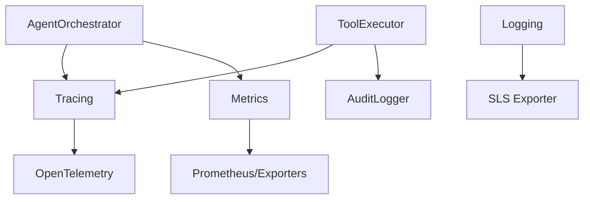

**Diagram sources**
- [tracing.py:32-87](file://src/aiops_agent/observability/tracing.py#L32-L87)
- [main.py:85-95](file://src/aiops_agent/main.py#L85-L95)

**Section sources**
- [tracing.py:32-87](file://src/aiops_agent/observability/tracing.py#L32-L87)
- [main.py:85-95](file://src/aiops_agent/main.py#L85-L95)

## Dependency Analysis
Key internal dependencies:
- Web server depends on Orchestrator creation and initialization
- Orchestrator depends on Task Planner, Context Manager, Skill Registry, Tool Executor, Security Guard, and Metrics
- Tool Executor depends on Permission Gate, Credential Manager, MCP Registry, Local Tools, and Audit Logger
- Security and Observability are injected dependencies configured at startup

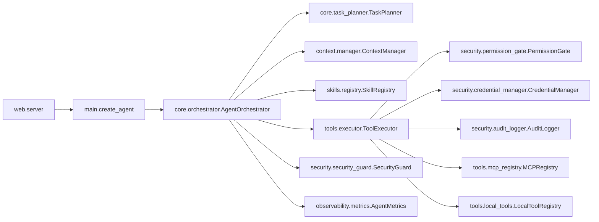

**Diagram sources**
- [server.py:32-36](file://src/aiops_agent/web/server.py#L32-L36)
- [main.py:70-222](file://src/aiops_agent/main.py#L70-L222)
- [orchestrator.py:59-75](file://src/aiops_agent/core/orchestrator.py#L59-L75)
- [executor.py:58-74](file://src/aiops_agent/tools/executor.py#L58-L74)

**Section sources**
- [server.py:32-36](file://src/aiops_agent/web/server.py#L32-L36)
- [main.py:70-222](file://src/aiops_agent/main.py#L70-L222)
- [orchestrator.py:59-75](file://src/aiops_agent/core/orchestrator.py#L59-L75)
- [executor.py:58-74](file://src/aiops_agent/tools/executor.py#L58-L74)

## Performance Considerations
- Concurrency control: Orchestrator uses a semaphore to cap concurrent subtasks per DAG level
- Retries and timeouts: Tool Executor applies exponential backoff and configurable timeouts
- Parallelism: Up to a fixed number of concurrent subtasks per level to avoid overload
- Caching: Credential Manager caches temporary credentials with pre-expiry refresh
- Observability: Metrics and tracing enable profiling and bottleneck identification

**Section sources**
- [orchestrator.py:450-460](file://src/aiops_agent/core/orchestrator.py#L450-L460)
- [executor.py:231-274](file://src/aiops_agent/tools/executor.py#L231-L274)
- [identity.py:179-213](file://src/aiops_agent/security/identity.py#L179-L213)

## Troubleshooting Guide
Common areas to inspect:
- Input sanitization failures and injection warnings
- Permission denied errors from Permission Gate
- Tool execution timeouts and retry exhaustion
- Skill unhealthiness triggering automatic marking
- Audit log failures during high-throughput periods

Recommended actions:
- Verify Workload Identity configuration and OIDC provider setup
- Confirm credential scope and target service alignment
- Review audit logs for denied actions and error messages
- Inspect tracing spans for slow or failing steps
- Check metrics for task completion rates and latency

**Section sources**
- [orchestrator.py:601-646](file://src/aiops_agent/core/orchestrator.py#L601-L646)
- [executor.py:124-201](file://src/aiops_agent/tools/executor.py#L124-L201)
- [executor.py:231-274](file://src/aiops_agent/tools/executor.py#L231-L274)
- [orchestrator.py:571-596](file://src/aiops_agent/core/orchestrator.py#L571-L596)

## Conclusion
The AIOps Agent employs a robust, layered architecture centered on an asynchronous Orchestrator that coordinates planning, context, skills, and tools. Security and observability are integrated from the ground up, with Workload Identity, RBAC, structured auditing, and OpenTelemetry tracing. The system is designed for scalability via concurrency controls, retries, and modular components, while maintaining strong separation of concerns across presentation, business logic, integration, and infrastructure layers.

## Appendices

### System Context and Alibaba Cloud Ecosystem
AIOps Agent integrates with Alibaba Cloud services through:
- Workload Identity using STS AssumeRoleWithOIDC
- MCP protocol for tool invocation
- SLS for observability exports
- Optional LLM backends (Qwen, Claude, GPT)

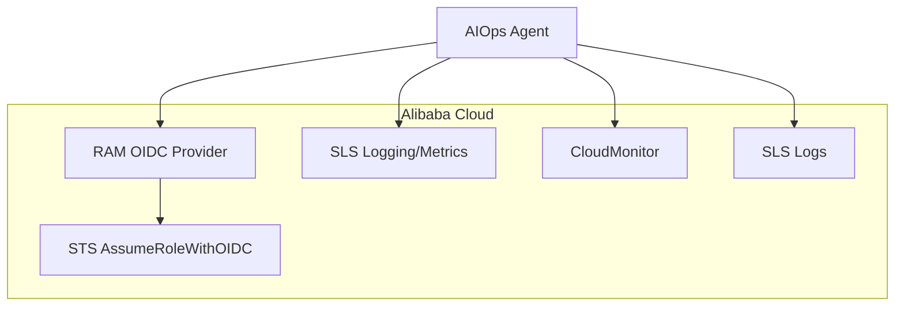

**Diagram sources**
- [identity.py:119-173](file://src/aiops_agent/security/identity.py#L119-L173)
- [tracing.py:64-82](file://src/aiops_agent/observability/tracing.py#L64-L82)

**Section sources**
- [README.md:160-177](file://README.md#L160-L177)
- [settings.yaml:27-41](file://config/settings.yaml#L27-L41)

### Technology Stack and Architectural Patterns
- Asynchronous runtime: asyncio/aiohttp
- Data modeling: Pydantic v2
- LLM abstraction: Provider interface with factory and auto-fallback
- Protocol: MCP (JSON-RPC over stdio/SSE)
- Identity: Alibaba Cloud Agent Identity (STS OIDC)
- Observability: OpenTelemetry tracing
- Testing: pytest/hypothesis

**Section sources**
- [README.md:178-189](file://README.md#L178-L189)
- [pyproject.toml:16-25](file://pyproject.toml#L16-L25)

### Deployment and Packaging
- Multi-stage Docker build with slim base image
- Non-root user execution
- Exposed port 8080
- Environment variables for logging and runtime behavior

**Section sources**
- [Dockerfile:16-42](file://deploy/Dockerfile#L16-L42)
- [pyproject.toml:37-38](file://pyproject.toml#L37-L38)