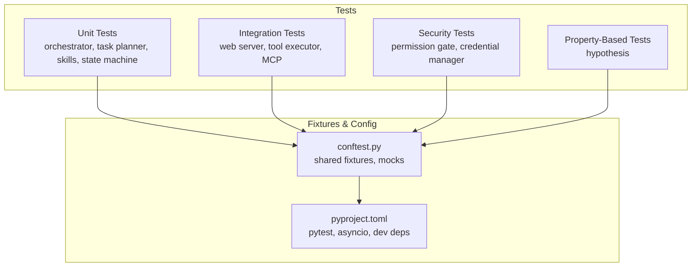
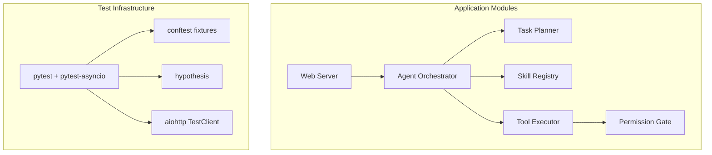
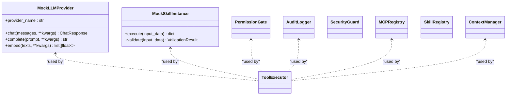
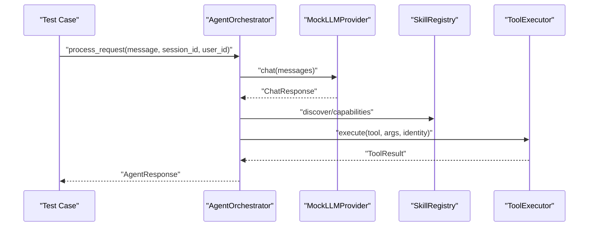
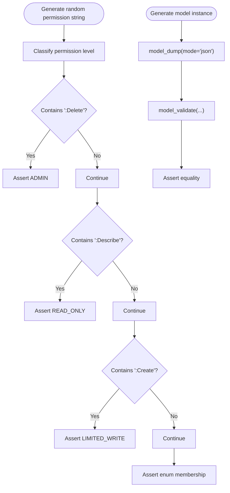
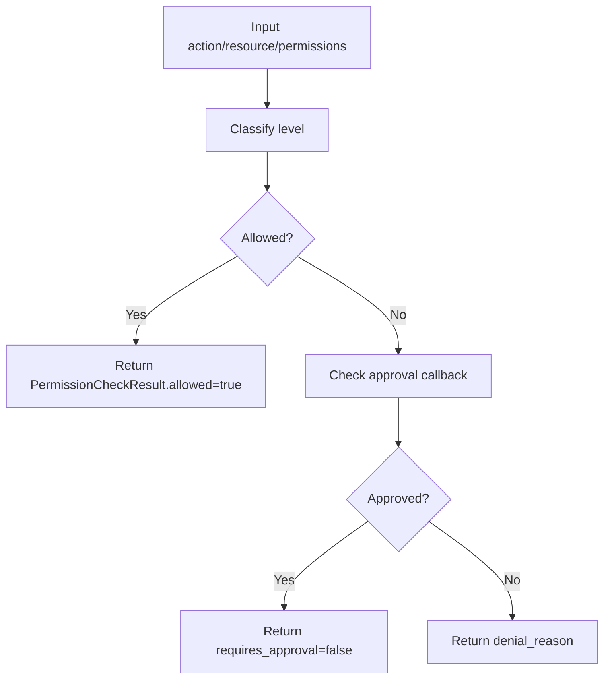
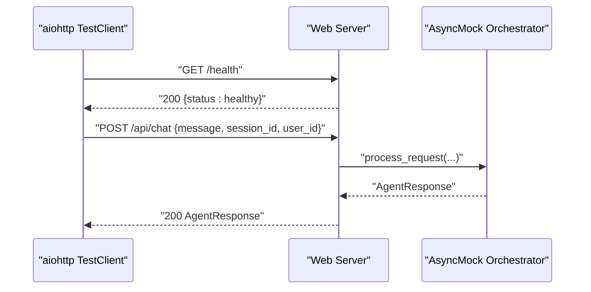
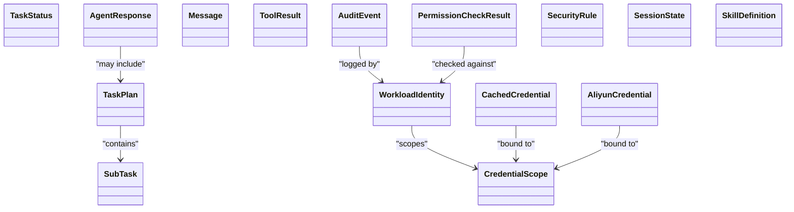
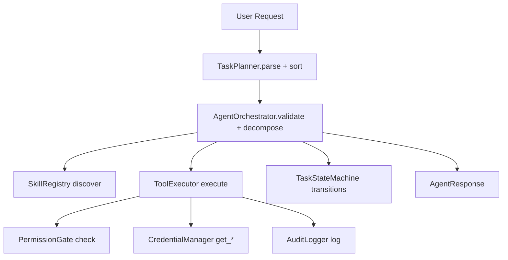
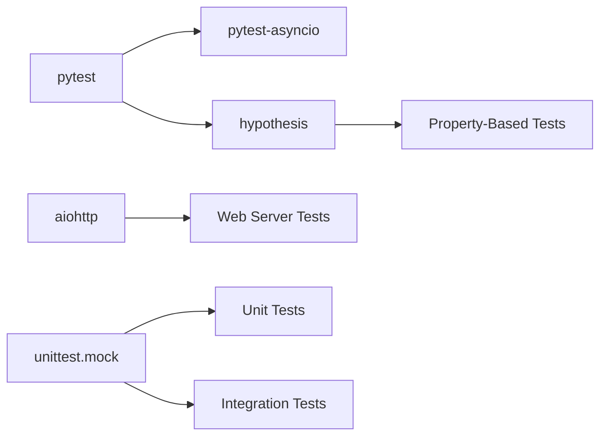

# Testing Strategy

<cite>
**Referenced Files in This Document**
- [tests/conftest.py](file://tests/conftest.py)
- [pyproject.toml](file://pyproject.toml)
- [README.md](file://README.md)
- [tests/test_orchestrator.py](file://tests/test_orchestrator.py)
- [tests/test_tool_executor.py](file://tests/test_tool_executor.py)
- [tests/test_permission_gate.py](file://tests/test_permission_gate.py)
- [tests/test_schemas.py](file://tests/test_schemas.py)
- [tests/properties/test_permission_logic.py](file://tests/properties/test_permission_logic.py)
- [tests/properties/test_serialization.py](file://tests/properties/test_serialization.py)
- [tests/test_web_server.py](file://tests/test_web_server.py)
- [tests/test_credential_manager.py](file://tests/test_credential_manager.py)
- [tests/test_skill_registry.py](file://tests/test_skill_registry.py)
- [tests/test_state_machine.py](file://tests/test_state_machine.py)
- [tests/test_task_planner.py](file://tests/test_task_planner.py)
</cite>

## Table of Contents
1. [Introduction](#introduction)
2. [Project Structure](#project-structure)
3. [Core Components](#core-components)
4. [Architecture Overview](#architecture-overview)
5. [Detailed Component Analysis](#detailed-component-analysis)
6. [Dependency Analysis](#dependency-analysis)
7. [Performance Considerations](#performance-considerations)
8. [Troubleshooting Guide](#troubleshooting-guide)
9. [Conclusion](#conclusion)
10. [Appendices](#appendices)

## Introduction
This document describes the comprehensive testing strategy for the AIOps Agent project. It explains the pytest-based testing framework with async/await support, property-based testing with hypothesis, and how tests are organized across unit, integration, and security domains. It documents shared fixtures in conftest.py that enable test isolation and setup, testing patterns for asynchronous components, strategies for mocking external dependencies, and test data management. It also provides guidelines for writing new tests, continuous integration setup, and test coverage expectations, along with examples of testing complex workflows and edge cases.

## Project Structure
The repository organizes tests under the tests/ directory with clear separation by domain:
- Unit tests for core orchestration, planning, skills, and state machines
- Integration tests for web server endpoints and MCP tool execution
- Security tests for permission gates and credential management
- Property-based tests using hypothesis for permission logic and serialization robustness

Key configuration and fixtures live in tests/conftest.py, while pytest and development dependencies are declared in pyproject.toml. The README provides quick-start commands for running tests.

**Section sources**
- [README.md:58-62](file://README.md#L58-L62)
- [pyproject.toml:40-42](file://pyproject.toml#L40-L42)

## Core Components
The testing strategy centers on:
- pytest with asyncio_mode enabled for native async/await support
- Shared fixtures in conftest.py to reduce boilerplate and ensure isolation
- Mock-based testing for external dependencies (LLM providers, MCP servers, credentials)
- Property-based testing with hypothesis to validate logic and serialization robustness
- Clear separation of concerns across unit, integration, and security tests

Highlights:
- Async fixtures and tests are marked appropriately to leverage pytest-asyncio
- Hypothesis profiles and deadlines configured for deterministic CI runs
- Mock LLM provider and mock skill instances simplify orchestration and planning tests
- Web server tests use aiohttp TestClient/TestServer with injected mocks

**Section sources**
- [pyproject.toml:40-42](file://pyproject.toml#L40-L42)
- [tests/conftest.py:114-215](file://tests/conftest.py#L114-L215)

## Architecture Overview
The testing architecture aligns with the application’s modular design. Tests exercise the Agent Orchestrator, Task Planner, Skill Registry, Tool Executor, Permission Gate, and Web Server, with mocks replacing external systems.

**Diagram sources**
- [tests/test_orchestrator.py:1-359](file://tests/test_orchestrator.py#L1-L359)
- [tests/test_tool_executor.py:1-294](file://tests/test_tool_executor.py#L1-L294)
- [tests/test_web_server.py:1-207](file://tests/test_web_server.py#L1-L207)
- [tests/conftest.py:114-215](file://tests/conftest.py#L114-L215)

## Detailed Component Analysis

### Shared Fixtures and Test Isolation
The conftest.py defines:
- Hypothesis profiles for CI/dev environments
- Mock LLM provider and factory for deterministic LLM behavior
- Mock skill instances for testing orchestration and planning
- Fixtures for security components (PermissionGate, AuditLogger, SecurityGuard)
- Fixtures for orchestration components (ContextManager, SkillRegistry, MCPRegistry)
- Fixtures for tool execution (ToolExecutor) with mocked dependencies

These fixtures ensure:
- Deterministic behavior via controlled LLM responses
- Isolation via per-test mocks and temporary directories
- Reusability across unit and integration tests

**Diagram sources**
- [tests/conftest.py:58-107](file://tests/conftest.py#L58-L107)
- [tests/conftest.py:114-215](file://tests/conftest.py#L114-L215)

**Section sources**
- [tests/conftest.py:40-51](file://tests/conftest.py#L40-L51)
- [tests/conftest.py:58-107](file://tests/conftest.py#L58-L107)
- [tests/conftest.py:114-215](file://tests/conftest.py#L114-L215)

### Async Testing Patterns
Async tests are annotated with pytest markers and use AsyncMock/MagicMock to stub async methods. Examples include:
- Agent Orchestrator input validation and task decomposition
- Tool Executor permission checks, MCP/local tool calls, retries, and audit logging
- Web server endpoints with injected AsyncMock orchestrator

**Diagram sources**
- [tests/test_orchestrator.py:46-182](file://tests/test_orchestrator.py#L46-L182)
- [tests/test_tool_executor.py:77-138](file://tests/test_tool_executor.py#L77-L138)
- [tests/conftest.py:114-125](file://tests/conftest.py#L114-L125)

**Section sources**
- [tests/test_orchestrator.py:46-182](file://tests/test_orchestrator.py#L46-L182)
- [tests/test_tool_executor.py:77-138](file://tests/test_tool_executor.py#L77-L138)
- [tests/test_web_server.py:24-50](file://tests/test_web_server.py#L24-L50)

### Property-Based Testing with Hypothesis
Property-based tests validate logic and serialization robustness:
- Permission logic: classify actions and wildcard matching across generated permission strings
- Serialization: round-trip model serialization and JSON serializability

**Diagram sources**
- [tests/properties/test_permission_logic.py:19-103](file://tests/properties/test_permission_logic.py#L19-L103)
- [tests/properties/test_serialization.py:44-227](file://tests/properties/test_serialization.py#L44-L227)

**Section sources**
- [tests/properties/test_permission_logic.py:19-103](file://tests/properties/test_permission_logic.py#L19-L103)
- [tests/properties/test_serialization.py:44-227](file://tests/properties/test_serialization.py#L44-L227)

### Security Tests: Permission Gate and Credential Management
Security tests validate:
- Permission level classification and matching logic
- Approval callbacks and on-behalf-of intersection semantics
- Credential caching, retrieval, and environment-based third-party credentials

**Diagram sources**
- [tests/test_permission_gate.py:99-188](file://tests/test_permission_gate.py#L99-L188)
- [tests/test_credential_manager.py:25-155](file://tests/test_credential_manager.py#L25-L155)

**Section sources**
- [tests/test_permission_gate.py:99-188](file://tests/test_permission_gate.py#L99-L188)
- [tests/test_credential_manager.py:25-155](file://tests/test_credential_manager.py#L25-L155)

### Integration Tests: Web Server and Tool Execution
Integration tests cover:
- HTTP endpoints (/health, /ready, /api/chat, /api/skills, /)
- Web server behavior with mocked orchestrator
- Tool execution scenarios: permission denied, MCP/local tool calls, audit logging, credential injection, retry logic

**Diagram sources**
- [tests/test_web_server.py:56-152](file://tests/test_web_server.py#L56-L152)
- [tests/test_tool_executor.py:77-138](file://tests/test_tool_executor.py#L77-L138)

**Section sources**
- [tests/test_web_server.py:56-152](file://tests/test_web_server.py#L56-L152)
- [tests/test_tool_executor.py:77-138](file://tests/test_tool_executor.py#L77-L138)

### Data Model and Schema Validation
Schema tests validate Pydantic models and enums:
- TaskStatus, SubTask, TaskPlan, AgentResponse, Message, ToolResult
- WorkloadIdentity, CredentialScope, CachedCredential, AliyunCredential
- AuditEvent, PermissionCheckResult, SecurityRule, SessionState, SkillDefinition

**Diagram sources**
- [tests/test_schemas.py:41-625](file://tests/test_schemas.py#L41-L625)

**Section sources**
- [tests/test_schemas.py:41-625](file://tests/test_schemas.py#L41-L625)

### Complex Workflow and Edge Cases
Examples of testing complex workflows and edge cases:
- Orchestrator input sanitization and error codes
- DAG execution with dependency chains and failure propagation
- Task planner parsing various LLM JSON formats, topological sorting, and skill mapping validation
- State machine transitions and terminal states
- Skill registry registration/unregistration, discovery, and health management

**Diagram sources**
- [tests/test_orchestrator.py:46-359](file://tests/test_orchestrator.py#L46-L359)
- [tests/test_task_planner.py:105-375](file://tests/test_task_planner.py#L105-L375)
- [tests/test_state_machine.py:13-111](file://tests/test_state_machine.py#L13-L111)
- [tests/test_skill_registry.py:49-253](file://tests/test_skill_registry.py#L49-L253)

**Section sources**
- [tests/test_orchestrator.py:46-359](file://tests/test_orchestrator.py#L46-L359)
- [tests/test_task_planner.py:105-375](file://tests/test_task_planner.py#L105-L375)
- [tests/test_state_machine.py:13-111](file://tests/test_state_machine.py#L13-L111)
- [tests/test_skill_registry.py:49-253](file://tests/test_skill_registry.py#L49-L253)

## Dependency Analysis
The testing suite depends on:
- pytest and pytest-asyncio for async test execution
- hypothesis for property-based testing
- aiohttp for web server integration tests
- unittest.mock for stubbing external systems

**Diagram sources**
- [pyproject.toml:28-32](file://pyproject.toml#L28-L32)
- [tests/test_web_server.py:13-16](file://tests/test_web_server.py#L13-L16)

**Section sources**
- [pyproject.toml:28-32](file://pyproject.toml#L28-L32)
- [tests/test_web_server.py:13-16](file://tests/test_web_server.py#L13-L16)

## Performance Considerations
- Prefer synchronous fixtures and deterministic mocks to avoid flaky tests
- Use hypothesis profiles with bounded max_examples and deadline=None for CI stability
- Keep async tests focused and avoid long-running network-bound stubs
- Use parametrize and indirect fixtures to minimize repeated setup overhead

## Troubleshooting Guide
Common issues and resolutions:
- Async test failures: ensure @pytest.mark.asyncio and proper use of AsyncMock
- Hypothesis failures: adjust profile settings or shrink failing examples to minimal repro
- Web server test failures: verify injected mocks and endpoint payload shapes
- Permission gate denials: confirm approval callbacks and user permission intersections
- Tool execution failures: validate credential scopes and MCP client availability

**Section sources**
- [tests/test_web_server.py:24-50](file://tests/test_web_server.py#L24-L50)
- [tests/test_permission_gate.py:195-236](file://tests/test_permission_gate.py#L195-L236)
- [tests/test_tool_executor.py:272-294](file://tests/test_tool_executor.py#L272-L294)

## Conclusion
The AIOps Agent employs a robust, layered testing strategy combining unit, integration, and property-based tests. Shared fixtures in conftest.py enable consistent, isolated setups across async components. Hypothesis enhances confidence in permission logic and serialization. The approach balances determinism with realistic integration coverage, supporting maintainable and reliable development.

## Appendices

### Guidelines for Writing New Tests
- Place unit tests under tests/ for the relevant module
- Use async fixtures and @pytest.mark.asyncio for async components
- Prefer mocks from conftest.py to keep tests concise and focused
- Add property-based tests under tests/properties/ for logic and serialization
- For web/integration tests, use aiohttp TestClient/TestServer with injected mocks
- Keep test data minimal and deterministic; use factories or strategies where appropriate

### Continuous Integration Setup
- Configure pytest with asyncio_mode = auto
- Use hypothesis profiles ci/dev with bounded examples for reproducibility
- Run tests with uv or pip-installed dev dependencies

**Section sources**
- [pyproject.toml:40-42](file://pyproject.toml#L40-L42)
- [tests/conftest.py:40-51](file://tests/conftest.py#L40-L51)