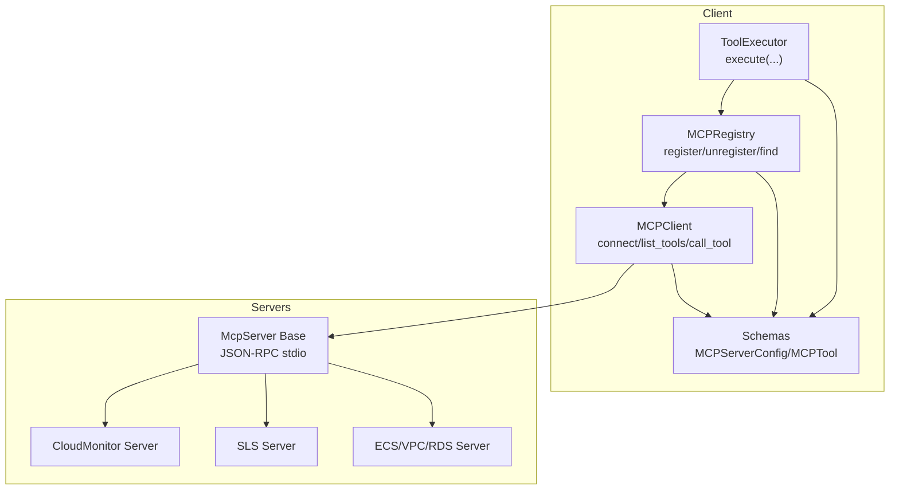
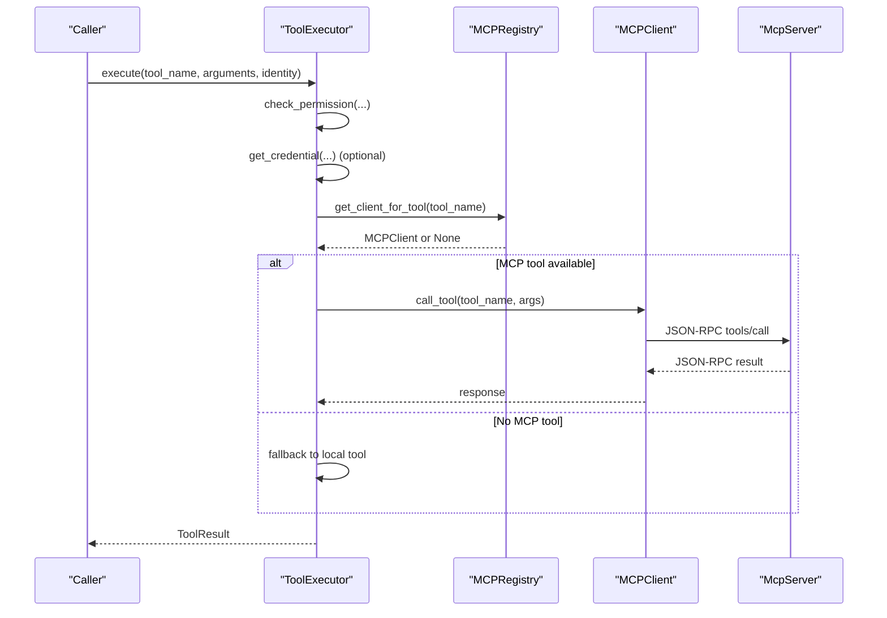
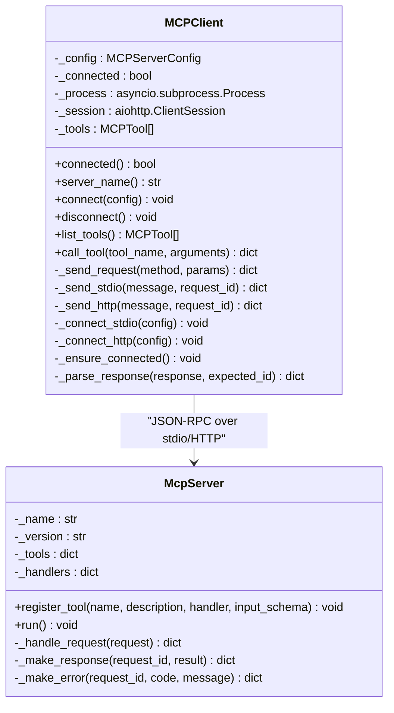
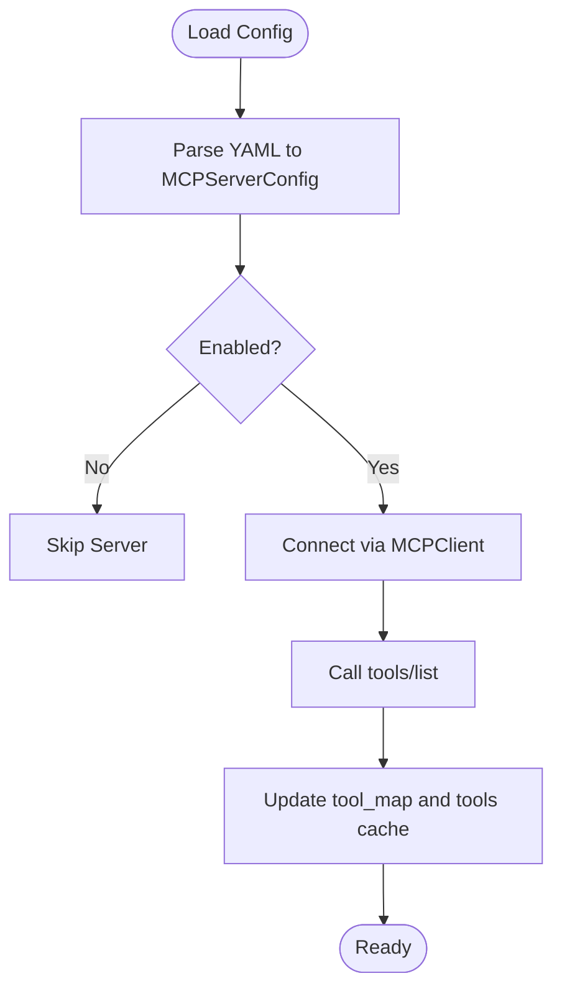
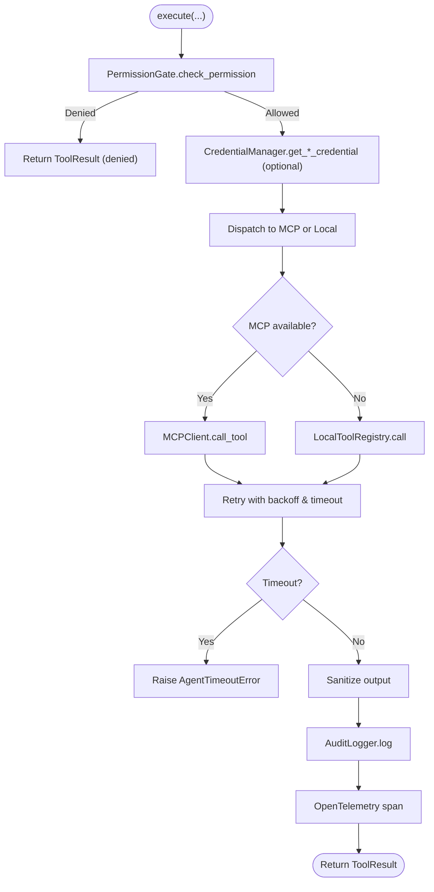
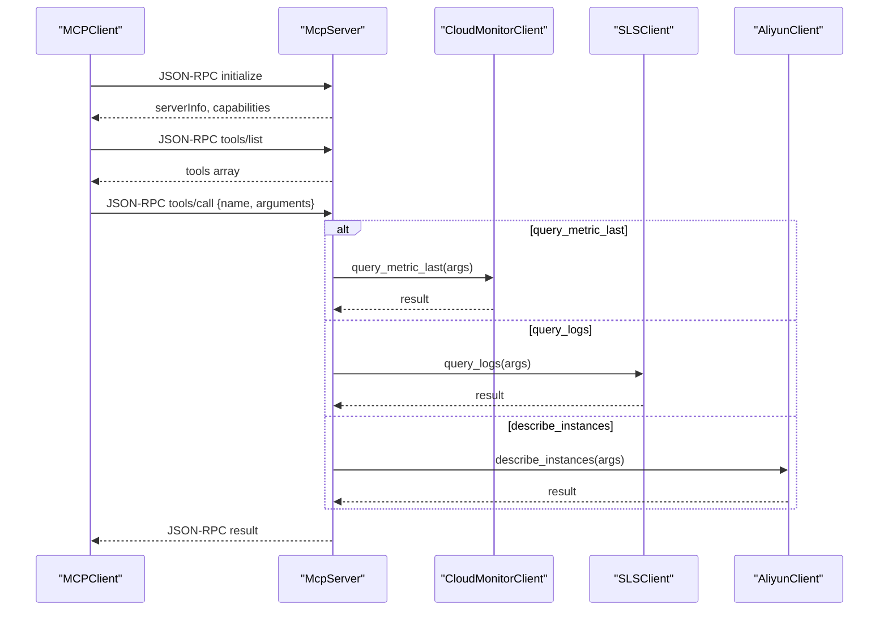
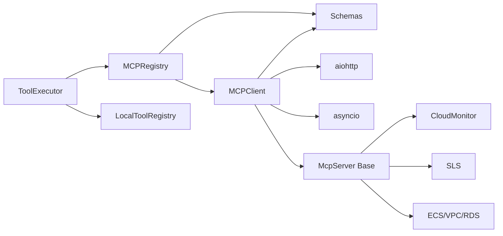

# MCP Client Implementation

<cite>
**Referenced Files in This Document**
- [mcp_client.py](file://src/aiops_agent/tools/mcp_client.py)
- [mcp_registry.py](file://src/aiops_agent/tools/mcp_registry.py)
- [executor.py](file://src/aiops_agent/tools/executor.py)
- [schemas.py](file://src/aiops_agent/models/schemas.py)
- [mcp_servers.yaml](file://config/mcp_servers.yaml)
- [base.py](file://mcp_servers/base.py)
- [cloud_monitor.py](file://mcp_servers/cloud_monitor.py)
- [sls.py](file://mcp_servers/sls.py)
- [ecs_vpc_rds.py](file://mcp_servers/ecs_vpc_rds.py)
</cite>

## Table of Contents
1. [Introduction](#introduction)
2. [Project Structure](#project-structure)
3. [Core Components](#core-components)
4. [Architecture Overview](#architecture-overview)
5. [Detailed Component Analysis](#detailed-component-analysis)
6. [Dependency Analysis](#dependency-analysis)
7. [Performance Considerations](#performance-considerations)
8. [Troubleshooting Guide](#troubleshooting-guide)
9. [Conclusion](#conclusion)
10. [Appendices](#appendices)

## Introduction
This document explains the MCP client implementation that enables the AIOps agent to communicate with MCP servers. It covers the client-server protocol, message formatting, authentication mechanisms, error handling, tool execution, connection management, retry logic, timeouts, and security considerations. Practical examples of client configuration, tool invocation patterns, and debugging techniques are included to help operators integrate and troubleshoot MCP-enabled tools effectively.

## Project Structure
The MCP ecosystem spans client-side orchestration, server-side tool implementations, and shared data models:
- Client-side: MCP client, registry, and unified tool executor
- Server-side: Example MCP servers implementing JSON-RPC over stdio
- Shared models: Data schemas for configuration, tools, and results

**Diagram sources**
- [executor.py:45-314](file://src/aiops_agent/tools/executor.py#L45-L314)
- [mcp_registry.py:20-162](file://src/aiops_agent/tools/mcp_registry.py#L20-L162)
- [mcp_client.py:22-324](file://src/aiops_agent/tools/mcp_client.py#L22-L324)
- [base.py:14-108](file://mcp_servers/base.py#L14-L108)
- [cloud_monitor.py:74-131](file://mcp_servers/cloud_monitor.py#L74-L131)
- [sls.py:49-97](file://mcp_servers/sls.py#L49-L97)
- [ecs_vpc_rds.py:101-125](file://mcp_servers/ecs_vpc_rds.py#L101-L125)
- [schemas.py:144-162](file://src/aiops_agent/models/schemas.py#L144-L162)

**Section sources**
- [mcp_client.py:1-324](file://src/aiops_agent/tools/mcp_client.py#L1-L324)
- [mcp_registry.py:1-162](file://src/aiops_agent/tools/mcp_registry.py#L1-L162)
- [executor.py:1-314](file://src/aiops_agent/tools/executor.py#L1-L314)
- [schemas.py:144-162](file://src/aiops_agent/models/schemas.py#L144-L162)
- [mcp_servers.yaml:1-41](file://config/mcp_servers.yaml#L1-L41)
- [base.py:1-108](file://mcp_servers/base.py#L1-L108)
- [cloud_monitor.py:1-131](file://mcp_servers/cloud_monitor.py#L1-L131)
- [sls.py:1-97](file://mcp_servers/sls.py#L1-L97)
- [ecs_vpc_rds.py:1-125](file://mcp_servers/ecs_vpc_rds.py#L1-L125)

## Core Components
- MCPClient: Implements JSON-RPC 2.0 over stdio and HTTP/SSE transports, manages connections, serializes/deserializes requests/responses, and exposes list_tools and call_tool.
- MCPRegistry: Manages registration/unregistration of MCP servers, loads configurations from YAML, maintains tool-to-server mapping, and provides lookup helpers.
- ToolExecutor: Orchestrates permission checks, credential acquisition, tool dispatch (MCP-first, fallback to local), retries with exponential backoff, timeouts, sanitization, auditing, and tracing.
- Schemas: Defines MCPServerConfig and MCPTool models used by the client and registry.

Key responsibilities:
- Transport abstraction: stdio for local subprocesses, HTTP/SSE for remote servers
- Protocol compliance: JSON-RPC 2.0 with id, method, params, result/error
- Tool discovery and invocation: tools/list and tools/call
- Robustness: timeouts, retries, error propagation, graceful disconnects

**Section sources**
- [mcp_client.py:22-324](file://src/aiops_agent/tools/mcp_client.py#L22-L324)
- [mcp_registry.py:20-162](file://src/aiops_agent/tools/mcp_registry.py#L20-L162)
- [executor.py:45-314](file://src/aiops_agent/tools/executor.py#L45-L314)
- [schemas.py:144-162](file://src/aiops_agent/models/schemas.py#L144-L162)

## Architecture Overview
The MCP client integrates with the broader agent via ToolExecutor, which coordinates permission gating, credentials, and auditing. MCPRegistry binds tool names to MCP servers, enabling dynamic discovery and invocation.

**Diagram sources**
- [executor.py:80-295](file://src/aiops_agent/tools/executor.py#L80-L295)
- [mcp_registry.py:99-113](file://src/aiops_agent/tools/mcp_registry.py#L99-L113)
- [mcp_client.py:135-156](file://src/aiops_agent/tools/mcp_client.py#L135-L156)
- [base.py:76-108](file://mcp_servers/base.py#L76-L108)

## Detailed Component Analysis

### MCP Client
The MCP client supports two transports and JSON-RPC 2.0 messaging:
- stdio: Launches a subprocess and communicates via stdin/stdout
- HTTP/SSE: Sends JSON-RPC over HTTP POST to a configured URL

Core behaviors:
- Connection lifecycle: connect/disconnect with process/session cleanup
- Tool discovery: sends tools/list and caches MCPTool definitions
- Tool invocation: sends tools/call and returns the result payload
- Serialization: constructs JSON-RPC requests and validates responses
- Error handling: raises runtime errors for protocol violations, network failures, and server errors

**Diagram sources**
- [mcp_client.py:22-324](file://src/aiops_agent/tools/mcp_client.py#L22-L324)
- [base.py:14-108](file://mcp_servers/base.py#L14-L108)

**Section sources**
- [mcp_client.py:22-324](file://src/aiops_agent/tools/mcp_client.py#L22-L324)
- [base.py:14-108](file://mcp_servers/base.py#L14-L108)

### MCP Registry
The registry manages MCP server lifecycles and tool mapping:
- Registers servers by connecting and fetching tools
- Maintains tool_name → server_name and tool_name → MCPTool maps
- Loads configurations from YAML and auto-registers enabled servers
- Provides lookup APIs for tools and clients

**Diagram sources**
- [mcp_registry.py:122-153](file://src/aiops_agent/tools/mcp_registry.py#L122-L153)
- [mcp_client.py:100-129](file://src/aiops_agent/tools/mcp_client.py#L100-L129)

**Section sources**
- [mcp_registry.py:20-162](file://src/aiops_agent/tools/mcp_registry.py#L20-L162)
- [mcp_servers.yaml:1-41](file://config/mcp_servers.yaml#L1-L41)

### Unified Tool Execution
ToolExecutor orchestrates the full lifecycle:
- Permission checks, optional credential injection, tool dispatch (MCP then local), retries, timeouts, sanitization, auditing, and tracing
- Exponential backoff for transient network errors
- Structured ToolResult wrapping outputs

**Diagram sources**
- [executor.py:80-295](file://src/aiops_agent/tools/executor.py#L80-L295)

**Section sources**
- [executor.py:45-314](file://src/aiops_agent/tools/executor.py#L45-L314)

### MCP Server Implementations
Example servers demonstrate JSON-RPC over stdio:
- McpServer base class: handles initialize, tools/list, tools/call, and notifications
- CloudMonitor server: queries Alibaba Cloud Metrics
- SLS server: queries Alibaba Cloud SLS logs
- ECS/VPC/RDS server: queries ECS, VPC, and RDS resources

**Diagram sources**
- [base.py:76-108](file://mcp_servers/base.py#L76-L108)
- [cloud_monitor.py:41-72](file://mcp_servers/cloud_monitor.py#L41-L72)
- [sls.py:35-47](file://mcp_servers/sls.py#L35-L47)
- [ecs_vpc_rds.py:43-99](file://mcp_servers/ecs_vpc_rds.py#L43-L99)

**Section sources**
- [base.py:14-108](file://mcp_servers/base.py#L14-L108)
- [cloud_monitor.py:1-131](file://mcp_servers/cloud_monitor.py#L1-L131)
- [sls.py:1-97](file://mcp_servers/sls.py#L1-L97)
- [ecs_vpc_rds.py:1-125](file://mcp_servers/ecs_vpc_rds.py#L1-L125)

## Dependency Analysis
- ToolExecutor depends on MCPRegistry and LocalToolRegistry for tool resolution and execution
- MCPRegistry depends on MCPClient for server connectivity and tool discovery
- MCPClient depends on aiohttp for HTTP transport and asyncio for stdio
- Servers depend on McpServer base class for JSON-RPC handling

**Diagram sources**
- [executor.py:58-75](file://src/aiops_agent/tools/executor.py#L58-L75)
- [mcp_registry.py:29-33](file://src/aiops_agent/tools/mcp_registry.py#L29-L33)
- [mcp_client.py:31-43](file://src/aiops_agent/tools/mcp_client.py#L31-L43)
- [base.py:14-22](file://mcp_servers/base.py#L14-L22)

**Section sources**
- [executor.py:1-314](file://src/aiops_agent/tools/executor.py#L1-L314)
- [mcp_registry.py:1-162](file://src/aiops_agent/tools/mcp_registry.py#L1-L162)
- [mcp_client.py:1-324](file://src/aiops_agent/tools/mcp_client.py#L1-L324)
- [base.py:1-108](file://mcp_servers/base.py#L1-L108)

## Performance Considerations
- Timeouts: HTTP requests enforce a 30-second total timeout; stdio reads enforce a 30-second readline timeout
- Retries: Up to three attempts with exponential backoff (base 1s, cap 30s) for transient network errors
- Concurrency: MCP calls are awaited individually; consider batching or parallelism at higher layers if needed
- Logging: Verbose logs during retries and disconnections aid performance diagnostics
- Streaming: Current client supports JSON-RPC over stdio and HTTP; native SSE streaming is not implemented in the client

[No sources needed since this section provides general guidance]

## Troubleshooting Guide
Common issues and resolutions:
- Not connected: Ensure connect() is called before list_tools() or call_tool()
- Unknown method or tool: Verify server implements tools/call and the tool name exists
- Network failures: Confirm URL and credentials; inspect HTTP status and body
- Timeouts: Increase timeout_seconds or reduce tool complexity; check server responsiveness
- Authentication: For Alibaba Cloud servers, ensure environment variables for region and credentials are set
- Debugging: Enable INFO logs for MCP client and server; correlate trace/span IDs from ToolResult

Operational tips:
- Load server configs from YAML and confirm enabled servers are registered
- Use ToolExecutor’s structured ToolResult to capture success/failure and timing
- Inspect audit logs for permission denials and parameter sanitization

**Section sources**
- [mcp_client.py:56-95](file://src/aiops_agent/tools/mcp_client.py#L56-L95)
- [mcp_client.py:161-220](file://src/aiops_agent/tools/mcp_client.py#L161-L220)
- [executor.py:124-201](file://src/aiops_agent/tools/executor.py#L124-L201)
- [mcp_servers.yaml:1-41](file://config/mcp_servers.yaml#L1-L41)

## Conclusion
The MCP client implementation provides a robust, extensible foundation for integrating external tools via the Model Context Protocol. By supporting both local and remote transports, enforcing JSON-RPC 2.0 compliance, and embedding retry/backoff and timeout controls, it enables reliable tool execution within the AIOps agent. The registry and executor layers further streamline lifecycle management, permission enforcement, and operational observability.

[No sources needed since this section summarizes without analyzing specific files]

## Appendices

### Protocol and Message Formatting
- JSON-RPC 2.0 requests include jsonrpc, id, method, and params
- Responses include jsonrpc, id, and either result or error
- Tools discovery uses tools/list; invocation uses tools/call

**Section sources**
- [mcp_client.py:281-324](file://src/aiops_agent/tools/mcp_client.py#L281-L324)
- [base.py:76-108](file://mcp_servers/base.py#L76-L108)

### Authentication Mechanisms
- Local servers: Environment variables for region and credentials
- Remote servers: HTTP transport; configure URL and headers as needed
- Credentials injection: ToolExecutor injects credentials into arguments when required

**Section sources**
- [cloud_monitor.py:74-80](file://mcp_servers/cloud_monitor.py#L74-L80)
- [sls.py:49-55](file://mcp_servers/sls.py#L49-L55)
- [ecs_vpc_rds.py:101-107](file://mcp_servers/ecs_vpc_rds.py#L101-L107)
- [executor.py:135-147](file://src/aiops_agent/tools/executor.py#L135-L147)

### Connection Management and Retry Logic
- connect(): Establishes stdio subprocess or HTTP session
- disconnect(): Terminates process or closes session; clears tools cache
- Retry policy: Three attempts with exponential backoff for network errors; hard timeout enforced

**Section sources**
- [mcp_client.py:56-95](file://src/aiops_agent/tools/mcp_client.py#L56-L95)
- [executor.py:231-275](file://src/aiops_agent/tools/executor.py#L231-L275)

### Practical Configuration Examples
- mcp_servers.yaml: Define stdio-based servers with command, args, env, and enabled flag
- Server commands: Use Python module invocation to start McpServer-based tools

**Section sources**
- [mcp_servers.yaml:1-41](file://config/mcp_servers.yaml#L1-L41)
- [cloud_monitor.py:128-131](file://mcp_servers/cloud_monitor.py#L128-L131)
- [sls.py:94-97](file://mcp_servers/sls.py#L94-L97)
- [ecs_vpc_rds.py:122-125](file://mcp_servers/ecs_vpc_rds.py#L122-L125)

### Tool Invocation Patterns
- MCP-first resolution: Try MCP tool; fall back to local tool
- Parameter sanitation: Remove internal fields before invoking tools
- Auditing and tracing: Capture events and span IDs for observability

**Section sources**
- [executor.py:276-295](file://src/aiops_agent/tools/executor.py#L276-L295)
- [executor.py:203-226](file://src/aiops_agent/tools/executor.py#L203-L226)