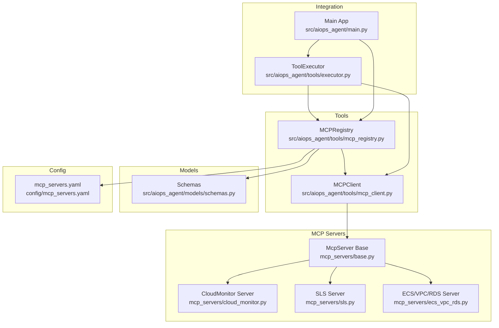
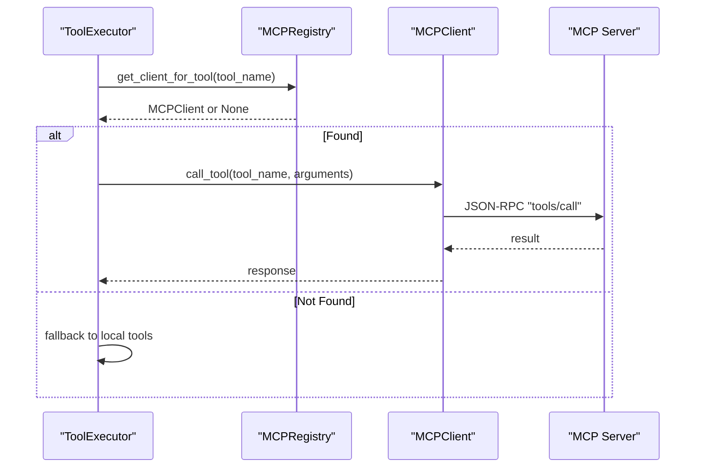
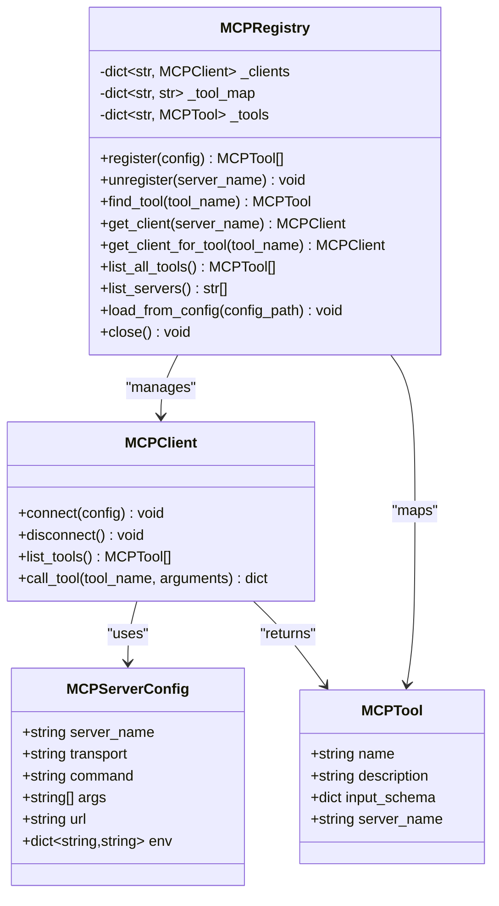
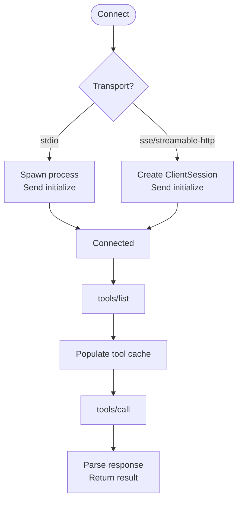
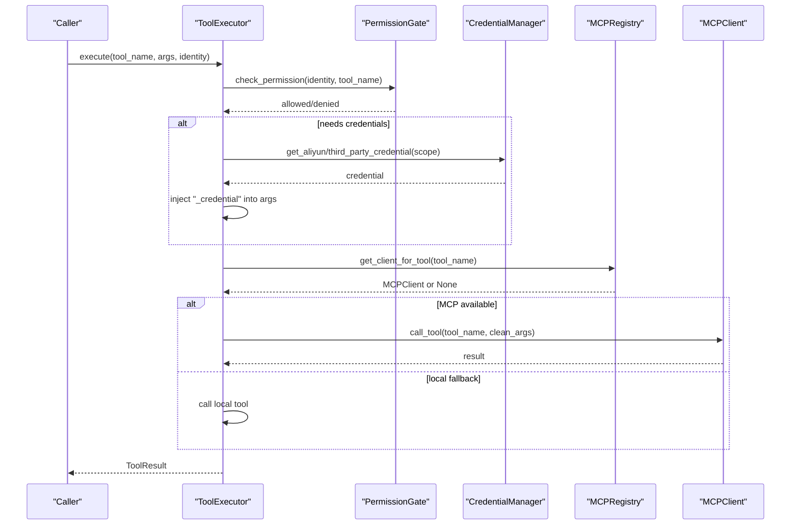
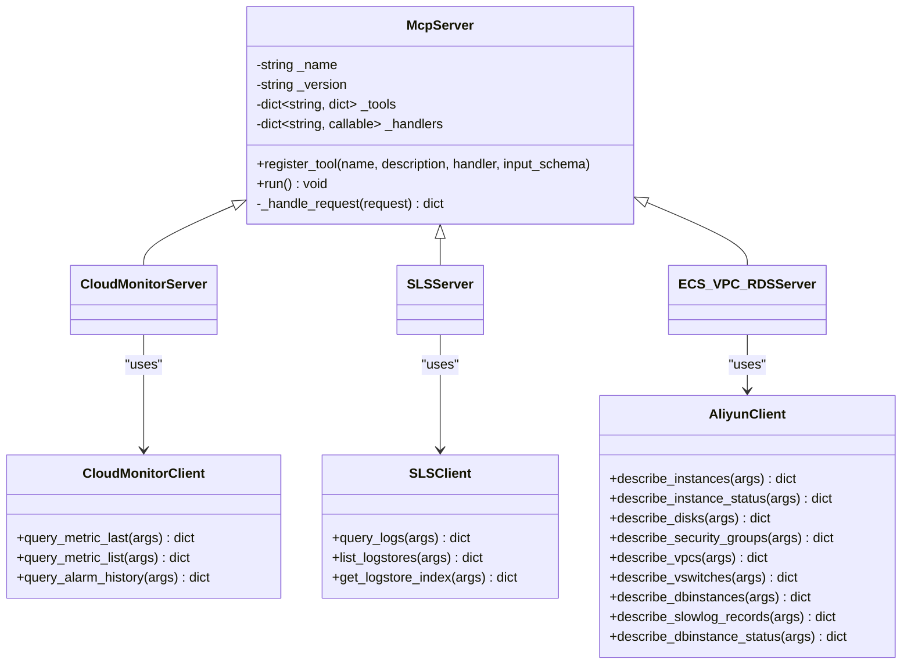
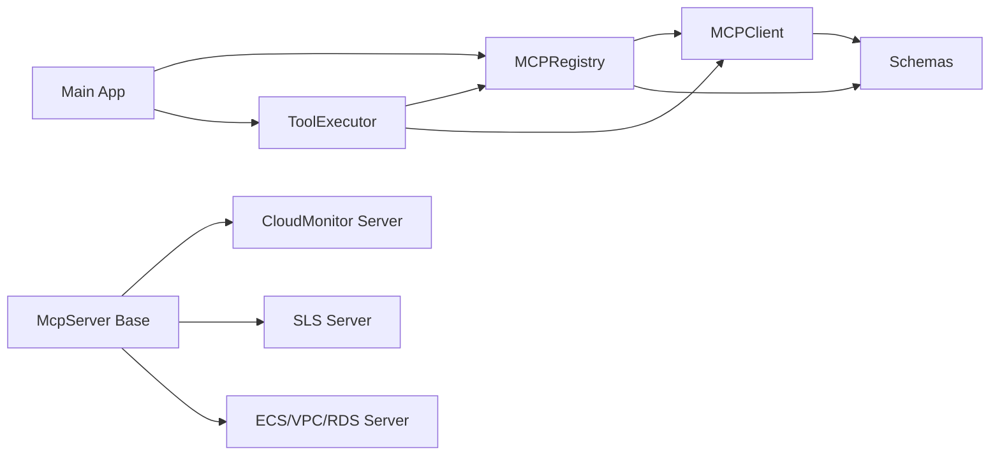

# MCP Registry System

<cite>
**Referenced Files in This Document**
- [mcp_registry.py](file://src/aiops_agent/tools/mcp_registry.py)
- [mcp_client.py](file://src/aiops_agent/tools/mcp_client.py)
- [schemas.py](file://src/aiops_agent/models/schemas.py)
- [executor.py](file://src/aiops_agent/tools/executor.py)
- [main.py](file://src/aiops_agent/main.py)
- [mcp_servers.yaml](file://config/mcp_servers.yaml)
- [base.py](file://mcp_servers/base.py)
- [cloud_monitor.py](file://mcp_servers/cloud_monitor.py)
- [sls.py](file://mcp_servers/sls.py)
- [ecs_vpc_rds.py](file://mcp_servers/ecs_vpc_rds.py)
- [test_mcp_registry.py](file://tests/test_mcp_registry.py)
</cite>

## Table of Contents
1. [Introduction](#introduction)
2. [Project Structure](#project-structure)
3. [Core Components](#core-components)
4. [Architecture Overview](#architecture-overview)
5. [Detailed Component Analysis](#detailed-component-analysis)
6. [Dependency Analysis](#dependency-analysis)
7. [Performance Considerations](#performance-considerations)
8. [Troubleshooting Guide](#troubleshooting-guide)
9. [Conclusion](#conclusion)
10. [Appendices](#appendices)

## Introduction
This document describes the MCP Registry system that powers Model Context Protocol (MCP) server discovery and tool mapping within the AIOps Agent. It explains how MCP servers are registered, discovered, and matched to tools, how the registry participates in the tool execution pipeline, and how dynamic server management works. It also covers configuration of MCP endpoints, authentication handling via environment variables, and practical examples for setup and troubleshooting.

## Project Structure
The MCP Registry system spans several modules:
- Tools: MCP registry and client implementations
- Models: Shared data models for MCP configurations and tools
- Skills and Orchestrator: Integration with the broader tool execution pipeline
- MCP Servers: Example MCP server implementations for Alibaba Cloud services
- Config: YAML configuration for MCP server endpoints

**Diagram sources**
- [mcp_registry.py:20-162](file://src/aiops_agent/tools/mcp_registry.py#L20-L162)
- [mcp_client.py:22-324](file://src/aiops_agent/tools/mcp_client.py#L22-L324)
- [schemas.py:144-162](file://src/aiops_agent/models/schemas.py#L144-L162)
- [executor.py:45-314](file://src/aiops_agent/tools/executor.py#L45-L314)
- [main.py:70-222](file://src/aiops_agent/main.py#L70-L222)
- [base.py:14-108](file://mcp_servers/base.py#L14-L108)
- [cloud_monitor.py:74-125](file://mcp_servers/cloud_monitor.py#L74-L125)
- [sls.py:49-91](file://mcp_servers/sls.py#L49-L91)
- [ecs_vpc_rds.py:101-119](file://mcp_servers/ecs_vpc_rds.py#L101-L119)
- [mcp_servers.yaml:1-41](file://config/mcp_servers.yaml#L1-L41)

**Section sources**
- [mcp_registry.py:1-162](file://src/aiops_agent/tools/mcp_registry.py#L1-L162)
- [mcp_client.py:1-324](file://src/aiops_agent/tools/mcp_client.py#L1-L324)
- [schemas.py:144-162](file://src/aiops_agent/models/schemas.py#L144-L162)
- [executor.py:1-314](file://src/aiops_agent/tools/executor.py#L1-L314)
- [main.py:1-311](file://src/aiops_agent/main.py#L1-L311)
- [mcp_servers.yaml:1-41](file://config/mcp_servers.yaml#L1-L41)
- [base.py:1-108](file://mcp_servers/base.py#L1-L108)
- [cloud_monitor.py:1-131](file://mcp_servers/cloud_monitor.py#L1-L131)
- [sls.py:1-97](file://mcp_servers/sls.py#L1-L97)
- [ecs_vpc_rds.py:1-125](file://mcp_servers/ecs_vpc_rds.py#L1-L125)

## Core Components
- MCPRegistry: Manages MCP server lifecycle, loads configuration, maintains tool-to-server mapping, and exposes lookup APIs.
- MCPClient: Implements JSON-RPC over stdio and HTTP/SSE transports, supports tool discovery and invocation.
- MCPServerConfig and MCPTool: Pydantic models defining server configuration and tool metadata.
- ToolExecutor: Integrates permission checks, credential acquisition, and dispatches to MCP or local tools.
- Example MCP Servers: Alibaba Cloud integrations demonstrating tool registration and execution.

Key responsibilities:
- Registration and discovery: Connect to servers, list tools, populate internal maps.
- Tool resolution: Map tool names to MCP clients and servers.
- Dynamic management: Load from YAML, support re-registration, graceful shutdown.
- Execution pipeline: Used by ToolExecutor to route tool calls to MCP servers.

**Section sources**
- [mcp_registry.py:20-162](file://src/aiops_agent/tools/mcp_registry.py#L20-L162)
- [mcp_client.py:22-324](file://src/aiops_agent/tools/mcp_client.py#L22-L324)
- [schemas.py:144-162](file://src/aiops_agent/models/schemas.py#L144-L162)
- [executor.py:45-314](file://src/aiops_agent/tools/executor.py#L45-L314)

## Architecture Overview
The MCP Registry sits between the ToolExecutor and the MCP servers. ToolExecutor queries the registry to resolve which MCP client serves a given tool, then invokes the client’s tool call method. The registry itself loads server configurations from YAML and maintains in-memory maps for fast lookups.

**Diagram sources**
- [executor.py:276-295](file://src/aiops_agent/tools/executor.py#L276-L295)
- [mcp_registry.py:103-108](file://src/aiops_agent/tools/mcp_registry.py#L103-L108)
- [mcp_client.py:135-155](file://src/aiops_agent/tools/mcp_client.py#L135-L155)

**Section sources**
- [executor.py:276-295](file://src/aiops_agent/tools/executor.py#L276-L295)
- [mcp_registry.py:95-116](file://src/aiops_agent/tools/mcp_registry.py#L95-L116)
- [mcp_client.py:135-155](file://src/aiops_agent/tools/mcp_client.py#L135-L155)

## Detailed Component Analysis

### MCPRegistry
Responsibilities:
- Register/unregister MCP servers, maintain client instances and tool maps.
- Discover tools via MCPClient and populate tool-to-server mappings.
- Load server configurations from YAML and skip disabled entries.
- Provide lookup APIs for tools and clients.

Implementation highlights:
- Registration flow: connect, list tools, update maps, log results.
- Unregistration: disconnect client and clean tool mappings.
- Configuration loader: parse YAML, construct MCPServerConfig, register each enabled server.
- Lifecycle: close all connections during shutdown.

**Diagram sources**
- [mcp_registry.py:20-162](file://src/aiops_agent/tools/mcp_registry.py#L20-L162)
- [mcp_client.py:22-324](file://src/aiops_agent/tools/mcp_client.py#L22-L324)
- [schemas.py:144-162](file://src/aiops_agent/models/schemas.py#L144-L162)

**Section sources**
- [mcp_registry.py:38-162](file://src/aiops_agent/tools/mcp_registry.py#L38-L162)
- [schemas.py:144-162](file://src/aiops_agent/models/schemas.py#L144-L162)

### MCPClient
Capabilities:
- Transport modes: stdio (local subprocess) and HTTP/SSE (remote).
- JSON-RPC 2.0 messaging: initialize handshake, tools/list, tools/call.
- Error handling: raises runtime errors on connection/tool failures.
- HTTP transport: uses aiohttp with timeouts; stdio transport uses asyncio subprocess streams.

**Diagram sources**
- [mcp_client.py:56-156](file://src/aiops_agent/tools/mcp_client.py#L56-L156)
- [mcp_client.py:225-256](file://src/aiops_agent/tools/mcp_client.py#L225-L256)

**Section sources**
- [mcp_client.py:56-274](file://src/aiops_agent/tools/mcp_client.py#L56-L274)

### ToolExecutor Integration
ToolExecutor orchestrates permission checks, credential acquisition, and tool dispatch. It prioritizes MCP tools (via registry) and falls back to local tools if unavailable.

**Diagram sources**
- [executor.py:80-295](file://src/aiops_agent/tools/executor.py#L80-L295)
- [mcp_registry.py:103-108](file://src/aiops_agent/tools/mcp_registry.py#L103-L108)
- [mcp_client.py:135-155](file://src/aiops_agent/tools/mcp_client.py#L135-L155)

**Section sources**
- [executor.py:80-295](file://src/aiops_agent/tools/executor.py#L80-L295)

### Example MCP Servers
The repository includes three example MCP servers demonstrating tool registration and execution patterns:
- CloudMonitor: registers metric query tools and alarm history retrieval.
- SLS: registers log query, list logstores, and index retrieval tools.
- ECS/VPC/RDS: registers infrastructure inspection tools.

These servers inherit from a shared McpServer base that implements JSON-RPC handling, tool registration, and request routing.

**Diagram sources**
- [base.py:14-108](file://mcp_servers/base.py#L14-L108)
- [cloud_monitor.py:74-125](file://mcp_servers/cloud_monitor.py#L74-L125)
- [sls.py:49-91](file://mcp_servers/sls.py#L49-L91)
- [ecs_vpc_rds.py:101-119](file://mcp_servers/ecs_vpc_rds.py#L101-L119)

**Section sources**
- [base.py:14-108](file://mcp_servers/base.py#L14-L108)
- [cloud_monitor.py:74-125](file://mcp_servers/cloud_monitor.py#L74-L125)
- [sls.py:49-91](file://mcp_servers/sls.py#L49-L91)
- [ecs_vpc_rds.py:101-119](file://mcp_servers/ecs_vpc_rds.py#L101-L119)

## Dependency Analysis
- MCPRegistry depends on MCPClient and Pydantic models for configuration and tool definitions.
- MCPClient depends on MCPServerConfig and MCPTool models, and uses aiohttp for HTTP transport.
- ToolExecutor depends on MCPRegistry for MCP tool resolution and on MCPClient for execution.
- Example MCP servers depend on McpServer base and use environment variables for credentials.

**Diagram sources**
- [mcp_registry.py:14-15](file://src/aiops_agent/tools/mcp_registry.py#L14-L15)
- [mcp_client.py:17-19](file://src/aiops_agent/tools/mcp_client.py#L17-L19)
- [schemas.py:144-162](file://src/aiops_agent/models/schemas.py#L144-L162)
- [executor.py:35-36](file://src/aiops_agent/tools/executor.py#L35-L36)
- [main.py:40-40](file://src/aiops_agent/main.py#L40-L40)
- [base.py:14-21](file://mcp_servers/base.py#L14-L21)

**Section sources**
- [mcp_registry.py:14-15](file://src/aiops_agent/tools/mcp_registry.py#L14-L15)
- [mcp_client.py:17-19](file://src/aiops_agent/tools/mcp_client.py#L17-L19)
- [schemas.py:144-162](file://src/aiops_agent/models/schemas.py#L144-L162)
- [executor.py:35-36](file://src/aiops_agent/tools/executor.py#L35-L36)
- [main.py:40-40](file://src/aiops_agent/main.py#L40-L40)
- [base.py:14-21](file://mcp_servers/base.py#L14-L21)

## Performance Considerations
- Transport choice: stdio avoids network overhead but ties execution to the local process; HTTP/SSE enables remote servers with potential latency and network reliability trade-offs.
- Tool caching: MCPClient caches tool lists after discovery to avoid repeated network calls.
- Concurrency: ToolExecutor uses asyncio and semaphores for concurrent task execution; MCPRegistry does not introduce concurrency but relies on MCPClient’s async I/O.
- Retry and timeout: ToolExecutor applies exponential backoff and timeout controls around tool execution; MCPClient enforces timeouts for HTTP requests.

[No sources needed since this section provides general guidance]

## Troubleshooting Guide
Common issues and resolutions:
- Server not found or tool not registered:
  - Verify server configuration in YAML and ensure the server is enabled.
  - Confirm tool names match exactly; ToolExecutor resolves tools via registry lookups.
- Connection failures:
  - For stdio, ensure the command and arguments are correct and executable.
  - For HTTP/SSE, verify URL and network reachability; check timeouts and server status.
- Authentication and credentials:
  - Example MCP servers read credentials from environment variables; ensure REGION and Alibaba Cloud credential variables are set.
- Registry loading errors:
  - YAML parsing errors or missing files are handled gracefully; check logs for detailed error messages.
- Re-registration and updates:
  - Re-registering a server automatically unregisters the old instance; ensure cleanup completes before re-registering.

Validation references:
- Registry tests cover registration, unregistration, configuration loading, and error handling scenarios.

**Section sources**
- [test_mcp_registry.py:57-128](file://tests/test_mcp_registry.py#L57-L128)
- [test_mcp_registry.py:134-166](file://tests/test_mcp_registry.py#L134-L166)
- [test_mcp_registry.py:271-442](file://tests/test_mcp_registry.py#L271-L442)
- [mcp_client.py:248-256](file://src/aiops_agent/tools/mcp_client.py#L248-L256)
- [cloud_monitor.py:75-77](file://mcp_servers/cloud_monitor.py#L75-L77)
- [sls.py:50-52](file://mcp_servers/sls.py#L50-L52)
- [ecs_vpc_rds.py:102-104](file://mcp_servers/ecs_vpc_rds.py#L102-L104)

## Conclusion
The MCP Registry system provides a robust foundation for discovering and managing MCP servers, mapping tools to servers, and integrating with the broader tool execution pipeline. Its design supports dynamic configuration, flexible transport modes, and seamless fallback to local tools. By leveraging environment-based authentication and structured error handling, it offers a production-ready mechanism for extending the agent with external MCP-capable services.

[No sources needed since this section summarizes without analyzing specific files]

## Appendices

### Configuration of MCP Endpoints
- YAML configuration template defines servers with transport type, command/URL, arguments, environment variables, and enable flag.
- Example servers include CloudMonitor, SLS, and ECS/VPC/RDS integrations configured via stdio.

**Section sources**
- [mcp_servers.yaml:1-41](file://config/mcp_servers.yaml#L1-L41)
- [cloud_monitor.py:74-125](file://mcp_servers/cloud_monitor.py#L74-L125)
- [sls.py:49-91](file://mcp_servers/sls.py#L49-L91)
- [ecs_vpc_rds.py:101-119](file://mcp_servers/ecs_vpc_rds.py#L101-L119)

### Authentication Handling
- Example MCP servers read credentials from environment variables (e.g., REGION, Alibaba Cloud access keys).
- ToolExecutor injects credentials into tool arguments when a credential scope is provided.

**Section sources**
- [cloud_monitor.py:75-77](file://mcp_servers/cloud_monitor.py#L75-L77)
- [sls.py:50-52](file://mcp_servers/sls.py#L50-L52)
- [ecs_vpc_rds.py:102-104](file://mcp_servers/ecs_vpc_rds.py#L102-L104)
- [executor.py:136-147](file://src/aiops_agent/tools/executor.py#L136-L147)

### Dynamic Server Management
- Registry supports loading servers from YAML, enabling/disabling servers, and re-registering existing servers.
- Graceful shutdown disconnects all clients and clears mappings.

**Section sources**
- [mcp_registry.py:122-162](file://src/aiops_agent/tools/mcp_registry.py#L122-L162)
- [test_mcp_registry.py:271-442](file://tests/test_mcp_registry.py#L271-L442)

### Tool Execution Pipeline Integration
- ToolExecutor resolves tools via MCPRegistry, executes via MCPClient, and handles errors, retries, and auditing.
- MCPClient implements JSON-RPC over stdio and HTTP transports with proper error propagation.

**Section sources**
- [executor.py:276-295](file://src/aiops_agent/tools/executor.py#L276-L295)
- [mcp_client.py:161-219](file://src/aiops_agent/tools/mcp_client.py#L161-L219)