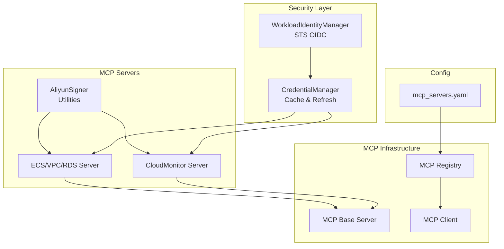
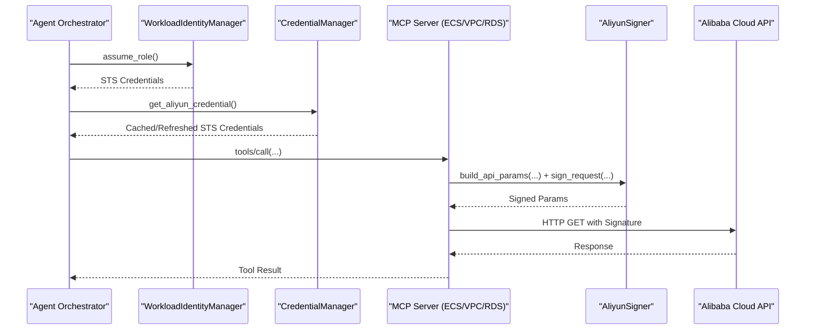
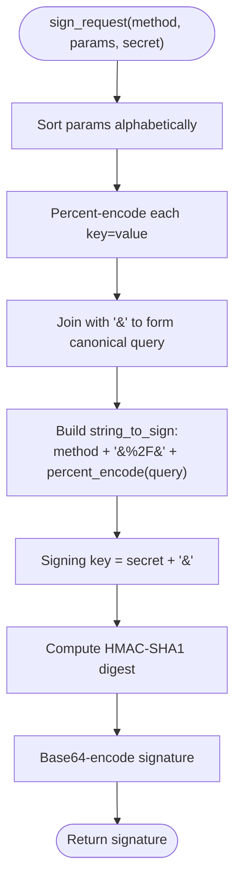
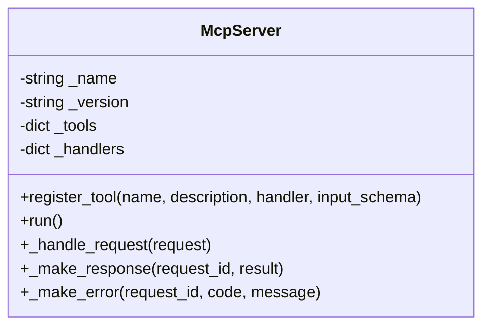
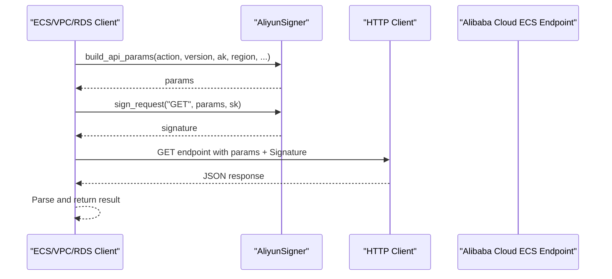
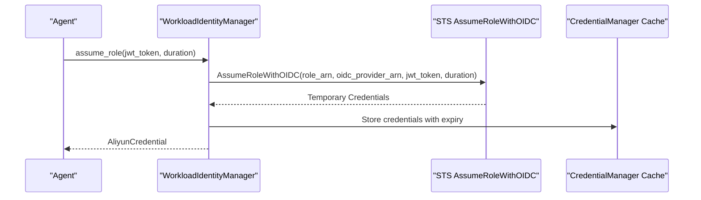
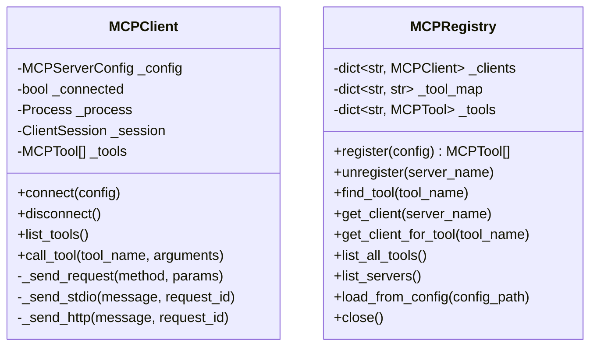
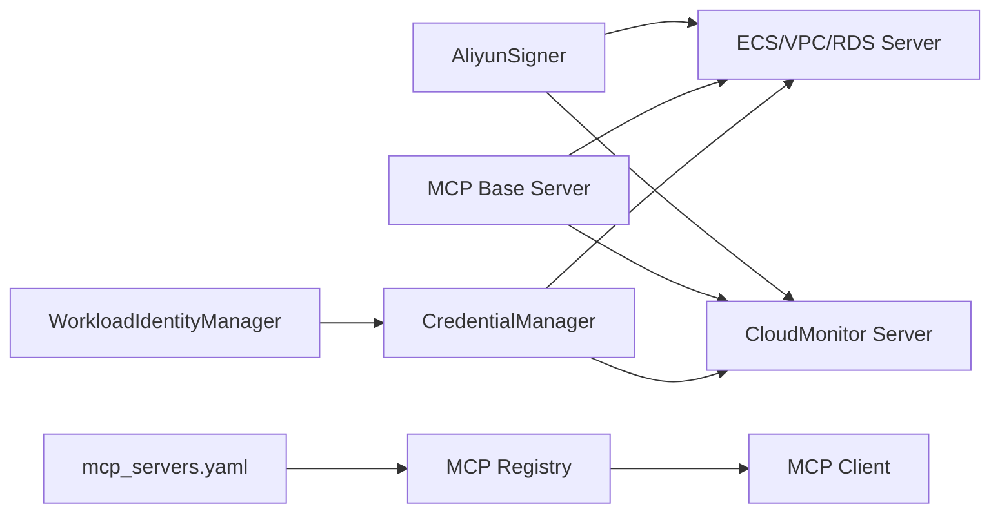

# AliyunSigner Cryptographic Operations

<cite>
**Referenced Files in This Document**
- [aliyun_signer.py](file://mcp_servers/aliyun_signer.py)
- [base.py](file://mcp_servers/base.py)
- [ecs_vpc_rds.py](file://mcp_servers/ecs_vpc_rds.py)
- [cloud_monitor.py](file://mcp_servers/cloud_monitor.py)
- [credential_manager.py](file://src/aiops_agent/security/credential_manager.py)
- [identity.py](file://src/aiops_agent/security/identity.py)
- [schemas.py](file://src/aiops_agent/models/schemas.py)
- [mcp_client.py](file://src/aiops_agent/tools/mcp_client.py)
- [mcp_registry.py](file://src/aiops_agent/tools/mcp_registry.py)
- [mcp_servers.yaml](file://config/mcp_servers.yaml)
- [test_aliyun_signer.py](file://tests/mcp_servers/test_aliyun_signer.py)
- [test_mcp_signer.py](file://tests/test_mcp_signer.py)
- [main.py](file://src/aiops_agent/main.py)
</cite>

## Table of Contents
1. [Introduction](#introduction)
2. [Project Structure](#project-structure)
3. [Core Components](#core-components)
4. [Architecture Overview](#architecture-overview)
5. [Detailed Component Analysis](#detailed-component-analysis)
6. [Dependency Analysis](#dependency-analysis)
7. [Performance Considerations](#performance-considerations)
8. [Troubleshooting Guide](#troubleshooting-guide)
9. [Conclusion](#conclusion)
10. [Appendices](#appendices)

## Introduction
This document describes the AliyunSigner cryptographic operations within the AIOps Agent’s MCP (Model Context Protocol) server ecosystem. It focuses on the HMAC-SHA1 signature generation used for Alibaba Cloud service authentication, the URL encoding rules required by the Alibaba Cloud API, and the integration with Alibaba Cloud KMS and STS for secure credential lifecycle management. It also documents how the MCP server composes API requests, signs them, and executes them against Alibaba Cloud endpoints, along with security best practices, key rotation procedures, and compliance considerations.

## Project Structure
The AliyunSigner cryptographic logic is implemented in a dedicated module and integrated into MCP servers that communicate with Alibaba Cloud services. The broader system includes:
- AliyunSigner cryptographic utilities for parameter building and HMAC-SHA1 signing
- MCP server base class for JSON-RPC over stdio
- MCP servers for ECS/VPC/RDS and CloudMonitor that use AliyunSigner to sign requests
- Security components for Workload Identity (STS AssumeRoleWithOIDC), credential caching, and refresh
- MCP client and registry for dynamic server discovery and invocation
- Configuration for MCP server deployment and environment variables

**Diagram sources**
- [aliyun_signer.py:1-76](file://mcp_servers/aliyun_signer.py#L1-L76)
- [base.py:14-108](file://mcp_servers/base.py#L14-L108)
- [ecs_vpc_rds.py:1-41](file://mcp_servers/ecs_vpc_rds.py#L1-L41)
- [cloud_monitor.py:1-39](file://mcp_servers/cloud_monitor.py#L1-L39)
- [identity.py:38-247](file://src/aiops_agent/security/identity.py#L38-L247)
- [credential_manager.py:38-261](file://src/aiops_agent/security/credential_manager.py#L38-L261)
- [mcp_client.py:22-324](file://src/aiops_agent/tools/mcp_client.py#L22-L324)
- [mcp_registry.py:20-162](file://src/aiops_agent/tools/mcp_registry.py#L20-L162)
- [mcp_servers.yaml:1-41](file://config/mcp_servers.yaml#L1-L41)

**Section sources**
- [aliyun_signer.py:1-76](file://mcp_servers/aliyun_signer.py#L1-L76)
- [base.py:14-108](file://mcp_servers/base.py#L14-L108)
- [ecs_vpc_rds.py:1-41](file://mcp_servers/ecs_vpc_rds.py#L1-L41)
- [cloud_monitor.py:1-39](file://mcp_servers/cloud_monitor.py#L1-L39)
- [identity.py:38-247](file://src/aiops_agent/security/identity.py#L38-L247)
- [credential_manager.py:38-261](file://src/aiops_agent/security/credential_manager.py#L38-L261)
- [mcp_client.py:22-324](file://src/aiops_agent/tools/mcp_client.py#L22-L324)
- [mcp_registry.py:20-162](file://src/aiops_agent/tools/mcp_registry.py#L20-L162)
- [mcp_servers.yaml:1-41](file://config/mcp_servers.yaml#L1-L41)

## Core Components
- AliyunSigner cryptographic utilities:
  - Percent-encoding tailored to Alibaba Cloud API requirements
  - Parameter builder for Alibaba Cloud API common parameters
  - HMAC-SHA1 signature generator for request canonicalization
- MCP server base class:
  - JSON-RPC over stdio with initialize/tools/list/tools/call handlers
- MCP servers for Alibaba Cloud services:
  - ECS/VPC/RDS and CloudMonitor servers that compose signed requests
- Security layer:
  - WorkloadIdentityManager for STS AssumeRoleWithOIDC
  - CredentialManager for caching and refreshing temporary credentials
- MCP infrastructure:
  - MCPClient and MCPRegistry for dynamic server registration and invocation

**Section sources**
- [aliyun_signer.py:13-76](file://mcp_servers/aliyun_signer.py#L13-L76)
- [base.py:14-108](file://mcp_servers/base.py#L14-L108)
- [ecs_vpc_rds.py:19-41](file://mcp_servers/ecs_vpc_rds.py#L19-L41)
- [cloud_monitor.py:17-39](file://mcp_servers/cloud_monitor.py#L17-L39)
- [identity.py:38-247](file://src/aiops_agent/security/identity.py#L38-L247)
- [credential_manager.py:38-261](file://src/aiops_agent/security/credential_manager.py#L38-L261)
- [mcp_client.py:22-324](file://src/aiops_agent/tools/mcp_client.py#L22-L324)
- [mcp_registry.py:20-162](file://src/aiops_agent/tools/mcp_registry.py#L20-L162)

## Architecture Overview
The AliyunSigner cryptographic operations integrate with Alibaba Cloud STS-assisted Workload Identity and MCP servers to securely call Alibaba Cloud APIs. The flow is:
- WorkloadIdentityManager obtains temporary STS credentials via AssumeRoleWithOIDC
- CredentialManager caches and refreshes these credentials
- MCP servers use AliyunSigner to build API parameters and compute HMAC-SHA1 signatures
- Signed requests are sent to Alibaba Cloud endpoints via HTTP clients

**Diagram sources**
- [identity.py:119-173](file://src/aiops_agent/security/identity.py#L119-L173)
- [credential_manager.py:63-121](file://src/aiops_agent/security/credential_manager.py#L63-L121)
- [ecs_vpc_rds.py:25-41](file://mcp_servers/ecs_vpc_rds.py#L25-L41)
- [aliyun_signer.py:25-76](file://mcp_servers/aliyun_signer.py#L25-L76)

## Detailed Component Analysis

### AliyunSigner Cryptographic Utilities
The AliyunSigner module provides:
- Percent-encoding tailored to Alibaba Cloud API rules
- Build API parameters with Alibaba Cloud common fields and extra parameters
- Compute HMAC-SHA1 signature over the canonicalized string-to-sign

**Diagram sources**
- [aliyun_signer.py:51-76](file://mcp_servers/aliyun_signer.py#L51-L76)

**Section sources**
- [aliyun_signer.py:13-76](file://mcp_servers/aliyun_signer.py#L13-L76)
- [test_aliyun_signer.py:12-108](file://tests/mcp_servers/test_aliyun_signer.py#L12-L108)
- [test_mcp_signer.py:18-54](file://tests/test_mcp_signer.py#L18-L54)

### MCP Server Base Class
The base MCP server implements JSON-RPC 2.0 over stdio with:
- initialize, tools/list, tools/call, notifications/initialized handlers
- Request parsing, response construction, and error handling
- Tool registration and handler dispatch

**Diagram sources**
- [base.py:14-108](file://mcp_servers/base.py#L14-L108)

**Section sources**
- [base.py:14-108](file://mcp_servers/base.py#L14-L108)

### ECS/VPC/RDS MCP Server Integration
The ECS/VPC/RDS server demonstrates how AliyunSigner is used:
- Builds API parameters with access key, region, and action/version
- Computes HMAC-SHA1 signature using AliyunSigner
- Sends HTTP GET request to Alibaba Cloud endpoint

**Diagram sources**
- [ecs_vpc_rds.py:25-41](file://mcp_servers/ecs_vpc_rds.py#L25-L41)
- [aliyun_signer.py:25-76](file://mcp_servers/aliyun_signer.py#L25-L76)

**Section sources**
- [ecs_vpc_rds.py:19-41](file://mcp_servers/ecs_vpc_rds.py#L19-L41)

### CloudMonitor MCP Server Integration
The CloudMonitor server follows the same pattern for metric queries.

**Section sources**
- [cloud_monitor.py:17-39](file://mcp_servers/cloud_monitor.py#L17-L39)

### Workload Identity and STS Integration
The WorkloadIdentityManager obtains temporary STS credentials via AssumeRoleWithOIDC:
- Reads Kubernetes ServiceAccount JWT or accepts a provided JWT
- Calls STS AssumeRoleWithOIDC to exchange for temporary credentials
- Automatically refreshes credentials before expiration

**Diagram sources**
- [identity.py:119-173](file://src/aiops_agent/security/identity.py#L119-L173)
- [credential_manager.py:63-121](file://src/aiops_agent/security/credential_manager.py#L63-L121)

**Section sources**
- [identity.py:38-247](file://src/aiops_agent/security/identity.py#L38-L247)
- [credential_manager.py:38-261](file://src/aiops_agent/security/credential_manager.py#L38-L261)

### MCP Client and Registry
The MCP client and registry enable dynamic discovery and invocation of MCP servers:
- Connect to stdio or HTTP/SSE servers
- List tools and call them by name
- Maintain tool-to-server mapping and global tool registry

**Diagram sources**
- [mcp_client.py:22-324](file://src/aiops_agent/tools/mcp_client.py#L22-L324)
- [mcp_registry.py:20-162](file://src/aiops_agent/tools/mcp_registry.py#L20-L162)

**Section sources**
- [mcp_client.py:22-324](file://src/aiops_agent/tools/mcp_client.py#L22-L324)
- [mcp_registry.py:20-162](file://src/aiops_agent/tools/mcp_registry.py#L20-L162)

## Dependency Analysis
- AliyunSigner depends on standard library modules for hashing, HMAC, URL encoding, and time handling.
- MCP servers depend on AliyunSigner and the base server class.
- Security components (WorkloadIdentityManager and CredentialManager) are injected into the Agent initialization pipeline.
- MCP registry loads configuration and dynamically connects to MCP servers.

**Diagram sources**
- [aliyun_signer.py:1-76](file://mcp_servers/aliyun_signer.py#L1-L76)
- [base.py:14-108](file://mcp_servers/base.py#L14-L108)
- [ecs_vpc_rds.py:1-41](file://mcp_servers/ecs_vpc_rds.py#L1-L41)
- [cloud_monitor.py:1-39](file://mcp_servers/cloud_monitor.py#L1-L39)
- [identity.py:38-247](file://src/aiops_agent/security/identity.py#L38-L247)
- [credential_manager.py:38-261](file://src/aiops_agent/security/credential_manager.py#L38-L261)
- [mcp_client.py:22-324](file://src/aiops_agent/tools/mcp_client.py#L22-L324)
- [mcp_registry.py:20-162](file://src/aiops_agent/tools/mcp_registry.py#L20-L162)
- [mcp_servers.yaml:1-41](file://config/mcp_servers.yaml#L1-L41)

**Section sources**
- [aliyun_signer.py:1-76](file://mcp_servers/aliyun_signer.py#L1-L76)
- [base.py:14-108](file://mcp_servers/base.py#L14-L108)
- [ecs_vpc_rds.py:1-41](file://mcp_servers/ecs_vpc_rds.py#L1-L41)
- [cloud_monitor.py:1-39](file://mcp_servers/cloud_monitor.py#L1-L39)
- [identity.py:38-247](file://src/aiops_agent/security/identity.py#L38-L247)
- [credential_manager.py:38-261](file://src/aiops_agent/security/credential_manager.py#L38-L261)
- [mcp_client.py:22-324](file://src/aiops_agent/tools/mcp_client.py#L22-L324)
- [mcp_registry.py:20-162](file://src/aiops_agent/tools/mcp_registry.py#L20-L162)
- [mcp_servers.yaml:1-41](file://config/mcp_servers.yaml#L1-L41)

## Performance Considerations
- Signature computation is lightweight and CPU-bound; negligible overhead compared to network latency.
- Parameter sorting and percent-encoding are O(n log n) due to sorting and O(n) for encoding; acceptable for typical API parameter sets.
- Credential caching reduces repeated STS calls; refresh occurs proactively before expiration.
- Asynchronous HTTP requests minimize blocking during API calls.

[No sources needed since this section provides general guidance]

## Troubleshooting Guide
Common issues and resolutions:
- Signature mismatch:
  - Verify percent-encoding rules and canonical query formation
  - Ensure Timestamp and SignatureNonce are included and formatted correctly
  - Confirm secret key matches the AccessKeySecret used to generate credentials
- STS credential failures:
  - Check OIDC Provider ARN and Role ARN configuration
  - Validate Kubernetes ServiceAccount JWT availability or provide jwt_token manually
  - Ensure refresh task is running and credentials are cached
- MCP connectivity:
  - Confirm stdio command and args in mcp_servers.yaml
  - Verify tools/list and tools/call responses from the server
- Environment variables:
  - Ensure ALIBABA_CLOUD_ROLE_ARN, ALIBABA_CLOUD_OIDC_PROVIDER_ARN, and region are set appropriately

**Section sources**
- [test_aliyun_signer.py:12-108](file://tests/mcp_servers/test_aliyun_signer.py#L12-L108)
- [test_mcp_signer.py:18-54](file://tests/test_mcp_signer.py#L18-L54)
- [identity.py:119-173](file://src/aiops_agent/security/identity.py#L119-L173)
- [credential_manager.py:63-121](file://src/aiops_agent/security/credential_manager.py#L63-L121)
- [mcp_client.py:56-95](file://src/aiops_agent/tools/mcp_client.py#L56-L95)
- [mcp_servers.yaml:1-41](file://config/mcp_servers.yaml#L1-L41)

## Conclusion
The AliyunSigner cryptographic utilities provide a minimal, standards-based implementation of Alibaba Cloud API signing compatible with HMAC-SHA1. Combined with Workload Identity and STS, the system enables secure, credentialless operation in Kubernetes environments. The MCP server architecture cleanly separates cryptographic operations from service-specific logic, enabling easy extension to other Alibaba Cloud services and robust integration with the broader AIOps Agent security and observability stack.

[No sources needed since this section summarizes without analyzing specific files]

## Appendices

### Security Best Practices
- Use Workload Identity (STS AssumeRoleWithOIDC) to avoid embedding long-term credentials
- Enable automatic credential refresh before expiration
- Restrict RAM roles to least privilege and enforce policy checks
- Log and audit all tool invocations with sensitive parameters redacted
- Rotate OIDC providers and roles periodically; update configurations accordingly

**Section sources**
- [identity.py:38-247](file://src/aiops_agent/security/identity.py#L38-L247)
- [credential_manager.py:38-261](file://src/aiops_agent/security/credential_manager.py#L38-L261)
- [main.py:70-222](file://src/aiops_agent/main.py#L70-L222)

### Key Rotation Procedures
- Update OIDC Provider ARN and Role ARN in configuration
- Re-deploy agents; they will automatically refresh credentials via AssumeRoleWithOIDC
- Validate that MCP servers can still list tools and execute calls post-rotation

**Section sources**
- [identity.py:119-173](file://src/aiops_agent/security/identity.py#L119-L173)
- [mcp_registry.py:122-152](file://src/aiops_agent/tools/mcp_registry.py#L122-L152)

### Compliance Requirements
- Ensure data residency constraints align with configured regions
- Maintain audit logs for all administrative actions
- Enforce rate limits and anomaly detection via security guard rules
- Use standardized JSON-RPC over stdio/SSE for interoperability

**Section sources**
- [main.py:58-67](file://src/aiops_agent/main.py#L58-L67)
- [mcp_client.py:225-255](file://src/aiops_agent/tools/mcp_client.py#L225-L255)
- [mcp_servers.yaml:1-41](file://config/mcp_servers.yaml#L1-L41)