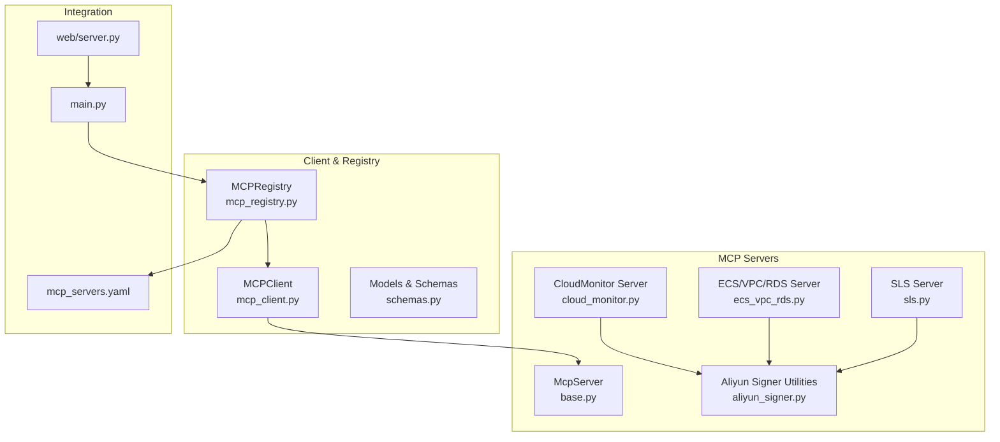
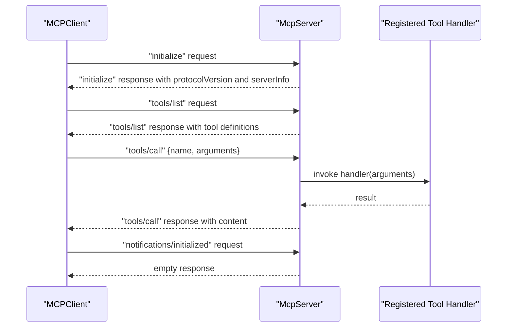
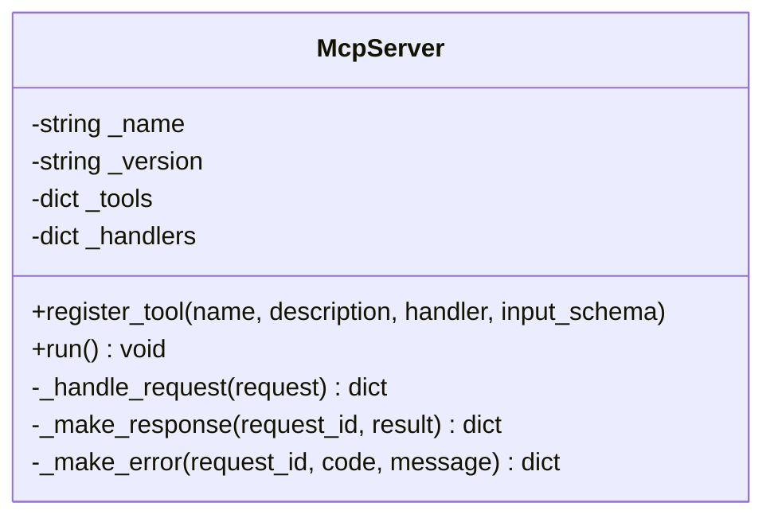
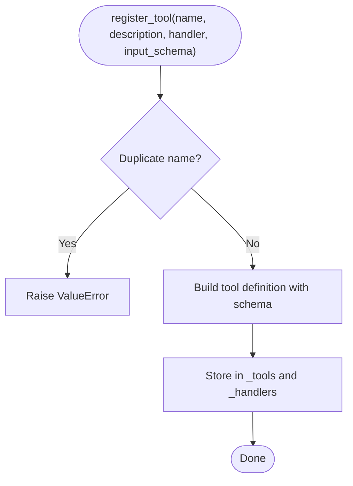
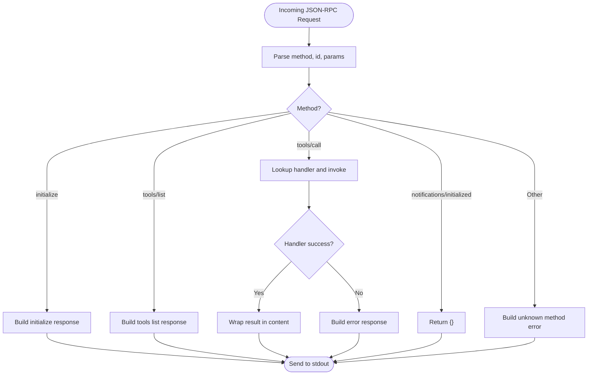
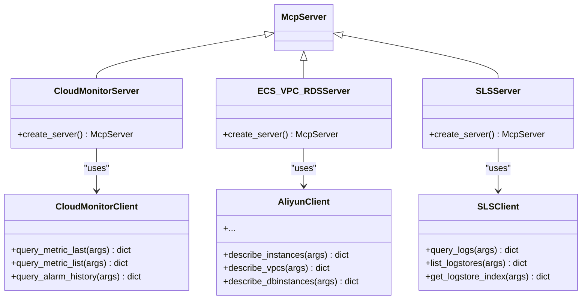
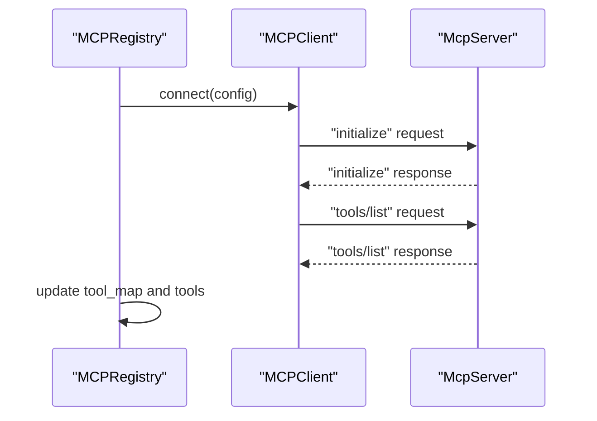
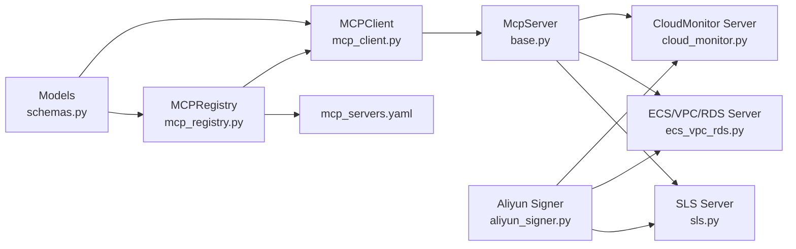

# Base MCP Server Architecture

<cite>
**Referenced Files in This Document**
- [mcp_servers/base.py](file://mcp_servers/base.py)
- [tests/test_mcp_server.py](file://tests/test_mcp_server.py)
- [tests/mcp_servers/test_base.py](file://tests/mcp_servers/test_base.py)
- [mcp_servers/cloud_monitor.py](file://mcp_servers/cloud_monitor.py)
- [mcp_servers/ecs_vpc_rds.py](file://mcp_servers/ecs_vpc_rds.py)
- [mcp_servers/sls.py](file://mcp_servers/sls.py)
- [mcp_servers/aliyun_signer.py](file://mcp_servers/aliyun_signer.py)
- [src/aiops_agent/tools/mcp_client.py](file://src/aiops_agent/tools/mcp_client.py)
- [src/aiops_agent/tools/mcp_registry.py](file://src/aiops_agent/tools/mcp_registry.py)
- [src/aiops_agent/models/schemas.py](file://src/aiops_agent/models/schemas.py)
- [config/mcp_servers.yaml](file://config/mcp_servers.yaml)
- [src/aiops_agent/main.py](file://src/aiops_agent/main.py)
- [src/aiops_agent/web/server.py](file://src/aiops_agent/web/server.py)
</cite>

## Table of Contents
1. [Introduction](#introduction)
2. [Project Structure](#project-structure)
3. [Core Components](#core-components)
4. [Architecture Overview](#architecture-overview)
5. [Detailed Component Analysis](#detailed-component-analysis)
6. [Dependency Analysis](#dependency-analysis)
7. [Performance Considerations](#performance-considerations)
8. [Troubleshooting Guide](#troubleshooting-guide)
9. [Conclusion](#conclusion)
10. [Appendices](#appendices)

## Introduction
This document describes the base Model Context Protocol (MCP) server architecture that powers Alibaba Cloud service integrations in the AIOps Agent. It focuses on the McpServer class implementation, covering JSON-RPC 2.0 protocol handling, stdio communication patterns, and the request/response lifecycle. It also explains the tool registration system, method dispatch mechanism, and error handling patterns. Finally, it demonstrates how derived classes extend the base functionality and outlines best practices for building custom MCP servers.

## Project Structure
The MCP server foundation resides under mcp_servers/base.py and is complemented by concrete implementations for Alibaba Cloud services. The client-side integration lives in src/aiops_agent/tools/, and the registry manages dynamic connections to multiple MCP servers. Configuration is centralized in config/mcp_servers.yaml.



**Diagram sources**
- [mcp_servers/base.py:14-108](file://mcp_servers/base.py#L14-L108)
- [mcp_servers/cloud_monitor.py:74-131](file://mcp_servers/cloud_monitor.py#L74-L131)
- [mcp_servers/ecs_vpc_rds.py:101-125](file://mcp_servers/ecs_vpc_rds.py#L101-L125)
- [mcp_servers/sls.py:49-97](file://mcp_servers/sls.py#L49-L97)
- [mcp_servers/aliyun_signer.py:13-76](file://mcp_servers/aliyun_signer.py#L13-L76)
- [src/aiops_agent/tools/mcp_client.py:22-324](file://src/aiops_agent/tools/mcp_client.py#L22-L324)
- [src/aiops_agent/tools/mcp_registry.py:20-162](file://src/aiops_agent/tools/mcp_registry.py#L20-L162)
- [src/aiops_agent/models/schemas.py:144-162](file://src/aiops_agent/models/schemas.py#L144-L162)
- [config/mcp_servers.yaml:1-41](file://config/mcp_servers.yaml#L1-L41)
- [src/aiops_agent/main.py:164-171](file://src/aiops_agent/main.py#L164-L171)
- [src/aiops_agent/web/server.py:196-227](file://src/aiops_agent/web/server.py#L196-L227)

**Section sources**
- [mcp_servers/base.py:14-108](file://mcp_servers/base.py#L14-L108)
- [config/mcp_servers.yaml:1-41](file://config/mcp_servers.yaml#L1-L41)

## Core Components
- McpServer: Base JSON-RPC 2.0 stdio server implementing initialize, tools/list, tools/call, and notifications/initialized.
- MCPClient: Client that connects to MCP servers via stdio or HTTP/SSE, serializes/deserializes JSON-RPC messages, and exposes list_tools and call_tool.
- MCPRegistry: Centralized registry that loads configurations, connects clients, discovers tools, and maintains tool-to-server mappings.
- Models: MCPServerConfig and MCPTool define the configuration and tool schemas used by the registry and client.

Key responsibilities:
- McpServer: Registers tools, dispatches handlers, constructs JSON-RPC responses/errors, and runs the stdio event loop.
- MCPClient: Manages stdio and HTTP transports, sends requests, parses responses, and handles timeouts.
- MCPRegistry: Loads YAML configs, registers/unregisters servers, and resolves tools to their providers.

**Section sources**
- [mcp_servers/base.py:14-108](file://mcp_servers/base.py#L14-L108)
- [src/aiops_agent/tools/mcp_client.py:22-324](file://src/aiops_agent/tools/mcp_client.py#L22-L324)
- [src/aiops_agent/tools/mcp_registry.py:20-162](file://src/aiops_agent/tools/mcp_registry.py#L20-L162)
- [src/aiops_agent/models/schemas.py:144-162](file://src/aiops_agent/models/schemas.py#L144-L162)

## Architecture Overview
The base McpServer implements a minimal JSON-RPC 2.0 interface over stdio. Derived servers plug in Alibaba Cloud APIs and register tools with input schemas. Clients discover tools and invoke them remotely. The registry automates discovery and routing.



**Diagram sources**
- [mcp_servers/base.py:76-108](file://mcp_servers/base.py#L76-L108)
- [src/aiops_agent/tools/mcp_client.py:161-274](file://src/aiops_agent/tools/mcp_client.py#L161-L274)

## Detailed Component Analysis

### McpServer: JSON-RPC 2.0 stdio Server
McpServer is the foundation for all Alibaba Cloud MCP servers. It:
- Registers tools with names, descriptions, and JSON Schemas.
- Implements a stdio-driven event loop that reads newline-delimited JSON-RPC messages.
- Dispatches to registered handlers for tools/call.
- Constructs standardized JSON-RPC responses and errors.

Key methods and behaviors:
- register_tool: Validates uniqueness and stores tool definition and handler mapping.
- run: Connects to stdin via asyncio pipe, reads lines, decodes JSON, and delegates to _handle_request.
- _handle_request: Routes to initialize, tools/list, tools/call, notifications/initialized, or returns unknown method error.
- _make_response/_make_error: Build compliant JSON-RPC 2.0 responses.



**Diagram sources**
- [mcp_servers/base.py:14-108](file://mcp_servers/base.py#L14-L108)

**Section sources**
- [mcp_servers/base.py:17-41](file://mcp_servers/base.py#L17-L41)
- [mcp_servers/base.py:42-63](file://mcp_servers/base.py#L42-L63)
- [mcp_servers/base.py:76-108](file://mcp_servers/base.py#L76-L108)

### Tool Registration System
Tools are registered with:
- name: Unique identifier used in tools/call.
- description: Human-readable description.
- input_schema: JSON Schema defining parameters; defaults to an empty object schema if omitted.
- handler: Coroutine invoked with arguments; must return a serializable result.

Validation:
- Duplicate tool names raise an error.
- Handlers are stored in a mapping keyed by tool name.



**Diagram sources**
- [mcp_servers/base.py:23-41](file://mcp_servers/base.py#L23-L41)

**Section sources**
- [mcp_servers/base.py:23-41](file://mcp_servers/base.py#L23-L41)

### Method Dispatch Mechanism
McpServer routes incoming JSON-RPC requests by method:
- initialize: Returns protocolVersion, capabilities, and serverInfo.
- tools/list: Returns the list of registered tools with their definitions.
- tools/call: Invokes the registered handler and wraps the result in a content array; errors are mapped to JSON-RPC error codes.
- notifications/initialized: Returns an empty object.

Error handling:
- Unknown methods return a JSON-RPC -32601 error.
- Missing handlers return -32601.
- Exceptions in handlers return -32603 with the exception message.



**Diagram sources**
- [mcp_servers/base.py:76-108](file://mcp_servers/base.py#L76-L108)

**Section sources**
- [mcp_servers/base.py:76-108](file://mcp_servers/base.py#L76-L108)

### Stdio Communication Patterns
McpServer’s run loop:
- Creates an asyncio.StreamReader and StreamReaderProtocol.
- Connects the protocol to sys.stdin.buffer via a read pipe.
- Reads lines until EOF, decodes JSON, calls _handle_request, and writes the response to stdout with a trailing newline.

Error handling:
- Ignores malformed JSON lines.
- Logs unexpected exceptions during request handling.

```mermaid
sequenceDiagram
participant Loop as "McpServer.run()"
participant Reader as "StreamReader"
participant Stdin as "sys.stdin"
participant Handler as "_handle_request"
participant Stdout as "sys.stdout"
Loop->>Reader : connect_read_pipe()
loop Read loop
Loop->>Stdin : readline()
Stdin-->>Loop : bytes
alt line present
Loop->>Handler : json.loads(line)
Handler-->>Loop : response or None
alt response is not None
Loop->>Stdout : write(json.dumps(response)+"\\n")
Stdout-->>Loop : flush
end
else EOF
Loop-->>Loop : break
end
end
```

**Diagram sources**
- [mcp_servers/base.py:42-63](file://mcp_servers/base.py#L42-L63)

**Section sources**
- [mcp_servers/base.py:42-63](file://mcp_servers/base.py#L42-L63)

### Derived Servers: Extending McpServer
Derived servers instantiate McpServer, create service clients, and register tools with input schemas. They demonstrate:
- Environment-driven configuration (REGION, AK, SK).
- Handler implementations that call external APIs and return structured results.
- Tool registration with precise JSON Schemas.

Examples:
- CloudMonitor Server: registers query_metric_last, query_metric_list, and query_alarm_history.
- ECS/VPC/RDS Server: registers multiple resource query tools.
- SLS Server: registers log query and index tools.



**Diagram sources**
- [mcp_servers/cloud_monitor.py:74-125](file://mcp_servers/cloud_monitor.py#L74-L125)
- [mcp_servers/ecs_vpc_rds.py:101-119](file://mcp_servers/ecs_vpc_rds.py#L101-L119)
- [mcp_servers/sls.py:49-91](file://mcp_servers/sls.py#L49-L91)

**Section sources**
- [mcp_servers/cloud_monitor.py:74-125](file://mcp_servers/cloud_monitor.py#L74-L125)
- [mcp_servers/ecs_vpc_rds.py:101-119](file://mcp_servers/ecs_vpc_rds.py#L101-L119)
- [mcp_servers/sls.py:49-91](file://mcp_servers/sls.py#L49-L91)

### MCP Client and Registry Integration
MCPClient:
- Supports stdio and HTTP/SSE transports.
- Sends JSON-RPC requests and parses responses, raising runtime errors on RPC errors.
- Provides list_tools and call_tool helpers.

MCPRegistry:
- Loads mcp_servers.yaml, creates MCPServerConfig instances, and connects MCPClient.
- Discovers tools, builds tool-to-server mappings, and exposes list_all_tools and get_client_for_tool.



**Diagram sources**
- [src/aiops_agent/tools/mcp_registry.py:38-69](file://src/aiops_agent/tools/mcp_registry.py#L38-L69)
- [src/aiops_agent/tools/mcp_client.py:56-95](file://src/aiops_agent/tools/mcp_client.py#L56-L95)
- [src/aiops_agent/tools/mcp_client.py:100-129](file://src/aiops_agent/tools/mcp_client.py#L100-L129)

**Section sources**
- [src/aiops_agent/tools/mcp_client.py:22-324](file://src/aiops_agent/tools/mcp_client.py#L22-L324)
- [src/aiops_agent/tools/mcp_registry.py:20-162](file://src/aiops_agent/tools/mcp_registry.py#L20-L162)
- [config/mcp_servers.yaml:1-41](file://config/mcp_servers.yaml#L1-L41)

## Dependency Analysis
- McpServer depends on Python stdio and asyncio for I/O.
- Derived servers depend on McpServer and Alibaba Cloud signing utilities.
- MCPClient depends on aiohttp for HTTP/SSE and asyncio for stdio.
- MCPRegistry depends on YAML parsing and the client to manage lifecycles.
- Models define shared schemas used across the ecosystem.



**Diagram sources**
- [mcp_servers/base.py:14-108](file://mcp_servers/base.py#L14-L108)
- [mcp_servers/cloud_monitor.py:74-125](file://mcp_servers/cloud_monitor.py#L74-L125)
- [mcp_servers/ecs_vpc_rds.py:101-119](file://mcp_servers/ecs_vpc_rds.py#L101-L119)
- [mcp_servers/sls.py:49-91](file://mcp_servers/sls.py#L49-L91)
- [mcp_servers/aliyun_signer.py:13-76](file://mcp_servers/aliyun_signer.py#L13-L76)
- [src/aiops_agent/tools/mcp_client.py:22-324](file://src/aiops_agent/tools/mcp_client.py#L22-L324)
- [src/aiops_agent/tools/mcp_registry.py:20-162](file://src/aiops_agent/tools/mcp_registry.py#L20-L162)
- [src/aiops_agent/models/schemas.py:144-162](file://src/aiops_agent/models/schemas.py#L144-L162)
- [config/mcp_servers.yaml:1-41](file://config/mcp_servers.yaml#L1-L41)

**Section sources**
- [mcp_servers/base.py:14-108](file://mcp_servers/base.py#L14-L108)
- [src/aiops_agent/tools/mcp_client.py:22-324](file://src/aiops_agent/tools/mcp_client.py#L22-L324)
- [src/aiops_agent/tools/mcp_registry.py:20-162](file://src/aiops_agent/tools/mcp_registry.py#L20-L162)
- [src/aiops_agent/models/schemas.py:144-162](file://src/aiops_agent/models/schemas.py#L144-L162)
- [config/mcp_servers.yaml:1-41](file://config/mcp_servers.yaml#L1-L41)

## Performance Considerations
- Stdio throughput: McpServer reads line-by-line; ensure clients send newline-delimited JSON messages.
- Handler latency: Tools that call external APIs should be designed for low latency; consider caching and batching where appropriate.
- Error propagation: Handlers should raise meaningful exceptions to surface actionable errors to clients.
- Concurrency: McpServer invokes handlers concurrently; ensure handlers are thread-safe and avoid blocking operations.

[No sources needed since this section provides general guidance]

## Troubleshooting Guide
Common issues and resolutions:
- Unknown method errors: Verify the method name matches initialize, tools/list, tools/call, or notifications/initialized.
- Tool not found: Confirm the tool name is registered and the handler exists.
- Execution errors: Inspect handler exceptions; they map to JSON-RPC -32603 with the exception message.
- Transport failures: For stdio, ensure the process starts with the correct module path; for HTTP/SSE, verify URL and network connectivity.
- Configuration loading: Check mcp_servers.yaml for correct server_name, transport, command/args, or url/env.

**Section sources**
- [mcp_servers/base.py:76-108](file://mcp_servers/base.py#L76-L108)
- [src/aiops_agent/tools/mcp_client.py:161-274](file://src/aiops_agent/tools/mcp_client.py#L161-L274)
- [src/aiops_agent/tools/mcp_registry.py:122-153](file://src/aiops_agent/tools/mcp_registry.py#L122-L153)

## Conclusion
The base McpServer provides a robust, minimal foundation for Alibaba Cloud service integrations. By registering tools with precise input schemas and implementing resilient handlers, derived servers expose powerful capabilities over JSON-RPC 2.0. The MCPClient and MCPRegistry layers enable seamless discovery and invocation across stdio and HTTP transports, integrating cleanly into the broader AIOps Agent ecosystem.

[No sources needed since this section summarizes without analyzing specific files]

## Appendices

### Best Practices for Implementing Custom MCP Servers
- Define clear tool names and comprehensive JSON Schemas for inputs.
- Keep handlers pure and asynchronous; avoid long-running blocking operations.
- Return structured results suitable for downstream consumers; wrap outputs in content arrays as per tools/call expectations.
- Use environment variables for credentials and regions; provide sensible defaults for demos.
- Implement notifications/initialized to acknowledge client readiness.
- Add logging for diagnostics and error handling.
- Validate inputs early and raise descriptive errors.

**Section sources**
- [mcp_servers/base.py:23-41](file://mcp_servers/base.py#L23-L41)
- [mcp_servers/base.py:76-108](file://mcp_servers/base.py#L76-L108)
- [mcp_servers/cloud_monitor.py:74-125](file://mcp_servers/cloud_monitor.py#L74-L125)
- [mcp_servers/ecs_vpc_rds.py:101-119](file://mcp_servers/ecs_vpc_rds.py#L101-L119)
- [mcp_servers/sls.py:49-91](file://mcp_servers/sls.py#L49-L91)