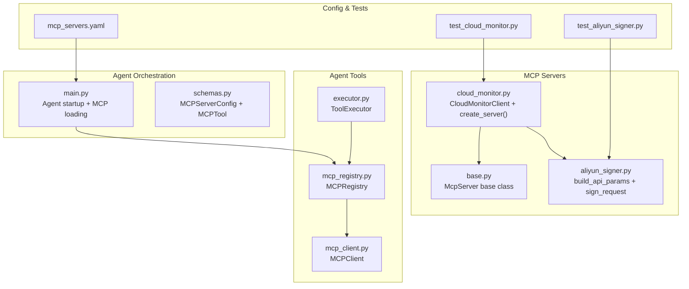
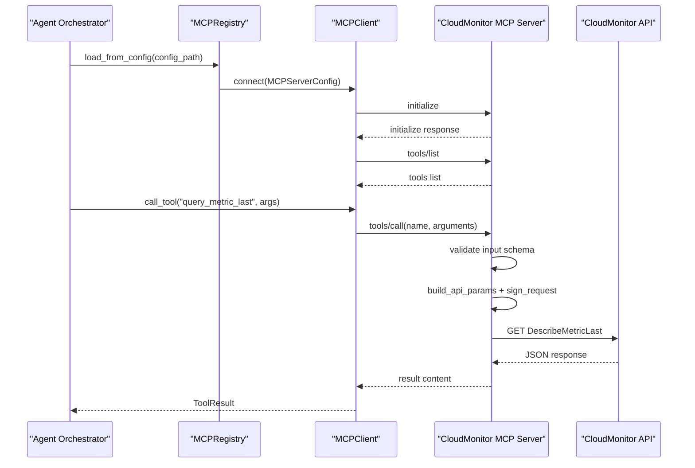
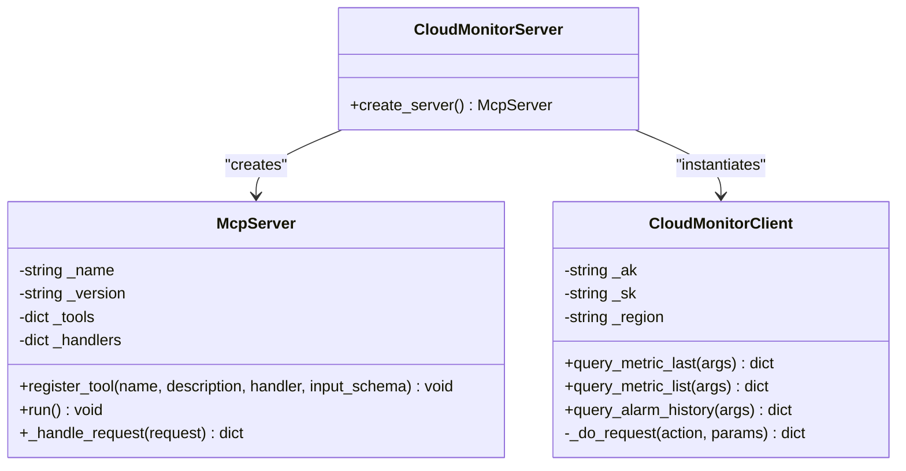
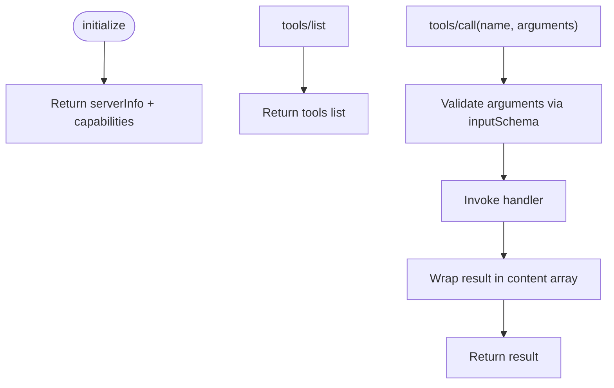
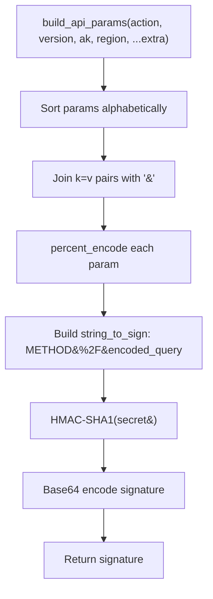
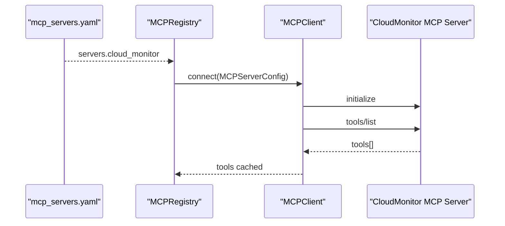
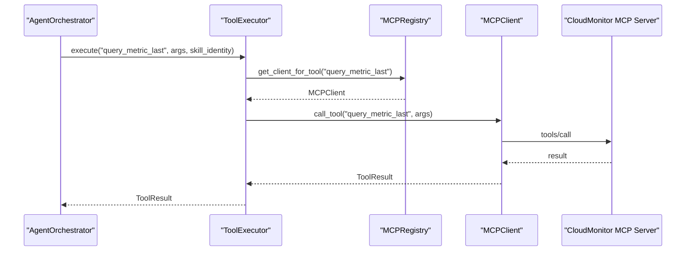
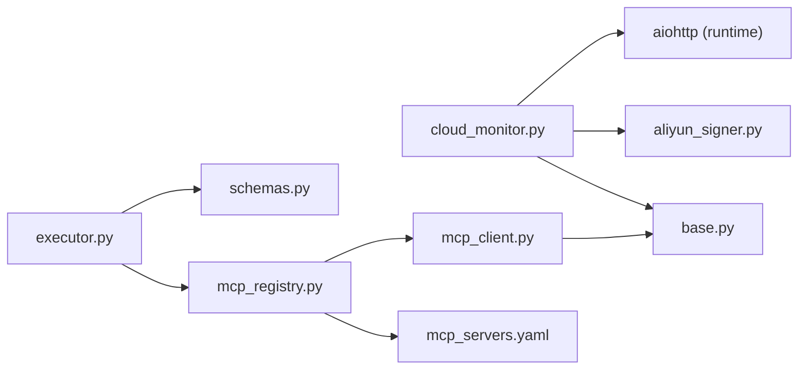

# CloudMonitor Integration

<cite>
**Referenced Files in This Document**
- [cloud_monitor.py](file://mcp_servers/cloud_monitor.py)
- [base.py](file://mcp_servers/base.py)
- [aliyun_signer.py](file://mcp_servers/aliyun_signer.py)
- [mcp_client.py](file://src/aiops_agent/tools/mcp_client.py)
- [mcp_registry.py](file://src/aiops_agent/tools/mcp_registry.py)
- [schemas.py](file://src/aiops_agent/models/schemas.py)
- [mcp_servers.yaml](file://config/mcp_servers.yaml)
- [test_cloud_monitor.py](file://tests/mcp_servers/test_cloud_monitor.py)
- [test_aliyun_signer.py](file://tests/mcp_servers/test_aliyun_signer.py)
- [monitoring.py](file://src/aiops_agent/skills/monitoring.py)
- [executor.py](file://src/aiops_agent/tools/executor.py)
- [main.py](file://src/aiops_agent/main.py)
</cite>

## Table of Contents
1. [Introduction](#introduction)
2. [Project Structure](#project-structure)
3. [Core Components](#core-components)
4. [Architecture Overview](#architecture-overview)
5. [Detailed Component Analysis](#detailed-component-analysis)
6. [Dependency Analysis](#dependency-analysis)
7. [Performance Considerations](#performance-considerations)
8. [Troubleshooting Guide](#troubleshooting-guide)
9. [Conclusion](#conclusion)
10. [Appendices](#appendices)

## Introduction
This document explains the CloudMonitor MCP server implementation that enables the AIOps Agent to retrieve monitoring data from Alibaba Cloud's CloudMonitor service. It covers server initialization, metric query capabilities, time range filtering, data aggregation methods, integration with the Alibaba Cloud SDK-compatible signer, authentication mechanisms, parameter validation, and error handling. Practical examples demonstrate querying system metrics, custom metrics, and performance indicators, along with guidance for diagnosing network issues, authentication failures, and invalid metric queries.

## Project Structure
The CloudMonitor integration spans several modules:
- MCP server implementation for CloudMonitor
- Base MCP server framework
- Alibaba Cloud API signing utilities
- MCP client and registry for dynamic server registration
- Agent orchestration and tool execution pipeline
- Configuration and tests

**Diagram sources**
- [cloud_monitor.py:1-131](file://mcp_servers/cloud_monitor.py#L1-L131)
- [base.py:14-108](file://mcp_servers/base.py#L14-L108)
- [aliyun_signer.py:25-76](file://mcp_servers/aliyun_signer.py#L25-L76)
- [mcp_client.py:22-324](file://src/aiops_agent/tools/mcp_client.py#L22-L324)
- [mcp_registry.py:20-162](file://src/aiops_agent/tools/mcp_registry.py#L20-L162)
- [executor.py:45-314](file://src/aiops_agent/tools/executor.py#L45-L314)
- [main.py:70-222](file://src/aiops_agent/main.py#L70-L222)
- [schemas.py:144-162](file://src/aiops_agent/models/schemas.py#L144-L162)
- [mcp_servers.yaml:1-41](file://config/mcp_servers.yaml#L1-L41)
- [test_cloud_monitor.py:1-51](file://tests/mcp_servers/test_cloud_monitor.py#L1-L51)
- [test_aliyun_signer.py:1-108](file://tests/mcp_servers/test_aliyun_signer.py#L1-L108)

**Section sources**
- [cloud_monitor.py:1-131](file://mcp_servers/cloud_monitor.py#L1-L131)
- [base.py:14-108](file://mcp_servers/base.py#L14-L108)
- [aliyun_signer.py:1-76](file://mcp_servers/aliyun_signer.py#L1-L76)
- [mcp_client.py:1-324](file://src/aiops_agent/tools/mcp_client.py#L1-L324)
- [mcp_registry.py:1-162](file://src/aiops_agent/tools/mcp_registry.py#L1-L162)
- [schemas.py:144-162](file://src/aiops_agent/models/schemas.py#L144-L162)
- [mcp_servers.yaml:1-41](file://config/mcp_servers.yaml#L1-L41)
- [test_cloud_monitor.py:1-51](file://tests/mcp_servers/test_cloud_monitor.py#L1-L51)
- [test_aliyun_signer.py:1-108](file://tests/mcp_servers/test_aliyun_signer.py#L1-L108)

## Core Components
- CloudMonitorClient: Implements asynchronous HTTP requests to CloudMonitor APIs, builds signed requests, and exposes three tools:
  - query_metric_last: Fetches latest metric data for a given namespace, metric name, and instance ID.
  - query_metric_list: Retrieves historical metric data with optional start_time and end_time filters.
  - query_alarm_history: Retrieves system event history with optional namespace and time filters.
- McpServer: Base JSON-RPC 2.0 stdio server that registers tools and handles initialize/tools/list/tools/call notifications.
- CloudMonitor MCP Server factory: create_server constructs a server with credentials from environment variables and registers the three tools with input schemas.
- Alibaba Cloud Signer: build_api_params generates standardized API parameters; sign_request computes HMAC-SHA1 signatures.
- MCP Client and Registry: Dynamic discovery and invocation of MCP tools; supports stdio transport and HTTP/SSE modes.
- Agent Orchestration: Loads MCP configurations, initializes MCPRegistry, and integrates with ToolExecutor for permission checks, credential acquisition, and auditing.

**Section sources**
- [cloud_monitor.py:17-125](file://mcp_servers/cloud_monitor.py#L17-L125)
- [base.py:14-108](file://mcp_servers/base.py#L14-L108)
- [aliyun_signer.py:25-76](file://mcp_servers/aliyun_signer.py#L25-L76)
- [mcp_client.py:22-324](file://src/aiops_agent/tools/mcp_client.py#L22-L324)
- [mcp_registry.py:20-162](file://src/aiops_agent/tools/mcp_registry.py#L20-L162)
- [main.py:164-171](file://src/aiops_agent/main.py#L164-L171)

## Architecture Overview
The CloudMonitor MCP server runs as a stdio-based JSON-RPC service. The Agent loads configuration, connects to the server, discovers tools, and executes them through ToolExecutor, which enforces permissions, manages credentials, and records audit events.

**Diagram sources**
- [mcp_servers.yaml:3-12](file://config/mcp_servers.yaml#L3-L12)
- [mcp_registry.py:122-153](file://src/aiops_agent/tools/mcp_registry.py#L122-L153)
- [mcp_client.py:56-94](file://src/aiops_agent/tools/mcp_client.py#L56-L94)
- [base.py:42-107](file://mcp_servers/base.py#L42-L107)
- [cloud_monitor.py:23-47](file://mcp_servers/cloud_monitor.py#L23-L47)

## Detailed Component Analysis

### CloudMonitorClient and Tools
- Authentication and endpoint:
  - Uses environment variables for region, access key ID, and access key secret.
  - Endpoint constant points to CloudMonitor metrics endpoint.
- Request building:
  - build_api_params adds standardized fields (Format, Version, AccessKeyId, SignatureMethod, Timestamp, SignatureVersion, SignatureNonce, RegionId, Action).
  - sign_request computes HMAC-SHA1 signature over canonicalized query string.
- Tool implementations:
  - query_metric_last: Constructs Dimensions with instanceId and calls DescribeMetricLast; returns Datapoints under "data".
  - query_metric_list: Adds optional StartTime and EndTime; calls DescribeMetricList; returns Datapoints under "data".
  - query_alarm_history: Optionally sets Namespace and time filters; calls DescribeSystemEventHistory; returns SystemEventHistory under "data".

**Diagram sources**
- [cloud_monitor.py:17-125](file://mcp_servers/cloud_monitor.py#L17-L125)
- [base.py:14-108](file://mcp_servers/base.py#L14-L108)

**Section sources**
- [cloud_monitor.py:17-125](file://mcp_servers/cloud_monitor.py#L17-L125)
- [aliyun_signer.py:25-76](file://mcp_servers/aliyun_signer.py#L25-L76)

### MCP Server Base and Tool Registration
- McpServer implements JSON-RPC 2.0 over stdio:
  - initialize returns serverInfo and capabilities.
  - tools/list returns registered tools with inputSchema.
  - tools/call invokes handler with validated arguments and wraps result in content array.
- Tool registration:
  - create_server registers three tools with explicit input schemas and required fields.
  - Handlers are bound to CloudMonitorClient methods.

**Diagram sources**
- [base.py:76-107](file://mcp_servers/base.py#L76-L107)

**Section sources**
- [base.py:14-108](file://mcp_servers/base.py#L14-L108)
- [cloud_monitor.py:74-125](file://mcp_servers/cloud_monitor.py#L74-L125)

### Alibaba Cloud Signer Implementation
- percent_encode applies Alibaba Cloud-specific URL encoding rules.
- build_api_params generates standardized API parameters including timestamps and nonce.
- sign_request canonicalizes parameters, builds string-to-sign, and computes HMAC-SHA1 signature.

**Diagram sources**
- [aliyun_signer.py:13-76](file://mcp_servers/aliyun_signer.py#L13-L76)

**Section sources**
- [aliyun_signer.py:1-76](file://mcp_servers/aliyun_signer.py#L1-L76)

### MCP Client and Registry Integration
- MCPClient supports stdio and HTTP/SSE transports, serializes JSON-RPC messages, and parses responses.
- MCPRegistry loads mcp_servers.yaml, connects clients, lists tools, and maintains tool-to-server mapping.
- ToolExecutor orchestrates permission checks, credential acquisition, MCP/local dispatch, retries, sanitization, and auditing.

**Diagram sources**
- [mcp_servers.yaml:3-12](file://config/mcp_servers.yaml#L3-L12)
- [mcp_registry.py:122-153](file://src/aiops_agent/tools/mcp_registry.py#L122-L153)
- [mcp_client.py:56-94](file://src/aiops_agent/tools/mcp_client.py#L56-L94)

**Section sources**
- [mcp_client.py:22-324](file://src/aiops_agent/tools/mcp_client.py#L22-L324)
- [mcp_registry.py:20-162](file://src/aiops_agent/tools/mcp_registry.py#L20-L162)
- [schemas.py:144-162](file://src/aiops_agent/models/schemas.py#L144-L162)

### Agent Orchestration and Tool Execution
- Agent startup loads configuration, sets up observability, initializes WorkloadIdentityManager, and creates ToolExecutor with MCPRegistry.
- MonitoringSkill demonstrates invoking query_metric_last via ToolExecutor and returning sanitized results.

**Diagram sources**
- [main.py:164-171](file://src/aiops_agent/main.py#L164-L171)
- [executor.py:80-201](file://src/aiops_agent/tools/executor.py#L80-L201)
- [mcp_registry.py:99-112](file://src/aiops_agent/tools/mcp_registry.py#L99-L112)
- [mcp_client.py:135-155](file://src/aiops_agent/tools/mcp_client.py#L135-L155)

**Section sources**
- [main.py:70-222](file://src/aiops_agent/main.py#L70-L222)
- [monitoring.py:59-97](file://src/aiops_agent/skills/monitoring.py#L59-L97)
- [executor.py:45-314](file://src/aiops_agent/tools/executor.py#L45-L314)

## Dependency Analysis
- CloudMonitorClient depends on:
  - McpServer for tool registration and JSON-RPC handling.
  - aliyun_signer for API parameter construction and request signing.
  - aiohttp for asynchronous HTTP requests.
- MCP Client and Registry depend on:
  - MCPServerConfig and MCPTool schemas.
  - YAML configuration for server discovery.
- ToolExecutor depends on:
  - PermissionGate, CredentialManager, AuditLogger, and WorkloadIdentityManager.
  - MCPRegistry for tool resolution.

**Diagram sources**
- [cloud_monitor.py:9-10](file://mcp_servers/cloud_monitor.py#L9-L10)
- [base.py:14-21](file://mcp_servers/base.py#L14-L21)
- [aliyun_signer.py:25-48](file://mcp_servers/aliyun_signer.py#L25-L48)
- [mcp_registry.py:122-153](file://src/aiops_agent/tools/mcp_registry.py#L122-L153)
- [mcp_client.py:17-18](file://src/aiops_agent/tools/mcp_client.py#L17-L18)
- [schemas.py:144-162](file://src/aiops_agent/models/schemas.py#L144-L162)
- [executor.py:32-35](file://src/aiops_agent/tools/executor.py#L32-L35)

**Section sources**
- [cloud_monitor.py:1-131](file://mcp_servers/cloud_monitor.py#L1-L131)
- [mcp_registry.py:1-162](file://src/aiops_agent/tools/mcp_registry.py#L1-L162)
- [mcp_client.py:1-324](file://src/aiops_agent/tools/mcp_client.py#L1-L324)
- [schemas.py:144-162](file://src/aiops_agent/models/schemas.py#L144-L162)
- [executor.py:1-314](file://src/aiops_agent/tools/executor.py#L1-L314)

## Performance Considerations
- Asynchronous I/O: aiohttp is used for non-blocking HTTP requests to CloudMonitor.
- Retry and timeout: ToolExecutor applies exponential backoff for transient network errors and enforces timeouts to prevent long-running operations.
- Parameter encoding: percent_encode ensures correct URL encoding for CloudMonitor API compatibility.
- Tool caching: MCPRegistry caches discovered tools and clients to minimize repeated discovery overhead.

[No sources needed since this section provides general guidance]

## Troubleshooting Guide
Common issues and resolutions:
- Network connectivity:
  - Symptom: ConnectionError/OSError during tool execution.
  - Resolution: Verify network access to CloudMonitor endpoint; retry logic is built-in with exponential backoff.
- Authentication failures:
  - Symptom: Invalid signature or unauthorized responses from CloudMonitor.
  - Resolution: Ensure ACCESS_KEY_ID and ACCESS_KEY_SECRET environment variables are set; confirm REGION matches the target account region.
- Invalid metric queries:
  - Symptom: Empty Datapoints or API errors.
  - Resolution: Validate namespace, metric_name, and instance_id; ensure Dimensions match the target resource; for historical queries, confirm start_time and end_time are properly formatted.
- Tool not found:
  - Symptom: "Unknown method" or "Tool not found" errors.
  - Resolution: Confirm tool name matches registered tools; verify MCP server is connected and tools are listed.
- Time range filtering:
  - Symptom: No data returned for historical queries.
  - Resolution: Provide valid start_time and end_time; ensure time window aligns with retention policies and CloudMonitor availability.

**Section sources**
- [executor.py:231-274](file://src/aiops_agent/tools/executor.py#L231-L274)
- [cloud_monitor.py:49-71](file://mcp_servers/cloud_monitor.py#L49-L71)
- [base.py:76-107](file://mcp_servers/base.py#L76-L107)

## Conclusion
The CloudMonitor MCP server provides a robust, standards-compliant interface for querying Alibaba Cloud monitoring data. It integrates cleanly with the Agent’s orchestration pipeline, enforcing permissions, managing credentials, and offering resilient execution with retries and timeouts. The implementation adheres to Alibaba Cloud API conventions and includes comprehensive tool registration, input validation, and error handling.

[No sources needed since this section summarizes without analyzing specific files]

## Appendices

### Practical Examples

- Query latest CPU utilization for an ECS instance:
  - Tool: query_metric_last
  - Arguments: namespace, metric_name, instance_id
  - Example invocation path: [monitoring.py:80-88](file://src/aiops_agent/skills/monitoring.py#L80-L88)

- Query historical disk I/O bytes over a time window:
  - Tool: query_metric_list
  - Arguments: namespace, metric_name, instance_id, start_time, end_time
  - Example invocation path: [cloud_monitor.py:49-60](file://mcp_servers/cloud_monitor.py#L49-L60)

- Retrieve system event history for a namespace:
  - Tool: query_alarm_history
  - Arguments: namespace, start_time, end_time
  - Example invocation path: [cloud_monitor.py:62-71](file://mcp_servers/cloud_monitor.py#L62-L71)

### Parameter Validation and Required Fields
- query_metric_last requires: namespace, metric_name, instance_id
- query_metric_list requires: namespace, metric_name, instance_id; optional: start_time, end_time
- query_alarm_history optional: namespace, start_time, end_time

**Section sources**
- [cloud_monitor.py:86-124](file://mcp_servers/cloud_monitor.py#L86-L124)
- [test_cloud_monitor.py:44-50](file://tests/mcp_servers/test_cloud_monitor.py#L44-L50)

### Configuration and Environment Setup
- MCP server configuration template: [mcp_servers.yaml:3-12](file://config/mcp_servers.yaml#L3-L12)
- Environment variables used by CloudMonitorClient:
  - REGION
  - ALIBABA_CLOUD_ACCESS_KEY_ID
  - ALIBABA_CLOUD_ACCESS_KEY_SECRET

**Section sources**
- [mcp_servers.yaml:3-12](file://config/mcp_servers.yaml#L3-L12)
- [cloud_monitor.py:75-77](file://mcp_servers/cloud_monitor.py#L75-L77)

### Testing Coverage
- CloudMonitor server creation and tool registration:
  - [test_cloud_monitor.py:8-25](file://tests/mcp_servers/test_cloud_monitor.py#L8-L25)
- JSON-RPC lifecycle handling:
  - [test_cloud_monitor.py:26-42](file://tests/mcp_servers/test_cloud_monitor.py#L26-L42)
- Required parameters validation:
  - [test_cloud_monitor.py:44-50](file://tests/mcp_servers/test_cloud_monitor.py#L44-L50)
- Signer correctness:
  - [test_aliyun_signer.py:12-37](file://tests/mcp_servers/test_aliyun_signer.py#L12-L37)
  - [test_aliyun_signer.py:39-81](file://tests/mcp_servers/test_aliyun_signer.py#L39-L81)
  - [test_aliyun_signer.py:83-108](file://tests/mcp_servers/test_aliyun_signer.py#L83-L108)