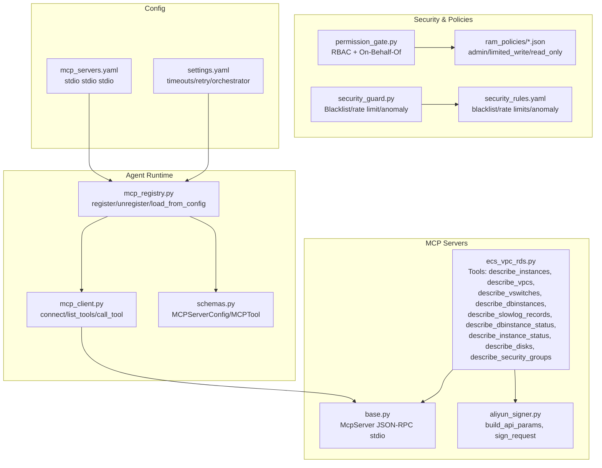
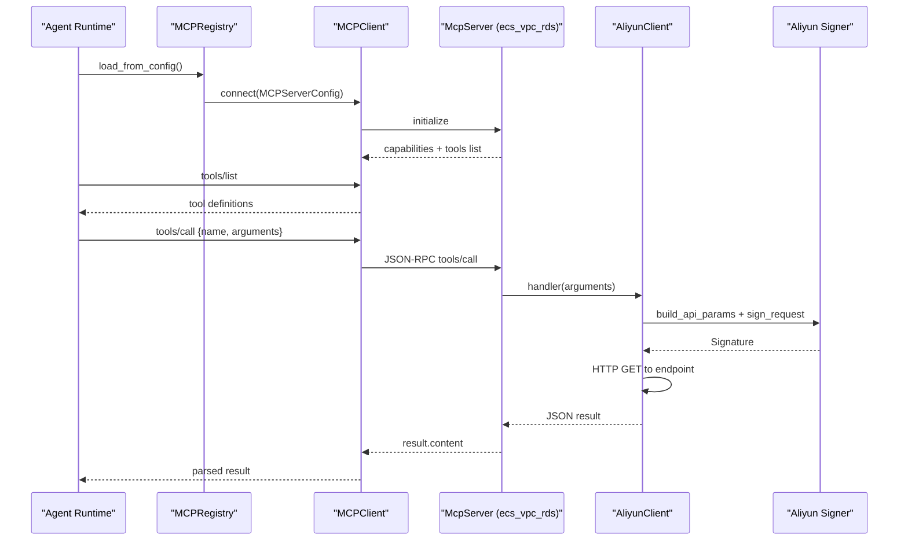
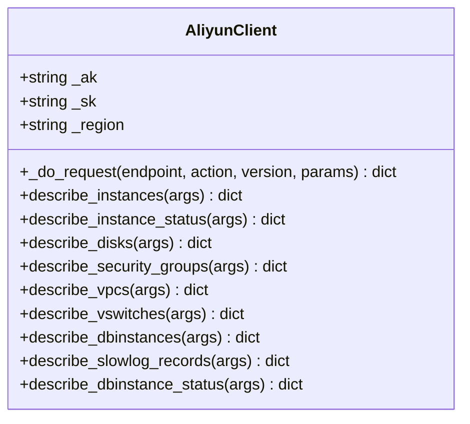
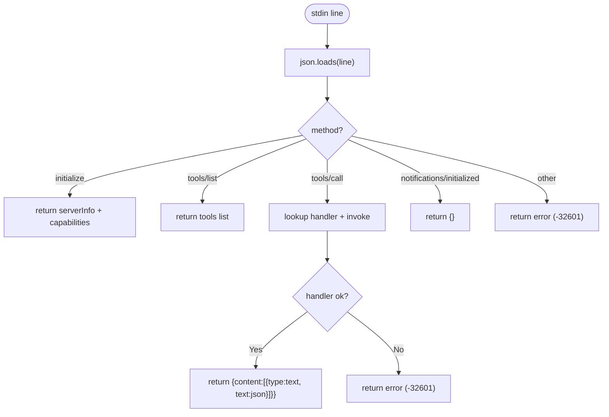
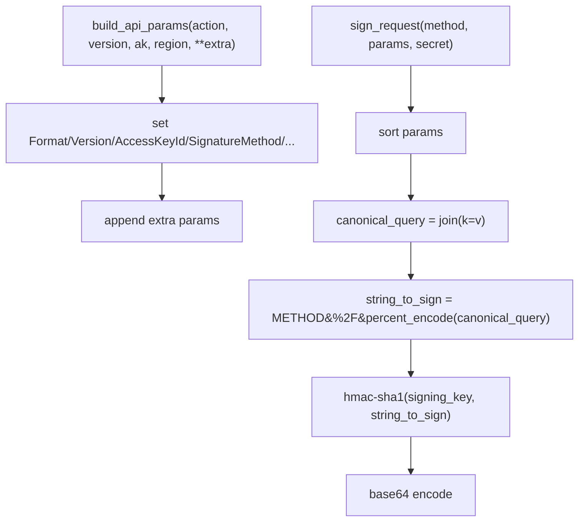
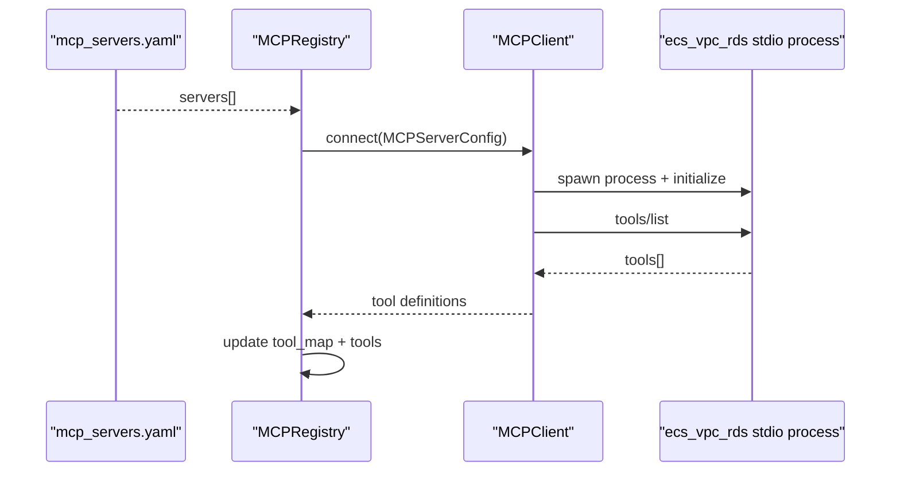
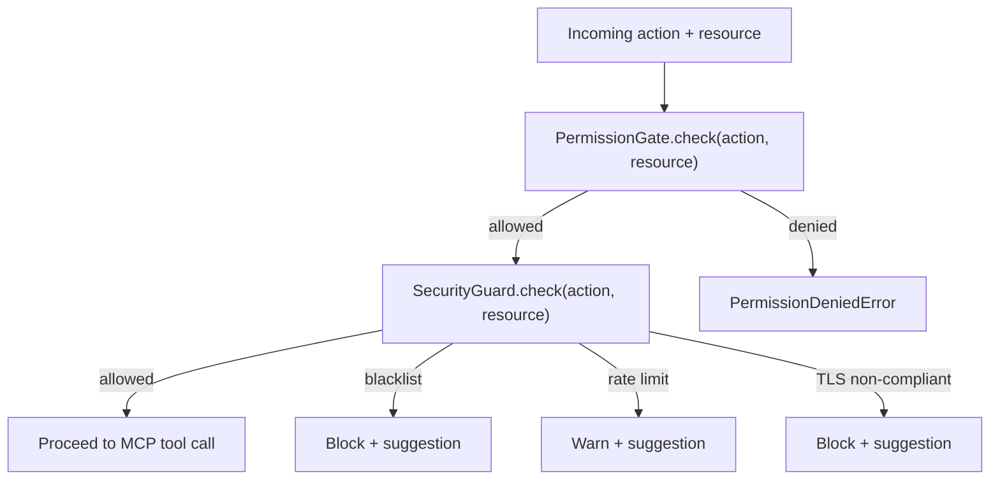
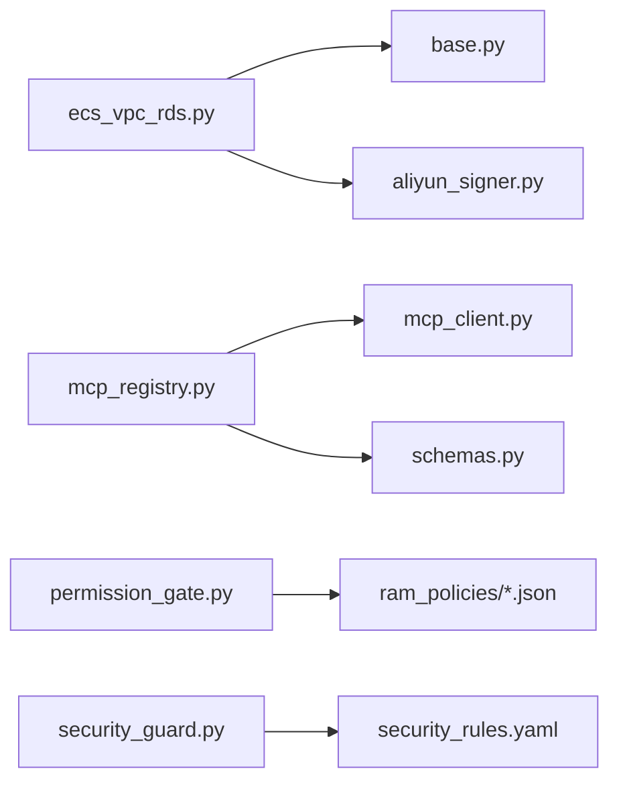

# ECS/VPC/RDS Operations

<cite>
**Referenced Files in This Document**
- [ecs_vpc_rds.py](file://mcp_servers/ecs_vpc_rds.py)
- [base.py](file://mcp_servers/base.py)
- [aliyun_signer.py](file://mcp_servers/aliyun_signer.py)
- [mcp_servers.yaml](file://config/mcp_servers.yaml)
- [security_rules.yaml](file://config/security_rules.yaml)
- [schemas.py](file://src/aiops_agent/models/schemas.py)
- [mcp_client.py](file://src/aiops_agent/tools/mcp_client.py)
- [mcp_registry.py](file://src/aiops_agent/tools/mcp_registry.py)
- [permission_gate.py](file://src/aiops_agent/security/permission_gate.py)
- [security_guard.py](file://src/aiops_agent/security/security_guard.py)
- [settings.yaml](file://config/settings.yaml)
- [admin.json](file://config/ram_policies/admin.json)
- [limited_write.json](file://config/ram_policies/limited_write.json)
- [read_only.json](file://config/ram_policies/read_only.json)
- [test_ecs_vpc_rds.py](file://tests/mcp_servers/test_ecs_vpc_rds.py)
</cite>

## Table of Contents
1. [Introduction](#introduction)
2. [Project Structure](#project-structure)
3. [Core Components](#core-components)
4. [Architecture Overview](#architecture-overview)
5. [Detailed Component Analysis](#detailed-component-analysis)
6. [Dependency Analysis](#dependency-analysis)
7. [Performance Considerations](#performance-considerations)
8. [Troubleshooting Guide](#troubleshooting-guide)
9. [Conclusion](#conclusion)
10. [Appendices](#appendices)

## Introduction
This document explains the ECS/VPC/RDS MCP server that integrates Alibaba Cloud compute, networking, and database operations into the AIOps Agent platform. It covers instance lifecycle operations (start/stop/status), network discovery (VPCs, switches), and database diagnostics (slow logs, instance attributes). It also documents the integration patterns with Alibaba Cloud SDK-free HTTP clients, parameter validation via JSON Schema, and error handling for cloud resource operations. Practical operational examples, safety checks, and rollback considerations are included for day-to-day use.

## Project Structure
The ECS/VPC/RDS MCP server is implemented as a standalone stdio-based JSON-RPC server that registers tools for querying cloud resources. It relies on a shared MCP base class, a pure-Python signer for Alibaba Cloud API signatures, and a configuration-driven registry to expose tools to the Agent runtime.

**Diagram sources**
- [ecs_vpc_rds.py:101-125](file://mcp_servers/ecs_vpc_rds.py#L101-L125)
- [base.py:14-108](file://mcp_servers/base.py#L14-L108)
- [aliyun_signer.py:25-76](file://mcp_servers/aliyun_signer.py#L25-L76)
- [mcp_registry.py:38-162](file://src/aiops_agent/tools/mcp_registry.py#L38-L162)
- [mcp_client.py:22-324](file://src/aiops_agent/tools/mcp_client.py#L22-L324)
- [schemas.py:144-162](file://src/aiops_agent/models/schemas.py#L144-L162)
- [permission_gate.py:57-319](file://src/aiops_agent/security/permission_gate.py#L57-L319)
- [security_guard.py:25-292](file://src/aiops_agent/security/security_guard.py#L25-L292)
- [security_rules.yaml:21-69](file://config/security_rules.yaml#L21-L69)
- [mcp_servers.yaml:24-32](file://config/mcp_servers.yaml#L24-L32)
- [settings.yaml:43-61](file://config/settings.yaml#L43-L61)

**Section sources**
- [ecs_vpc_rds.py:101-125](file://mcp_servers/ecs_vpc_rds.py#L101-L125)
- [mcp_servers.yaml:24-32](file://config/mcp_servers.yaml#L24-L32)

## Core Components
- AliyunClient: Implements Alibaba Cloud API calls for ECS, VPC, and RDS using aiohttp. It builds signed requests via build_api_params and sign_request, then performs GET requests against official endpoints.
- McpServer: Base JSON-RPC 2.0 stdio server that registers tools, validates requests, and returns structured results.
- Aliyun Signer: Pure Python HMAC-SHA1 signature builder and parameter encoder compliant with Alibaba Cloud API requirements.
- MCP Registry and Client: Dynamic registration of MCP servers from YAML, connection lifecycle, tool discovery, and invocation.
- Security and Permissions: PermissionGate enforces RBAC and On-Behalf-Of semantics; SecurityGuard enforces blacklist, rate limits, anomaly detection, and TLS enforcement.

Key tools exposed by the ECS/VPC/RDS server:
- describe_instances, describe_instance_status, describe_disks, describe_security_groups
- describe_vpcs, describe_vswitches
- describe_dbinstances, describe_slowlog_records, describe_dbinstance_status

**Section sources**
- [ecs_vpc_rds.py:19-119](file://mcp_servers/ecs_vpc_rds.py#L19-L119)
- [base.py:14-108](file://mcp_servers/base.py#L14-L108)
- [aliyun_signer.py:25-76](file://mcp_servers/aliyun_signer.py#L25-L76)
- [mcp_registry.py:38-162](file://src/aiops_agent/tools/mcp_registry.py#L38-L162)
- [mcp_client.py:22-324](file://src/aiops_agent/tools/mcp_client.py#L22-L324)
- [permission_gate.py:57-182](file://src/aiops_agent/security/permission_gate.py#L57-L182)
- [security_guard.py:25-123](file://src/aiops_agent/security/security_guard.py#L25-L123)

## Architecture Overview
The ECS/VPC/RDS MCP server runs as a stdio process. The Agent runtime connects to it, discovers tools, and invokes them with validated parameters. Requests are signed and sent to Alibaba Cloud endpoints; responses are returned as JSON-RPC results.

**Diagram sources**
- [mcp_registry.py:122-153](file://src/aiops_agent/tools/mcp_registry.py#L122-L153)
- [mcp_client.py:56-156](file://src/aiops_agent/tools/mcp_client.py#L56-L156)
- [base.py:76-108](file://mcp_servers/base.py#L76-L108)
- [ecs_vpc_rds.py:19-119](file://mcp_servers/ecs_vpc_rds.py#L19-L119)
- [aliyun_signer.py:25-76](file://mcp_servers/aliyun_signer.py#L25-L76)

## Detailed Component Analysis

### AliyunClient and Tools
AliyunClient encapsulates Alibaba Cloud API calls for ECS, VPC, and RDS. It constructs signed requests and returns normalized results. The server registers tools with JSON Schema input validation.

**Diagram sources**
- [ecs_vpc_rds.py:19-119](file://mcp_servers/ecs_vpc_rds.py#L19-L119)

Operational coverage:
- ECS: list instances, statuses, disks, and security groups.
- VPC: list VPCs and VSwitches optionally filtered by VPC ID.
- RDS: list DB instances, slow log records, and instance attributes.

Parameter validation:
- Tools declare inputSchema; for example, slow log queries require db_instance_id.

**Section sources**
- [ecs_vpc_rds.py:43-98](file://mcp_servers/ecs_vpc_rds.py#L43-L98)
- [ecs_vpc_rds.py:109-119](file://mcp_servers/ecs_vpc_rds.py#L109-L119)
- [test_ecs_vpc_rds.py:50-55](file://tests/mcp_servers/test_ecs_vpc_rds.py#L50-L55)

### McpServer Base
McpServer implements JSON-RPC 2.0 over stdio, supporting initialize, tools/list, tools/call, and notifications/initialized. It validates method names, dispatches to registered handlers, and returns standardized responses or errors.

**Diagram sources**
- [base.py:76-108](file://mcp_servers/base.py#L76-L108)

**Section sources**
- [base.py:14-108](file://mcp_servers/base.py#L14-L108)

### Alibaba Cloud Signer
The signer builds canonical API parameters and computes HMAC-SHA1 signatures. It percent-encodes according to Alibaba Cloud rules and sorts parameters for deterministic signing.

**Diagram sources**
- [aliyun_signer.py:25-76](file://mcp_servers/aliyun_signer.py#L25-L76)

**Section sources**
- [aliyun_signer.py:13-76](file://mcp_servers/aliyun_signer.py#L13-L76)

### MCP Client and Registry
MCPRegistry loads servers from mcp_servers.yaml, connects via stdio, lists tools, and maintains tool-to-server mapping. MCPClient supports stdio and HTTP/SSE transports, serializes JSON-RPC, and parses responses.

**Diagram sources**
- [mcp_registry.py:122-153](file://src/aiops_agent/tools/mcp_registry.py#L122-L153)
- [mcp_client.py:56-130](file://src/aiops_agent/tools/mcp_client.py#L56-L130)
- [mcp_servers.yaml:24-32](file://config/mcp_servers.yaml#L24-L32)

**Section sources**
- [mcp_registry.py:38-162](file://src/aiops_agent/tools/mcp_registry.py#L38-L162)
- [mcp_client.py:22-324](file://src/aiops_agent/tools/mcp_client.py#L22-L324)
- [mcp_servers.yaml:24-32](file://config/mcp_servers.yaml#L24-L32)

### Security and Permissions
- PermissionGate: Enforces RBAC with three levels (read-only, limited-write, admin). Supports On-Behalf-Of to intersect agent and user permissions. Classifies actions by verb prefixes.
- SecurityGuard: Enforces blacklist rules, rate limits, anomaly detection, and TLS enforcement. Maintains call history and operation sequences.

**Diagram sources**
- [permission_gate.py:95-182](file://src/aiops_agent/security/permission_gate.py#L95-L182)
- [security_guard.py:64-123](file://src/aiops_agent/security/security_guard.py#L64-L123)
- [security_rules.yaml:21-69](file://config/security_rules.yaml#L21-L69)

**Section sources**
- [permission_gate.py:57-319](file://src/aiops_agent/security/permission_gate.py#L57-L319)
- [security_guard.py:25-292](file://src/aiops_agent/security/security_guard.py#L25-L292)
- [security_rules.yaml:21-69](file://config/security_rules.yaml#L21-L69)
- [admin.json:6-32](file://config/ram_policies/admin.json#L6-L32)
- [limited_write.json:6-35](file://config/ram_policies/limited_write.json#L6-L35)
- [read_only.json:6-27](file://config/ram_policies/read_only.json#L6-L27)

## Dependency Analysis
- ecs_vpc_rds.py depends on:
  - base.py for JSON-RPC server behavior
  - aliyun_signer.py for API parameter building and signing
  - Environment variables for region and credentials
- mcp_registry.py depends on:
  - mcp_client.py for connection and tool discovery
  - schemas.py for typed configuration and tool definitions
- security components depend on:
  - security_rules.yaml for configuration
  - ram_policies/*.json for permission templates

**Diagram sources**
- [ecs_vpc_rds.py:9-11](file://mcp_servers/ecs_vpc_rds.py#L9-L11)
- [base.py:14-22](file://mcp_servers/base.py#L14-L22)
- [aliyun_signer.py:25-48](file://mcp_servers/aliyun_signer.py#L25-L48)
- [mcp_registry.py:14-15](file://src/aiops_agent/tools/mcp_registry.py#L14-L15)
- [mcp_client.py:17-18](file://src/aiops_agent/tools/mcp_client.py#L17-L18)
- [schemas.py:144-162](file://src/aiops_agent/models/schemas.py#L144-L162)
- [permission_gate.py:16-21](file://src/aiops_agent/security/permission_gate.py#L16-L21)
- [security_guard.py:16-21](file://src/aiops_agent/security/security_guard.py#L16-L21)
- [security_rules.yaml:1-70](file://config/security_rules.yaml#L1-L70)
- [admin.json:1-35](file://config/ram_policies/admin.json#L1-L35)
- [limited_write.json:1-38](file://config/ram_policies/limited_write.json#L1-L38)
- [read_only.json:1-30](file://config/ram_policies/read_only.json#L1-L30)

**Section sources**
- [ecs_vpc_rds.py:9-11](file://mcp_servers/ecs_vpc_rds.py#L9-L11)
- [mcp_registry.py:14-15](file://src/aiops_agent/tools/mcp_registry.py#L14-L15)
- [mcp_client.py:17-18](file://src/aiops_agent/tools/mcp_client.py#L17-L18)
- [schemas.py:144-162](file://src/aiops_agent/models/schemas.py#L144-L162)
- [security_rules.yaml:1-70](file://config/security_rules.yaml#L1-L70)
- [admin.json:1-35](file://config/ram_policies/admin.json#L1-L35)
- [limited_write.json:1-38](file://config/ram_policies/limited_write.json#L1-L38)
- [read_only.json:1-30](file://config/ram_policies/read_only.json#L1-L30)

## Performance Considerations
- Asynchronous I/O: All cloud calls use aiohttp in async methods, enabling concurrent tool invocations.
- Request signing overhead: Parameter sorting and HMAC computation are lightweight but occur per request; keep argument sets minimal.
- Rate limiting: SecurityGuard enforces per-action minute/hour thresholds; tune security_rules.yaml to avoid throttling during bulk operations.
- Timeouts: Configure tool_execution_seconds and retry policies in settings.yaml to balance responsiveness and reliability.

[No sources needed since this section provides general guidance]

## Troubleshooting Guide
Common issues and resolutions:
- Missing aiohttp: AliyunClient returns an error when aiohttp is unavailable; install the dependency.
- Invalid or missing credentials: Environment variables REGION, ALIBANA_CLOUD_ACCESS_KEY_ID, ALIBABA_CLOUD_ACCESS_KEY_SECRET are used; ensure they are set or rely on demo values.
- Tool not found: Verify tools are registered and inputSchema matches; use tools/list to confirm.
- Permission denied: Review RAM policies and On-Behalf-Of intersection; admin actions require explicit approval.
- Blacklisted operations: SecurityGuard blocks high-risk actions; adjust security_rules.yaml or follow suggestions.
- TLS enforcement failures: Ensure HTTPS endpoints are used; SecurityGuard rejects non-HTTPS URLs.

**Section sources**
- [ecs_vpc_rds.py:25-41](file://mcp_servers/ecs_vpc_rds.py#L25-L41)
- [mcp_client.py:261-274](file://src/aiops_agent/tools/mcp_client.py#L261-L274)
- [security_guard.py:124-144](file://src/aiops_agent/security/security_guard.py#L124-L144)
- [security_rules.yaml:21-69](file://config/security_rules.yaml#L21-L69)

## Conclusion
The ECS/VPC/RDS MCP server provides a secure, standards-based integration with Alibaba Cloud. By combining a JSON-RPC stdio interface, robust parameter validation, and integrated security controls, it enables safe automation of compute, networking, and database operations. Operators can discover resources, monitor health, and perform controlled maintenance with built-in safety checks and audit-ready workflows.

[No sources needed since this section summarizes without analyzing specific files]

## Appendices

### Operational Examples
- Describe ECS instances by ID: pass instance_ids as a comma-separated string; returns a list of instances.
- Describe VPCs by optional VPC ID: filter results by VPC identifier.
- Describe RDS slow logs: require db_instance_id; returns slow query records.
- Describe RDS instance status: require db_instance_id; returns instance attributes.

Validation highlights:
- Slow log tool declares db_instance_id as required.
- All tools define inputSchema for parameter validation.

**Section sources**
- [ecs_vpc_rds.py:109-119](file://mcp_servers/ecs_vpc_rds.py#L109-L119)
- [test_ecs_vpc_rds.py:50-55](file://tests/mcp_servers/test_ecs_vpc_rds.py#L50-L55)

### Safety Checks and Rollback Procedures
- Safety checks:
  - RBAC classification determines whether actions require approval.
  - Blacklist blocks destructive operations (e.g., delete DB instance).
  - Rate limits prevent burst calls; anomaly detection warns on suspicious sequences.
  - TLS enforcement ensures HTTPS for all outbound requests.
- Rollback procedures:
  - For instance stop/start operations, maintain a pre-change snapshot or tag state before acting.
  - For VPC/VSwitch changes, preserve original CIDR and route table associations.
  - For RDS maintenance, schedule during maintenance windows and retain automated backups.

**Section sources**
- [permission_gate.py:45-54](file://src/aiops_agent/security/permission_gate.py#L45-L54)
- [security_rules.yaml:21-42](file://config/security_rules.yaml#L21-L42)
- [security_guard.py:165-211](file://src/aiops_agent/security/security_guard.py#L165-L211)