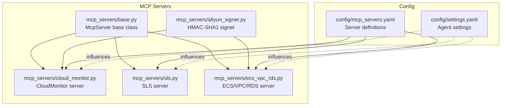
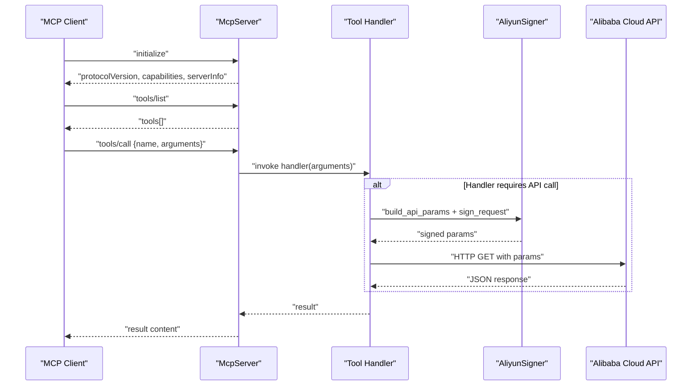
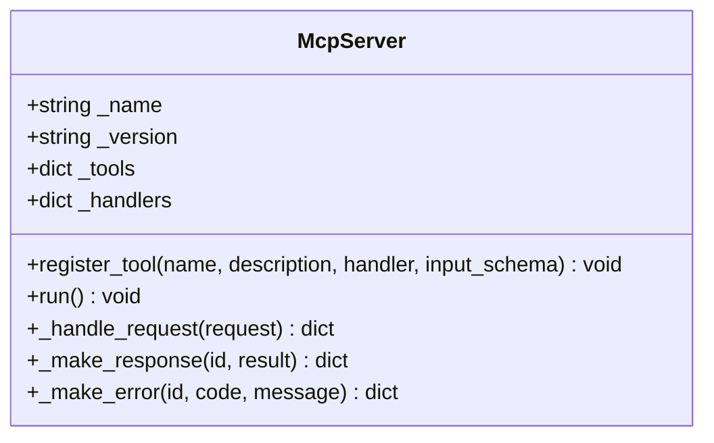
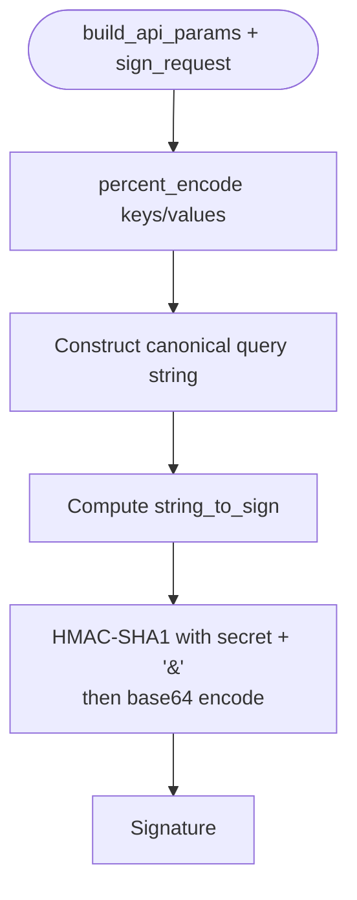
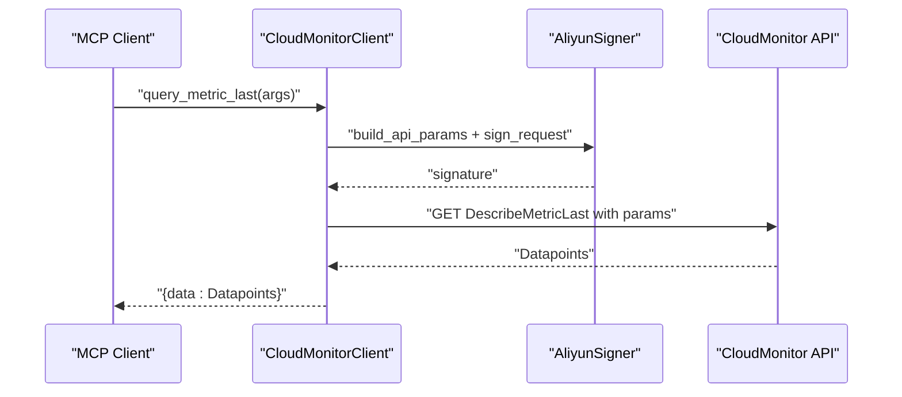
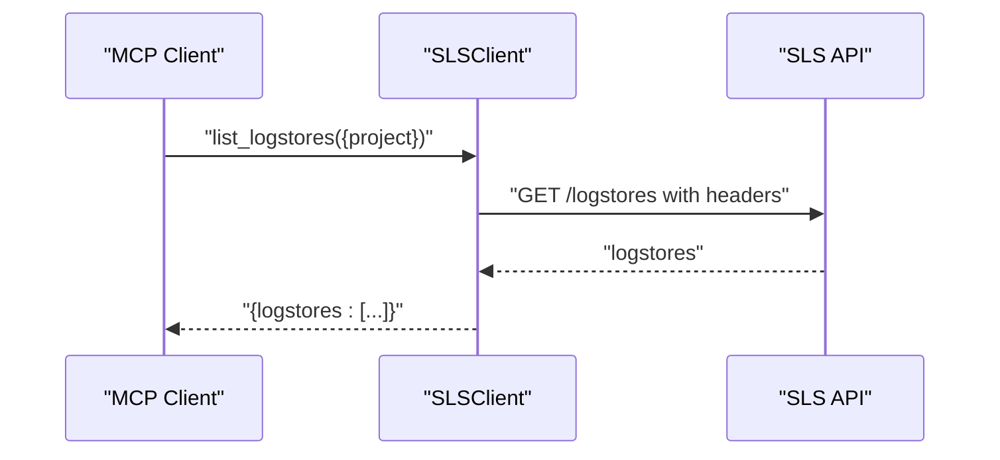
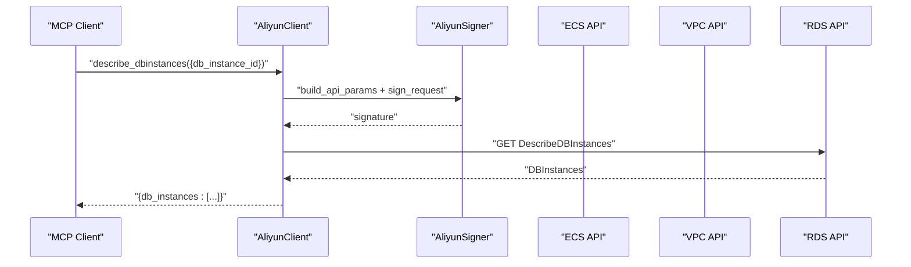
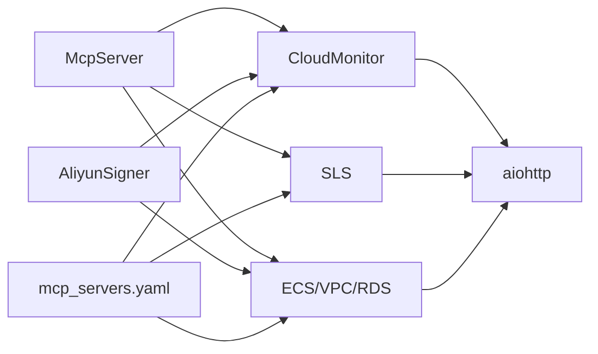

# MCP Server Implementations

<cite>
**Referenced Files in This Document**
- [README.md](file://README.md)
- [mcp_servers/base.py](file://mcp_servers/base.py)
- [mcp_servers/aliyun_signer.py](file://mcp_servers/aliyun_signer.py)
- [mcp_servers/cloud_monitor.py](file://mcp_servers/cloud_monitor.py)
- [mcp_servers/sls.py](file://mcp_servers/sls.py)
- [mcp_servers/ecs_vpc_rds.py](file://mcp_servers/ecs_vpc_rds.py)
- [config/mcp_servers.yaml](file://config/mcp_servers.yaml)
- [config/settings.yaml](file://config/settings.yaml)
- [tests/mcp_servers/test_base.py](file://tests/mcp_servers/test_base.py)
- [tests/mcp_servers/test_cloud_monitor.py](file://tests/mcp_servers/test_cloud_monitor.py)
- [tests/mcp_servers/test_sls.py](file://tests/mcp_servers/test_sls.py)
- [tests/mcp_servers/test_ecs_vpc_rds.py](file://tests/mcp_servers/test_ecs_vpc_rds.py)
- [tests/mcp_servers/test_aliyun_signer.py](file://tests/mcp_servers/test_aliyun_signer.py)
</cite>

## Table of Contents
1. [Introduction](#introduction)
2. [Project Structure](#project-structure)
3. [Core Components](#core-components)
4. [Architecture Overview](#architecture-overview)
5. [Detailed Component Analysis](#detailed-component-analysis)
6. [Dependency Analysis](#dependency-analysis)
7. [Performance Considerations](#performance-considerations)
8. [Troubleshooting Guide](#troubleshooting-guide)
9. [Conclusion](#conclusion)
10. [Appendices](#appendices)

## Introduction
This document describes the MCP server implementations that integrate the AIOps Agent with Alibaba Cloud services. It covers the base MCP server architecture, common patterns, and the specific servers for CloudMonitor, SLS, ECS/VPC/RDS, and the AliyunSigner cryptographic utility. It explains server initialization, method implementations, parameter validation, error handling, and security considerations. It also provides configuration examples, usage patterns, and integration guidelines for extending with additional Alibaba Cloud services.

## Project Structure
The MCP server implementations live under the mcp_servers package and are configured via config/mcp_servers.yaml. Each server exposes a create_server() factory that builds an McpServer instance and registers tools. The AliyunSigner module provides HMAC-SHA1 signing utilities used by the Alibaba Cloud API clients.

**Diagram sources**
- [mcp_servers/base.py:14-108](file://mcp_servers/base.py#L14-L108)
- [mcp_servers/aliyun_signer.py:13-76](file://mcp_servers/aliyun_signer.py#L13-L76)
- [mcp_servers/cloud_monitor.py:74-131](file://mcp_servers/cloud_monitor.py#L74-L131)
- [mcp_servers/sls.py:49-97](file://mcp_servers/sls.py#L49-L97)
- [mcp_servers/ecs_vpc_rds.py:101-125](file://mcp_servers/ecs_vpc_rds.py#L101-L125)
- [config/mcp_servers.yaml:1-41](file://config/mcp_servers.yaml#L1-L41)
- [config/settings.yaml:1-85](file://config/settings.yaml#L1-L85)

**Section sources**
- [README.md:64-126](file://README.md#L64-L126)
- [config/mcp_servers.yaml:1-41](file://config/mcp_servers.yaml#L1-L41)
- [config/settings.yaml:1-85](file://config/settings.yaml#L1-L85)

## Core Components
- McpServer base class: Implements JSON-RPC 2.0 over stdio, manages tool registration, and handles initialize/tools/list/tools/call notifications.
- AliyunSigner: Provides percent encoding, API parameter construction, and HMAC-SHA1 signing for Alibaba Cloud requests.
- CloudMonitor server: Exposes tools to query metrics, metric lists, and alarm history via CloudMonitor API.
- SLS server: Exposes tools to query logs, list logstores, and get logstore index via SLS API.
- ECS/VPC/RDS server: Exposes tools to describe instances, statuses, disks, security groups, VPCs, VSwitches, and RDS instances and slow logs.

Key capabilities:
- Tool registration with JSON Schema input validation.
- Standardized JSON-RPC responses and errors.
- Environment-driven configuration for credentials and region.
- Asynchronous HTTP client usage for Alibaba Cloud APIs.

**Section sources**
- [mcp_servers/base.py:14-108](file://mcp_servers/base.py#L14-L108)
- [mcp_servers/aliyun_signer.py:13-76](file://mcp_servers/aliyun_signer.py#L13-L76)
- [mcp_servers/cloud_monitor.py:74-131](file://mcp_servers/cloud_monitor.py#L74-L131)
- [mcp_servers/sls.py:49-97](file://mcp_servers/sls.py#L49-L97)
- [mcp_servers/ecs_vpc_rds.py:101-125](file://mcp_servers/ecs_vpc_rds.py#L101-L125)

## Architecture Overview
The MCP servers follow a consistent pattern:
- Each server defines a create_server() factory that constructs a McpServer and registers tools.
- Tools are registered with a handler coroutine and an input JSON Schema.
- Requests are processed by the base server’s JSON-RPC dispatcher.
- Alibaba Cloud API calls are signed using the AliyunSigner and executed via asynchronous HTTP requests.

**Diagram sources**
- [mcp_servers/base.py:76-108](file://mcp_servers/base.py#L76-L108)
- [mcp_servers/aliyun_signer.py:25-76](file://mcp_servers/aliyun_signer.py#L25-L76)
- [mcp_servers/cloud_monitor.py:23-47](file://mcp_servers/cloud_monitor.py#L23-L47)
- [mcp_servers/sls.py:22-38](file://mcp_servers/sls.py#L22-L38)
- [mcp_servers/ecs_vpc_rds.py:25-41](file://mcp_servers/ecs_vpc_rds.py#L25-L41)

## Detailed Component Analysis

### McpServer Base Class
- Responsibilities:
  - Initialize stdio reader/writer for JSON-RPC communication.
  - Dispatch initialize, tools/list, tools/call, and notifications/initialized.
  - Build standardized JSON-RPC responses and errors.
  - Manage tool registry with name, description, and inputSchema.
- Error handling:
  - Unknown method returns JSON-RPC -32601.
  - Tool not found returns -32601.
  - Exceptions in tool handlers return -32603 with error message.
- Security considerations:
  - No built-in authentication; rely on external transport security and agent-side permission gates.

**Diagram sources**
- [mcp_servers/base.py:14-108](file://mcp_servers/base.py#L14-L108)

**Section sources**
- [mcp_servers/base.py:14-108](file://mcp_servers/base.py#L14-L108)
- [tests/mcp_servers/test_base.py:52-150](file://tests/mcp_servers/test_base.py#L52-L150)

### AliyunSigner Cryptographic Utility
- Responsibilities:
  - Percent-encode strings according to Alibaba Cloud rules.
  - Build API parameters including timestamps, nonces, region, action, and version.
  - Compute HMAC-SHA1 signatures for HTTP requests.
- Security considerations:
  - Uses standard library cryptography; avoids SDK dependencies.
  - Ensures deterministic signatures for identical parameters.

**Diagram sources**
- [mcp_servers/aliyun_signer.py:13-76](file://mcp_servers/aliyun_signer.py#L13-L76)

**Section sources**
- [mcp_servers/aliyun_signer.py:13-76](file://mcp_servers/aliyun_signer.py#L13-L76)
- [tests/mcp_servers/test_aliyun_signer.py:12-108](file://tests/mcp_servers/test_aliyun_signer.py#L12-L108)

### CloudMonitor MCP Server
- Initialization:
  - Reads REGION, ALIBABA_CLOUD_ACCESS_KEY_ID, ALIBABA_CLOUD_ACCESS_KEY_SECRET from environment.
  - Creates CloudMonitorClient with AK/SK/region.
- Tools:
  - query_metric_last(namespace, metric_name, instance_id) -> data[]
  - query_metric_list(namespace, metric_name, instance_id, start_time?, end_time?) -> data[]
  - query_alarm_history(namespace?, start_time?, end_time?) -> history[]
- Parameter validation:
  - JSON Schema enforces required fields per tool.
- Error handling:
  - Tool handler exceptions propagate as JSON-RPC errors.
- Security considerations:
  - Uses AliyunSigner for HMAC-SHA1 signatures.
  - Credentials sourced from environment variables.

**Diagram sources**
- [mcp_servers/cloud_monitor.py:17-72](file://mcp_servers/cloud_monitor.py#L17-L72)
- [mcp_servers/aliyun_signer.py:25-76](file://mcp_servers/aliyun_signer.py#L25-L76)

**Section sources**
- [mcp_servers/cloud_monitor.py:74-131](file://mcp_servers/cloud_monitor.py#L74-L131)
- [tests/mcp_servers/test_cloud_monitor.py:8-51](file://tests/mcp_servers/test_cloud_monitor.py#L8-L51)

### SLS MCP Server
- Initialization:
  - Reads REGION, ALIBABA_CLOUD_ACCESS_KEY_ID, ALIBABA_CLOUD_ACCESS_KEY_SECRET from environment.
  - Creates SLSClient with AK/SK/region.
- Tools:
  - query_logs(project, logstore, query="*") -> logs[]
  - list_logstores(project) -> logstores[]
  - get_logstore_index(project, logstore) -> index
- Parameter validation:
  - JSON Schema enforces required fields per tool.
- Error handling:
  - Tool handler exceptions propagate as JSON-RPC errors.
- Security considerations:
  - Uses environment variables for credentials.

**Diagram sources**
- [mcp_servers/sls.py:16-47](file://mcp_servers/sls.py#L16-L47)

**Section sources**
- [mcp_servers/sls.py:49-97](file://mcp_servers/sls.py#L49-L97)
- [tests/mcp_servers/test_sls.py:8-43](file://tests/mcp_servers/test_sls.py#L8-L43)

### ECS/VPC/RDS MCP Server
- Initialization:
  - Reads REGION, ALIBABA_CLOUD_ACCESS_KEY_ID, ALIBANA_CLOUD_ACCESS_KEY_SECRET from environment.
  - Creates AliyunClient with AK/SK/region.
- Tools:
  - ECS: describe_instances(instance_ids?), describe_instance_status(instance_ids?), describe_disks(instance_id?), describe_security_groups()
  - VPC: describe_vpcs(vpc_id?), describe_vswitches(vpc_id?)
  - RDS: describe_dbinstances(db_instance_id?), describe_slowlog_records(db_instance_id!), describe_dbinstance_status(db_instance_id!)
- Parameter validation:
  - JSON Schema enforces required fields (e.g., db_instance_id for slowlog/status).
- Error handling:
  - Tool handler exceptions propagate as JSON-RPC errors.
- Security considerations:
  - Uses AliyunSigner for HMAC-SHA1 signatures.

**Diagram sources**
- [mcp_servers/ecs_vpc_rds.py:19-99](file://mcp_servers/ecs_vpc_rds.py#L19-L99)
- [mcp_servers/aliyun_signer.py:25-76](file://mcp_servers/aliyun_signer.py#L25-L76)

**Section sources**
- [mcp_servers/ecs_vpc_rds.py:101-125](file://mcp_servers/ecs_vpc_rds.py#L101-L125)
- [tests/mcp_servers/test_ecs_vpc_rds.py:8-55](file://tests/mcp_servers/test_ecs_vpc_rds.py#L8-L55)

## Dependency Analysis
- McpServer depends on asyncio, json, logging, and sys for stdio JSON-RPC.
- CloudMonitor and ECS/VPC/RDS depend on AliyunSigner for API parameter building and signing.
- All servers depend on aiohttp for asynchronous HTTP requests.
- Configuration is driven by environment variables and config/mcp_servers.yaml.

**Diagram sources**
- [mcp_servers/base.py:14-108](file://mcp_servers/base.py#L14-L108)
- [mcp_servers/aliyun_signer.py:13-76](file://mcp_servers/aliyun_signer.py#L13-L76)
- [mcp_servers/cloud_monitor.py:9-10](file://mcp_servers/cloud_monitor.py#L9-L10)
- [mcp_servers/sls.py:9-10](file://mcp_servers/sls.py#L9-L10)
- [mcp_servers/ecs_vpc_rds.py:9-10](file://mcp_servers/ecs_vpc_rds.py#L9-L10)
- [config/mcp_servers.yaml:1-41](file://config/mcp_servers.yaml#L1-L41)

**Section sources**
- [mcp_servers/base.py:14-108](file://mcp_servers/base.py#L14-L108)
- [mcp_servers/aliyun_signer.py:13-76](file://mcp_servers/aliyun_signer.py#L13-L76)
- [config/mcp_servers.yaml:1-41](file://config/mcp_servers.yaml#L1-L41)

## Performance Considerations
- Asynchronous I/O: All servers use aiohttp for non-blocking HTTP calls.
- Tool execution timeouts: Configure via config/settings.yaml (tool_execution_seconds).
- Retry strategy: Configure via config/settings.yaml (max_retries, base_delay_seconds).
- Concurrency: McpServer runs a single stdio loop; parallelism is achieved by registering multiple tools and invoking them concurrently from the agent orchestrator.

[No sources needed since this section provides general guidance]

## Troubleshooting Guide
Common issues and resolutions:
- Missing aiohttp: Tools return an error indicating aiohttp is not installed; install the dependency.
- Unknown method: Ensure the client sends supported JSON-RPC methods (initialize, tools/list, tools/call, notifications/initialized).
- Tool not found: Verify the tool name matches the registered tool name.
- Handler exceptions: Tool handlers raise exceptions propagated as JSON-RPC errors; inspect logs for stack traces.
- Credentials missing: Ensure ALIBABA_CLOUD_ACCESS_KEY_ID and ALIBABA_CLOUD_ACCESS_KEY_SECRET are set; otherwise, demo credentials are used.
- Region misconfiguration: Confirm REGION environment variable matches the target Alibaba Cloud region.

**Section sources**
- [mcp_servers/base.py:59-63](file://mcp_servers/base.py#L59-L63)
- [mcp_servers/cloud_monitor.py:25-27](file://mcp_servers/cloud_monitor.py#L25-L27)
- [mcp_servers/sls.py:23-26](file://mcp_servers/sls.py#L23-L26)
- [mcp_servers/ecs_vpc_rds.py:26-29](file://mcp_servers/ecs_vpc_rds.py#L26-L29)
- [tests/mcp_servers/test_base.py:96-141](file://tests/mcp_servers/test_base.py#L96-L141)

## Conclusion
The MCP server implementations provide a consistent, extensible foundation for integrating Alibaba Cloud services into the AIOps Agent. The base McpServer ensures standardized JSON-RPC behavior, while the AliyunSigner encapsulates secure API signing. The CloudMonitor, SLS, and ECS/VPC/RDS servers demonstrate clear patterns for tool registration, parameter validation, and error handling. Configuration via environment variables and YAML enables flexible deployments across regions and environments.

[No sources needed since this section summarizes without analyzing specific files]

## Appendices

### Configuration Examples
- MCP server configuration template:
  - See [config/mcp_servers.yaml:1-41](file://config/mcp_servers.yaml#L1-L41)
- Agent settings influencing tool execution:
  - See [config/settings.yaml:44-55](file://config/settings.yaml#L44-L55)

**Section sources**
- [config/mcp_servers.yaml:1-41](file://config/mcp_servers.yaml#L1-L41)
- [config/settings.yaml:44-55](file://config/settings.yaml#L44-L55)

### Usage Patterns
- Initialize server: Send JSON-RPC initialize; expect protocolVersion and serverInfo.
- List tools: Send tools/list; receive tool definitions with inputSchema.
- Call a tool: Send tools/call with name and arguments; receive result content.
- Notifications: Send notifications/initialized to finalize handshake.

**Section sources**
- [mcp_servers/base.py:82-107](file://mcp_servers/base.py#L82-L107)
- [tests/mcp_servers/test_base.py:52-125](file://tests/mcp_servers/test_base.py#L52-L125)

### Integration Guidelines for Additional Alibaba Cloud Services
- Create a new client class with async methods for each API operation.
- Use AliyunSigner.build_api_params and sign_request for signing requests.
- Register tools via server.register_tool with descriptive names, descriptions, and inputSchema.
- Handle exceptions and return structured results suitable for JSON-RPC responses.
- Add server definition to config/mcp_servers.yaml with appropriate env settings.

**Section sources**
- [mcp_servers/aliyun_signer.py:25-76](file://mcp_servers/aliyun_signer.py#L25-L76)
- [mcp_servers/base.py:23-41](file://mcp_servers/base.py#L23-L41)
- [config/mcp_servers.yaml:1-41](file://config/mcp_servers.yaml#L1-L41)