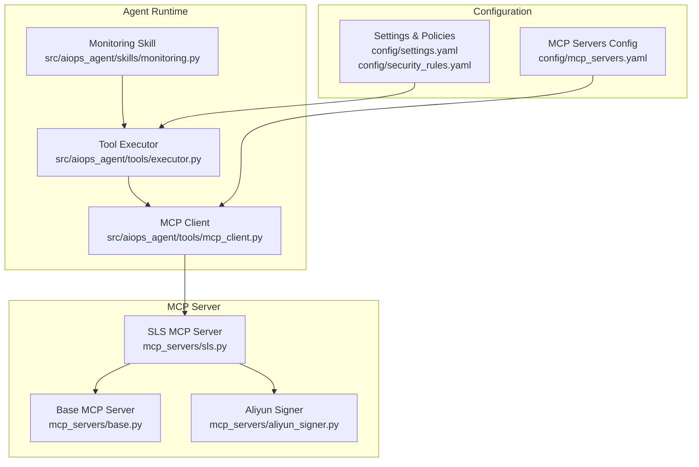
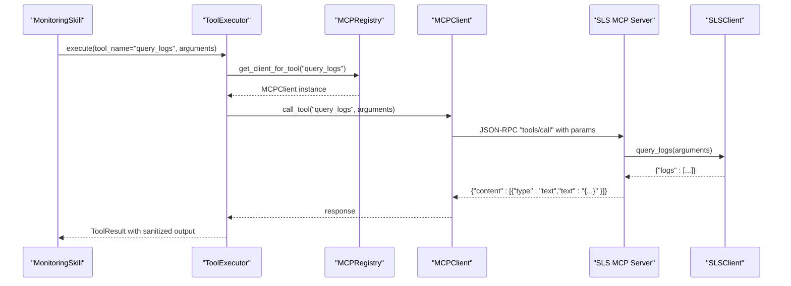
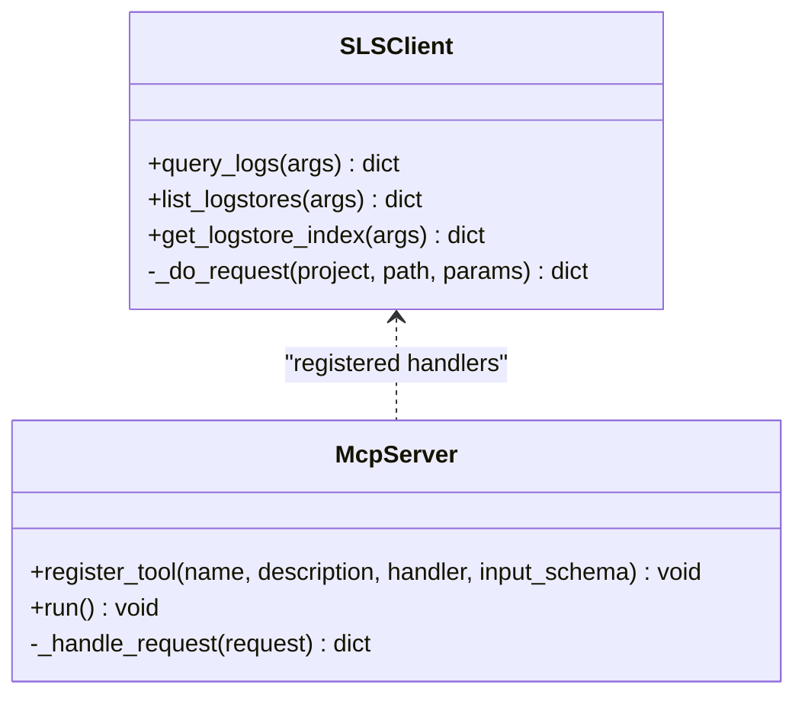
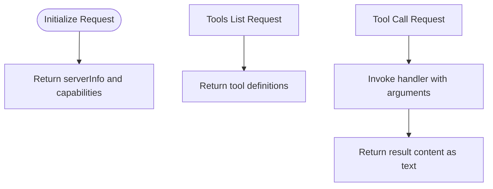
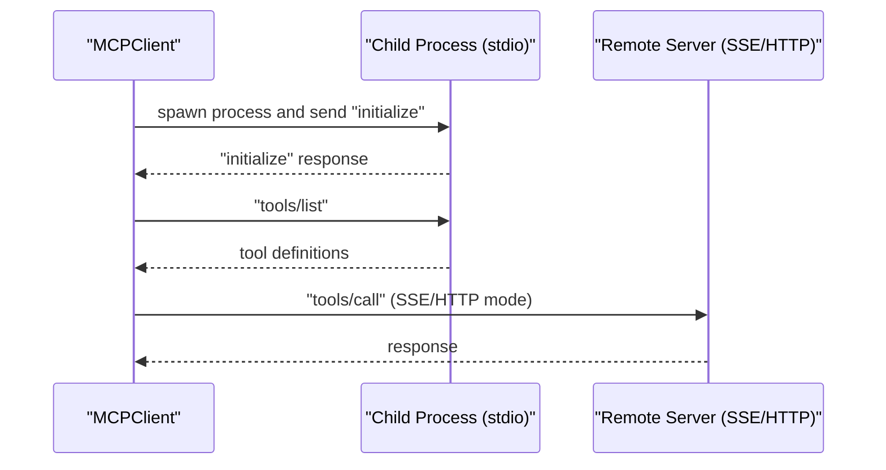
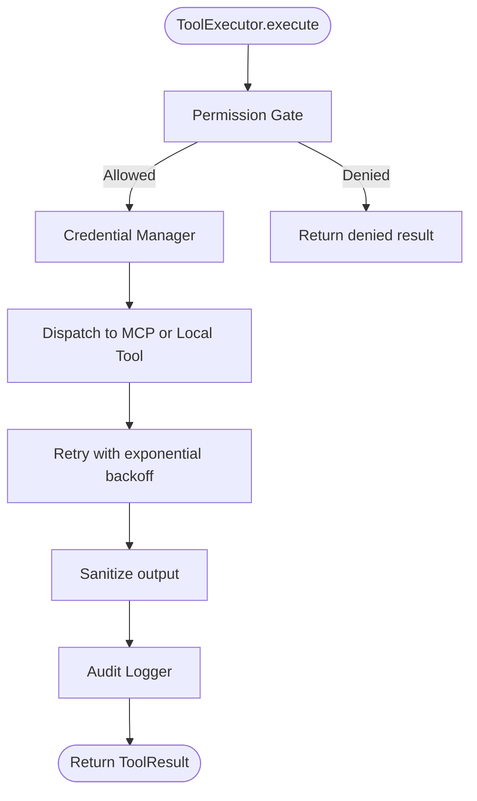
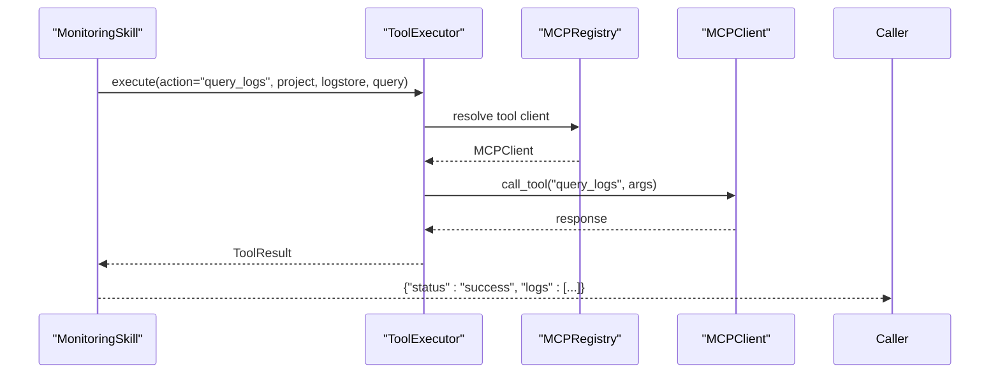
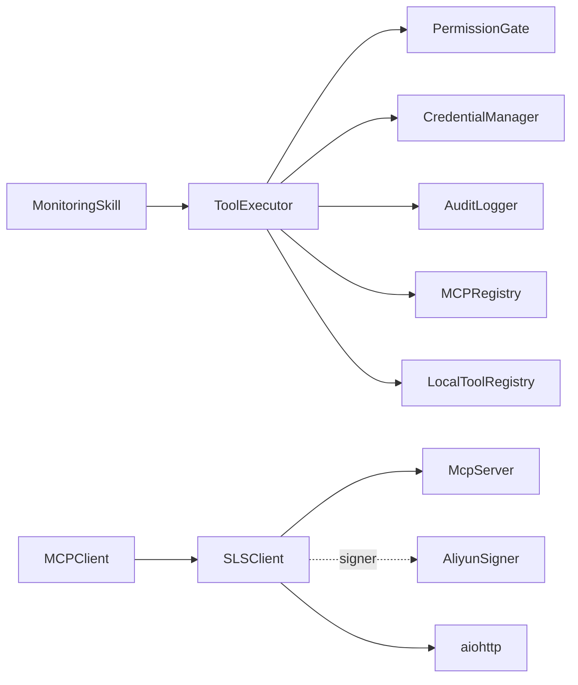

# SLS Log Analysis Integration

<cite>
**Referenced Files in This Document**
- [README.md](file://README.md)
- [mcp_servers/sls.py](file://mcp_servers/sls.py)
- [mcp_servers/base.py](file://mcp_servers/base.py)
- [mcp_servers/aliyun_signer.py](file://mcp_servers/aliyun_signer.py)
- [src/aiops_agent/tools/mcp_client.py](file://src/aiops_agent/tools/mcp_client.py)
- [src/aiops_agent/tools/executor.py](file://src/aiops_agent/tools/executor.py)
- [src/aiops_agent/skills/monitoring.py](file://src/aiops_agent/skills/monitoring.py)
- [config/mcp_servers.yaml](file://config/mcp_servers.yaml)
- [config/settings.yaml](file://config/settings.yaml)
- [config/security_rules.yaml](file://config/security_rules.yaml)
- [src/aiops_agent/models/schemas.py](file://src/aiops_agent/models/schemas.py)
- [tests/mcp_servers/test_sls.py](file://tests/mcp_servers/test_sls.py)
</cite>

## Table of Contents
1. [Introduction](#introduction)
2. [Project Structure](#project-structure)
3. [Core Components](#core-components)
4. [Architecture Overview](#architecture-overview)
5. [Detailed Component Analysis](#detailed-component-analysis)
6. [Dependency Analysis](#dependency-analysis)
7. [Performance Considerations](#performance-considerations)
8. [Troubleshooting Guide](#troubleshooting-guide)
9. [Conclusion](#conclusion)
10. [Appendices](#appendices)

## Introduction
This document describes the SLS (Simple Log Service) MCP server that provides log analysis capabilities for the AIOps Agent. It covers log query operations, search filters, time range specifications, and result formatting. It also explains the integration with Alibaba Cloud SLS SDK, log tailing capabilities, and real-time log streaming. Security considerations for log access, data privacy compliance, and efficient query optimization techniques are included.

The SLS MCP server exposes three tools:
- query_logs: Executes SLS log queries with optional filters and returns structured results.
- list_logstores: Lists logstores under a given project.
- get_logstore_index: Retrieves the index configuration for a logstore.

These tools integrate with the AIOps Agent’s Tool Executor and MCP client to provide secure, audited, and rate-limited access to SLS.

**Section sources**
- [README.md:15-24](file://README.md#L15-L24)
- [mcp_servers/sls.py:49-91](file://mcp_servers/sls.py#L49-L91)

## Project Structure
The SLS integration spans several modules:
- MCP server implementation and base protocol
- Alibaba Cloud signer utilities
- MCP client and Tool Executor for secure tool invocation
- Monitoring skill that orchestrates SLS queries
- Configuration files for MCP servers and security policies

**Diagram sources**
- [mcp_servers/sls.py:1-97](file://mcp_servers/sls.py#L1-L97)
- [mcp_servers/base.py:14-108](file://mcp_servers/base.py#L14-L108)
- [mcp_servers/aliyun_signer.py:1-76](file://mcp_servers/aliyun_signer.py#L1-L76)
- [src/aiops_agent/tools/mcp_client.py:22-324](file://src/aiops_agent/tools/mcp_client.py#L22-L324)
- [src/aiops_agent/tools/executor.py:45-314](file://src/aiops_agent/tools/executor.py#L45-L314)
- [src/aiops_agent/skills/monitoring.py:18-121](file://src/aiops_agent/skills/monitoring.py#L18-L121)
- [config/mcp_servers.yaml:14-22](file://config/mcp_servers.yaml#L14-L22)
- [config/settings.yaml:44-55](file://config/settings.yaml#L44-L55)

**Section sources**
- [README.md:64-126](file://README.md#L64-L126)
- [config/mcp_servers.yaml:14-22](file://config/mcp_servers.yaml#L14-L22)

## Core Components
- SLSClient: Implements HTTP requests to SLS endpoints and returns structured results. It constructs URLs and headers, and performs GET requests using aiohttp.
- McpServer: Base JSON-RPC 2.0 stdio server that registers tools and handles initialize/tools/list/tools/call notifications.
- AliyunSigner: Provides HMAC-SHA1 signing utilities for Alibaba Cloud APIs. Note: The current SLSClient does not use this signer in the provided implementation.
- MCPClient: Supports stdio and SSE/HTTP transports, serializes JSON-RPC messages, and manages connections and tool discovery/calls.
- ToolExecutor: Orchestrates permission checks, credential acquisition, MCP/local tool dispatch, retries, sanitization, and auditing.
- MonitoringSkill: Provides a skill-level interface to query logs via the Tool Executor.

Key capabilities:
- Log query operations with optional query filters
- Listing logstores under a project
- Retrieving logstore index configuration
- Secure credential injection and audit logging
- Rate limiting and safety controls via configuration

**Section sources**
- [mcp_servers/sls.py:16-47](file://mcp_servers/sls.py#L16-L47)
- [mcp_servers/base.py:14-108](file://mcp_servers/base.py#L14-L108)
- [mcp_servers/aliyun_signer.py:13-76](file://mcp_servers/aliyun_signer.py#L13-L76)
- [src/aiops_agent/tools/mcp_client.py:22-324](file://src/aiops_agent/tools/mcp_client.py#L22-L324)
- [src/aiops_agent/tools/executor.py:45-314](file://src/aiops_agent/tools/executor.py#L45-L314)
- [src/aiops_agent/skills/monitoring.py:99-121](file://src/aiops_agent/skills/monitoring.py#L99-L121)

## Architecture Overview
The SLS MCP server integrates with the AIOps Agent runtime as follows:
- The MonitoringSkill invokes ToolExecutor to call the SLS tool.
- ToolExecutor resolves the MCP client for the tool, injects credentials if needed, and executes the call.
- The MCP client communicates with the SLS MCP server over stdio, sending JSON-RPC requests and receiving responses.
- The SLS MCP server executes the SLSClient handler and returns results.

**Diagram sources**
- [src/aiops_agent/skills/monitoring.py:117-121](file://src/aiops_agent/skills/monitoring.py#L117-L121)
- [src/aiops_agent/tools/executor.py:276-295](file://src/aiops_agent/tools/executor.py#L276-L295)
- [src/aiops_agent/tools/mcp_client.py:135-155](file://src/aiops_agent/tools/mcp_client.py#L135-L155)
- [mcp_servers/base.py:76-107](file://mcp_servers/base.py#L76-L107)
- [mcp_servers/sls.py:35-38](file://mcp_servers/sls.py#L35-L38)

## Detailed Component Analysis

### SLS MCP Server Implementation
The SLS MCP server defines three tools:
- query_logs: Accepts project, logstore, and optional query. Returns a JSON object containing logs.
- list_logstores: Lists logstores for a given project.
- get_logstore_index: Retrieves index configuration for a logstore.

It reads credentials and region from environment variables and registers tools with input schemas.

**Diagram sources**
- [mcp_servers/sls.py:16-47](file://mcp_servers/sls.py#L16-L47)
- [mcp_servers/base.py:23-107](file://mcp_servers/base.py#L23-L107)

**Section sources**
- [mcp_servers/sls.py:49-91](file://mcp_servers/sls.py#L49-L91)

### Base MCP Server Protocol
The base server implements JSON-RPC 2.0 over stdio:
- initialize: Returns server info and capabilities.
- tools/list: Lists registered tools with descriptions and input schemas.
- tools/call: Invokes a registered tool and returns content as text.
- notifications/initialized: Acknowledges initialization.

**Diagram sources**
- [mcp_servers/base.py:76-107](file://mcp_servers/base.py#L76-L107)

**Section sources**
- [mcp_servers/base.py:14-108](file://mcp_servers/base.py#L14-L108)

### MCP Client and Transport
The MCP client supports stdio and SSE/HTTP transports:
- stdio: Spawns a subprocess and communicates via stdin/stdout.
- SSE/HTTP: Sends JSON-RPC over HTTP.
- Handles request serialization/deserialization and response parsing.

**Diagram sources**
- [src/aiops_agent/tools/mcp_client.py:182-220](file://src/aiops_agent/tools/mcp_client.py#L182-L220)
- [src/aiops_agent/tools/mcp_client.py:225-247](file://src/aiops_agent/tools/mcp_client.py#L225-L247)

**Section sources**
- [src/aiops_agent/tools/mcp_client.py:22-324](file://src/aiops_agent/tools/mcp_client.py#L22-L324)

### Tool Execution Pipeline
The ToolExecutor coordinates:
- Permission gate checks
- Credential acquisition (including Alibaba Cloud STS)
- Tool dispatch (MCP or local)
- Retries and timeouts
- Output sanitization and audit logging

**Diagram sources**
- [src/aiops_agent/tools/executor.py:80-202](file://src/aiops_agent/tools/executor.py#L80-L202)

**Section sources**
- [src/aiops_agent/tools/executor.py:45-314](file://src/aiops_agent/tools/executor.py#L45-L314)

### Monitoring Skill Integration
The MonitoringSkill provides a high-level interface to query logs:
- Validates inputs and delegates to ToolExecutor
- Returns structured results with logs

**Diagram sources**
- [src/aiops_agent/skills/monitoring.py:99-121](file://src/aiops_agent/skills/monitoring.py#L99-L121)
- [src/aiops_agent/tools/executor.py:276-295](file://src/aiops_agent/tools/executor.py#L276-L295)

**Section sources**
- [src/aiops_agent/skills/monitoring.py:99-121](file://src/aiops_agent/skills/monitoring.py#L99-L121)

## Dependency Analysis
- SLS MCP server depends on:
  - McpServer base class for JSON-RPC handling
  - AliyunSigner module (present but not used in current implementation)
  - aiohttp for HTTP requests
- ToolExecutor depends on:
  - PermissionGate, CredentialManager, AuditLogger
  - MCPRegistry and LocalToolRegistry
  - OpenTelemetry tracing
- MonitoringSkill depends on ToolExecutor for tool invocation.

**Diagram sources**
- [mcp_servers/sls.py:9-10](file://mcp_servers/sls.py#L9-L10)
- [mcp_servers/aliyun_signer.py:1-10](file://mcp_servers/aliyun_signer.py#L1-L10)
- [src/aiops_agent/tools/executor.py:18-36](file://src/aiops_agent/tools/executor.py#L18-L36)
- [src/aiops_agent/skills/monitoring.py:18-29](file://src/aiops_agent/skills/monitoring.py#L18-L29)

**Section sources**
- [mcp_servers/sls.py:9-10](file://mcp_servers/sls.py#L9-L10)
- [src/aiops_agent/tools/executor.py:18-36](file://src/aiops_agent/tools/executor.py#L18-L36)

## Performance Considerations
- Query pagination and limits: The current implementation sets a fixed line count for log queries. For large datasets, consider adding pagination support and configurable line offsets.
- Network latency: Use connection pooling and keep-alive where applicable. The current implementation creates a new session per request.
- Retry strategy: Exponential backoff is implemented for transient failures. Tune retry counts and delays according to SLA requirements.
- Timeouts: Configure tool execution timeouts to prevent long-running queries from blocking the system.
- Index usage: Ensure logstore indices are configured appropriately to speed up query performance.

[No sources needed since this section provides general guidance]

## Troubleshooting Guide
Common issues and resolutions:
- Missing aiohttp: The SLSClient returns an error if aiohttp is not installed. Install the dependency to enable HTTP requests.
- Authentication failures: Verify environment variables for region and credentials. Confirm that the agent has sufficient permissions to access SLS resources.
- Tool not found: Ensure the MCP server is enabled and the tool name matches exactly.
- Network errors: Check connectivity to SLS endpoints and proxy/firewall settings.
- Audit and tracing: Review audit logs and OpenTelemetry traces for detailed error context.

**Section sources**
- [mcp_servers/sls.py:23-26](file://mcp_servers/sls.py#L23-L26)
- [config/mcp_servers.yaml:14-22](file://config/mcp_servers.yaml#L14-L22)
- [config/settings.yaml:44-55](file://config/settings.yaml#L44-L55)

## Conclusion
The SLS MCP server provides a secure, audited, and extensible way to query Alibaba Cloud SLS logs within the AIOps Agent. It integrates with the Tool Executor pipeline to enforce permissions, inject credentials, and record audit events. While the current implementation focuses on basic log queries, future enhancements can include pagination, streaming, and advanced filtering to meet production AIOps needs.

[No sources needed since this section summarizes without analyzing specific files]

## Appendices

### Log Query Operations and Filters
- query_logs:
  - Inputs: project, logstore, query (optional)
  - Behavior: Executes a log query against the specified logstore and returns logs
  - Notes: The current implementation uses a fixed line count and offset; consider adding pagination and configurable time ranges
- list_logstores:
  - Inputs: project
  - Behavior: Lists available logstores for the project
- get_logstore_index:
  - Inputs: project, logstore
  - Behavior: Returns the index configuration for the logstore

**Section sources**
- [mcp_servers/sls.py:35-46](file://mcp_servers/sls.py#L35-L46)

### Time Range Specifications
- Current implementation does not expose explicit time range parameters in the SLSClient query_logs method.
- Recommendation: Extend the input schema to accept startTime and endTime parameters and pass them to the SLS API.

**Section sources**
- [mcp_servers/sls.py:35-38](file://mcp_servers/sls.py#L35-L38)

### Result Formatting
- query_logs returns a JSON object with a logs field containing the query results.
- list_logstores returns a JSON object with a logstores field.
- get_logstore_index returns a JSON object with an index field.

**Section sources**
- [mcp_servers/sls.py:35-46](file://mcp_servers/sls.py#L35-L46)

### Security Considerations
- Credential management: Use Alibaba Cloud STS temporary credentials via the CredentialManager and WorkloadIdentityManager.
- Permissions: Enforce RBAC levels and On-Behalf-Of delegation to minimize privilege exposure.
- Data privacy: Apply sensitive data sanitization and audit logging for all tool invocations.
- Compliance: Adhere to data residency and retention policies defined in configuration.

**Section sources**
- [src/aiops_agent/tools/executor.py:124-202](file://src/aiops_agent/tools/executor.py#L124-L202)
- [config/security_rules.yaml:44-69](file://config/security_rules.yaml#L44-L69)
- [config/settings.yaml:79-85](file://config/settings.yaml#L79-L85)

### Performance Optimization Techniques
- Use SLS indices to accelerate queries.
- Limit result sets with pagination and time windows.
- Batch queries where possible and leverage caching for repeated reads.
- Monitor tool execution durations and adjust timeouts accordingly.

[No sources needed since this section provides general guidance]

### Example Scenarios
- Log pattern matching: Use the query_logs tool with a query string that matches desired patterns (e.g., error messages).
- Error detection: Filter logs by severity or error keywords and correlate with metrics.
- Performance analysis: Query slow operation logs and join with metrics for root cause analysis.

[No sources needed since this section provides general guidance]