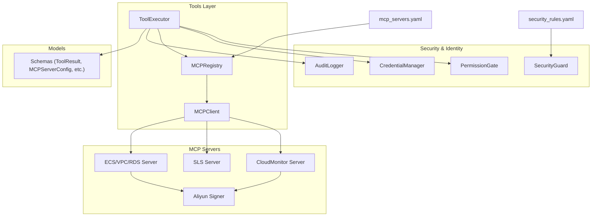
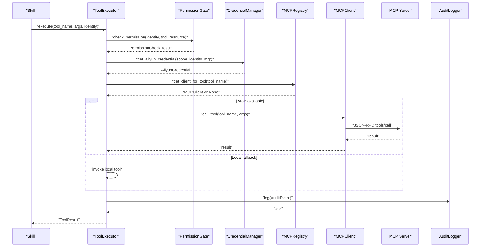
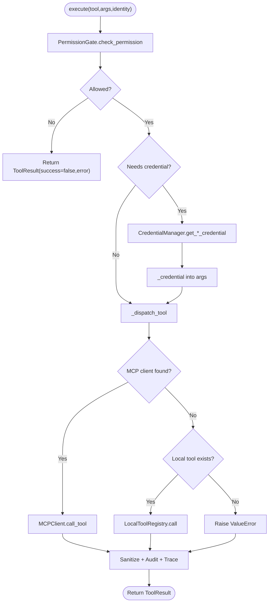
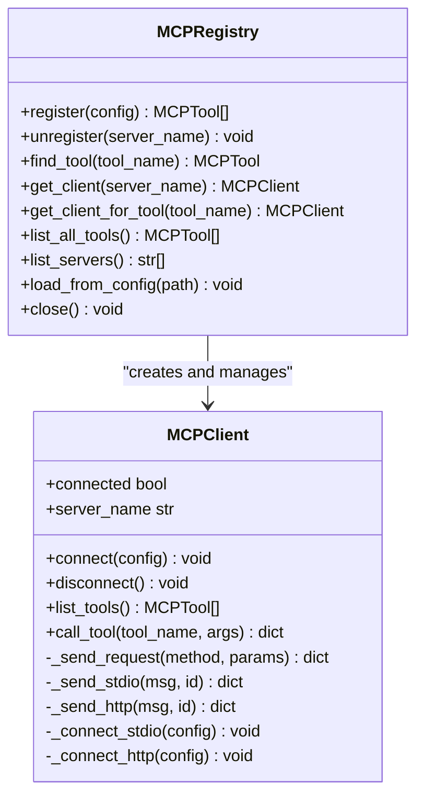
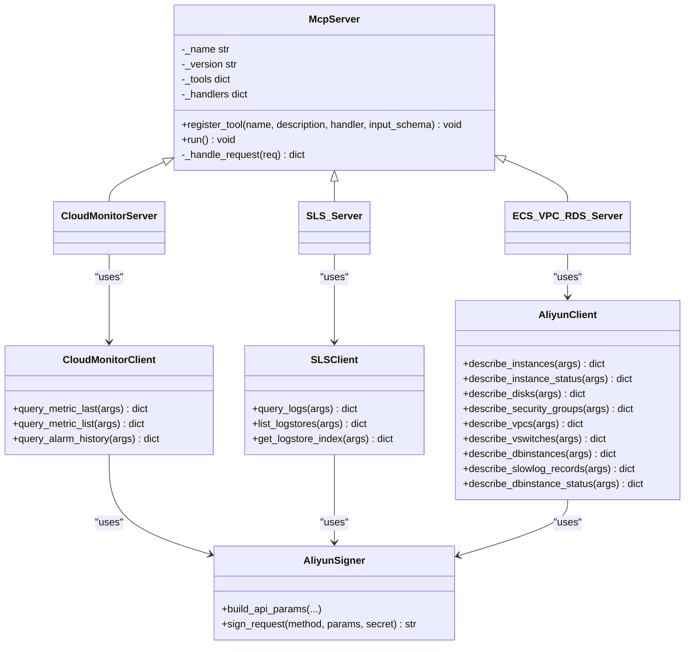
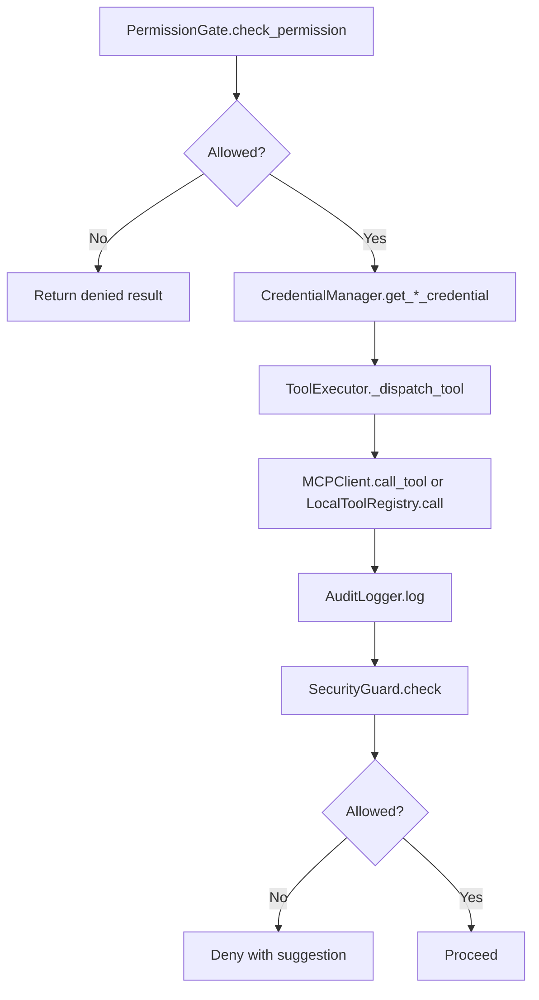
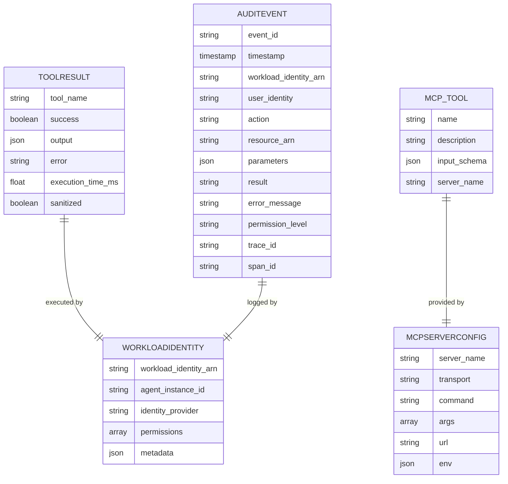
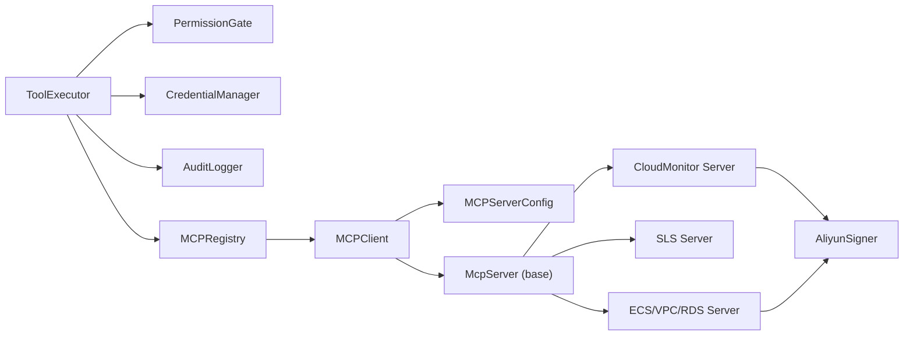

# Tool Execution & MCP Integration

<cite>
**Referenced Files in This Document**
- [executor.py](file://src/aiops_agent/tools/executor.py)
- [mcp_client.py](file://src/aiops_agent/tools/mcp_client.py)
- [mcp_registry.py](file://src/aiops_agent/tools/mcp_registry.py)
- [base.py](file://mcp_servers/base.py)
- [cloud_monitor.py](file://mcp_servers/cloud_monitor.py)
- [sls.py](file://mcp_servers/sls.py)
- [ecs_vpc_rds.py](file://mcp_servers/ecs_vpc_rds.py)
- [aliyun_signer.py](file://mcp_servers/aliyun_signer.py)
- [schemas.py](file://src/aiops_agent/models/schemas.py)
- [credential_manager.py](file://src/aiops_agent/security/credential_manager.py)
- [permission_gate.py](file://src/aiops_agent/security/permission_gate.py)
- [audit_logger.py](file://src/aiops_agent/security/audit_logger.py)
- [security_guard.py](file://src/aiops_agent/security/security_guard.py)
- [mcp_servers.yaml](file://config/mcp_servers.yaml)
- [security_rules.yaml](file://config/security_rules.yaml)
</cite>

## Table of Contents
1. [Introduction](#introduction)
2. [Project Structure](#project-structure)
3. [Core Components](#core-components)
4. [Architecture Overview](#architecture-overview)
5. [Detailed Component Analysis](#detailed-component-analysis)
6. [Dependency Analysis](#dependency-analysis)
7. [Performance Considerations](#performance-considerations)
8. [Troubleshooting Guide](#troubleshooting-guide)
9. [Conclusion](#conclusion)
10. [Appendices](#appendices)

## Introduction
This document explains how the AIOps Agent executes tools and integrates with the Model Context Protocol (MCP) to securely connect to cloud services. It covers:
- What MCP is and how it enables secure cloud integrations
- How ToolExecutor bridges skills and MCP servers
- MCP server implementations for Alibaba Cloud services (CloudMonitor, SLS, ECS/VPC/RDS) and a custom signer
- The MCP registry system, client–server communication patterns, and credential management
- Security considerations, error handling, and performance optimization
- Practical examples of tool execution flows and integration patterns

## Project Structure
The tool execution and MCP integration spans several modules:
- Tools orchestration and execution: ToolExecutor, MCP client, MCP registry
- MCP server implementations: CloudMonitor, SLS, ECS/VPC/RDS, and a generic signer
- Security and identity: PermissionGate, CredentialManager, AuditLogger, SecurityGuard
- Shared models: schemas for ToolResult, WorkloadIdentity, MCPServerConfig, and more
- Configuration: mcp_servers.yaml and security_rules.yaml

**Diagram sources**
- [executor.py:45-314](file://src/aiops_agent/tools/executor.py#L45-L314)
- [mcp_registry.py:20-162](file://src/aiops_agent/tools/mcp_registry.py#L20-L162)
- [mcp_client.py:22-324](file://src/aiops_agent/tools/mcp_client.py#L22-L324)
- [cloud_monitor.py:74-131](file://mcp_servers/cloud_monitor.py#L74-L131)
- [sls.py:49-97](file://mcp_servers/sls.py#L49-L97)
- [ecs_vpc_rds.py:101-125](file://mcp_servers/ecs_vpc_rds.py#L101-L125)
- [aliyun_signer.py:25-76](file://mcp_servers/aliyun_signer.py#L25-L76)
- [permission_gate.py:57-319](file://src/aiops_agent/security/permission_gate.py#L57-L319)
- [credential_manager.py:38-261](file://src/aiops_agent/security/credential_manager.py#L38-L261)
- [audit_logger.py:24-253](file://src/aiops_agent/security/audit_logger.py#L24-L253)
- [security_guard.py:25-292](file://src/aiops_agent/security/security_guard.py#L25-L292)
- [schemas.py:73-162](file://src/aiops_agent/models/schemas.py#L73-L162)
- [mcp_servers.yaml:1-41](file://config/mcp_servers.yaml#L1-L41)
- [security_rules.yaml:1-70](file://config/security_rules.yaml#L1-L70)

**Section sources**
- [executor.py:45-314](file://src/aiops_agent/tools/executor.py#L45-L314)
- [mcp_registry.py:20-162](file://src/aiops_agent/tools/mcp_registry.py#L20-L162)
- [mcp_client.py:22-324](file://src/aiops_agent/tools/mcp_client.py#L22-L324)
- [cloud_monitor.py:74-131](file://mcp_servers/cloud_monitor.py#L74-L131)
- [sls.py:49-97](file://mcp_servers/sls.py#L49-L97)
- [ecs_vpc_rds.py:101-125](file://mcp_servers/ecs_vpc_rds.py#L101-L125)
- [aliyun_signer.py:25-76](file://mcp_servers/aliyun_signer.py#L25-L76)
- [permission_gate.py:57-319](file://src/aiops_agent/security/permission_gate.py#L57-L319)
- [credential_manager.py:38-261](file://src/aiops_agent/security/credential_manager.py#L38-L261)
- [audit_logger.py:24-253](file://src/aiops_agent/security/audit_logger.py#L24-L253)
- [security_guard.py:25-292](file://src/aiops_agent/security/security_guard.py#L25-L292)
- [schemas.py:73-162](file://src/aiops_agent/models/schemas.py#L73-L162)
- [mcp_servers.yaml:1-41](file://config/mcp_servers.yaml#L1-L41)
- [security_rules.yaml:1-70](file://config/security_rules.yaml#L1-L70)

## Core Components
- ToolExecutor: Unified entry point for tool execution with permission checks, credential acquisition, MCP/local dispatch, retries, sanitization, auditing, and tracing.
- MCPRegistry: Manages MCP server lifecycles, loads configs, maintains tool-to-server mapping, and exposes clients.
- MCPClient: Implements JSON-RPC over stdio and HTTP/SSE transports, supports tool discovery and invocation.
- MCP Servers: CloudMonitor, SLS, ECS/VPC/RDS, and a signer module for building signed requests.
- Security stack: PermissionGate, CredentialManager, AuditLogger, SecurityGuard.
- Shared models: ToolResult, WorkloadIdentity, MCPServerConfig, and related schemas.

Key responsibilities and interactions are covered in the following sections.

**Section sources**
- [executor.py:45-314](file://src/aiops_agent/tools/executor.py#L45-L314)
- [mcp_registry.py:20-162](file://src/aiops_agent/tools/mcp_registry.py#L20-L162)
- [mcp_client.py:22-324](file://src/aiops_agent/tools/mcp_client.py#L22-L324)
- [base.py:14-108](file://mcp_servers/base.py#L14-L108)
- [cloud_monitor.py:74-131](file://mcp_servers/cloud_monitor.py#L74-L131)
- [sls.py:49-97](file://mcp_servers/sls.py#L49-L97)
- [ecs_vpc_rds.py:101-125](file://mcp_servers/ecs_vpc_rds.py#L101-L125)
- [aliyun_signer.py:25-76](file://mcp_servers/aliyun_signer.py#L25-L76)
- [permission_gate.py:57-319](file://src/aiops_agent/security/permission_gate.py#L57-L319)
- [credential_manager.py:38-261](file://src/aiops_agent/security/credential_manager.py#L38-L261)
- [audit_logger.py:24-253](file://src/aiops_agent/security/audit_logger.py#L24-L253)
- [security_guard.py:25-292](file://src/aiops_agent/security/security_guard.py#L25-L292)
- [schemas.py:73-162](file://src/aiops_agent/models/schemas.py#L73-L162)

## Architecture Overview
The system follows a layered design:
- Skills trigger tool execution via ToolExecutor
- ToolExecutor enforces permissions, acquires credentials, and dispatches to MCP or local tools
- MCPRegistry connects to configured MCP servers and caches tool definitions
- MCPClient communicates with servers using JSON-RPC over stdio or HTTP/SSE
- MCP servers implement tools and use a custom signer for Alibaba Cloud APIs
- Security and observability layers record audits, enforce policies, and guard against anomalies

**Diagram sources**
- [executor.py:80-226](file://src/aiops_agent/tools/executor.py#L80-L226)
- [permission_gate.py:95-182](file://src/aiops_agent/security/permission_gate.py#L95-L182)
- [credential_manager.py:63-122](file://src/aiops_agent/security/credential_manager.py#L63-L122)
- [mcp_registry.py:103-108](file://src/aiops_agent/tools/mcp_registry.py#L103-L108)
- [mcp_client.py:135-155](file://src/aiops_agent/tools/mcp_client.py#L135-L155)
- [base.py:76-108](file://mcp_servers/base.py#L76-L108)
- [audit_logger.py:65-104](file://src/aiops_agent/security/audit_logger.py#L65-L104)

## Detailed Component Analysis

### ToolExecutor
Responsibilities:
- Permission gating, credential acquisition, MCP/local tool dispatch
- Retry with exponential backoff, timeout enforcement, and error normalization
- Sanitization of sensitive parameters and audit logging
- OpenTelemetry tracing integration

Execution flow highlights:
- PermissionGate.check_permission validates action and resource ARN
- CredentialManager supplies temporary credentials for Alibaba Cloud or third-party services
- MCPRegistry resolves tool to server and returns MCPClient
- _execute_with_retry wraps _dispatch_tool with timeouts and network error retries
- _dispatch_tool prefers MCP, falls back to local tools
- AuditLogger records events with sanitized parameters

**Diagram sources**
- [executor.py:80-295](file://src/aiops_agent/tools/executor.py#L80-L295)
- [permission_gate.py:95-182](file://src/aiops_agent/security/permission_gate.py#L95-L182)
- [credential_manager.py:63-214](file://src/aiops_agent/security/credential_manager.py#L63-L214)
- [mcp_registry.py:103-108](file://src/aiops_agent/tools/mcp_registry.py#L103-L108)
- [mcp_client.py:135-155](file://src/aiops_agent/tools/mcp_client.py#L135-L155)

**Section sources**
- [executor.py:45-314](file://src/aiops_agent/tools/executor.py#L45-L314)

### MCP Registry and Client
MCPRegistry:
- Registers servers from mcp_servers.yaml, connects via MCPClient, lists tools, and maintains tool-to-server mapping
- Supports dynamic registration/unregistration and bulk loading

MCPClient:
- Supports stdio (local subprocess) and HTTP/SSE transports
- Implements JSON-RPC 2.0 with initialize, tools/list, tools/call
- Handles connection lifecycle, request/response serialization, and error parsing

**Diagram sources**
- [mcp_registry.py:20-162](file://src/aiops_agent/tools/mcp_registry.py#L20-L162)
- [mcp_client.py:22-324](file://src/aiops_agent/tools/mcp_client.py#L22-L324)

**Section sources**
- [mcp_registry.py:20-162](file://src/aiops_agent/tools/mcp_registry.py#L20-L162)
- [mcp_client.py:22-324](file://src/aiops_agent/tools/mcp_client.py#L22-L324)
- [mcp_servers.yaml:1-41](file://config/mcp_servers.yaml#L1-L41)

### MCP Server Implementations
Base server:
- Implements JSON-RPC 2.0 over stdio with initialize, tools/list, tools/call
- Maintains tool definitions and handlers

CloudMonitor server:
- Provides metric queries, history retrieval
- Uses Aliyun Signer to build signed requests

SLS server:
- Provides log queries, list logstores, and index retrieval
- Uses Aliyun Signer to build signed requests

ECS/VPC/RDS server:
- Provides instance, disk, security group, VPC/VSwitch, and RDS queries
- Uses Aliyun Signer to build signed requests

Aliyun Signer:
- Builds canonical API parameters and computes HMAC-SHA1 signatures
- Pure standard library implementation without SDK dependencies

**Diagram sources**
- [base.py:14-108](file://mcp_servers/base.py#L14-L108)
- [cloud_monitor.py:17-125](file://mcp_servers/cloud_monitor.py#L17-L125)
- [sls.py:16-91](file://mcp_servers/sls.py#L16-L91)
- [ecs_vpc_rds.py:19-119](file://mcp_servers/ecs_vpc_rds.py#L19-L119)
- [aliyun_signer.py:25-76](file://mcp_servers/aliyun_signer.py#L25-L76)

**Section sources**
- [base.py:14-108](file://mcp_servers/base.py#L14-L108)
- [cloud_monitor.py:17-125](file://mcp_servers/cloud_monitor.py#L17-L125)
- [sls.py:16-91](file://mcp_servers/sls.py#L16-L91)
- [ecs_vpc_rds.py:19-119](file://mcp_servers/ecs_vpc_rds.py#L19-L119)
- [aliyun_signer.py:25-76](file://mcp_servers/aliyun_signer.py#L25-L76)

### Security and Identity
PermissionGate:
- Enforces RBAC with three permission levels
- Supports On-Behalf-Of permission intersection
- Matches actions/resources using wildcard patterns
- Requests manual approval for limited-write and admin actions

CredentialManager:
- Retrieves Alibaba Cloud STS credentials via WorkloadIdentityManager
- Manages third-party credentials from environment variables
- Implements caching and refresh-before expiration logic
- Uses exponential backoff for retries

AuditLogger:
- Writes structured audit logs to ActionTrail and local JSONL files
- Sanitizes sensitive parameters
- Backs up failed writes and triggers alerts

SecurityGuard:
- Enforces blacklist rules for high-risk actions
- Applies rate limits per minute/hour and per skill
- Detects anomalous operation sequences
- Enforces HTTPS/TLS compliance

**Diagram sources**
- [permission_gate.py:95-182](file://src/aiops_agent/security/permission_gate.py#L95-L182)
- [credential_manager.py:63-214](file://src/aiops_agent/security/credential_manager.py#L63-L214)
- [audit_logger.py:65-104](file://src/aiops_agent/security/audit_logger.py#L65-L104)
- [security_guard.py:64-123](file://src/aiops_agent/security/security_guard.py#L64-L123)

**Section sources**
- [permission_gate.py:57-319](file://src/aiops_agent/security/permission_gate.py#L57-L319)
- [credential_manager.py:38-261](file://src/aiops_agent/security/credential_manager.py#L38-L261)
- [audit_logger.py:24-253](file://src/aiops_agent/security/audit_logger.py#L24-L253)
- [security_guard.py:25-292](file://src/aiops_agent/security/security_guard.py#L25-L292)
- [security_rules.yaml:1-70](file://config/security_rules.yaml#L1-L70)

### Data Models and Schemas
Shared models define ToolResult, WorkloadIdentity, MCPServerConfig, MCPTool, AuditEvent, and more. These models standardize cross-module data exchange and validation.

**Diagram sources**
- [schemas.py:73-162](file://src/aiops_agent/models/schemas.py#L73-L162)

**Section sources**
- [schemas.py:73-162](file://src/aiops_agent/models/schemas.py#L73-L162)

## Dependency Analysis
- ToolExecutor depends on PermissionGate, CredentialManager, AuditLogger, MCPRegistry, and LocalToolRegistry
- MCPRegistry depends on MCPClient and MCPServerConfig
- MCPClient depends on MCPServerConfig and implements JSON-RPC over stdio/HTTP
- MCP Servers depend on McpServer base class and AliyunSigner
- Security modules are independent but integrated at runtime via ToolExecutor

**Diagram sources**
- [executor.py:45-314](file://src/aiops_agent/tools/executor.py#L45-L314)
- [mcp_registry.py:20-162](file://src/aiops_agent/tools/mcp_registry.py#L20-L162)
- [mcp_client.py:22-324](file://src/aiops_agent/tools/mcp_client.py#L22-L324)
- [base.py:14-108](file://mcp_servers/base.py#L14-L108)
- [cloud_monitor.py:74-131](file://mcp_servers/cloud_monitor.py#L74-L131)
- [sls.py:49-97](file://mcp_servers/sls.py#L49-L97)
- [ecs_vpc_rds.py:101-125](file://mcp_servers/ecs_vpc_rds.py#L101-L125)
- [aliyun_signer.py:25-76](file://mcp_servers/aliyun_signer.py#L25-L76)

**Section sources**
- [executor.py:45-314](file://src/aiops_agent/tools/executor.py#L45-L314)
- [mcp_registry.py:20-162](file://src/aiops_agent/tools/mcp_registry.py#L20-L162)
- [mcp_client.py:22-324](file://src/aiops_agent/tools/mcp_client.py#L22-L324)
- [base.py:14-108](file://mcp_servers/base.py#L14-L108)
- [cloud_monitor.py:74-131](file://mcp_servers/cloud_monitor.py#L74-L131)
- [sls.py:49-97](file://mcp_servers/sls.py#L49-L97)
- [ecs_vpc_rds.py:101-125](file://mcp_servers/ecs_vpc_rds.py#L101-L125)
- [aliyun_signer.py:25-76](file://mcp_servers/aliyun_signer.py#L25-L76)

## Performance Considerations
- Retries and timeouts: ToolExecutor applies exponential backoff and enforces per-call timeouts to improve resilience under transient failures.
- Credential caching: CredentialManager caches STS and third-party credentials with refresh-before logic to reduce overhead.
- Tool discovery caching: MCPRegistry caches tools per server to avoid repeated discovery calls.
- Transport selection: Prefer stdio for local MCP servers to minimize network latency; use HTTP/SSE for remote servers.
- Rate limiting: SecurityGuard enforces per-minute and per-hour limits to prevent API saturation.
- Tracing and auditing: OpenTelemetry spans and audit logs help identify slow paths and bottlenecks.

[No sources needed since this section provides general guidance]

## Troubleshooting Guide
Common issues and resolutions:
- Permission denied: Verify WorkloadIdentity permissions and resource ARN patterns; On-Behalf-Of reduces agent permissions to intersection.
- Credential acquisition failure: Ensure WorkloadIdentityManager is configured and STS assume-role succeeds; check retry logs for exponential backoff delays.
- MCP connection failures: Confirm mcp_servers.yaml transport and endpoints; for stdio, verify command and args; for HTTP/SSE, ensure TLS and URL correctness.
- Tool not found: Check MCPRegistry tool mapping and server registration; ensure tools/list returns expected definitions.
- Audit write failures: ActionTrail endpoint down; confirm backups and alert callbacks; sanitize sensitive parameters to avoid masking issues.
- Security rule violations: Review blacklist, rate limit, and anomaly detection configurations; adjust thresholds or whitelist as appropriate.

**Section sources**
- [permission_gate.py:95-182](file://src/aiops_agent/security/permission_gate.py#L95-L182)
- [credential_manager.py:63-214](file://src/aiops_agent/security/credential_manager.py#L63-L214)
- [mcp_registry.py:38-89](file://src/aiops_agent/tools/mcp_registry.py#L38-L89)
- [mcp_client.py:56-95](file://src/aiops_agent/tools/mcp_client.py#L56-L95)
- [audit_logger.py:65-104](file://src/aiops_agent/security/audit_logger.py#L65-L104)
- [security_guard.py:64-123](file://src/aiops_agent/security/security_guard.py#L64-L123)

## Conclusion
The AIOps Agent’s tool execution and MCP integration provide a secure, extensible framework for cloud operations. ToolExecutor centralizes safety and reliability, MCPRegistry and MCPClient enable flexible server connectivity, and Alibaba Cloud MCP servers deliver robust toolsets backed by a custom signer. Combined with PermissionGate, CredentialManager, AuditLogger, and SecurityGuard, the system ensures secure, auditable, and high-performance cloud interactions.

[No sources needed since this section summarizes without analyzing specific files]

## Appendices

### Practical Examples

- Execute a CloudMonitor metric query:
  - Skill invokes ToolExecutor.execute with tool_name matching a registered CloudMonitor tool
  - ToolExecutor fetches Alibaba Cloud STS credentials, resolves MCP client, and calls tools/call
  - MCP server signs and queries CloudMonitor, returning results to ToolExecutor

- Execute an SLS log query:
  - Similar flow with SLS MCP server; tool uses signed request to retrieve logs

- Execute ECS/VPC/RDS queries:
  - ToolExecutor dispatches to ECS/VPC/RDS MCP server; tool handlers query respective APIs via signer

- Local tool fallback:
  - If no MCP client is registered for a tool, ToolExecutor attempts local tool execution

**Section sources**
- [executor.py:80-295](file://src/aiops_agent/tools/executor.py#L80-L295)
- [cloud_monitor.py:74-131](file://mcp_servers/cloud_monitor.py#L74-L131)
- [sls.py:49-97](file://mcp_servers/sls.py#L49-L97)
- [ecs_vpc_rds.py:101-125](file://mcp_servers/ecs_vpc_rds.py#L101-L125)