# Tool Executor

<cite>
**Referenced Files in This Document**
- [executor.py](file://src/aiops_agent/tools/executor.py)
- [local_tools.py](file://src/aiops_agent/tools/local_tools.py)
- [mcp_client.py](file://src/aiops_agent/tools/mcp_client.py)
- [mcp_registry.py](file://src/aiops_agent/tools/mcp_registry.py)
- [permission_gate.py](file://src/aiops_agent/security/permission_gate.py)
- [credential_manager.py](file://src/aiops_agent/security/credential_manager.py)
- [audit_logger.py](file://src/aiops_agent/security/audit_logger.py)
- [schemas.py](file://src/aiops_agent/models/schemas.py)
- [exceptions.py](file://src/aiops_agent/core/exceptions.py)
- [settings.yaml](file://config/settings.yaml)
- [mcp_servers.yaml](file://config/mcp_servers.yaml)
- [security_rules.yaml](file://config/security_rules.yaml)
- [main.py](file://src/aiops_agent/main.py)
- [test_tool_executor.py](file://tests/test_tool_executor.py)
</cite>

## Table of Contents
1. [Introduction](#introduction)
2. [Project Structure](#project-structure)
3. [Core Components](#core-components)
4. [Architecture Overview](#architecture-overview)
5. [Detailed Component Analysis](#detailed-component-analysis)
6. [Dependency Analysis](#dependency-analysis)
7. [Performance Considerations](#performance-considerations)
8. [Troubleshooting Guide](#troubleshooting-guide)
9. [Conclusion](#conclusion)
10. [Appendices](#appendices)

## Introduction
This document provides a comprehensive guide to the ToolExecutor component, the unified execution engine for all tools in AIOps Agent. It explains the end-to-end execution pipeline: permission gate validation, credential acquisition, tool matching and dispatch, execution with timeout control and retry logic, output sanitization, and audit logging. It also documents the three execution modes (sync, async, stream), error handling strategies, and integration with security components. Practical examples, configuration options, and performance considerations are included to help operators and developers deploy and tune ToolExecutor effectively.

## Project Structure
ToolExecutor resides in the tools layer and integrates tightly with security and observability components. The key modules involved are:
- ToolExecutor: orchestrates the full lifecycle of tool invocation
- PermissionGate: enforces RBAC and resource-level ARN checks
- CredentialManager: obtains temporary credentials and manages caching
- MCPRegistry and MCPClient: dynamic discovery and invocation of MCP tools
- LocalToolRegistry: local Python function registration and invocation
- AuditLogger: structured auditing with sensitive data sanitization
- Models and Exceptions: shared schemas and error types

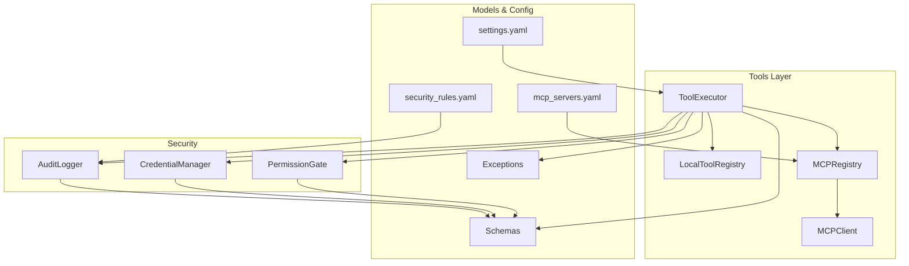

**Diagram sources**
- [executor.py:45-314](file://src/aiops_agent/tools/executor.py#L45-L314)
- [local_tools.py:35-161](file://src/aiops_agent/tools/local_tools.py#L35-L161)
- [mcp_registry.py:20-162](file://src/aiops_agent/tools/mcp_registry.py#L20-L162)
- [mcp_client.py:22-324](file://src/aiops_agent/tools/mcp_client.py#L22-L324)
- [permission_gate.py:57-319](file://src/aiops_agent/security/permission_gate.py#L57-L319)
- [credential_manager.py:38-261](file://src/aiops_agent/security/credential_manager.py#L38-L261)
- [audit_logger.py:24-253](file://src/aiops_agent/security/audit_logger.py#L24-L253)
- [schemas.py:73-184](file://src/aiops_agent/models/schemas.py#L73-L184)
- [exceptions.py:10-143](file://src/aiops_agent/core/exceptions.py#L10-L143)
- [settings.yaml:43-55](file://config/settings.yaml#L43-L55)
- [mcp_servers.yaml:1-41](file://config/mcp_servers.yaml#L1-L41)
- [security_rules.yaml:1-70](file://config/security_rules.yaml#L1-L70)

**Section sources**
- [executor.py:1-314](file://src/aiops_agent/tools/executor.py#L1-L314)
- [main.py:160-171](file://src/aiops_agent/main.py#L160-L171)

## Core Components
- ToolExecutor: central coordinator implementing the execution pipeline with retries, timeouts, and auditing.
- PermissionGate: validates actions against Workload Identity permissions and resource ARNs, classifies permission levels, and supports approval callbacks.
- CredentialManager: fetches and caches temporary credentials (Aliyun STS and third-party tokens) with exponential backoff.
- MCPRegistry/MCPClient: dynamic discovery and invocation of MCP tools via stdio or HTTP/SSE transports.
- LocalToolRegistry: registers and invokes local Python functions with optional parameter validation.
- AuditLogger: writes audit events to ActionTrail and local logs, with sensitive data sanitization and alerting.
- Models and Exceptions: shared schemas for tool results, identities, credentials, audit events, and structured exceptions.

**Section sources**
- [executor.py:45-314](file://src/aiops_agent/tools/executor.py#L45-L314)
- [permission_gate.py:57-319](file://src/aiops_agent/security/permission_gate.py#L57-L319)
- [credential_manager.py:38-261](file://src/aiops_agent/security/credential_manager.py#L38-L261)
- [mcp_registry.py:20-162](file://src/aiops_agent/tools/mcp_registry.py#L20-L162)
- [mcp_client.py:22-324](file://src/aiops_agent/tools/mcp_client.py#L22-L324)
- [local_tools.py:35-161](file://src/aiops_agent/tools/local_tools.py#L35-L161)
- [audit_logger.py:24-253](file://src/aiops_agent/security/audit_logger.py#L24-L253)
- [schemas.py:73-184](file://src/aiops_agent/models/schemas.py#L73-L184)
- [exceptions.py:10-143](file://src/aiops_agent/core/exceptions.py#L10-L143)

## Architecture Overview
The ToolExecutor orchestrates a deterministic pipeline:
1. Permission validation
2. Optional credential acquisition
3. Tool resolution (MCP first, then local)
4. Execution with timeout and retry
5. Output sanitization
6. Audit logging

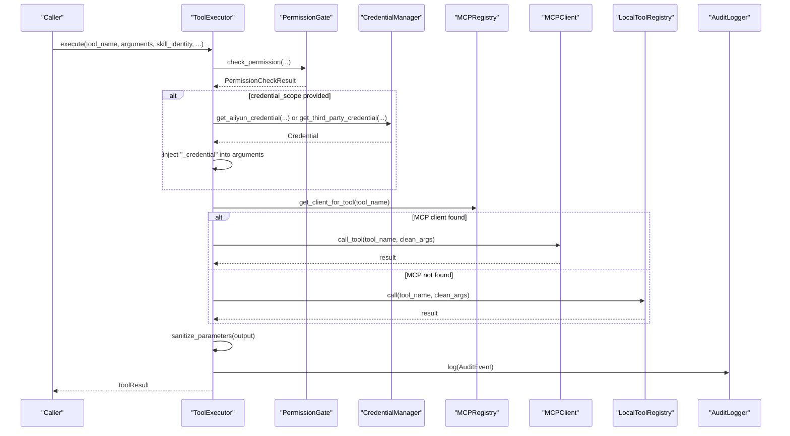

**Diagram sources**
- [executor.py:80-226](file://src/aiops_agent/tools/executor.py#L80-L226)
- [permission_gate.py:95-181](file://src/aiops_agent/security/permission_gate.py#L95-L181)
- [credential_manager.py:63-214](file://src/aiops_agent/security/credential_manager.py#L63-L214)
- [mcp_registry.py:103-108](file://src/aiops_agent/tools/mcp_registry.py#L103-L108)
- [mcp_client.py:135-155](file://src/aiops_agent/tools/mcp_client.py#L135-L155)
- [local_tools.py:91-116](file://src/aiops_agent/tools/local_tools.py#L91-L116)
- [audit_logger.py:65-103](file://src/aiops_agent/security/audit_logger.py#L65-L103)

## Detailed Component Analysis

### ToolExecutor Pipeline
- Permission Gate Validation: Validates action and resource ARN against Workload Identity permissions and computes permission level. Approval gating applies for limited-write and admin actions.
- Credential Acquisition: If a credential scope is provided, obtains temporary credentials (Aliyun STS or third-party) and injects them into arguments under a reserved key for downstream use.
- Tool Matching and Dispatch: Resolves tool via MCPRegistry; if not found, falls back to LocalToolRegistry. Internal credential argument is stripped before invoking tools.
- Execution with Timeout and Retry: Executes with a configurable timeout and exponential backoff retry on network errors. Raises structured timeout errors.
- Output Sanitization: Applies sensitive data sanitization to results before returning.
- Audit Logging: Emits an AuditEvent with sanitized parameters, permission level, trace identifiers, and result outcome.

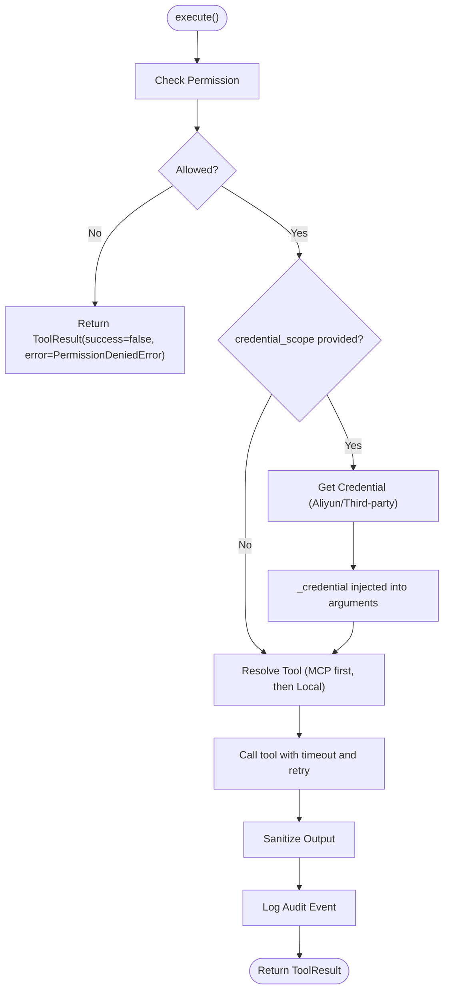

**Diagram sources**
- [executor.py:123-226](file://src/aiops_agent/tools/executor.py#L123-L226)
- [permission_gate.py:95-181](file://src/aiops_agent/security/permission_gate.py#L95-L181)
- [credential_manager.py:63-214](file://src/aiops_agent/security/credential_manager.py#L63-L214)
- [mcp_registry.py:103-108](file://src/aiops_agent/tools/mcp_registry.py#L103-L108)
- [local_tools.py:91-116](file://src/aiops_agent/tools/local_tools.py#L91-L116)
- [audit_logger.py:65-103](file://src/aiops_agent/security/audit_logger.py#L65-L103)

**Section sources**
- [executor.py:80-226](file://src/aiops_agent/tools/executor.py#L80-L226)

### Permission Gate
- RBAC enforcement with resource ARN pattern matching using wildcards.
- Permission classification into read-only, limited-write, and admin levels.
- On-Behalf-Of support: effective permissions computed as intersection of agent and user permissions.
- Approval gating for higher-risk actions with optional external approval callback.

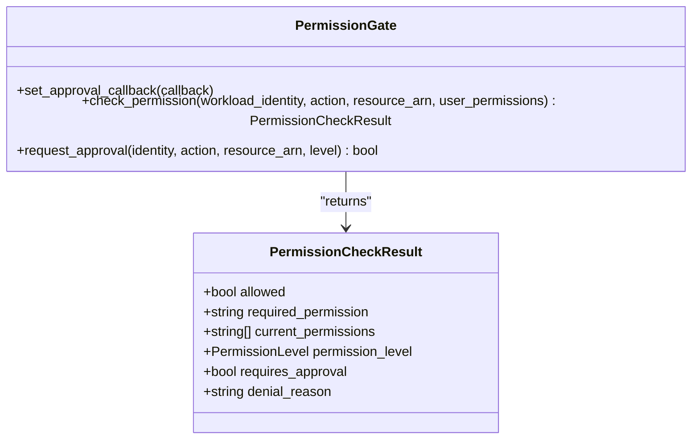

**Diagram sources**
- [permission_gate.py:57-319](file://src/aiops_agent/security/permission_gate.py#L57-L319)
- [schemas.py:199-208](file://src/aiops_agent/models/schemas.py#L199-L208)

**Section sources**
- [permission_gate.py:95-181](file://src/aiops_agent/security/permission_gate.py#L95-L181)

### Credential Manager
- Aliyun STS credential retrieval via WorkloadIdentityManager with caching and pre-expiration refresh.
- Third-party credential sourcing from environment variables with caching.
- Exponential backoff retry with bounded jitter for robustness.
- Clear separation of credential scope and cache keys for skill-level isolation.

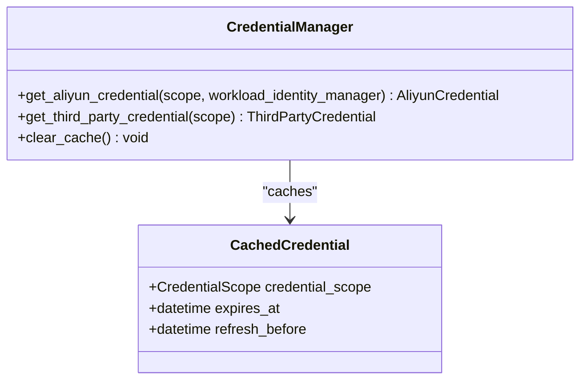

**Diagram sources**
- [credential_manager.py:38-261](file://src/aiops_agent/security/credential_manager.py#L38-L261)
- [schemas.py:108-137](file://src/aiops_agent/models/schemas.py#L108-L137)

**Section sources**
- [credential_manager.py:63-214](file://src/aiops_agent/security/credential_manager.py#L63-L214)

### MCP Registry and Client
- Dynamic registration and unregistration of MCP Servers with automatic tool discovery.
- Transport support for stdio (local subprocess), SSE, and streamable HTTP.
- JSON-RPC 2.0 messaging with request/response serialization and error parsing.

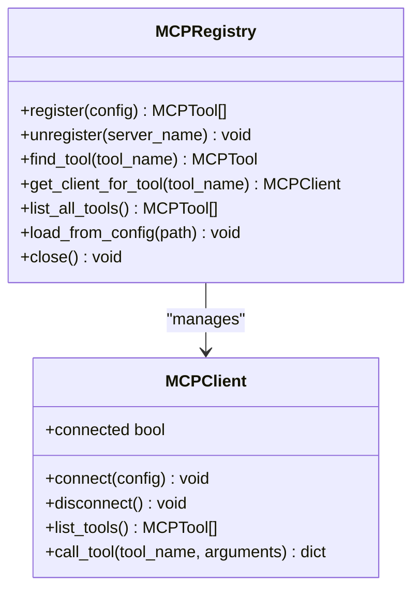

**Diagram sources**
- [mcp_registry.py:20-162](file://src/aiops_agent/tools/mcp_registry.py#L20-L162)
- [mcp_client.py:22-324](file://src/aiops_agent/tools/mcp_client.py#L22-L324)

**Section sources**
- [mcp_registry.py:38-113](file://src/aiops_agent/tools/mcp_registry.py#L38-L113)
- [mcp_client.py:135-220](file://src/aiops_agent/tools/mcp_client.py#L135-L220)

### Local Tools
- Registration of Python callables as tools with optional JSON Schema-based parameter validation.
- Supports both sync and async handlers.
- Parameter validation ensures required fields and basic type checks.

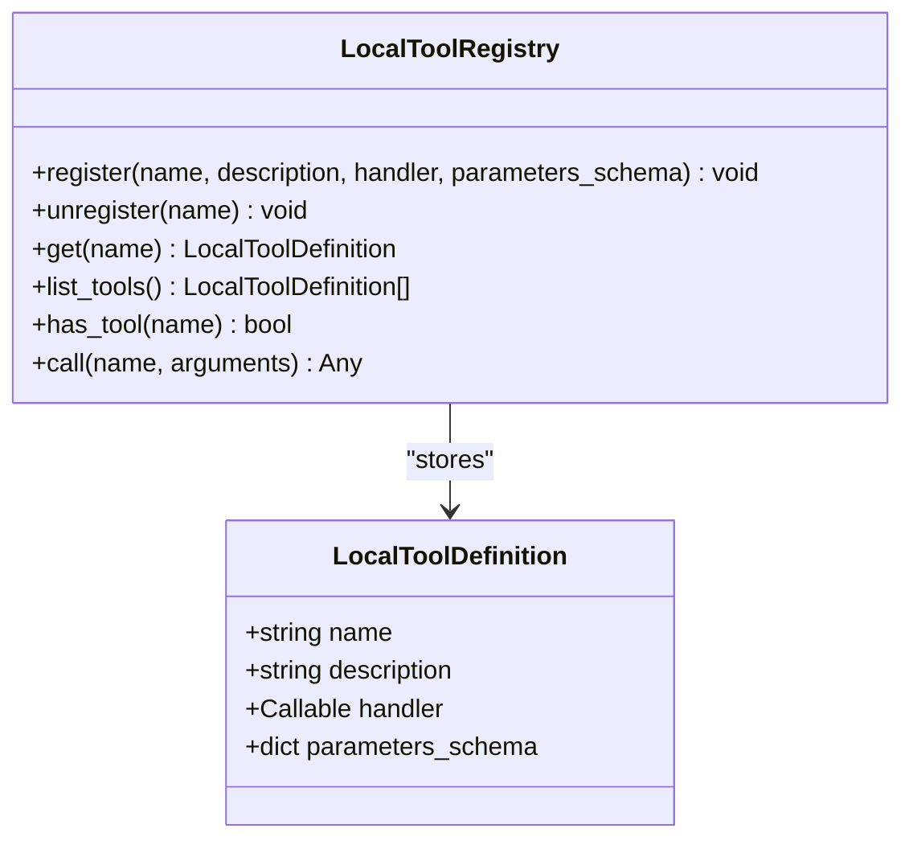

**Diagram sources**
- [local_tools.py:35-161](file://src/aiops_agent/tools/local_tools.py#L35-L161)

**Section sources**
- [local_tools.py:91-145](file://src/aiops_agent/tools/local_tools.py#L91-L145)

### Audit Logger
- Writes audit events to ActionTrail endpoint and local JSONL logs.
- Sensitive parameter sanitization and backup logging on ActionTrail failure.
- Optional alert callback for operational notifications.

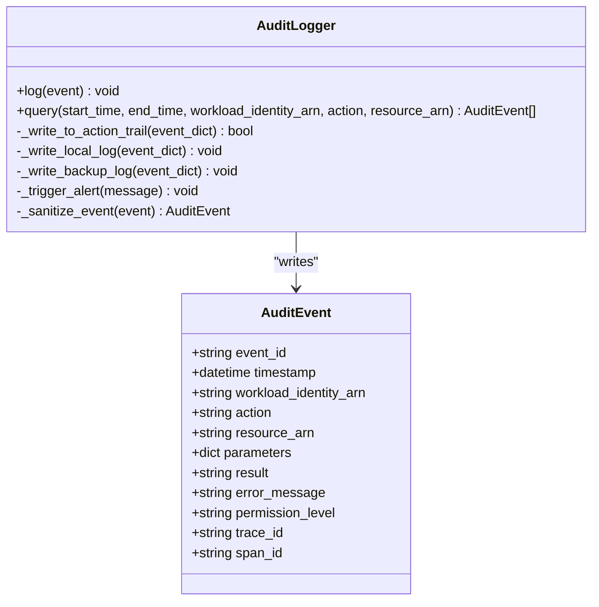

**Diagram sources**
- [audit_logger.py:24-253](file://src/aiops_agent/security/audit_logger.py#L24-L253)
- [schemas.py:169-184](file://src/aiops_agent/models/schemas.py#L169-L184)

**Section sources**
- [audit_logger.py:65-103](file://src/aiops_agent/security/audit_logger.py#L65-L103)

### Execution Modes
- Sync: blocking execution within an async loop (useful for local tools).
- Async: native async execution for MCP tools.
- Stream: not exposed as a separate mode in ToolExecutor.execute; streaming is handled by MCP transport (SSE/HTTP) when supported by the server.

Note: The execute method signature accepts an execution_mode parameter but does not branch logic for distinct modes beyond async behavior. The MCP client supports streaming transports, enabling server-side streaming semantics.

**Section sources**
- [executor.py:80-89](file://src/aiops_agent/tools/executor.py#L80-L89)
- [mcp_client.py:67-72](file://src/aiops_agent/tools/mcp_client.py#L67-L72)

### Error Handling Strategies
- PermissionDeniedError: raised when permission checks fail; returned as a failed ToolResult with error message.
- AgentTimeoutError: raised on execution timeout; surfaced as a failed ToolResult.
- Generic exceptions: captured and returned as failed ToolResult with exception details.
- Audit logging records outcomes and error messages for all flows.

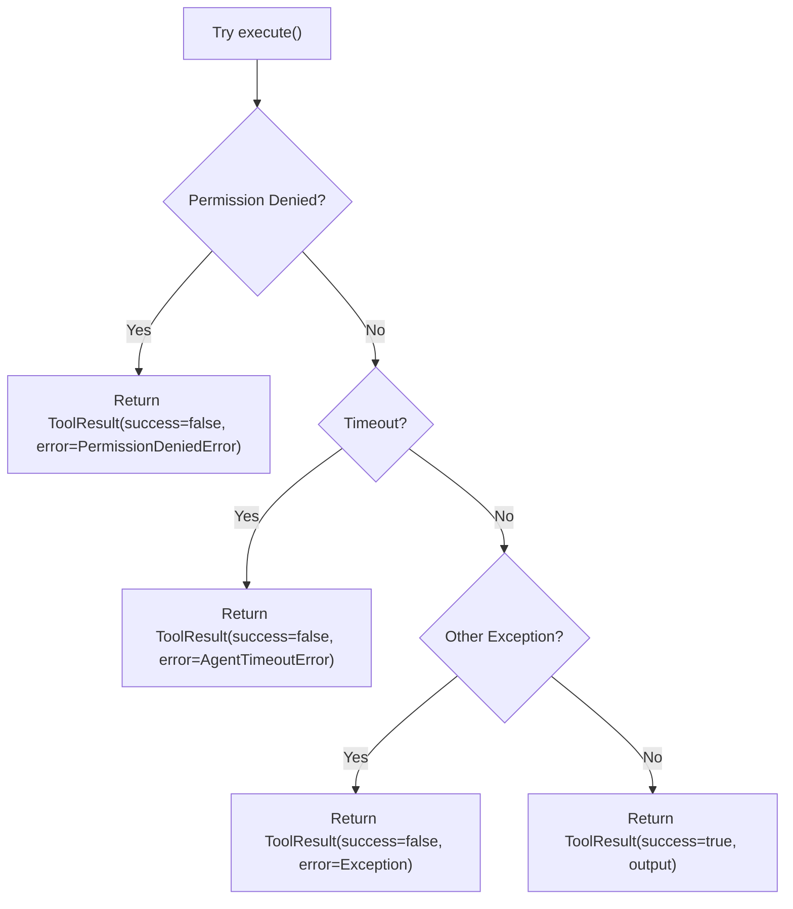

**Diagram sources**
- [executor.py:169-201](file://src/aiops_agent/tools/executor.py#L169-L201)
- [exceptions.py:57-121](file://src/aiops_agent/core/exceptions.py#L57-L121)

**Section sources**
- [executor.py:169-201](file://src/aiops_agent/tools/executor.py#L169-L201)
- [exceptions.py:57-121](file://src/aiops_agent/core/exceptions.py#L57-L121)

### Retry Mechanism and Timeout Management
- Retries: up to a fixed number of attempts with exponential backoff and capped maximum delay.
- Network errors trigger retry; other exceptions propagate immediately.
- Timeout: enforced per-tool call; exceeding the configured timeout raises a structured timeout error.

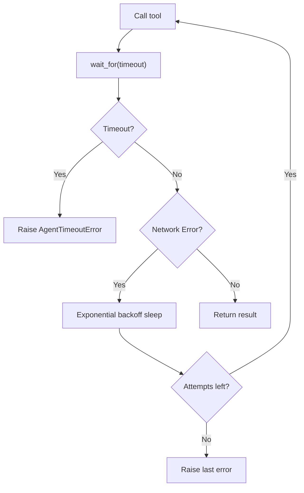

**Diagram sources**
- [executor.py:231-274](file://src/aiops_agent/tools/executor.py#L231-L274)
- [exceptions.py:100-121](file://src/aiops_agent/core/exceptions.py#L100-L121)

**Section sources**
- [executor.py:231-274](file://src/aiops_agent/tools/executor.py#L231-L274)
- [settings.yaml:49-54](file://config/settings.yaml#L49-L54)

### Practical Examples of Tool Execution Flows
- Successful MCP tool call: permission granted, MCP tool resolved, executed with retries and timeout, sanitized output, logged audit.
- Local tool fallback: MCP tool not found, local tool registered and invoked, result wrapped if scalar.
- Permission denied: permission gate rejects action/resource, ToolResult indicates failure with error.
- Credential injection: aliased credential scope triggers credential acquisition and injection; internal credential argument is removed before tool invocation.
- Retry on flaky network: connection errors retried with exponential backoff until success.

**Section sources**
- [test_tool_executor.py:77-184](file://tests/test_tool_executor.py#L77-L184)
- [test_tool_executor.py:219-294](file://tests/test_tool_executor.py#L219-L294)

## Dependency Analysis
ToolExecutor depends on:
- Security components: PermissionGate, CredentialManager, AuditLogger
- Tool registries: MCPRegistry, LocalToolRegistry
- Models and exceptions: ToolResult, WorkloadIdentity, CredentialScope, AuditEvent, PermissionCheckResult, AgentTimeoutError
- Configuration: settings.yaml for defaults, mcp_servers.yaml for MCP server discovery, security_rules.yaml for sanitization

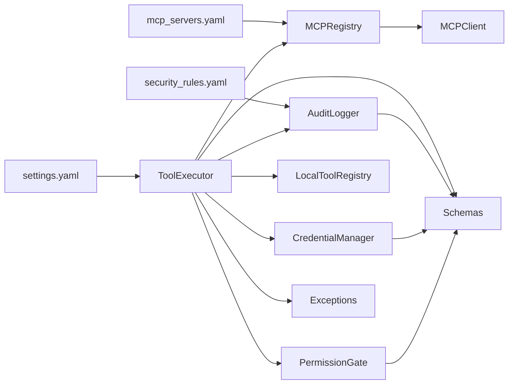

**Diagram sources**
- [executor.py:45-75](file://src/aiops_agent/tools/executor.py#L45-L75)
- [permission_gate.py:57-82](file://src/aiops_agent/security/permission_gate.py#L57-L82)
- [credential_manager.py:38-58](file://src/aiops_agent/security/credential_manager.py#L38-L58)
- [mcp_registry.py:20-33](file://src/aiops_agent/tools/mcp_registry.py#L20-L33)
- [audit_logger.py:24-56](file://src/aiops_agent/security/audit_logger.py#L24-L56)
- [schemas.py:73-184](file://src/aiops_agent/models/schemas.py#L73-L184)
- [exceptions.py:10-143](file://src/aiops_agent/core/exceptions.py#L10-L143)
- [settings.yaml:43-55](file://config/settings.yaml#L43-L55)
- [mcp_servers.yaml:1-41](file://config/mcp_servers.yaml#L1-L41)
- [security_rules.yaml:1-70](file://config/security_rules.yaml#L1-L70)

**Section sources**
- [executor.py:45-75](file://src/aiops_agent/tools/executor.py#L45-L75)
- [main.py:160-171](file://src/aiops_agent/main.py#L160-L171)

## Performance Considerations
- Default tool execution timeout is configurable in settings.yaml and can be overridden per call.
- Retry backoff is bounded to avoid excessive delays; adjust max_retries and max_delay to balance resilience and latency.
- Credential caching reduces repeated AssumeRole calls; refresh window prevents staleness near expiration.
- MCP transport selection impacts latency; stdio avoids network overhead for local tools, while HTTP/SSE enables distributed tool servers.
- Audit logging is asynchronous and resilient; failures are logged locally and alerts can be triggered.

[No sources needed since this section provides general guidance]

## Troubleshooting Guide
Common issues and resolutions:
- Permission denied: Verify Workload Identity permissions and resource ARN patterns; confirm approval gating for higher permission levels.
- Tool not found: Ensure MCP tool is registered and discoverable; verify LocalToolRegistry has the tool if MCP fallback is intended.
- Credential acquisition failures: Confirm WorkloadIdentityManager initialization and environment variables; check role ARN and OIDC provider ARN configuration.
- Network errors and retries: Inspect retry logs; verify network connectivity and server availability; consider increasing timeout or reducing load.
- Audit logging failures: Check ActionTrail endpoint reachability; review backup logs and alert callback behavior.

**Section sources**
- [permission_gate.py:141-181](file://src/aiops_agent/security/permission_gate.py#L141-L181)
- [credential_manager.py:153-157](file://src/aiops_agent/security/credential_manager.py#L153-L157)
- [mcp_registry.py:141-152](file://src/aiops_agent/tools/mcp_registry.py#L141-L152)
- [audit_logger.py:161-185](file://src/aiops_agent/security/audit_logger.py#L161-L185)
- [test_tool_executor.py:77-184](file://tests/test_tool_executor.py#L77-L184)

## Conclusion
ToolExecutor provides a secure, observable, and resilient execution engine for AIOps Agent tools. By enforcing strict permission gates, managing credentials, resolving tools dynamically, and recording comprehensive audits, it ensures safe automation at scale. Proper configuration of timeouts, retries, and MCP registries enables flexible deployment across local and remote environments.

[No sources needed since this section summarizes without analyzing specific files]

## Appendices

### Configuration Options
- Tool execution timeout: default and per-call override via settings.yaml and execute() parameter.
- Retry strategy: max_retries, base_delay, max_delay in settings.yaml.
- MCP server discovery: configure via mcp_servers.yaml; supports stdio and HTTP/SSE transports.
- Security rules: sensitive field patterns and blacklists in security_rules.yaml.

**Section sources**
- [settings.yaml:43-55](file://config/settings.yaml#L43-L55)
- [mcp_servers.yaml:1-41](file://config/mcp_servers.yaml#L1-L41)
- [security_rules.yaml:1-70](file://config/security_rules.yaml#L1-L70)

### Integration Notes
- ToolExecutor is instantiated in main.py and injected into skills via SkillInstance.set_tool_executor().
- MCP servers are loaded from configuration during runtime for dynamic tool discovery.
- Observability spans are recorded via OpenTelemetry tracers for end-to-end visibility.

**Section sources**
- [main.py:160-171](file://src/aiops_agent/main.py#L160-L171)
- [mcp_registry.py:122-152](file://src/aiops_agent/tools/mcp_registry.py#L122-L152)