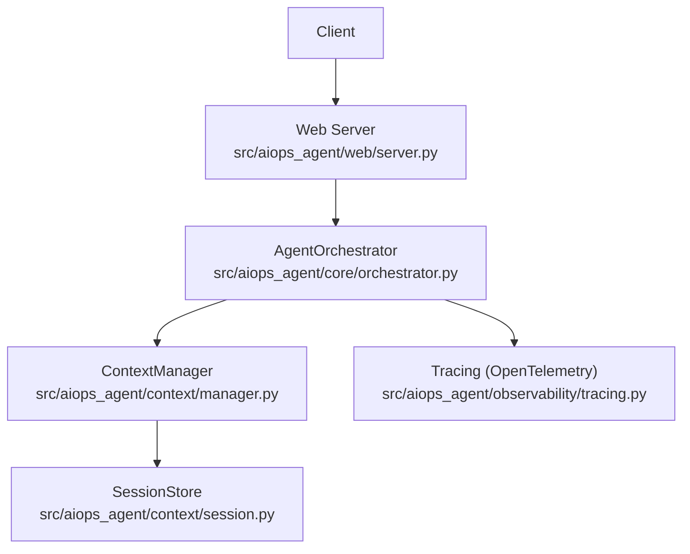
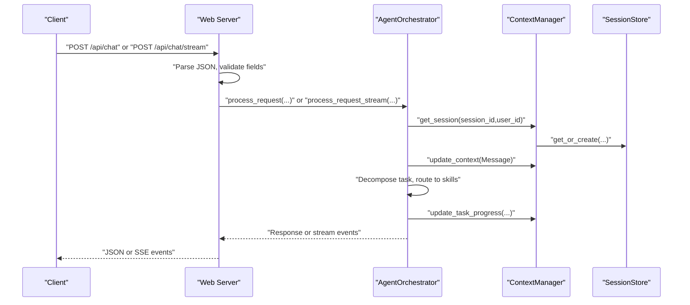
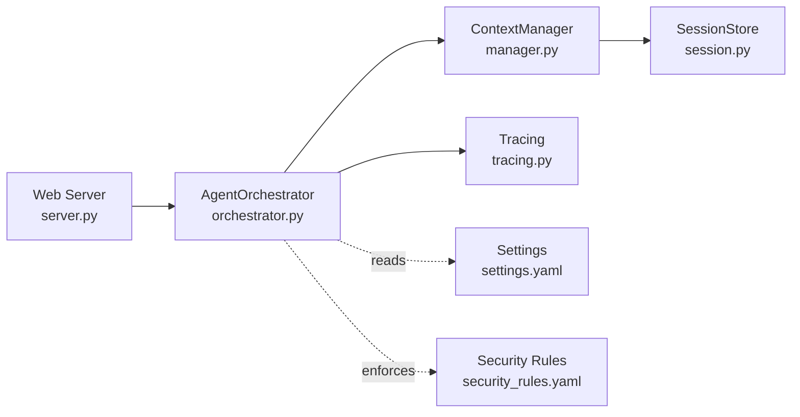

# API Endpoints

<cite>
**Referenced Files in This Document**
- [server.py](file://src/aiops_agent/web/server.py)
- [main.py](file://src/aiops_agent/main.py)
- [orchestrator.py](file://src/aiops_agent/core/orchestrator.py)
- [schemas.py](file://src/aiops_agent/models/schemas.py)
- [session.py](file://src/aiops_agent/context/session.py)
- [manager.py](file://src/aiops_agent/context/manager.py)
- [tracing.py](file://src/aiops_agent/observability/tracing.py)
- [settings.yaml](file://config/settings.yaml)
- [security_rules.yaml](file://config/security_rules.yaml)
- [test_web_server.py](file://tests/test_web_server.py)
- [test_sse.py](file://tests/test_sse.py)
</cite>

## Table of Contents
1. [Introduction](#introduction)
2. [Project Structure](#project-structure)
3. [Core Components](#core-components)
4. [Architecture Overview](#architecture-overview)
5. [Detailed Component Analysis](#detailed-component-analysis)
6. [Dependency Analysis](#dependency-analysis)
7. [Performance Considerations](#performance-considerations)
8. [Troubleshooting Guide](#troubleshooting-guide)
9. [Conclusion](#conclusion)

## Introduction
This document provides comprehensive API documentation for the AIOps Agent’s REST endpoints. It covers:
- POST /api/chat for synchronous chat processing
- POST /api/chat/stream for SSE streaming responses
- GET /api/skills for skill marketplace access
- GET /health for health checks
- GET /ready for readiness probes

For each endpoint, you will find HTTP method, URL pattern, request/response schemas, authentication requirements, error codes, parameter descriptions, example requests/responses, and common use cases. It also documents streaming response formats, event types, payload structures, session management, user context handling, and trace ID generation for debugging.

## Project Structure
The API surface is implemented in the web server module and routed to the orchestrator for processing. The orchestrator coordinates LLM planning, skill execution, and context management. Observability integrates OpenTelemetry tracing for trace ID generation.

**Diagram sources**
- [server.py:196-227](file://src/aiops_agent/web/server.py#L196-L227)
- [orchestrator.py:47-82](file://src/aiops_agent/core/orchestrator.py#L47-L82)
- [manager.py:25-45](file://src/aiops_agent/context/manager.py#L25-L45)
- [session.py:19-37](file://src/aiops_agent/context/session.py#L19-L37)
- [tracing.py:32-87](file://src/aiops_agent/observability/tracing.py#L32-L87)

**Section sources**
- [server.py:196-227](file://src/aiops_agent/web/server.py#L196-L227)
- [main.py:70-222](file://src/aiops_agent/main.py#L70-L222)

## Core Components
- Web Server: Exposes REST endpoints and SSE stream, validates requests, and delegates to the orchestrator.
- AgentOrchestrator: Central coordinator for task planning, skill routing, execution, and response assembly.
- ContextManager and SessionStore: Manage session lifecycle, user context, and task progress.
- Tracing: Generates trace IDs for debugging and correlation across distributed systems.

Key data models used in responses:
- AgentResponse: Standardized response envelope for success/failure, messages, structured data, error codes, suggestions, and trace IDs.
- SessionState: Session metadata, user identity, mode, messages, resources, and task progress.

**Section sources**
- [server.py:44-171](file://src/aiops_agent/web/server.py#L44-L171)
- [orchestrator.py:84-198](file://src/aiops_agent/core/orchestrator.py#L84-L198)
- [manager.py:50-121](file://src/aiops_agent/context/manager.py#L50-L121)
- [session.py:38-72](file://src/aiops_agent/context/session.py#L38-L72)
- [schemas.py:53-62](file://src/aiops_agent/models/schemas.py#L53-L62)
- [schemas.py:264-276](file://src/aiops_agent/models/schemas.py#L264-L276)

## Architecture Overview
The request lifecycle for chat endpoints:

**Diagram sources**
- [server.py:44-135](file://src/aiops_agent/web/server.py#L44-L135)
- [orchestrator.py:84-198](file://src/aiops_agent/core/orchestrator.py#L84-L198)
- [manager.py:50-121](file://src/aiops_agent/context/manager.py#L50-L121)
- [session.py:38-72](file://src/aiops_agent/context/session.py#L38-L72)

## Detailed Component Analysis

### POST /api/chat (Synchronous)
- Method: POST
- URL: /api/chat
- Purpose: Process a user message synchronously and return a structured response.
- Request JSON fields:
  - message (string, required): Natural language query or instruction.
  - session_id (string, optional): Identifier for persistent conversation state. Defaults to a newly generated UUID.
  - user_id (string, optional): Identity of the end user. Defaults to "anonymous".
- Response JSON fields (AgentResponse):
  - success (boolean)
  - message (string)
  - data (object|null)
  - error_code (string|null)
  - suggestion (string|null)
  - trace_id (string|null)
  - session_id (string)
- Authentication: Not enforced by the endpoint itself; however, downstream orchestration may apply security gating and permission checks.
- Error codes:
  - 400 Bad Request: Invalid JSON or empty message.
  - 500 Internal Server Error: Orchestrator exception; response includes error_code "INTERNAL_ERROR".
- Example request:
  - POST /api/chat
  - Body: {"message":"Explain CPU spike","session_id":"sess-123","user_id":"user-456"}
- Example successful response:
  - 200 OK
  - Body: {"success":true,"message":"...","data":{"plan":{...}},"error_code":null,"suggestion":null,"trace_id":"<hex-trace-id>","session_id":"sess-123"}
- Common use cases:
  - One-shot operational questions
  - Summarized diagnostics after multi-step tasks
- Notes:
  - The orchestrator generates a trace_id via OpenTelemetry and returns it in the response envelope.

**Section sources**
- [server.py:44-82](file://src/aiops_agent/web/server.py#L44-L82)
- [test_web_server.py:79-103](file://tests/test_web_server.py#L79-L103)
- [test_web_server.py:110-152](file://tests/test_web_server.py#L110-L152)
- [schemas.py:53-62](file://src/aiops_agent/models/schemas.py#L53-L62)
- [tracing.py:649-657](file://src/aiops_agent/observability/tracing.py#L649-L657)

### POST /api/chat/stream (SSE Streaming)
- Method: POST
- URL: /api/chat/stream
- Purpose: Stream structured events for long-running operations with progress updates.
- Headers:
  - Content-Type: application/json
  - Cache-Control: no-cache
  - Connection: keep-alive
  - X-Accel-Buffering: no (for NGINX passthrough)
- Request JSON fields:
  - message (string, required)
  - session_id (string, optional)
  - user_id (string, optional)
- Event types and payloads:
  - planning:started
    - Fields: status="started", message (string), session_id (string), trace_id (string)
  - planning:completed
    - Fields: status="completed", message (string), total_tasks (number), tasks (array of {task_id, skill_name, action}), session_id (string), trace_id (string)
  - task_start
    - Fields: task_id (string), skill_name (string), action (string), level (string), session_id (string)
  - task_done
    - Fields: task_id (string), skill_name (string), action (string), status ("pending"|"running"|"completed"|"failed"|"cancelled"), result (object|null), error (string|null), progress (string "n/N"), session_id (string)
  - error
    - Fields: status="failed", message (string), error_code (string|null), suggestion (string|null), session_id (string), trace_id (string)
  - done
    - Fields: status ("completed"|"partial_failure"), message (string), success (boolean), elapsed_ms (number), data (object|null), session_id (string), trace_id (string)
  - token (LLM synthesis tokens)
    - Fields: type="token", content (string), session_id (string)
- Error handling:
  - On internal exceptions, emits an error event then closes the stream.
- Example request:
  - POST /api/chat/stream
  - Body: {"message":"Check ECS instances and logs"}
- Example event sequence:
  - event: planning
    - data: {"status":"started","message":"Analyzing task...","session_id":"...","trace_id":"..."}
  - event: planning
    - data: {"status":"completed","message":"Generated 2 sub-tasks","total_tasks":2,"tasks":[{"task_id":"t1","skill_name":"monitoring","action":"query"}],"session_id":"...","trace_id":"..."}
  - event: task_start
    - data: {"task_id":"t1","skill_name":"monitoring","action":"query","level":"1/2","session_id":"..."}
  - event: task_done
    - data: {"task_id":"t1","skill_name":"monitoring","action":"query","status":"completed","result":{"cpu":85},"progress":"1/2","session_id":"..."}
  - event: done
    - data: {"status":"completed","message":"Task completed","success":true,"elapsed_ms":1234.5,"data":{"plan":{...}},"session_id":"...","trace_id":"..."}
- Common use cases:
  - Real-time progress reporting for multi-step operations
  - Live summarization tokens during synthesis
- Notes:
  - The server writes each event as "event: <type>\ndata: <JSON>\n\n".

**Section sources**
- [server.py:85-135](file://src/aiops_agent/web/server.py#L85-L135)
- [test_sse.py:412-461](file://tests/test_sse.py#L412-L461)
- [test_sse.py:342-406](file://tests/test_sse.py#L342-L406)
- [orchestrator.py:203-390](file://src/aiops_agent/core/orchestrator.py#L203-L390)

### GET /api/skills (Skill Marketplace)
- Method: GET
- URL: /api/skills
- Purpose: List available skills with metadata suitable for a marketplace UI.
- Response JSON fields:
  - skills (array)
    - Each item includes: name (string), description (string), version (string), capabilities (array), status (string), author (string), category (string), icon (string), tags (array), install_count (number), rating (number), updated_at (string|ISO 8601), readme (string|Markdown)
- Authentication: Not enforced by the endpoint itself.
- Error codes: 200 on success; endpoint does not return 4xx for empty registry.
- Example request:
  - GET /api/skills
- Example response excerpt:
  - 200 OK
  - Body: {"skills":[{"name":"monitoring","description":"...","version":"1.0.0", ...}]}

**Section sources**
- [server.py:148-171](file://src/aiops_agent/web/server.py#L148-L171)
- [test_web_server.py:159-192](file://tests/test_web_server.py#L159-L192)

### GET /health (Health Check)
- Method: GET
- URL: /health
- Purpose: Probes service health.
- Response JSON fields:
  - status (string): "healthy"
- Authentication: Not enforced.
- Error codes: 200 on success.

**Section sources**
- [server.py:138-140](file://src/aiops_agent/web/server.py#L138-L140)
- [test_web_server.py:56-62](file://tests/test_web_server.py#L56-L62)

### GET /ready (Readiness Probe)
- Method: GET
- URL: /ready
- Purpose: Probes service readiness.
- Response JSON fields:
  - status (string): "ready"
- Authentication: Not enforced.
- Error codes: 200 on success.

**Section sources**
- [server.py:143-145](file://src/aiops_agent/web/server.py#L143-L145)
- [test_web_server.py:65-71](file://tests/test_web_server.py#L65-L71)

## Dependency Analysis
The web server depends on the orchestrator to process requests. The orchestrator depends on context management for sessions and messages, and uses tracing to generate trace IDs. Configuration files define timeouts, observability, and security rules.

**Diagram sources**
- [server.py:32-36](file://src/aiops_agent/web/server.py#L32-L36)
- [orchestrator.py:47-79](file://src/aiops_agent/core/orchestrator.py#L47-L79)
- [manager.py:25-45](file://src/aiops_agent/context/manager.py#L25-L45)
- [session.py:19-37](file://src/aiops_agent/context/session.py#L19-L37)
- [tracing.py:32-87](file://src/aiops_agent/observability/tracing.py#L32-L87)
- [settings.yaml:43-85](file://config/settings.yaml#L43-L85)
- [security_rules.yaml:1-70](file://config/security_rules.yaml#L1-L70)

**Section sources**
- [settings.yaml:43-85](file://config/settings.yaml#L43-L85)
- [security_rules.yaml:1-70](file://config/security_rules.yaml#L1-L70)

## Performance Considerations
- Streaming SSE avoids long-lived HTTP connections blocking and enables real-time UI updates.
- Orchestrator limits concurrent subtask execution to reduce resource contention.
- Session TTL and idle persistence help manage memory footprint.
- Observability configuration supports exporting traces and metrics for performance monitoring.

[No sources needed since this section provides general guidance]

## Troubleshooting Guide
Common issues and resolutions:
- Empty or missing message:
  - Symptom: 400 Bad Request on both /api/chat and /api/chat/stream.
  - Resolution: Ensure the request body contains a non-empty message field.
- Invalid JSON:
  - Symptom: 400 Bad Request on POST endpoints.
  - Resolution: Validate request payload format.
- Orchestrator exceptions:
  - Symptom: 500 Internal Server Error on /api/chat; error event on /api/chat/stream.
  - Resolution: Inspect server logs and the returned error_code; verify LLM provider availability and permissions.
- Streaming parsing:
  - Symptom: Frontend not receiving structured events.
  - Resolution: Verify Content-Type is text/event-stream and parse each block separated by blank lines.

**Section sources**
- [test_web_server.py:110-152](file://tests/test_web_server.py#L110-L152)
- [test_sse.py:427-461](file://tests/test_sse.py#L427-L461)

## Conclusion
The AIOps Agent exposes a clear set of REST endpoints for synchronous and streaming chat, skill discovery, and liveness/readiness probes. Responses follow a standardized structure with trace IDs for debugging. Sessions and context are managed centrally, enabling coherent multi-step operations. Security and observability configurations are externalized for flexibility.