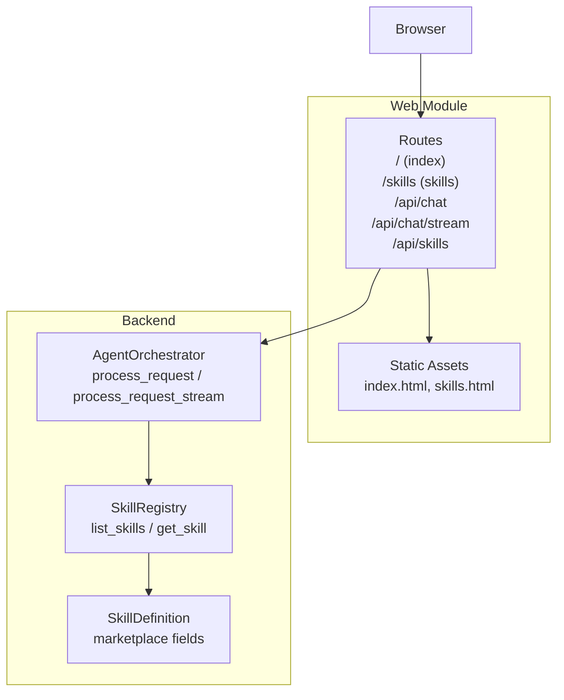
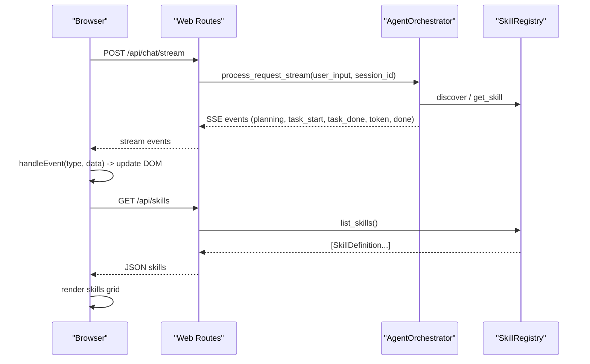
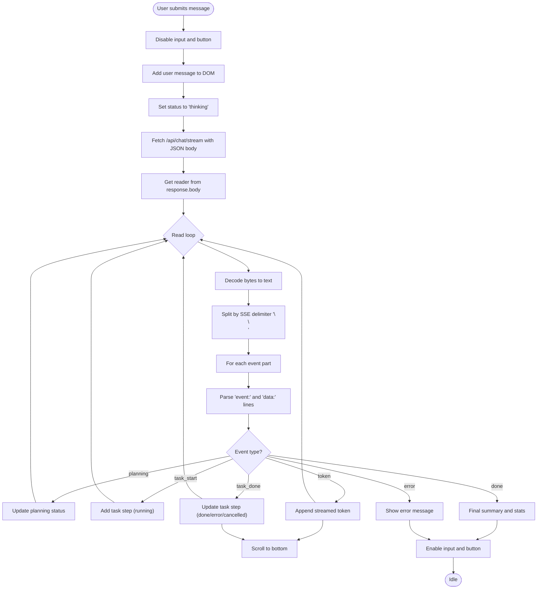
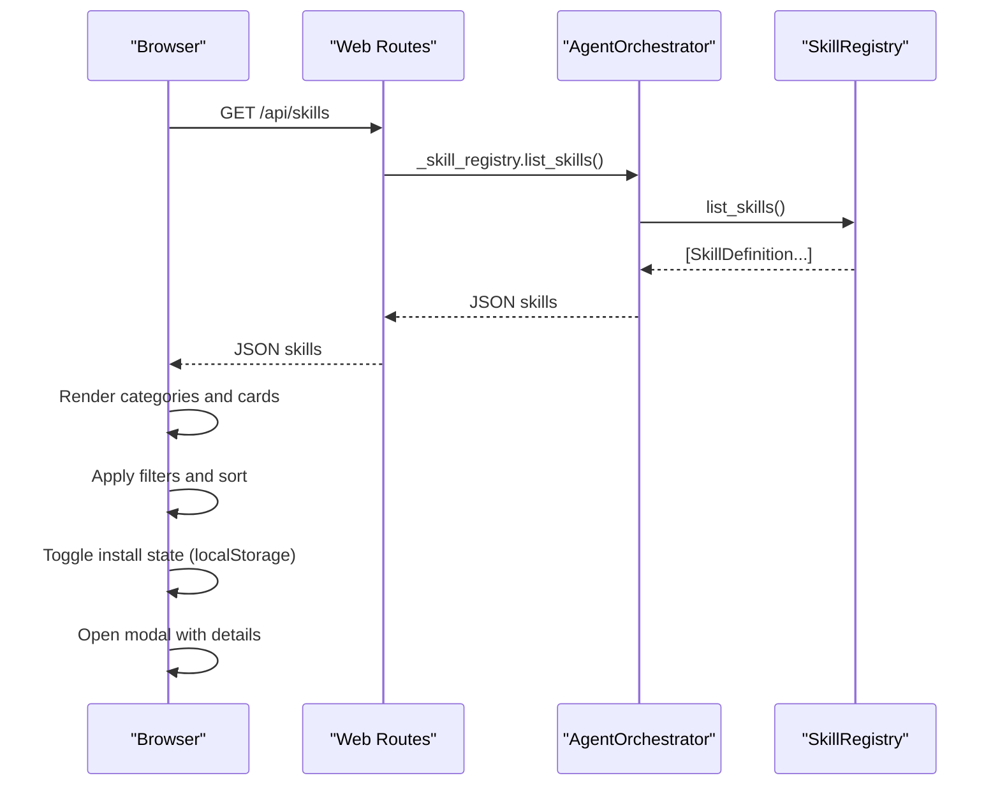
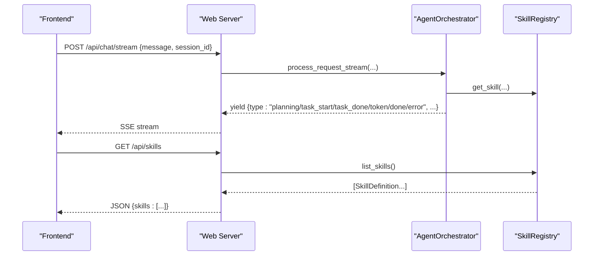
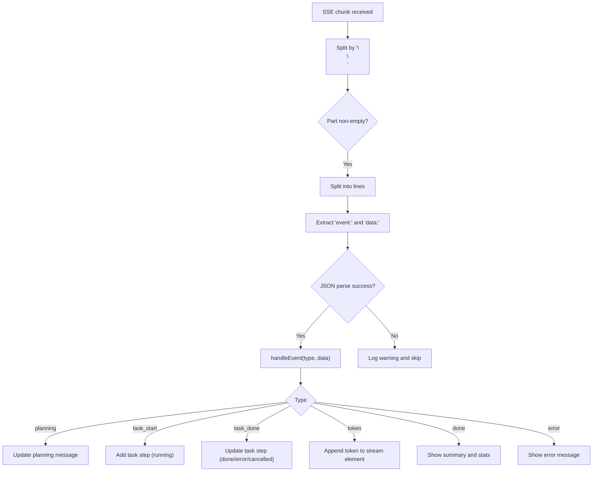
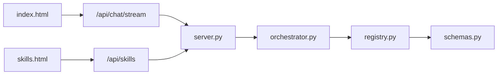

# Frontend UI & Static Assets

<cite>
**Referenced Files in This Document**
- [index.html](file://src/aiops_agent/web/static/index.html)
- [skills.html](file://src/aiops_agent/web/static/skills.html)
- [server.py](file://src/aiops_agent/web/server.py)
- [orchestrator.py](file://src/aiops_agent/core/orchestrator.py)
- [registry.py](file://src/aiops_agent/skills/registry.py)
- [base.py](file://src/aiops_agent/skills/base.py)
- [schemas.py](file://src/aiops_agent/models/schemas.py)
- [README.md](file://README.md)
</cite>

## Table of Contents
1. [Introduction](#introduction)
2. [Project Structure](#project-structure)
3. [Core Components](#core-components)
4. [Architecture Overview](#architecture-overview)
5. [Detailed Component Analysis](#detailed-component-analysis)
6. [Dependency Analysis](#dependency-analysis)
7. [Performance Considerations](#performance-considerations)
8. [Troubleshooting Guide](#troubleshooting-guide)
9. [Conclusion](#conclusion)
10. [Appendices](#appendices)

## Introduction
This document describes the embedded frontend interface and static assets of the AIOps Agent. It focuses on:
- The main chat interface implementation in index.html, including HTML structure, CSS styling, and JavaScript functionality for real-time chat interactions
- The skills marketplace page (skills.html) and how it integrates with the backend skill registry
- Frontend-backend communication patterns, event handling for streaming responses, and DOM manipulation for dynamic content updates
- Customization guidelines for themes, layouts, and branding
- Browser compatibility requirements, responsive design considerations, and accessibility features
- Examples of extending the UI with custom components and integrating additional frontend frameworks

## Project Structure
The frontend assets are embedded directly under the web module’s static directory and served by the aiohttp server. The chat UI and skills marketplace share a cohesive dark theme and responsive layout.

**Diagram sources**
- [server.py:196-214](file://src/aiops_agent/web/server.py#L196-L214)
- [index.html:43-58](file://src/aiops_agent/web/static/index.html#L43-L58)
- [skills.html:29-34](file://src/aiops_agent/web/static/skills.html#L29-L34)
- [orchestrator.py:203-419](file://src/aiops_agent/core/orchestrator.py#L203-L419)
- [registry.py:199-207](file://src/aiops_agent/skills/registry.py#L199-L207)
- [schemas.py:283-313](file://src/aiops_agent/models/schemas.py#L283-L313)

**Section sources**
- [README.md:113-137](file://README.md#L113-L137)
- [server.py:174-193](file://src/aiops_agent/web/server.py#L174-L193)

## Core Components
- Chat UI (index.html): Single-page chat interface with a sidebar listing skills, a message area, and a form for sending requests. It streams responses via Server-Sent Events (SSE) and updates the DOM dynamically.
- Skills Marketplace (skills.html): A grid-based marketplace for discovering and installing skills. It fetches skill metadata from the backend and renders cards with filtering, sorting, and modal details.
- Backend API (server.py): Exposes routes for serving static pages and APIs, including SSE streaming for chat and a skills listing endpoint.
- Orchestrator (orchestrator.py): Implements the streaming event generator that emits structured events for planning, task execution, tokens, and completion.
- Skill Registry (registry.py): Provides the skill catalog used by the frontend and backend.
- Skill Definition (schemas.py): Defines the schema for marketplace metadata and skill attributes.

**Section sources**
- [index.html:43-191](file://src/aiops_agent/web/static/index.html#L43-L191)
- [skills.html:29-235](file://src/aiops_agent/web/static/skills.html#L29-L235)
- [server.py:44-171](file://src/aiops_agent/web/server.py#L44-L171)
- [orchestrator.py:203-419](file://src/aiops_agent/core/orchestrator.py#L203-L419)
- [registry.py:199-207](file://src/aiops_agent/skills/registry.py#L199-L207)
- [schemas.py:283-313](file://src/aiops_agent/models/schemas.py#L283-L313)

## Architecture Overview
The frontend communicates with the backend using:
- Synchronous POST /api/chat for immediate responses
- Streaming POST /api/chat/stream using SSE for progressive UI updates
- GET /api/skills for the skills marketplace

**Diagram sources**
- [server.py:85-135](file://src/aiops_agent/web/server.py#L85-L135)
- [server.py:148-171](file://src/aiops_agent/web/server.py#L148-L171)
- [orchestrator.py:203-419](file://src/aiops_agent/core/orchestrator.py#L203-L419)
- [registry.py:199-207](file://src/aiops_agent/skills/registry.py#L199-L207)

## Detailed Component Analysis

### Chat Interface (index.html)
- HTML structure: Header with navigation, a sidebar for skills, a main message area, and a form for input submission.
- CSS styling: Uses CSS custom properties for a cohesive dark theme, responsive flexbox layout, and modular styles for badges, progress bars, and task steps.
- JavaScript functionality:
  - Generates a session ID and appends user and agent messages to the DOM
  - Submits requests to /api/chat/stream and parses SSE events
  - Handles event types: planning, task_start, task_done, token, done, error
  - Updates status indicators and scroll position automatically

**Diagram sources**
- [index.html:80-134](file://src/aiops_agent/web/static/index.html#L80-L134)
- [index.html:136-180](file://src/aiops_agent/web/static/index.html#L136-L180)

**Section sources**
- [index.html:43-191](file://src/aiops_agent/web/static/index.html#L43-L191)

### Skills Marketplace (skills.html)
- HTML structure: Header with navigation, hero section, toolbar for search/filter/sort, a grid of skill cards, and a modal for details.
- CSS styling: Responsive grid layout, hover effects, category buttons, sort selector, and modal overlay.
- JavaScript functionality:
  - Loads skills from /api/skills and populates categories
  - Filters and sorts skills by name, installs, ratings, or update date
  - Renders cards with icons, tags, author, and stats
  - Toggles installation state using localStorage and updates UI
  - Opens a modal with detailed README and permissions

**Diagram sources**
- [server.py:148-171](file://src/aiops_agent/web/server.py#L148-L171)
- [registry.py:199-207](file://src/aiops_agent/skills/registry.py#L199-L207)
- [schemas.py:283-313](file://src/aiops_agent/models/schemas.py#L283-L313)

**Section sources**
- [skills.html:29-235](file://src/aiops_agent/web/static/skills.html#L29-L235)

### Backend Communication Patterns
- Chat streaming: The frontend opens a stream to /api/chat/stream and expects SSE events. The backend writes structured events with a type field and JSON payload.
- Skills listing: The frontend fetches /api/skills and expects a JSON object containing a skills array of SkillDefinition entries.

**Diagram sources**
- [server.py:85-135](file://src/aiops_agent/web/server.py#L85-L135)
- [server.py:148-171](file://src/aiops_agent/web/server.py#L148-L171)
- [orchestrator.py:203-419](file://src/aiops_agent/core/orchestrator.py#L203-L419)
- [registry.py:199-207](file://src/aiops_agent/skills/registry.py#L199-L207)

**Section sources**
- [server.py:85-135](file://src/aiops_agent/web/server.py#L85-L135)
- [server.py:148-171](file://src/aiops_agent/web/server.py#L148-L171)

### Event Handling and DOM Manipulation
- SSE parsing: The frontend splits the incoming stream by the SSE delimiter and extracts event types and data payloads.
- Dynamic updates:
  - Planning events update the agent message area
  - Task events add or update task steps with status indicators
  - Token events append streamed LLM tokens to a dedicated element
  - Done and error events finalize the UI state and show summaries

**Diagram sources**
- [index.html:100-134](file://src/aiops_agent/web/static/index.html#L100-L134)
- [index.html:136-180](file://src/aiops_agent/web/static/index.html#L136-L180)

**Section sources**
- [index.html:100-180](file://src/aiops_agent/web/static/index.html#L100-L180)

### Skills Integration and Market Metadata
- The backend endpoint /api/skills returns a skills array with fields aligned to SkillDefinition, including name, description, version, capabilities, status, author, category, icon, tags, install_count, rating, updated_at, and readme.
- The frontend renders these fields into cards and modals, enabling discovery and installation toggling.

**Section sources**
- [server.py:148-171](file://src/aiops_agent/web/server.py#L148-L171)
- [schemas.py:283-313](file://src/aiops_agent/models/schemas.py#L283-L313)

## Dependency Analysis
- Frontend-to-backend dependencies:
  - index.html depends on /api/chat/stream and /api/skills
  - skills.html depends on /api/skills
- Backend orchestration:
  - server.py routes depend on AgentOrchestrator and SkillRegistry
  - Orchestrator depends on SkillRegistry for skill discovery and execution
  - SkillRegistry exposes list_skills() used by both server and frontend

**Diagram sources**
- [server.py:200-207](file://src/aiops_agent/web/server.py#L200-L207)
- [orchestrator.py:69-75](file://src/aiops_agent/core/orchestrator.py#L69-L75)
- [registry.py:199-207](file://src/aiops_agent/skills/registry.py#L199-L207)
- [schemas.py:283-313](file://src/aiops_agent/models/schemas.py#L283-L313)

**Section sources**
- [server.py:200-207](file://src/aiops_agent/web/server.py#L200-L207)
- [orchestrator.py:69-75](file://src/aiops_agent/core/orchestrator.py#L69-L75)
- [registry.py:199-207](file://src/aiops_agent/skills/registry.py#L199-L207)

## Performance Considerations
- Streaming responsiveness: The SSE stream updates the UI incrementally, reducing perceived latency. Ensure the server disables buffering and maintains keep-alive headers.
- DOM updates: Minimize reflows by appending nodes efficiently and scrolling to the latest content.
- Filtering and sorting: For large skill catalogs, consider client-side pagination or virtualized rendering to reduce layout thrashing.
- Asset delivery: Since static files are served inline, ensure caching headers are configured appropriately in production deployments.

[No sources needed since this section provides general guidance]

## Troubleshooting Guide
- SSE parsing failures: The frontend logs warnings when JSON parsing fails during SSE event handling. Verify backend event payloads conform to the expected structure.
- Stream errors: On exceptions, the backend emits an error event with a message and suggestion. The frontend displays a user-friendly error message.
- Skills loading: If skills fail to load, confirm /api/skills returns a valid JSON object with a skills array.

**Section sources**
- [index.html:120-126](file://src/aiops_agent/web/static/index.html#L120-L126)
- [server.py:125-132](file://src/aiops_agent/web/server.py#L125-L132)
- [server.py:222-231](file://src/aiops_agent/web/server.py#L222-L231)

## Conclusion
The AIOps Agent embeds a compact, efficient frontend that integrates tightly with the backend orchestrator and skill registry. The chat UI provides real-time feedback via SSE, while the skills marketplace offers a responsive, filterable interface powered by the same backend APIs. The design emphasizes a cohesive dark theme, responsive layout, and straightforward customization points for branding and layout.

[No sources needed since this section summarizes without analyzing specific files]

## Appendices

### Customization Guidelines
- Themes and branding:
  - Adjust CSS custom properties (e.g., color variables) to change primary, secondary, and neutral tones
  - Replace the favicon SVG and header logo to align with brand identity
  - Modify typography and spacing variables to fit corporate design systems
- Layout and responsiveness:
  - Adjust grid columns and breakpoints in the skills marketplace to optimize for different screen sizes
  - Tune padding and margins to balance density and readability
- Accessibility:
  - Ensure sufficient color contrast for text and interactive elements
  - Add ARIA roles and labels for dynamic content areas (e.g., status indicators, task steps)
  - Provide keyboard navigation support for forms and modals
- Extending UI with frameworks:
  - Wrap existing components in framework components (e.g., React/Preact) by mounting them into existing DOM nodes
  - Maintain the SSE event contract so backend streaming remains compatible
  - Use the skills listing endpoint to populate framework-based lists and modals

[No sources needed since this section provides general guidance]