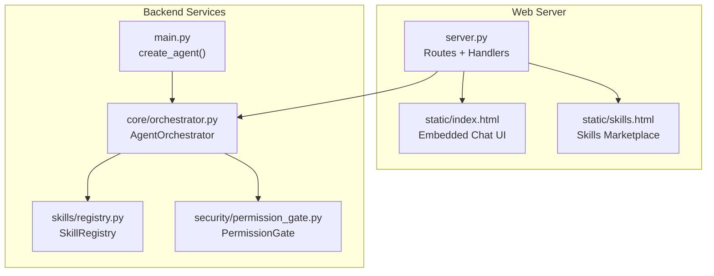
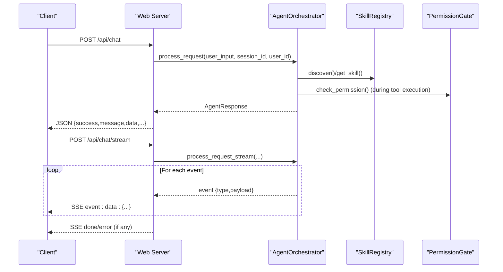
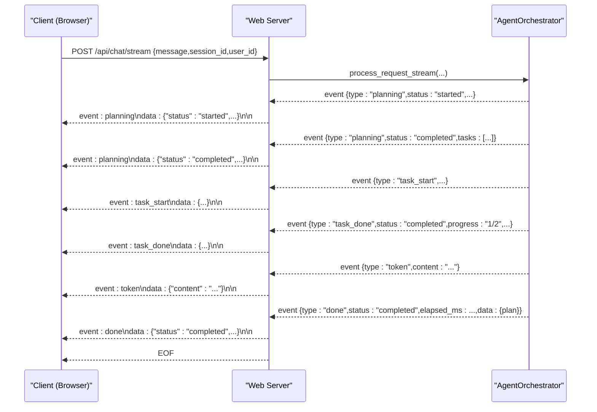
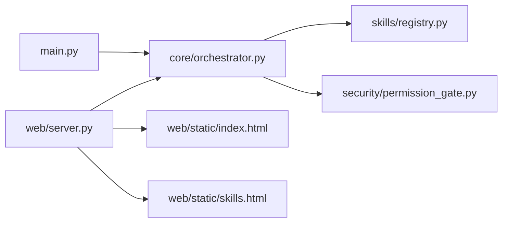

# Web Interface & API

<cite>
**Referenced Files in This Document**
- [src/aiops_agent/web/server.py](file://src/aiops_agent/web/server.py)
- [src/aiops_agent/web/static/index.html](file://src/aiops_agent/web/static/index.html)
- [src/aiops_agent/web/static/skills.html](file://src/aiops_agent/web/static/skills.html)
- [src/aiops_agent/core/orchestrator.py](file://src/aiops_agent/core/orchestrator.py)
- [src/aiops_agent/skills/registry.py](file://src/aiops_agent/skills/registry.py)
- [src/aiops_agent/models/schemas.py](file://src/aiops_agent/models/schemas.py)
- [src/aiops_agent/main.py](file://src/aiops_agent/main.py)
- [src/aiops_agent/security/permission_gate.py](file://src/aiops_agent/security/permission_gate.py)
- [tests/test_web_server.py](file://tests/test_web_server.py)
- [tests/test_sse.py](file://tests/test_sse.py)
- [config/settings.yaml](file://config/settings.yaml)
- [config/security_rules.yaml](file://config/security_rules.yaml)
- [deploy/Dockerfile](file://deploy/Dockerfile)
</cite>

## Table of Contents
1. [Introduction](#introduction)
2. [Project Structure](#project-structure)
3. [Core Components](#core-components)
4. [Architecture Overview](#architecture-overview)
5. [Detailed Component Analysis](#detailed-component-analysis)
6. [Dependency Analysis](#dependency-analysis)
7. [Performance Considerations](#performance-considerations)
8. [Troubleshooting Guide](#troubleshooting-guide)
9. [Conclusion](#conclusion)
10. [Appendices](#appendices)

## Introduction
This document describes the AIOps Agent’s web interface and REST API. It covers:
- HTTP endpoints: POST /api/chat (synchronous), POST /api/chat/stream (SSE streaming), GET /api/skills (skills marketplace), and health/ready probes
- Embedded chat UI and its integration with backend services
- SSE event types and client parsing behavior
- Authentication and permission model
- Request/response schemas and error handling
- Practical usage examples, client integration patterns, and frontend customization options
- Skills marketplace interface and browsing/management of capabilities

## Project Structure
The web server is implemented with aiohttp and exposes:
- Static HTML pages for the chat UI and skills marketplace
- REST endpoints for chat, skills, and health/ready probes
- SSE streaming for real-time progress updates during chat

**Diagram sources**
- [src/aiops_agent/web/server.py:196-222](file://src/aiops_agent/web/server.py#L196-L222)
- [src/aiops_agent/web/static/index.html:1-191](file://src/aiops_agent/web/static/index.html#L1-L191)
- [src/aiops_agent/web/static/skills.html:1-235](file://src/aiops_agent/web/static/skills.html#L1-L235)
- [src/aiops_agent/main.py:70-222](file://src/aiops_agent/main.py#L70-L222)
- [src/aiops_agent/core/orchestrator.py:47-79](file://src/aiops_agent/core/orchestrator.py#L47-L79)
- [src/aiops_agent/skills/registry.py:19-36](file://src/aiops_agent/skills/registry.py#L19-L36)
- [src/aiops_agent/security/permission_gate.py:57-66](file://src/aiops_agent/security/permission_gate.py#L57-L66)

**Section sources**
- [src/aiops_agent/web/server.py:196-222](file://src/aiops_agent/web/server.py#L196-L222)
- [src/aiops_agent/web/static/index.html:1-191](file://src/aiops_agent/web/static/index.html#L1-L191)
- [src/aiops_agent/web/static/skills.html:1-235](file://src/aiops_agent/web/static/skills.html#L1-L235)
- [src/aiops_agent/main.py:70-222](file://src/aiops_agent/main.py#L70-L222)

## Core Components
- Web server and routes: aiohttp application with endpoints for chat, skills, and health/ready probes; serves static HTML pages
- Agent orchestrator: processes requests synchronously and streams structured events for real-time UI updates
- Skill registry: discovers and lists skills with market-ready metadata
- Permission gate: enforces RBAC and resource-level ARN matching for tool execution
- Frontend UIs: embedded chat and skills marketplace pages with client-side SSE parsing and filtering

Key responsibilities:
- POST /api/chat: synchronous request processing via orchestrator
- POST /api/chat/stream: SSE stream emitting structured events for planning, tasks, tokens, and completion
- GET /api/skills: returns skills metadata for the marketplace
- GET /health and GET /ready: liveness/readiness probes
- Static pages: index.html and skills.html serve the UIs

**Section sources**
- [src/aiops_agent/web/server.py:44-171](file://src/aiops_agent/web/server.py#L44-L171)
- [src/aiops_agent/core/orchestrator.py:84-198](file://src/aiops_agent/core/orchestrator.py#L84-L198)
- [src/aiops_agent/skills/registry.py:199-207](file://src/aiops_agent/skills/registry.py#L199-L207)
- [src/aiops_agent/security/permission_gate.py:95-181](file://src/aiops_agent/security/permission_gate.py#L95-L181)

## Architecture Overview
The API surface is thin; most logic resides in the orchestrator. The web server delegates to the orchestrator and returns either JSON responses or SSE streams.

**Diagram sources**
- [src/aiops_agent/web/server.py:44-135](file://src/aiops_agent/web/server.py#L44-L135)
- [src/aiops_agent/core/orchestrator.py:203-418](file://src/aiops_agent/core/orchestrator.py#L203-L418)
- [src/aiops_agent/skills/registry.py:122-153](file://src/aiops_agent/skills/registry.py#L122-L153)
- [src/aiops_agent/security/permission_gate.py:95-181](file://src/aiops_agent/security/permission_gate.py#L95-L181)

## Detailed Component Analysis

### REST API Endpoints

- Base URL: http://host:8080
- Content-Type: application/json for JSON endpoints unless otherwise noted
- Authentication: Not enforced by the web server; permissions enforced by the orchestrator via the permission gate and security guard

Endpoints:
- GET /
  - Returns the embedded chat UI HTML page or a plaintext fallback
- GET /skills
  - Returns the skills marketplace HTML page
- GET /health
  - Returns {"status":"healthy"}
- GET /ready
  - Returns {"status":"ready"}
- POST /api/chat
  - Request body: {message, session_id?, user_id?}
  - Response: AgentResponse JSON
- POST /api/chat/stream
  - Request body: {message, session_id?, user_id?}
  - Response: text/event-stream with structured events
- GET /api/skills
  - Returns list of skills with market metadata

Request/response schemas:
- AgentResponse: success, message, data?, error_code?, suggestion?, trace_id?
- SkillDefinition (marketplace): skill_name, description, version, capabilities, required_permissions, status, author, category, icon, tags, install_count, rating, updated_at, readme

Error handling:
- Validation errors return 400 with {"error": "..."}
- Internal errors return 500 with structured error fields including error_code and suggestion

Examples:
- Chat (sync): curl -X POST http://localhost:8080/api/chat -H "Content-Type: application/json" -d '{"message":"query CPU","session_id":"s1","user_id":"u1"}'
- Chat (stream): curl -N http://localhost:8080/api/chat/stream -H "Content-Type: application/json" -d '{"message":"check ECS"}'
- Skills: curl http://localhost:8080/api/skills
- Probes: curl http://localhost:8080/health and curl http://localhost:8080/ready

**Section sources**
- [src/aiops_agent/web/server.py:44-171](file://src/aiops_agent/web/server.py#L44-L171)
- [src/aiops_agent/models/schemas.py:53-62](file://src/aiops_agent/models/schemas.py#L53-L62)
- [src/aiops_agent/models/schemas.py:283-306](file://src/aiops_agent/models/schemas.py#L283-L306)
- [tests/test_web_server.py:56-152](file://tests/test_web_server.py#L56-L152)
- [tests/test_web_server.py:159-192](file://tests/test_web_server.py#L159-L192)

### SSE Streaming (POST /api/chat/stream)

Event types emitted by the orchestrator:
- planning: started/completed
- task_start: per-subtask start
- task_done: per-subtask completion/failure/cancellation
- token: incremental LLM summary tokens
- done: final aggregation with success flag and timing
- error: on failures

Client parsing behavior (as implemented in the embedded UI):
- Uses fetch() with a readable stream
- Parses SSE chunks split by \n\n
- Extracts event type and parses JSON data
- Updates UI progressively based on event type

**Diagram sources**
- [src/aiops_agent/web/server.py:85-135](file://src/aiops_agent/web/server.py#L85-L135)
- [src/aiops_agent/core/orchestrator.py:203-418](file://src/aiops_agent/core/orchestrator.py#L203-L418)
- [src/aiops_agent/web/static/index.html:80-134](file://src/aiops_agent/web/static/index.html#L80-L134)
- [tests/test_sse.py:342-461](file://tests/test_sse.py#L342-L461)

**Section sources**
- [src/aiops_agent/web/server.py:85-135](file://src/aiops_agent/web/server.py#L85-L135)
- [src/aiops_agent/core/orchestrator.py:203-418](file://src/aiops_agent/core/orchestrator.py#L203-L418)
- [src/aiops_agent/web/static/index.html:80-134](file://src/aiops_agent/web/static/index.html#L80-L134)
- [tests/test_sse.py:342-461](file://tests/test_sse.py#L342-L461)

### Embedded Chat UI Integration

The embedded chat UI:
- Provides a form to submit natural language requests
- Calls POST /api/chat/stream with SSE
- Parses events and renders planning steps, task progress, and incremental tokens
- Displays final summary and error messages
- Loads skills list from GET /api/skills for sidebar

Client-side behavior:
- Submits form with message and generates a session_id
- Reads SSE stream, splits on \n\n, extracts event type and JSON payload
- Renders planning, task steps, and final result

Customization options:
- Modify styles and layout in the inline CSS
- Adjust placeholders and initial greeting
- Extend event handlers to support additional UI actions

**Section sources**
- [src/aiops_agent/web/static/index.html:59-188](file://src/aiops_agent/web/static/index.html#L59-L188)
- [src/aiops_agent/web/server.py:148-171](file://src/aiops_agent/web/server.py#L148-L171)

### Skills Marketplace Interface

The skills marketplace:
- Lists skills returned by GET /api/skills
- Supports search, category filter, and sorting by installs, rating, update time, or name
- Allows “install” toggling persisted in localStorage
- Shows detailed modal with description, tags, permissions, and README

Market metadata:
- Fields include name, description, version, capabilities, status, author, category, icon, tags, install_count, rating, updated_at, readme

Client-side behavior:
- Fetches skills, builds cards, filters and sorts, and toggles installation state locally

**Section sources**
- [src/aiops_agent/web/static/skills.html:129-232](file://src/aiops_agent/web/static/skills.html#L129-L232)
- [src/aiops_agent/web/server.py:148-171](file://src/aiops_agent/web/server.py#L148-L171)
- [src/aiops_agent/models/schemas.py:283-306](file://src/aiops_agent/models/schemas.py#L283-L306)

### Authentication and Permissions

- Web server does not enforce authentication; endpoints are open
- Permissions are enforced at runtime during tool execution via the permission gate and security guard
- The orchestrator performs input sanitization and security checks
- Workload identity and RAM policies are configured via settings and policies

Key configuration areas:
- Agent identity and STS assume-role with OIDC
- RAM policies for permissions
- Security rules including sensitive field patterns, blacklists, rate limits, anomaly detection, and TLS enforcement

Operational notes:
- If OIDC credentials are unavailable, the orchestrator will log warnings and retry later
- Permission checks can require manual approvals for write/admin actions

**Section sources**
- [src/aiops_agent/main.py:70-222](file://src/aiops_agent/main.py#L70-L222)
- [src/aiops_agent/security/permission_gate.py:95-181](file://src/aiops_agent/security/permission_gate.py#L95-L181)
- [config/settings.yaml:27-41](file://config/settings.yaml#L27-L41)
- [config/security_rules.yaml:1-70](file://config/security_rules.yaml#L1-L70)

### Request/Response Schemas

Core models:
- AgentResponse: success, message, data?, error_code?, suggestion?, trace_id?
- SkillDefinition: skill metadata for marketplace
- TaskPlan/SubTask: internal orchestration structures
- PermissionCheckResult: permission evaluation outcome

These schemas define the shape of responses and events across the API and UI.

**Section sources**
- [src/aiops_agent/models/schemas.py:53-62](file://src/aiops_agent/models/schemas.py#L53-L62)
- [src/aiops_agent/models/schemas.py:283-306](file://src/aiops_agent/models/schemas.py#L283-L306)
- [src/aiops_agent/models/schemas.py:43-51](file://src/aiops_agent/models/schemas.py#L43-L51)
- [src/aiops_agent/models/schemas.py:29-41](file://src/aiops_agent/models/schemas.py#L29-L41)

### Error Handling

- Validation: empty or malformed JSON returns 400 with {"error": "..."}
- Orchestrator exceptions: mapped to structured 500 responses with error_code and suggestion
- SSE error events: sent as {"type":"error", ...} and surfaced to the UI
- Frontend fallback: displays user-friendly messages and suggestions

**Section sources**
- [src/aiops_agent/web/server.py:46-72](file://src/aiops_agent/web/server.py#L46-L72)
- [src/aiops_agent/web/server.py:125-133](file://src/aiops_agent/web/server.py#L125-L133)
- [tests/test_web_server.py:110-152](file://tests/test_web_server.py#L110-L152)
- [tests/test_sse.py:293-336](file://tests/test_sse.py#L293-L336)

## Dependency Analysis

**Diagram sources**
- [src/aiops_agent/web/server.py:196-222](file://src/aiops_agent/web/server.py#L196-L222)
- [src/aiops_agent/core/orchestrator.py:47-79](file://src/aiops_agent/core/orchestrator.py#L47-L79)
- [src/aiops_agent/skills/registry.py:19-36](file://src/aiops_agent/skills/registry.py#L19-L36)
- [src/aiops_agent/security/permission_gate.py:57-66](file://src/aiops_agent/security/permission_gate.py#L57-L66)
- [src/aiops_agent/main.py:70-222](file://src/aiops_agent/main.py#L70-L222)

**Section sources**
- [src/aiops_agent/web/server.py:196-222](file://src/aiops_agent/web/server.py#L196-L222)
- [src/aiops_agent/core/orchestrator.py:47-79](file://src/aiops_agent/core/orchestrator.py#L47-L79)
- [src/aiops_agent/skills/registry.py:19-36](file://src/aiops_agent/skills/registry.py#L19-L36)
- [src/aiops_agent/security/permission_gate.py:57-66](file://src/aiops_agent/security/permission_gate.py#L57-L66)
- [src/aiops_agent/main.py:70-222](file://src/aiops_agent/main.py#L70-L222)

## Performance Considerations
- SSE streaming avoids long polling and reduces latency for progress updates
- Orchestrator supports concurrent subtask execution up to a configured limit
- Metrics and tracing are enabled by default; configure exporters via settings
- Rate limiting and anomaly detection can be tuned in security rules

[No sources needed since this section provides general guidance]

## Troubleshooting Guide
Common issues and resolutions:
- Empty or invalid JSON in chat endpoints: ensure Content-Type is application/json and body contains message
- Permission denied or write/admin actions failing: review RAM policies and approval callbacks
- Skill not found or unhealthy: verify skill registration and status; orchestrator marks skills unhealthy after repeated failures
- SSE parsing errors: confirm client splits on \n\n and decodes UTF-8 properly
- Probe failures: verify readiness of underlying services and configuration

**Section sources**
- [tests/test_web_server.py:110-152](file://tests/test_web_server.py#L110-L152)
- [tests/test_sse.py:342-461](file://tests/test_sse.py#L342-L461)
- [src/aiops_agent/core/orchestrator.py:571-596](file://src/aiops_agent/core/orchestrator.py#L571-L596)
- [src/aiops_agent/security/permission_gate.py:95-181](file://src/aiops_agent/security/permission_gate.py#L95-L181)

## Conclusion
The AIOps Agent provides a compact, embeddable web interface with robust REST APIs and SSE streaming. The design separates concerns cleanly: the web server handles routing and static assets, while the orchestrator manages planning, execution, and security. The skills marketplace and chat UI integrate seamlessly with backend services, enabling both programmatic clients and human operators to interact with the system effectively.

[No sources needed since this section summarizes without analyzing specific files]

## Appendices

### API Reference Summary

- GET /
  - Description: Serve chat UI
  - Response: HTML or plaintext
- GET /skills
  - Description: Serve skills marketplace
  - Response: HTML
- GET /health
  - Description: Health probe
  - Response: {"status":"healthy"}
- GET /ready
  - Description: Readiness probe
  - Response: {"status":"ready"}
- POST /api/chat
  - Body: {message, session_id?, user_id?}
  - Response: AgentResponse JSON
- POST /api/chat/stream
  - Body: {message, session_id?, user_id?}
  - Response: text/event-stream with structured events
- GET /api/skills
  - Description: List skills for marketplace
  - Response: {skills:[SkillDefinition,...]}

**Section sources**
- [src/aiops_agent/web/server.py:138-171](file://src/aiops_agent/web/server.py#L138-L171)
- [src/aiops_agent/models/schemas.py:53-62](file://src/aiops_agent/models/schemas.py#L53-L62)
- [src/aiops_agent/models/schemas.py:283-306](file://src/aiops_agent/models/schemas.py#L283-L306)

### Client Integration Patterns

- Synchronous chat:
  - Send POST /api/chat with message
  - Render response.message and optional data
- Streaming chat:
  - Send POST /api/chat/stream and parse SSE
  - Update UI on planning, task_start, task_done, token, done, error
- Skills marketplace:
  - GET /api/skills to populate cards
  - Toggle installation state in localStorage
  - Open modals to view README and permissions

**Section sources**
- [src/aiops_agent/web/static/index.html:80-188](file://src/aiops_agent/web/static/index.html#L80-L188)
- [src/aiops_agent/web/static/skills.html:222-232](file://src/aiops_agent/web/static/skills.html#L222-L232)
- [tests/test_sse.py:440-461](file://tests/test_sse.py#L440-L461)

### Deployment Notes
- Container exposes port 8080
- Non-root user and writable directories for logs and sessions
- Environment variables for OIDC and API keys can be supplied externally

**Section sources**
- [deploy/Dockerfile:39-41](file://deploy/Dockerfile#L39-L41)
- [src/aiops_agent/main.py:120-139](file://src/aiops_agent/main.py#L120-L139)