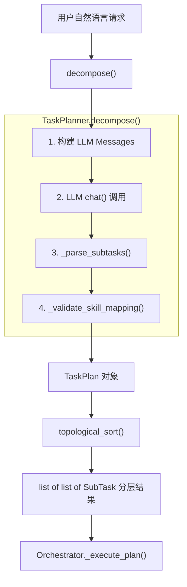
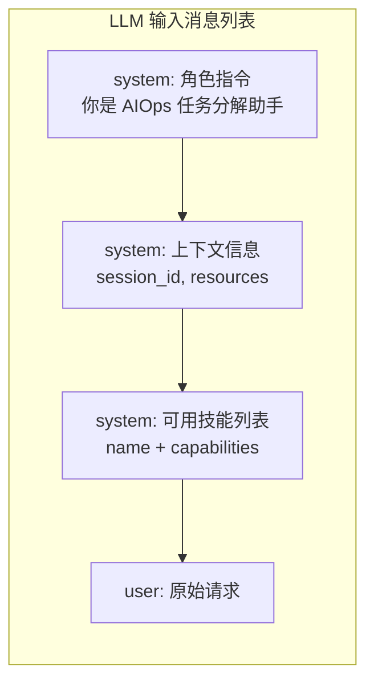
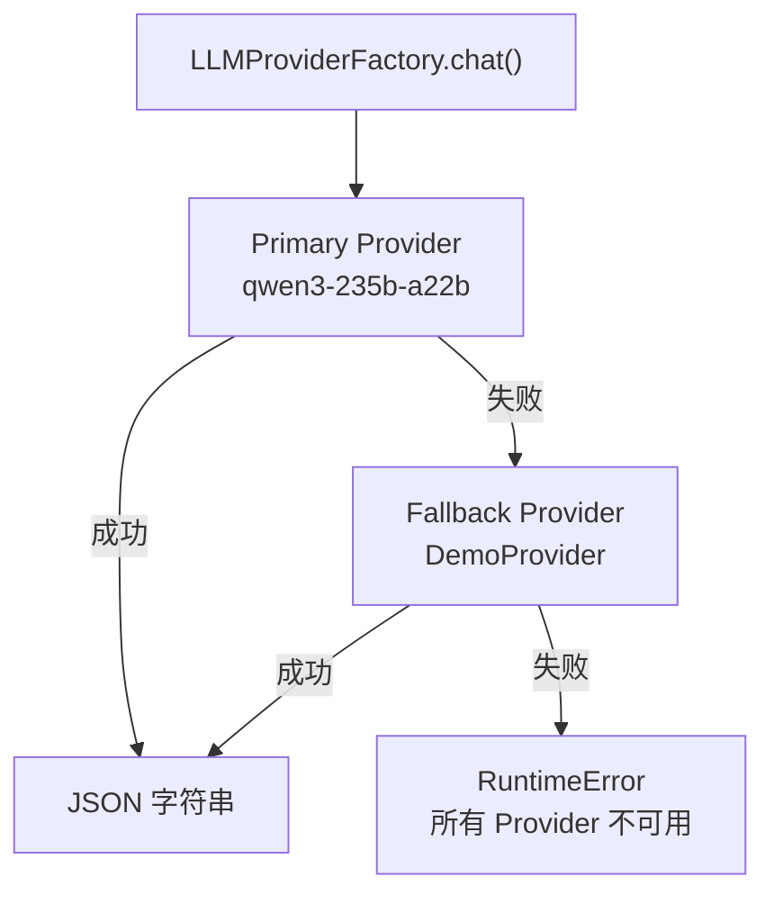
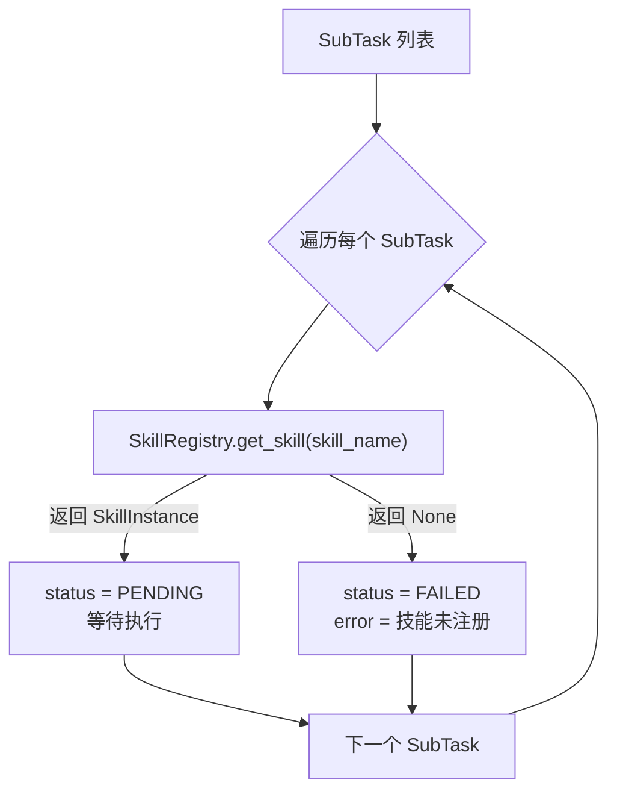
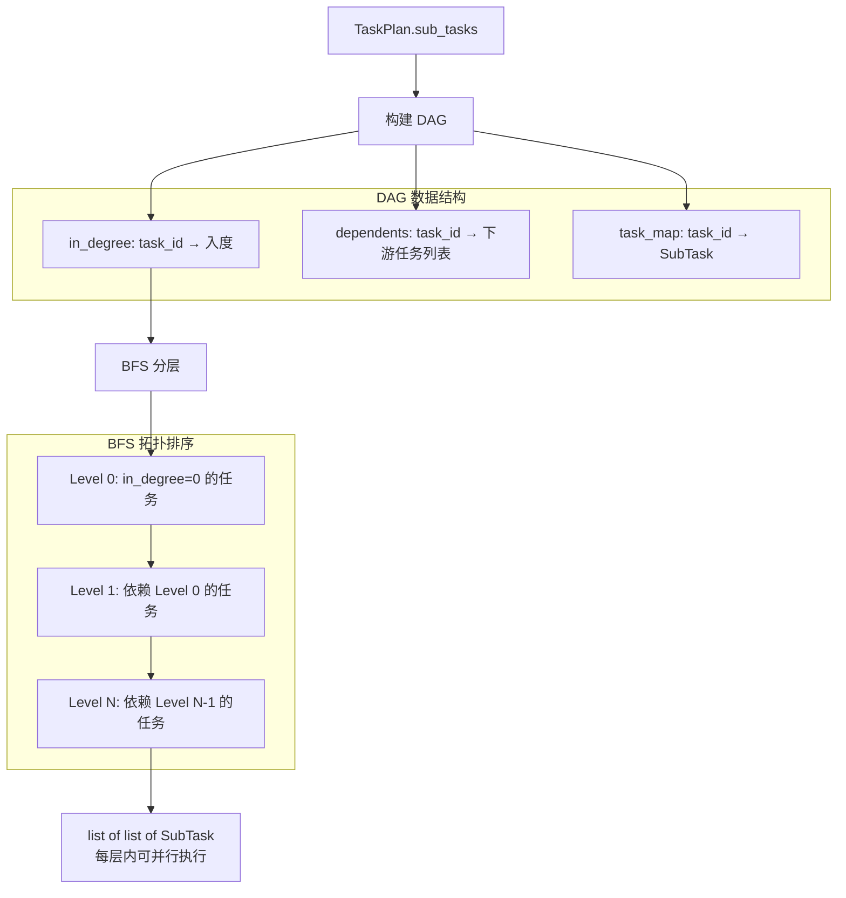
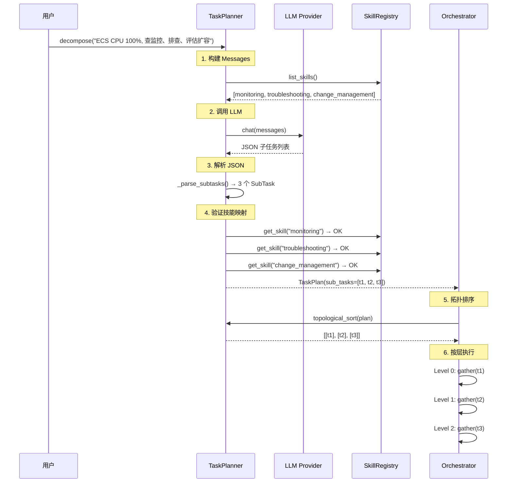
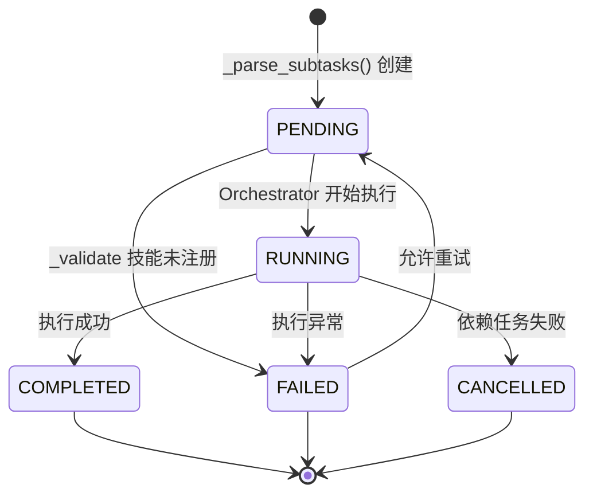
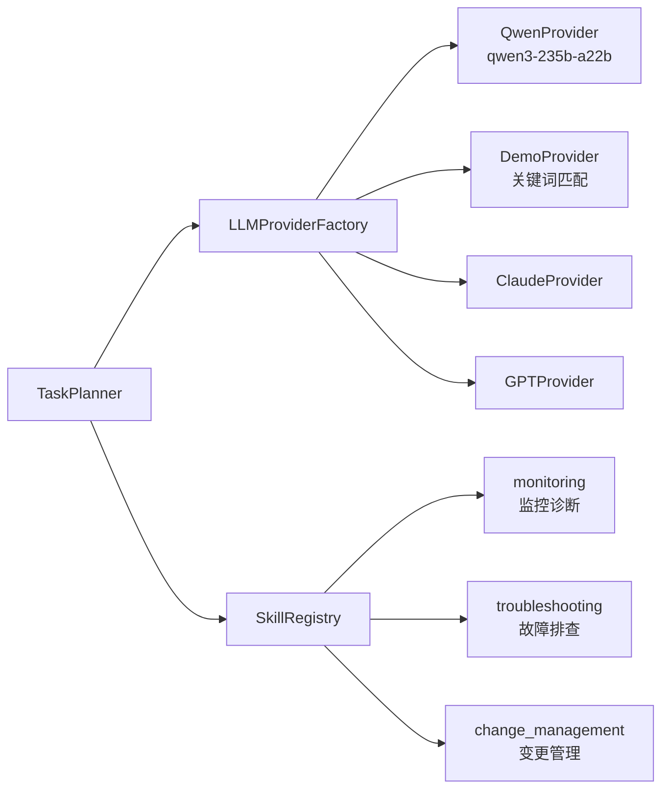

# TaskPlanner 架构文档

## 概述

TaskPlanner 是 AIOps Agent 的任务分解引擎，负责将用户的自然语言运维请求通过 LLM 分解为结构化的子任务列表，并构建 DAG 依赖图进行拓扑排序，供 Orchestrator 按层并行执行。

## 核心流程



## 步骤详解

### 1. 构建 LLM Messages



| 消息 | 来源 | 说明 |
|------|------|------|
| system prompt | 硬编码 | 指导 LLM 输出 JSON 格式的子任务列表 |
| 上下文 | `context` 参数 | 可选，包含 session_id、已识别的资源引用 |
| 可用技能 | `SkillRegistry.list_skills()` | 告知 LLM 当前可用的技能及其 capabilities |
| 用户请求 | `user_input` 参数 | 原始自然语言运维请求 |

### 2. LLM 调用（含自动降级）



### 3. _parse_subtasks() — JSON 解析

```mermaid
flowchart TD
    INPUT["LLM 输出文本"] --> CHECK{"包含代码块?"}

    CHECK -->|"包含 &#96;&#96;&#96;json"| EXTRACT1["提取代码块内容"]
    CHECK -->|"包含 &#96;&#96;&#96;"| EXTRACT2["提取代码块内容"]
    CHECK -->|否| RAW["直接解析"]

    EXTRACT1 --> PARSE["json.loads()"]
    EXTRACT2 --> PARSE
    RAW --> PARSE

    PARSE -->|成功| TYPE{"数据类型?"}
    PARSE -->|失败| EMPTY["返回空列表"]

    TYPE -->|list| BUILD["构建 SubTask 列表"]
    TYPE -->|"dict 含 sub_tasks"| UNWRAP1["解包 sub_tasks"]
    TYPE -->|"dict 含 tasks"| UNWRAP2["解包 tasks"]
    TYPE -->|"单个 dict"| WRAP["包装为列表"]

    UNWRAP1 --> BUILD
    UNWRAP2 --> BUILD
    WRAP --> BUILD

    BUILD --> RESULT["list of SubTask"]
```



**支持的 LLM 输出格式：**

| 格式 | 示例 | 处理方式 |
|------|------|----------|
| JSON 数组 | `[{"task_id":"t1",...}]` | 直接解析 |
| json 代码块 | `` ```json [...] ``` `` | 提取代码块内容 |
| 通用代码块 | `` ``` [...] ``` `` | 提取代码块内容 |
| sub_tasks 包装 | `{"sub_tasks":[...]}` | 解包 sub_tasks 字段 |
| tasks 包装 | `{"tasks":[...]}` | 解包 tasks 字段 |
| 单个 dict | `{"task_id":"t1",...}` | 包装为单元素列表 |
| 无效 JSON | 任意文本 | 返回空列表 |

### 4. _validate_skill_mapping() — 技能映射验证



## topological_sort() — DAG 拓扑排序



## 数据流示例



## SubTask 状态流转



## 关键依赖



## 核心接口

```python
class TaskPlanner:
    def __init__(self, llm_factory: LLMProviderFactory, skill_registry: SkillRegistry):
        ...

    async def decompose(self, user_input: str, context: dict = None) -> TaskPlan:
        """主入口: 自然语言 → TaskPlan"""

    def topological_sort(self, plan: TaskPlan) -> list[list[SubTask]]:
        """DAG 拓扑排序: TaskPlan → 分层可并行任务"""

    def _parse_subtasks(self, llm_output: str, plan_id: str) -> list[SubTask]:
        """解析 LLM 输出为 SubTask 列表"""

    async def _validate_skill_mapping(self, sub_tasks: list[SubTask]) -> list[SubTask]:
        """验证每个 SubTask 的 skill_name 是否已注册"""
```

## 核心数据模型

```python
class SubTask:
    task_id: str           # 唯一标识 (t1, t2, ...)
    skill_name: str        # 目标技能名称
    action: str            # 具体操作
    parameters: dict       # 操作参数
    dependencies: list     # 依赖的 task_id 列表
    status: TaskStatus     # PENDING / RUNNING / COMPLETED / FAILED / CANCELLED
    result: dict | None    # 执行结果
    error: str | None      # 错误信息

class TaskPlan:
    plan_id: str           # UUID
    user_request: str      # 原始用户请求
    sub_tasks: list        # SubTask 列表
    context: dict          # 上下文信息
    status: TaskStatus     # 整体状态
```
